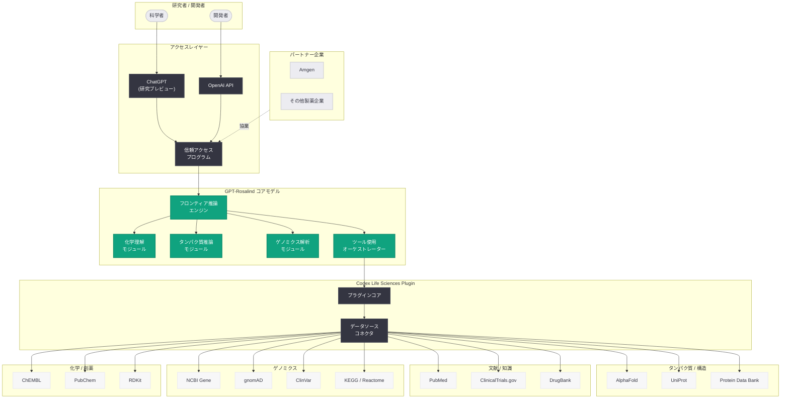
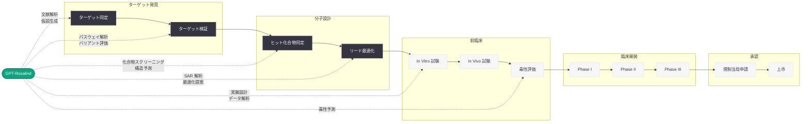

# GPT-Rosalind の発表: ライフサイエンス研究を加速するフロンティア推論モデル

## メタデータ

| 項目 | 内容 |
|------|------|
| 発表日 | 2026-04-16 |
| ソース | OpenAI Research |
| カテゴリ | Research |
| 公式リンク | [Introducing GPT-Rosalind for life sciences research](https://openai.com/index/introducing-gpt-rosalind) |

> **注記:** 本レポートは RSS フィードおよび公開されているニュースソース (Reuters、VentureBeat、Bloomberg、Ars Technica、R&D World、PYMNTS、Endpoints News など) に基づいて作成されている。記事公開ページへの直接アクセスが Cloudflare の保護により制限されていたため、RSS の説明文、各報道機関の記事、および関連する公開情報をもとに内容を構成している。

## 概要

OpenAI は 2026 年 4 月 16 日、ライフサイエンス研究に特化したフロンティア推論モデル「GPT-Rosalind」を発表した。GPT-Rosalind は、創薬、ゲノミクス解析、タンパク質推論、科学研究ワークフロー全般の加速を目的として設計されたモデルであり、化学、タンパク質工学、ゲノミクスに関する深い理解と改善されたツール使用能力を備えている。モデル名は、DNA の二重らせん構造の解明に貢献した X 線結晶学のパイオニアである Rosalind Franklin に因んでいる。

本発表は、OpenAI がライフサイエンス分野に対して初の専用モデルを投入するという戦略的な動きであり、Google DeepMind の AlphaFold をはじめとする競合他社との直接的な競争領域への参入を意味する。現在、創薬プロセスはターゲット発見から規制当局の承認まで 10 年から 15 年を要するが、OpenAI は GPT-Rosalind によって研究者がこのプロセスをより迅速に進められるようになることを目指している。GPT-Rosalind は、研究プレビューとして ChatGPT および API を通じ、信頼アクセスプログラム (Trusted Access Program) を通じた資格を持つ顧客向けに提供が開始されている。

## 主な内容

### GPT-Rosalind の概要と設計思想

GPT-Rosalind は、ライフサイエンス研究の複雑なワークフローにおける制約を科学者が克服することを支援するために設計された、目的特化型のフロンティア推論モデルである。OpenAI は「高度な AI システムは、既存の作業をより効率的にするだけでなく、科学者がより多くの可能性を探求し、見落とされがちなつながりを発見し、より優れた仮説にたどり着くことを支援できる」と述べている。

GPT-Rosalind の主な特徴は以下の通りである。

- **化学分野の深い理解:** 低分子化合物、化学反応、分子特性に関する高度な推論能力
- **タンパク質工学の支援:** タンパク質の構造、機能、変異の影響に関する推論
- **ゲノミクス解析:** 遺伝子発現データ、バリアント解析、パスウェイ分析の支援
- **改善されたツール使用:** 50 以上の科学ツールやデータソースとの連携能力
- **研究ワークフロー全般の加速:** 仮説生成から実験設計、データ解析までの包括的な支援

### Rosalind Franklin への敬意

GPT-Rosalind のモデル名は、20 世紀の科学に多大な貢献を果たした Rosalind Franklin (1920-1958) に因んで命名されている。Franklin は X 線結晶学のパイオニアであり、DNA の二重らせん構造の解明につながった「Photo 51」と呼ばれる決定的な X 線回折写真を撮影した。彼女の業績は生命科学の基礎を築いたものであり、ライフサイエンス特化型モデルにその名を冠することは、科学的発見への敬意を表すものである。

### Life Sciences Research Plugin for Codex

GPT-Rosalind の発表と同時に、OpenAI は Codex 向けの Life Sciences Research Plugin を導入した。このプラグインは無料でアクセス可能であり、科学者が GPT-Rosalind を含むモデルを 50 以上の科学ツールやデータソースに接続することを支援する。

主な連携先として以下が含まれる。

- **AlphaFold プラグイン:** タンパク質構造予測データベースとの統合
- **PubMed プラグイン:** 生物医学文献の検索と解析
- **その他の科学データソース:** ゲノムデータベース、化合物ライブラリ、臨床試験データなど

このプラグインは GitHub 上でも公開されており、開発者コミュニティがエコシステムの拡張に貢献できる仕組みが整備されている。

### 信頼アクセスプログラム (Trusted Access Program) による提供

GPT-Rosalind は、すべてのユーザーに即座に公開されるのではなく、信頼アクセスプログラムを通じた限定的なアクセスとして提供される。このアプローチは、ライフサイエンス研究という機密性の高い分野における安全性と責任ある利用を確保するためのものである。

- **対象:** 資格を持つ研究機関、製薬企業、バイオテクノロジー企業
- **提供形態:** ChatGPT 内での研究プレビューおよび API アクセス
- **アクセス方法:** OpenAI の信頼アクセスプログラムへの申請と審査

### Amgen との協業

OpenAI は GPT-Rosalind の初期顧客として、大手バイオ医薬品企業 Amgen との協業を発表した。Amgen の AI およびデータ担当シニアバイスプレジデントである David Reese 氏は「OpenAI とのユニークな協業により、最先端の AI 能力とツールを新しく革新的な方法で応用し、患者への医薬品提供を加速する可能性がある」と述べている。

この協業は、GPT-Rosalind が実際の創薬ワークフローにおいて具体的な価値を提供できることを示す重要な事例であり、製薬業界における AI 活用の新たなベンチマークとなる可能性がある。

### 競争環境: Google DeepMind との対決

GPT-Rosalind の発表は、ライフサイエンス AI 分野における競争構図を大きく変える可能性がある。これまで、この分野では Google DeepMind の AlphaFold が圧倒的な存在感を示してきた。AlphaFold はタンパク質の 3D 構造予測において革命的な成果を上げ、2024 年のノーベル化学賞の受賞対象にもなった技術である。

OpenAI が GPT-Rosalind でこの領域に参入したことにより、テクノロジー大企業が製薬業界に AI ソリューションを提供するための競争がさらに激化することが予想される。

- **Google DeepMind AlphaFold:** タンパク質構造予測に特化した実績のあるモデル
- **GPT-Rosalind:** 構造予測に限らず、創薬ワークフロー全般をカバーする汎用的な推論モデル
- **差別化要因:** GPT-Rosalind は推論能力とツール使用を組み合わせ、研究ワークフロー全体を支援するアプローチを採用

## 技術的な詳細

### API の利用

GPT-Rosalind は OpenAI API の Chat Completions エンドポイントを通じて利用可能である。以下は基本的な API 呼び出しの例である。

```python
from openai import OpenAI

client = OpenAI()

# GPT-Rosalind を使用した基本的な科学研究クエリ
response = client.chat.completions.create(
    model="gpt-rosalind",
    messages=[
        {
            "role": "system",
            "content": (
                "You are a life sciences research assistant specializing in "
                "drug discovery, genomics, and protein engineering. "
                "Provide evidence-based analysis with citations to relevant literature."
            )
        },
        {
            "role": "user",
            "content": (
                "Analyze the potential druggability of the KRAS G12C mutation "
                "in non-small cell lung cancer. What are the key binding sites "
                "and what approaches have shown promise in recent research?"
            )
        }
    ],
    max_tokens=4096
)

print(response.choices[0].message.content)
```

### タンパク質構造解析のワークフロー例

```python
from openai import OpenAI

client = OpenAI()

# タンパク質配列に基づく構造・機能解析
protein_sequence = """
MTEYKLVVVGAVGVGKSALTIQLIQNHFVDEYDPTIEDSY
RKQVVIDGETCLLDILDTAGQEEYSAMRDQYMRTGEGFLCV
FAINNTKSFEDIHHQRQITKNSRQHFVDKDCNECMLRMLQ
"""

response = client.chat.completions.create(
    model="gpt-rosalind",
    messages=[
        {
            "role": "system",
            "content": (
                "You are an expert in protein biochemistry and structural biology. "
                "Analyze protein sequences to identify functional domains, "
                "potential mutation sites, and drug target opportunities."
            )
        },
        {
            "role": "user",
            "content": f"""Analyze the following protein sequence:

{protein_sequence}

Please provide:
1. Identification of the protein and its family
2. Key functional domains and their roles
3. Known pathogenic mutations and their mechanisms
4. Potential drug target sites and binding pocket analysis
5. Recommended experimental validation approaches"""
        }
    ],
    max_tokens=8192
)

print(response.choices[0].message.content)
```

### ゲノミクスデータ解析の例

```python
from openai import OpenAI

client = OpenAI()

# ゲノムバリアントの解析と臨床的意義の評価
variant_data = """
Gene: BRCA1
Variant: c.5266dupC (5382insC)
Location: Exon 20
Protein change: p.Gln1756Profs*74
Population frequency: 0.1% (gnomAD)
ClinVar: Pathogenic
"""

response = client.chat.completions.create(
    model="gpt-rosalind",
    messages=[
        {
            "role": "system",
            "content": (
                "You are a clinical genomics specialist. "
                "Analyze genetic variants and provide comprehensive "
                "interpretation including pathogenicity assessment, "
                "functional impact, and clinical recommendations."
            )
        },
        {
            "role": "user",
            "content": f"""Analyze the following genomic variant:

{variant_data}

Provide a comprehensive analysis including:
1. Variant classification rationale (ACMG criteria)
2. Functional impact on protein structure and function
3. Associated cancer risks and penetrance data
4. Therapeutic implications and targeted treatment options
5. Recommended surveillance protocols"""
        }
    ],
    max_tokens=8192
)

print(response.choices[0].message.content)
```

### Life Sciences Plugin for Codex との統合

```python
from openai import OpenAI

client = OpenAI()

# Life Sciences Plugin を活用した PubMed 文献検索と解析
response = client.chat.completions.create(
    model="gpt-rosalind",
    messages=[
        {
            "role": "system",
            "content": (
                "You are a life sciences research assistant with access to "
                "scientific tools and databases. Use available plugins to "
                "retrieve and analyze data from PubMed, AlphaFold, and other "
                "scientific data sources."
            )
        },
        {
            "role": "user",
            "content": (
                "Search PubMed for recent publications on CAR-T cell therapy "
                "targeting solid tumors published in the last 12 months. "
                "Summarize the key findings and identify emerging trends."
            )
        }
    ],
    tools=[
        {
            "type": "function",
            "function": {
                "name": "search_pubmed",
                "description": "Search PubMed for biomedical literature",
                "parameters": {
                    "type": "object",
                    "properties": {
                        "query": {
                            "type": "string",
                            "description": "PubMed search query"
                        },
                        "max_results": {
                            "type": "integer",
                            "description": "Maximum number of results to return"
                        },
                        "date_range": {
                            "type": "string",
                            "description": "Date range filter (e.g., '2025/04:2026/04')"
                        }
                    },
                    "required": ["query"]
                }
            }
        },
        {
            "type": "function",
            "function": {
                "name": "query_alphafold",
                "description": "Query AlphaFold protein structure database",
                "parameters": {
                    "type": "object",
                    "properties": {
                        "uniprot_id": {
                            "type": "string",
                            "description": "UniProt accession ID"
                        },
                        "include_pae": {
                            "type": "boolean",
                            "description": "Include predicted aligned error"
                        }
                    },
                    "required": ["uniprot_id"]
                }
            }
        }
    ],
    tool_choice="auto",
    max_tokens=4096
)

# ツール呼び出しの結果を処理
for choice in response.choices:
    message = choice.message
    if message.tool_calls:
        for tool_call in message.tool_calls:
            print(f"Tool: {tool_call.function.name}")
            print(f"Arguments: {tool_call.function.arguments}")
    else:
        print(message.content)
```

### AlphaFold プラグインを活用したタンパク質構造取得

```python
from openai import OpenAI
import json

client = OpenAI()

# AlphaFold プラグインによるタンパク質構造データの取得と解析
messages = [
    {
        "role": "system",
        "content": (
            "You are a structural biologist using AlphaFold data "
            "to analyze protein structures and identify drug target sites."
        )
    },
    {
        "role": "user",
        "content": (
            "Retrieve the AlphaFold predicted structure for human p53 "
            "(UniProt: P04637) and analyze potential small molecule "
            "binding sites in the DNA-binding domain."
        )
    }
]

response = client.chat.completions.create(
    model="gpt-rosalind",
    messages=messages,
    tools=[
        {
            "type": "function",
            "function": {
                "name": "query_alphafold",
                "description": "Query AlphaFold protein structure database",
                "parameters": {
                    "type": "object",
                    "properties": {
                        "uniprot_id": {
                            "type": "string",
                            "description": "UniProt accession ID"
                        },
                        "include_pae": {
                            "type": "boolean",
                            "description": "Include predicted aligned error"
                        },
                        "include_contacts": {
                            "type": "boolean",
                            "description": "Include predicted contact map"
                        }
                    },
                    "required": ["uniprot_id"]
                }
            }
        }
    ],
    tool_choice="auto",
    max_tokens=4096
)

# ツール呼び出しの処理とフォローアップ
if response.choices[0].message.tool_calls:
    tool_call = response.choices[0].message.tool_calls[0]
    print(f"Querying AlphaFold for: {tool_call.function.arguments}")

    # シミュレーション: AlphaFold からの応答データ
    alphafold_result = {
        "uniprot_id": "P04637",
        "protein_name": "Cellular tumor antigen p53",
        "organism": "Homo sapiens",
        "confidence_score": 0.89,
        "domains": [
            {"name": "Transactivation domain", "start": 1, "end": 61},
            {"name": "Proline-rich region", "start": 64, "end": 92},
            {"name": "DNA-binding domain", "start": 102, "end": 292},
            {"name": "Tetramerization domain", "start": 323, "end": 356}
        ]
    }

    # フォローアップリクエスト
    messages.append(response.choices[0].message)
    messages.append({
        "role": "tool",
        "tool_call_id": tool_call.id,
        "content": json.dumps(alphafold_result)
    })

    follow_up = client.chat.completions.create(
        model="gpt-rosalind",
        messages=messages,
        max_tokens=4096
    )

    print(follow_up.choices[0].message.content)
```

### 創薬ワークフローの自動化例

```python
from openai import OpenAI

client = OpenAI()

# 創薬パイプラインにおける化合物スクリーニングの支援
compound_data = """
Compound: AMG-510 (Sotorasib)
Target: KRAS G12C
Molecular Weight: 560.6 g/mol
LogP: 2.8
IC50: 0.18 nM (biochemical)
Selectivity: >1000x vs wild-type KRAS
Clinical Stage: Approved (2021, NSCLC)
"""

response = client.chat.completions.create(
    model="gpt-rosalind",
    messages=[
        {
            "role": "system",
            "content": (
                "You are a medicinal chemistry expert assisting with drug "
                "discovery. Analyze compound data and suggest structural "
                "modifications to improve drug-like properties."
            )
        },
        {
            "role": "user",
            "content": f"""Based on the following approved compound data:

{compound_data}

Please:
1. Analyze the structure-activity relationship (SAR) of this compound class
2. Suggest 3 structural modifications to improve oral bioavailability
3. Predict potential metabolic liabilities
4. Recommend in vitro assays for validation
5. Identify potential combination therapy partners based on the target biology"""
        }
    ],
    max_tokens=8192
)

print(response.choices[0].message.content)
```

> **注:** 上記のコード例は、公開情報に基づく想定的な利用パターンである。GPT-Rosalind は研究プレビュー段階であり、実際の API パラメータ、ツール定義、プラグインインターフェースの詳細は OpenAI の公式ドキュメントおよび信頼アクセスプログラムを通じて提供される。

### 対応する科学ツールとデータソース

Life Sciences Research Plugin for Codex は、50 以上の科学ツールおよびデータソースとの連携をサポートする。主な連携先は以下の通りである。

**タンパク質・構造データベース:**

| ツール / データソース | 用途 |
|---------------------|------|
| AlphaFold | タンパク質構造予測 |
| UniProt | タンパク質配列・機能情報 |
| PDB (Protein Data Bank) | 実験的構造データ |
| InterPro | タンパク質ドメイン・ファミリー分類 |

**文献・知識データベース:**

| ツール / データソース | 用途 |
|---------------------|------|
| PubMed | 生物医学文献検索 |
| bioRxiv / medRxiv | プレプリント検索 |
| ClinicalTrials.gov | 臨床試験データ |
| DrugBank | 医薬品情報データベース |

**ゲノミクス・バイオインフォマティクス:**

| ツール / データソース | 用途 |
|---------------------|------|
| NCBI Gene | 遺伝子情報 |
| gnomAD | 集団ゲノムデータ |
| ClinVar | 遺伝子バリアント臨床的意義 |
| KEGG / Reactome | パスウェイデータベース |

**化学・創薬:**

| ツール / データソース | 用途 |
|---------------------|------|
| ChEMBL | 生物活性化合物データ |
| PubChem | 化学物質情報 |
| ZINC | 化合物ライブラリ |
| RDKit (統合) | 化学情報学ツールキット |

## アーキテクチャ



### 創薬ワークフローにおける GPT-Rosalind の位置付け



## 開発者への影響

### ライフサイエンス分野の開発者にとっての新たな機会

GPT-Rosalind と Life Sciences Research Plugin の導入は、ライフサイエンス分野で AI アプリケーションを構築する開発者に対して、以下の重要な機会をもたらす。

- **専用モデルの活用:** 汎用モデルでは達成が困難であった化学、タンパク質工学、ゲノミクスに関する高精度な推論が、専用に訓練されたモデルを通じて利用可能になる。これにより、ライフサイエンスアプリケーションの品質と信頼性が大幅に向上する可能性がある
- **50 以上の科学ツールとの統合:** Life Sciences Research Plugin を通じて、AlphaFold、PubMed、UniProt、ChEMBL など主要な科学データベースとの連携が標準化される。開発者は個別のデータソースごとにコネクタを構築する必要がなくなり、プラグインエコシステムを活用した迅速なアプリケーション開発が可能になる
- **Codex との連携:** Life Sciences Plugin は Codex と統合されており、科学的なコード生成、データ解析パイプラインの構築、実験プロトコルの自動化などのワークフローを Codex 上で実行できる

### 信頼アクセスプログラムの考慮事項

GPT-Rosalind は信頼アクセスプログラムを通じた限定提供であるため、開発者は以下の点を考慮する必要がある。

- **アクセス申請:** API アクセスには OpenAI の信頼アクセスプログラムへの事前申請が必要であり、審査プロセスを経る必要がある
- **利用規約の遵守:** ライフサイエンス研究における倫理的な利用ガイドラインへの準拠が求められる
- **研究プレビューの制限:** 研究プレビュー段階であるため、API の仕様やモデルの動作が今後変更される可能性がある。プロダクション環境での利用には段階的なアプローチが推奨される
- **データセキュリティ:** 患者データや機密性の高い研究データの取り扱いについて、組織のコンプライアンスポリシーとの整合性を事前に確認すべきである

### 製薬・バイオテクノロジー業界への影響

GPT-Rosalind の登場は、製薬・バイオテクノロジー業界全体に対して以下の影響を与えると予想される。

- **創薬プロセスの加速:** ターゲット発見から規制当局承認までの 10 年から 15 年というタイムラインの短縮が期待される。特に初期段階の仮説生成、文献調査、化合物スクリーニングにおける効率化が見込まれる
- **テクノロジー企業間の競争激化:** OpenAI の参入により、Google DeepMind (AlphaFold)、Microsoft (BioGPT) などとの競争がさらに激化する。製薬企業にとっては、より多くの選択肢と競争的な価格設定が期待できる
- **AI リテラシーの重要性:** 研究者やメディカルチームにおいて、AI ツールを効果的に活用するためのリテラシーがこれまで以上に重要となる

### オープンソースコミュニティへの貢献

Life Sciences Research Plugin が GitHub で公開されていることは、オープンソースコミュニティにとって重要な意味を持つ。

- **カスタムプラグインの開発:** 開発者はプラグインフレームワークを基に、特定の研究分野やデータソースに特化したカスタムプラグインを構築できる
- **エコシステムの拡張:** コミュニティ主導でサポートされる科学ツールやデータソースの数が今後拡大することが期待される
- **研究の再現性向上:** 標準化されたプラグインインターフェースにより、研究ワークフローの共有と再現が容易になる

## 関連リンク

- [GPT-Rosalind 公式発表ページ](https://openai.com/index/introducing-gpt-rosalind)
- [OpenAI Research](https://openai.com/research)
- [OpenAI Trusted Access Program](https://openai.com/index/scaling-trusted-access-for-cyber-defense)
- [OpenAI API ドキュメント](https://platform.openai.com/docs)
- [AlphaFold Protein Structure Database](https://alphafold.ebi.ac.uk/)
- [PubMed](https://pubmed.ncbi.nlm.nih.gov/)
- [Reuters: OpenAI takes on Google with new AI model aimed at drug discovery](https://www.reuters.com/)
- [VentureBeat: GPT-Rosalind coverage](https://venturebeat.com/)
- [Bloomberg: OpenAI enters crowd of tech giants selling AI to pharma](https://www.bloomberg.com/)

## まとめ

OpenAI が発表した GPT-Rosalind は、ライフサイエンス研究に特化した初のフロンティア推論モデルであり、創薬、ゲノミクス解析、タンパク質推論、科学研究ワークフロー全般を加速することを目的としている。化学、タンパク質工学、ゲノミクスに関する深い理解と改善されたツール使用能力を備え、50 以上の科学ツールおよびデータソースとの連携を実現する Life Sciences Research Plugin for Codex も同時に導入された。

信頼アクセスプログラムを通じた限定提供というアプローチは、ライフサイエンス研究の機密性と安全性を確保しながら、段階的にエコシステムを拡大する戦略である。Amgen をはじめとする製薬大手との協業は、GPT-Rosalind が実際の創薬ワークフローにおいて具体的な価値を提供できることを示している。

GPT-Rosalind の発表は、Google DeepMind の AlphaFold が牽引してきたライフサイエンス AI 分野に OpenAI が本格的に参入したことを意味し、テクノロジー大企業間の競争がさらに激化することが予想される。創薬プロセスの 10 年から 15 年という長大なタイムラインの短縮に向け、AI がどこまで貢献できるかが今後の焦点となる。Rosalind Franklin の名を冠したこのモデルが、彼女の遺志を継いで科学的発見の新たな扉を開くことが期待される。
