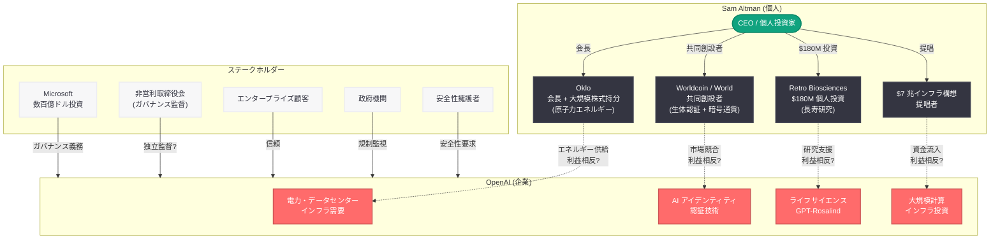
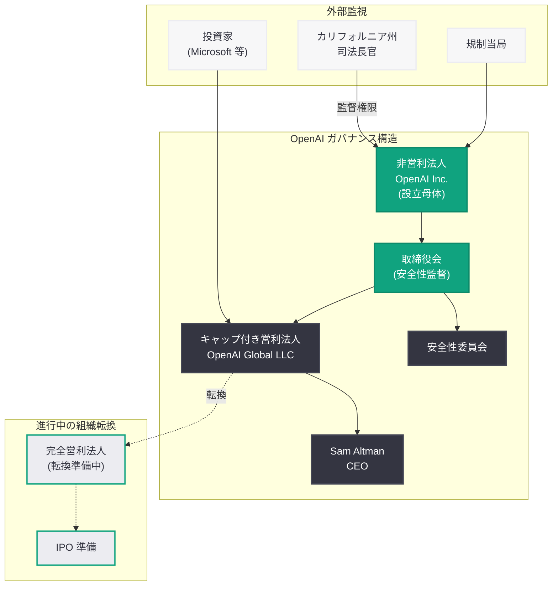

# Sam Altman の副業と利益相反に対する厳しい監視の目: OpenAI は誰のために構築されているのか

## メタデータ

| 項目 | 内容 |
|------|------|
| 発表日 | 2026-04-17 |
| ソース | The Wall Street Journal / Startup Fortune |
| カテゴリ | 企業ガバナンス / 利益相反 / 経営 |
| 公式リンク | [WSJ](https://www.wsj.com/tech/ai/sam-altman-side-hustles-openai)、[Startup Fortune](https://startupfortune.com/sam-altmans-outside-ventures-are-raising-hard-questions-about-who-openai-is-really-building-for/) |

> **注記:** 本レポートは The Wall Street Journal (2026 年 4 月 17 日付) の調査報道および Startup Fortune (2026 年 4 月 19 日付) の分析記事に基づいて作成されている。WSJ 記事の原題は「Sam Altman's Side Hustles Blur the Line Between OpenAI's Interests and His Own」である。

## 概要

The Wall Street Journal は 2026 年 4 月 17 日、Sam Altman の個人投資ポートフォリオが OpenAI の事業領域と増大する重複を見せていることに焦点を当てた調査報道を公開した。Altman が会長を務める原子力エネルギースタートアップ Oklo、生体認証 / 暗号通貨プロジェクト Worldcoin、そして 1 億 8,000 万ドルの個人投資を行った長寿研究企業 Retro Biosciences という 3 つの主要な副業が、OpenAI の電力需要、アイデンティティ認証、ライフサイエンス研究といった事業戦略と直接的に交差する構図が浮き彫りになっている。

Startup Fortune は 4 月 19 日の分析記事で、この問題をさらに掘り下げ、「OpenAI は誰のために構築されているのか」という根本的な問いを提起した。OpenAI の非営利 / キャップ付き営利のハイブリッド構造、2023 年 11 月の取締役会危機後に再構築されたガバナンス体制、そして数百億ドル規模の Microsoft との提携関係という文脈の中で、CEO の個人的な経済的利益と会社の利益が一致しない可能性は、エンタープライズ顧客、政府機関、研究者、安全性擁護者からの信頼に直接的な影響を及ぼすものである。

## 主な内容

### Altman の個人投資ポートフォリオと OpenAI の事業領域の重複

Sam Altman は OpenAI の CEO としての職務とは別に、複数のスタートアップ企業に対して個人的に重要な投資を行っている。問題の核心は、これらの投資先が OpenAI の事業戦略上の重要領域と直接的に重なる点にある。

#### Oklo: 原子力エネルギーと AI インフラの接点

**Altman の関与:** Altman は先進的な原子力エネルギースタートアップ Oklo の会長を務めており、同社に対する大規模な株式持分を保有している。

**OpenAI との利益の交差:** OpenAI の計算処理需要は急速に拡大しており、電力供給は AI インフラにおける最も重要な制約要因の 1 つとなっている。大規模言語モデルの訓練と推論には膨大な電力が必要であり、データセンターの電力確保は OpenAI の事業成長を左右する戦略的課題である。Altman は 7 兆ドル規模のグローバル AI インフラ構想を提唱してきたが、このような大規模インフラ投資は、エネルギー供給企業である Oklo を含む Altman 自身の投資先に資金が流れる構造を生み出す可能性がある。

**懸念事項:** OpenAI がエネルギー供給に関する意思決定を行う際、CEO が個人的に利益を得る可能性のある企業が供給元の候補に含まれることは、意思決定の客観性に対する疑義を生じさせる。

#### Worldcoin: 生体認証と AI アイデンティティ認証の競合

**Altman の関与:** Altman は生体認証技術と暗号通貨を組み合わせたプロジェクト Worldcoin (現在のブランド名は World) の共同創設者であり、虹彩スキャンによる個人認証を通じた「人間であることの証明 (Proof of Personhood)」を推進している。

**OpenAI との利益の交差:** OpenAI 自体も AI を活用したアイデンティティ認証の可能性を追求しており、AI 生成コンテンツの氾濫に対応するための人間認証ソリューションは同社の戦略的関心事項に含まれる。Worldcoin と OpenAI のアイデンティティ認証に関する取り組みは、同じ問題領域をターゲットとしており、両者の境界線が曖昧になるリスクがある。

**懸念事項:** CEO が推進する外部プロジェクトと自社の事業が同一の市場空間を狙っている場合、リソース配分、技術的な意思決定、パートナーシップ戦略において利益相反が発生する可能性がある。

#### Retro Biosciences: ライフサイエンスと OpenAI の研究基盤の接近

**Altman の関与:** Altman は長寿・老化研究を行うスタートアップ Retro Biosciences に対して 1 億 8,000 万ドルの個人投資を行っている。これは個人投資としては極めて大規模な金額である。

**OpenAI との利益の交差:** Retro Biosciences は設立以来、OpenAI の研究インフラからの支援を受けてきたとされる。特に注目すべきは、OpenAI が 2026 年 4 月 16 日 (WSJ 報道の前日) にライフサイエンス特化型モデル GPT-Rosalind を発表したタイミングである。OpenAI が自社のライフサイエンス研究能力を公式製品として展開する一方で、CEO が個人的に巨額の投資を行っているライフサイエンス企業が OpenAI の研究成果の恩恵を受けている構図は、利益相反の疑いを強めるものである。

**懸念事項:** OpenAI の研究リソースが、CEO の個人的な投資先に対して優先的に提供されている可能性があるとすれば、これは受託者責任 (fiduciary duty) の観点から重大な問題となる。

### 利益相反の構造的リスク

以下の図は、Altman の個人投資と OpenAI の事業領域の重複関係を可視化したものである。

### ガバナンス上の懸念

#### 2023 年取締役会危機からの教訓

2023 年 11 月、OpenAI の取締役会は Altman を突然 CEO から解任した。この危機の結果、取締役会は再構築され、「安全性監督」を重視する新たなガバナンス体制が敷かれた。しかし、WSJ の報道は、再構築後のガバナンス体制が本来の役割を果たしているかに対して深い疑問を呈している。

**ガバナンスの理想と現実:**

| 期待されるガバナンス | 現在の懸念 |
|---------------------|-----------|
| 非営利取締役会が商業的利益への歯止めとなる | CEO の外部ポジションが取締役会の独立性を損なう可能性 |
| 安全性監督の強化 | 利益相反の監視が十分に行われているか不明 |
| ステークホルダーの利益保護 | CEO の個人的経済的利益が意思決定を歪める可能性 |
| 透明性の確保 | 外部投資と社内意思決定の関係が不透明 |

#### 受託者責任と法的リスク

受託者責任 (fiduciary duty) の法理は、企業の経営幹部が個人的な利益よりも会社の利益を優先することを義務づけている。Altman のケースでは、以下の法的論点が生じ得る。

- **忠実義務 (Duty of Loyalty):** CEO は自身の利益よりも OpenAI の利益を優先する義務がある。Oklo への投資と OpenAI のエネルギー調達に関する意思決定が重なる場合、この義務への抵触が問われる可能性がある
- **注意義務 (Duty of Care):** 情報に基づく合理的な意思決定を行う義務であり、個人的な経済的利益がバイアスを生じさせる場合に問題となる
- **利益相反開示義務:** 多くの法域において、経営幹部は潜在的な利益相反を取締役会に開示する義務がある。開示が不十分であれば法的リスクとなる

#### ハイブリッド組織構造の複雑性

OpenAI は非営利法人を頂点とし、キャップ付き営利法人がその下に位置するハイブリッド構造を採用している。この構造は、AI の安全性と公益性を最優先事項として維持しつつ、商業的活動を行うために設計された。しかし、現在進行中の営利法人への完全転換計画とも相まって、この独特な構造が利益相反問題への対処をさらに複雑にしている。

- **非営利の使命:** 「安全で有益な汎用人工知能 (AGI) の開発」が OpenAI の設立目的である。CEO の副業がこの使命と整合するかどうかは重要な問いである
- **営利転換の影響:** 営利法人への完全転換が進む中、非営利取締役会のガバナンス機能が弱体化するリスクがある。これにより、利益相反の監視体制がさらに脆弱になる可能性がある
- **投資家の期待:** $1,220 億規模の資金調達を完了し IPO を準備する段階において、利益相反の存在は投資家の信頼を毀損する要因となり得る

### Microsoft との関係への影響

Microsoft は OpenAI に対して数百億ドル規模のコミットメントを行っており、両社の関係は AI 産業における最も重要なパートナーシップの 1 つである。Microsoft 自体にもガバナンス上の義務があり、投資先企業の CEO が利益相反を抱えている場合、それは Microsoft の投資判断と株主への説明責任にも影響する。

**考慮すべき論点:**

- **投資保護:** Microsoft の巨額投資が、Altman の個人的な投資先に間接的に利益をもたらす構造になっている場合、Microsoft の株主はこの状況をどう評価するか
- **共同意思決定:** Microsoft と OpenAI が AI インフラに関する共同意思決定を行う際、Altman の Oklo への関与はどのように管理されるか
- **Azure との競合:** Microsoft Azure のデータセンター戦略と、Altman が推進する独自の AI インフラ構想との間に整合性はあるか

### 信頼への影響

OpenAI の商業的成長は、複数のステークホルダーグループからの信頼に依存している。WSJ の報道は、この信頼基盤を揺るがす可能性を持つ。

**ステークホルダー別の影響:**

- **エンタープライズ顧客:** OpenAI の API やプラットフォームに依存する企業は、CEO の利益相反が製品開発の優先順位やリソース配分に影響を与えないかを懸念する可能性がある
- **政府機関:** AI の規制を検討する政府機関にとって、AI 企業の CEO が複数の関連企業に経済的利益を持つことは、業界全体のガバナンスへの信頼を低下させる材料となり得る
- **研究者:** OpenAI の研究リソースが CEO の投資先に優先的に配分される可能性は、学術界や研究コミュニティとの信頼関係を損なう要因である
- **安全性擁護者:** AI の安全性を最優先とする OpenAI の使命が、CEO の商業的利益によって後回しにされるリスクへの懸念が高まる

## 技術的な詳細

本件は技術的な製品・API の発表ではなく、コーポレートガバナンスに関する報道である。ここでは、OpenAI のガバナンス構造と利益相反管理の仕組みについて詳述する。

### OpenAI のガバナンス構造

### 利益相反管理のフレームワーク

適切なコーポレートガバナンスにおいて、利益相反を管理するための標準的なフレームワークは以下の通りである。

1. **開示 (Disclosure):** 経営幹部が外部の経済的利益を取締役会に完全に開示すること
2. **回避 (Recusal):** 利益相反が存在する意思決定から当該経営幹部を除外すること
3. **独立審査 (Independent Review):** 利益相反に関わる取引を独立した第三者が審査すること
4. **文書化 (Documentation):** 利益相反の管理プロセスとその結果を記録すること
5. **定期的監査 (Periodic Audit):** 利益相反管理の有効性を定期的に評価すること

WSJ の報道は、OpenAI がこれらのフレームワークを十分に実施しているかについて疑問を投げかけている。特に、2023 年の取締役会危機後に再構築されたガバナンス体制において、Altman の外部投資に関する監視がどの程度機能しているかは不透明な状況にある。

### 時系列: Altman の副業と OpenAI の事業展開の交差

| 日付 / 時期 | Altman の副業関連 | OpenAI の事業関連 |
|------------|------------------|------------------|
| 2021 年 | Worldcoin プロジェクト共同創設 | -- |
| 2023 年初頭 | Oklo 会長就任、株式取得 | AI 計算需要の急速な拡大 |
| 2023 年 11 月 | -- | 取締役会危機、Altman 解任→復帰 |
| 2024 年 | Retro Biosciences に $180M 投資 | ライフサイエンス研究への関心拡大 |
| 2024 年 | $7 兆 AI インフラ構想を提唱 | データセンター電力需要の急増 |
| 2025 年 | Oklo の事業拡大 | AI 推論コストの増大、電力確保の重要性向上 |
| 2026 年 3 月 31 日 | -- | $1,220 億資金調達完了 |
| 2026 年 4 月 16 日 | Retro Biosciences が OpenAI 研究の恩恵を受領 | GPT-Rosalind (ライフサイエンス特化型モデル) 発表 |
| 2026 年 4 月 17 日 | WSJ が利益相反を報道 | 幹部 3 名の同時退社 |

## 開発者への影響

本件は技術的な API 変更ではなく、OpenAI の組織ガバナンスに関する報道であるが、開発者やエンタープライズ顧客に対して以下の間接的な影響が考えられる。

### プラットフォーム依存リスクの再評価

- **戦略的優先順位の不透明性:** CEO の個人的利益と会社の戦略的優先順位が交差する可能性がある場合、OpenAI がどの領域に長期的にコミットするかの予測が困難になる。ライフサイエンス分野 (GPT-Rosalind) への投資が持続的なものか、CEO の個人的関心に基づく一時的なものかを見極める必要がある
- **マルチプロバイダー戦略の重要性:** OpenAI のガバナンスリスクを考慮し、Anthropic、Google、Meta 等の代替プロバイダーとの並行利用を検討する開発者が増加する可能性がある

### エンタープライズ契約への影響

- **デューデリジェンスの強化:** 大規模なエンタープライズ契約において、OpenAI のガバナンス体制と利益相反管理に関するデューデリジェンスが厳格化される可能性がある
- **調達基準の変化:** 政府機関や規制対象業種の組織は、AI プロバイダー選定においてガバナンス体制の評価をより重視する方向に動く可能性がある

### IPO への影響と長期的な安定性

- **IPO プロセスにおける開示要件:** OpenAI が IPO を実施する場合、Altman の外部投資と潜在的な利益相反について詳細な開示が求められる。これは OpenAI の企業評価額と投資家の信頼に影響を与える可能性がある
- **上場後のガバナンス:** IPO 後は証券取引委員会 (SEC) の監督下に入り、利益相反管理に関するより厳格な基準が適用される。これは OpenAI の組織運営に長期的な変化をもたらす可能性がある

## 関連リンク

- [WSJ: Sam Altman's Side Hustles Blur the Line Between OpenAI's Interests and His Own](https://www.wsj.com/tech/ai/sam-altman-side-hustles-openai)
- [Startup Fortune: Sam Altman's Outside Ventures Are Raising Hard Questions About Who OpenAI Is Really Building For](https://startupfortune.com/sam-altmans-outside-ventures-are-raising-hard-questions-about-who-openai-is-really-building-for/)
- [関連レポート: The New Yorker が Sam Altman の経営手法を徹底検証](2026-04-07-new-yorker-altman-investigation.md)
- [関連レポート: Musk が Altman の CEO 解任を裁判所に要求](2026-04-07-musk-seeks-altman-ouster.md)
- [関連レポート: OpenAI 幹部 3 名が同日退社](2026-04-17-openai-triple-executive-exit.md)
- [OpenAI News](https://openai.com/news)

## まとめ

WSJ が 2026 年 4 月 17 日に報じた Sam Altman の副業と利益相反に関する調査報道は、OpenAI のコーポレートガバナンスにおける構造的な問題を浮き彫りにしている。Oklo (原子力エネルギー)、Worldcoin (生体認証)、Retro Biosciences (ライフサイエンス) という 3 つの主要な個人投資先が、OpenAI の電力インフラ、アイデンティティ認証、ライフサイエンス研究という事業戦略と直接的に重なる構図は、受託者責任の観点から重大な懸念を提起するものである。

特に、Altman が提唱する 7 兆ドル規模の AI インフラ構想が自身の投資先に資金を流す可能性、OpenAI の研究基盤が Retro Biosciences に優先的に提供されている可能性、そして GPT-Rosalind の発表と Retro Biosciences の関係性は、CEO の個人的利益と会社の公益的使命の間の緊張関係を端的に示している。

2023 年 11 月の取締役会危機後に再構築されたガバナンス体制が、こうした利益相反を適切に監視・管理できているかは疑わしい。OpenAI が IPO に向けて動き出す中で、同社は利益相反管理の透明性を大幅に向上させ、ステークホルダーの信頼を回復する必要がある。エンタープライズ顧客や開発者にとっては、OpenAI への依存度を適切に管理し、プラットフォームリスクを分散させることがこれまで以上に重要になっている。この問題は、急速に成長する AI 産業全体に対して、ガバナンスと倫理的リーダーシップの重要性を改めて突きつけるものである。
