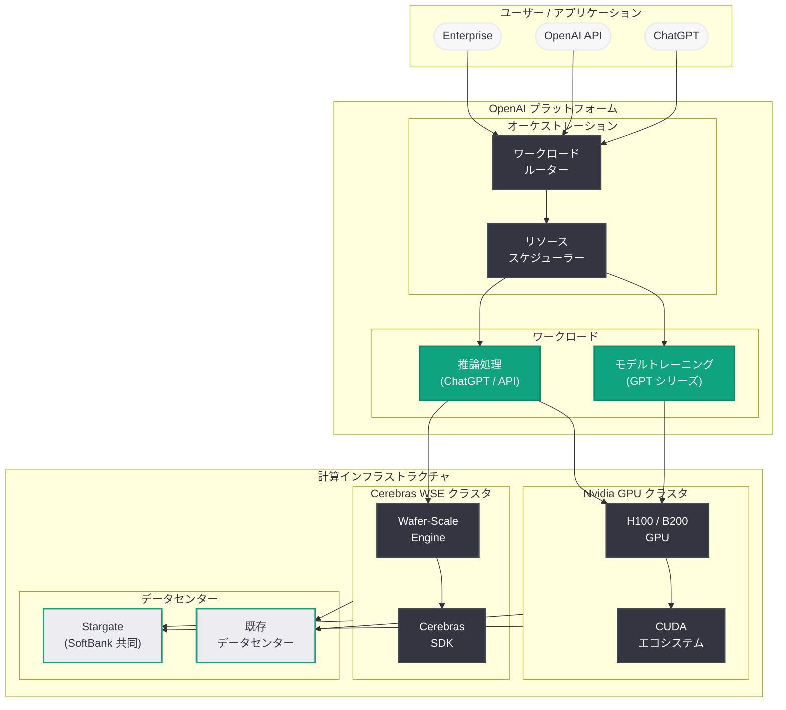

# OpenAI が Cerebras と 200 億ドル超のチップ供給契約を締結: AI 推論市場の覇権を巡る大規模投資

## メタデータ

| 項目 | 内容 |
|------|------|
| 発表日 | 2026-04-17 |
| ソース | The Information / Reuters / Investing.com |
| カテゴリ | インフラ投資 / チップ戦略 / AI 推論 |
| 公式リンク | [Reuters](https://www.reuters.com/technology/openai-cerebras-chip-deal-2026-04-17/) / [Devdiscourse](https://www.devdiscourse.com/article/technology/3413832-openais-20-billion-deal-with-cerebras-a-game-changer-in-ai-technology) |

## 概要

OpenAI が AI チップメーカー Cerebras Systems との間で 200 億ドル (約 3 兆円) を超える大規模なチップ供給契約を締結したことが、2026 年 4 月 17 日に The Information の報道で明らかになった。本契約は 2026 年 1 月に「200 億ドル超の複数年契約」として発表されていたものの具体的な詳細が判明したものであり、OpenAI が Cerebras に対して出資 (エクイティステーク) を取得することも含まれている。

この取引は、OpenAI が Nvidia への依存から脱却し、AI 推論用の計算資源を多角的に確保するという戦略的な転換点を示している。Cerebras の Wafer-Scale Engine (WSE) チップは、史上最大のチップとして設計されており、AI 推論処理に特化した性能を発揮する。OpenAI が Stargate データセンタープロジェクトと並行してこの規模の投資を行うことは、同社が AI インフラに対して前例のないスケールで資本を投下していることを示すものである。

## 主な内容

### 契約の概要と経緯

本契約は、2026 年 1 月に OpenAI と Cerebras Systems の間で初めて発表された複数年にわたるチップ供給契約である。当初は「200 億ドルを超える規模の複数年契約」として公表されていたが、2026 年 4 月 17 日の The Information の報道により、契約の詳細な構造が明らかになった。

契約の主要な要素は以下の通りである。

- **契約規模:** 200 億ドル (約 3 兆円) 超の複数年契約
- **エクイティステーク:** OpenAI が Cerebras Systems の株式を取得。出資比率の詳細は非公開
- **供給対象:** Cerebras の Wafer-Scale Engine (WSE) チップ。主に AI 推論処理向け
- **契約期間:** 複数年 (具体的な期間は非公開)

OpenAI が単なるチップの購入契約にとどまらず、Cerebras に対して出資を行うという構造は、両社の関係が通常のサプライヤー - バイヤーの枠を超えた戦略的パートナーシップであることを示している。

### Cerebras Systems と Wafer-Scale Engine (WSE) チップ

Cerebras Systems は、AI 処理に特化した半導体チップを設計・製造するスタートアップ企業である。同社の中核技術である Wafer-Scale Engine (WSE) は、これまでに製造された中で最大のチップとして知られている。

#### WSE チップの特徴

- **ウェーハスケール設計:** 通常の半導体チップはシリコンウェーハから個別に切り出されるが、WSE はウェーハ全体を 1 枚のチップとして使用する革新的な設計を採用
- **巨大なダイサイズ:** WSE のダイサイズは通常の GPU と比較して桁違いに大きく、大量のトランジスタとメモリを 1 チップ上に集積
- **AI 推論に最適化:** 大規模言語モデル (LLM) の推論処理において、低レイテンシかつ高スループットを実現する設計
- **オンチップメモリ:** 大容量の SRAM をチップ上に搭載することで、外部メモリへのアクセスによるボトルネックを解消

WSE チップは、従来の Nvidia GPU とは根本的に異なるアーキテクチャを採用しており、特に AI 推論ワークロードにおいてエネルギー効率と処理速度の両面で優位性を持つとされている。

### Cerebras の IPO 計画

Cerebras Systems は、OpenAI との大型契約の発表と並行して、新規株式公開 (IPO) の申請を再開した。Cerebras は 2025 年に IPO を計画していたが、当時の市場環境を理由に計画を撤回していた。200 億ドル超の OpenAI 契約という強力なバックボーンを得たことで、IPO を再び推進する基盤が整ったと判断したものと考えられる。

IPO に関する主要なポイントは以下の通りである。

- **IPO 再申請:** 2025 年に撤回した IPO 計画を再度申請
- **評価額への影響:** OpenAI 契約により、Cerebras の企業価値評価が大幅に上昇することが見込まれる
- **OpenAI のエクイティステーク:** IPO に先立って OpenAI が株式を取得したことは、上場後の株価上昇による OpenAI のリターンにもつながる可能性がある
- **市場のシグナル:** AI チップ専業メーカーとしての上場は、Nvidia 一強の GPU 市場に新たな競争軸を持ち込む

### Nvidia 依存からの脱却: 「推論戦争」の構図

本契約の最も重要な文脈は、OpenAI が長年依存してきた Nvidia からの調達構造を多角化するという戦略的意図にある。AI 業界では「推論戦争 (War of Inference)」と呼ばれる競争が激化しており、OpenAI と Nvidia はそれぞれ異なるアプローチで AI 推論市場の覇権を争っている。

#### OpenAI 側の動き

- **Cerebras との 200 億ドル超契約:** 推論特化型チップの大規模調達
- **Stargate データセンター:** SoftBank と共同で進める大規模データセンタープロジェクト
- **チップ供給の多角化:** Nvidia 以外のサプライヤーからの調達比率を引き上げ

#### Nvidia 側の動き

- **推論専用チップの開発強化:** トレーニングだけでなく推論市場でも支配的地位を維持する戦略
- **ソフトウェアエコシステム (CUDA) の優位性:** 長年にわたる開発者エコシステムの蓄積
- **クラウドパートナーシップ:** 主要クラウドプロバイダーとの関係維持

AI の進化がトレーニングフェーズから推論フェーズへと重心を移す中で、推論処理の効率化とコスト削減は AI 企業の競争力を左右する重要な要素となっている。OpenAI が Cerebras の WSE チップを大規模に導入することは、この推論戦争における重要な一手である。

### Stargate データセンタープロジェクトとの関係

OpenAI は SoftBank との共同プロジェクト「Stargate」を通じて、大規模な AI データセンターの建設を進めている。Cerebras チップの大量調達は、このデータセンターインフラの計算能力を拡充するための取り組みの一部として位置づけられる。

Stargate プロジェクトと Cerebras 契約の関係は以下のように整理できる。

- **計算資源の多様化:** Stargate データセンターには Nvidia GPU と Cerebras WSE の両方が導入される可能性
- **推論処理の分散:** トレーニングは引き続き Nvidia GPU を主力としつつ、推論処理を Cerebras WSE にオフロードする構成
- **投資規模の全体像:** Stargate プロジェクト (数百億ドル規模) と Cerebras 契約 (200 億ドル超) を合わせると、OpenAI のインフラ投資は前例のない規模に達する

## 技術的な詳細

### Nvidia GPU vs Cerebras WSE: 技術比較

| 項目 | Nvidia GPU (H100/B200) | Cerebras WSE |
|------|----------------------|--------------|
| 設計思想 | 汎用 GPU アーキテクチャ | ウェーハスケール専用設計 |
| 主な用途 | トレーニング + 推論 | 推論特化 |
| チップサイズ | 標準的なダイサイズ | ウェーハ全体を 1 チップ化 |
| メモリ | HBM (外付け高帯域メモリ) | 大容量オンチップ SRAM |
| ソフトウェア | CUDA エコシステム | Cerebras 独自 SDK |
| スケーラビリティ | マルチ GPU クラスタ | ウェーハスケール並列処理 |
| エネルギー効率 | 高性能だが消費電力大 | 推論ワークロードで高効率 |
| エコシステム成熟度 | 非常に成熟 | 発展途上 |

### OpenAI の計算資源戦略

OpenAI が Cerebras との契約を通じて構築しようとしている計算資源戦略は、以下の 3 層構造として理解できる。

1. **トレーニング層:** 大規模モデル (GPT シリーズ) のトレーニングには引き続き Nvidia GPU (H100、B200 等) を主力として使用。Nvidia の CUDA エコシステムとの互換性が重要
2. **推論層:** ChatGPT や API を通じた推論リクエストの処理に Cerebras WSE チップを導入。低レイテンシと高スループットを実現し、推論コストを削減
3. **エッジ / 特化型処理:** 将来的には、特定のワークロード (マルチモーダル処理、リアルタイム推論等) に最適化された専用チップの導入も視野に

## アーキテクチャ

以下は、OpenAI のチップ / 計算資源サプライチェーンの全体像を示すアーキテクチャ図である。

## 開発者への影響

### 推論パフォーマンスの向上

- **レイテンシの改善:** Cerebras WSE チップの導入により、OpenAI API を通じた推論リクエストのレイテンシが改善される可能性がある。特にリアルタイム性が求められるアプリケーション (チャットボット、コード補完等) において顕著な効果が期待される
- **スループットの拡大:** 大規模なチップ調達により、API の同時処理能力が向上し、ピーク時のレートリミットやキューイングの緩和が見込まれる

### API 利用コストへの影響

- **推論コストの削減可能性:** Cerebras WSE のエネルギー効率の高さにより、OpenAI の推論コストが削減されれば、API 利用料金の値下げにつながる可能性がある
- **新料金プランの可能性:** 推論チップの多様化により、用途別 (高速推論、バッチ推論等) の差別化された料金プランが導入される可能性がある

### AI インフラ開発者への影響

- **チップ多様化のトレンド:** OpenAI の動きは、AI 業界全体における Nvidia 以外のチップへの関心を高め、開発者がマルチチップ環境を前提としたアプリケーション設計を検討する契機となる
- **推論最適化の重要性:** トレーニングから推論へのフォーカスシフトにより、モデルの推論効率 (量子化、蒸留、プルーニング等) を意識した開発がより重要になる

### スタートアップエコシステムへの影響

- **AI チップスタートアップへの投資促進:** OpenAI による Cerebras への大規模投資は、Groq、SambaNova、Graphcore など他の AI チップスタートアップへの投資家の関心を高める可能性がある
- **推論特化型サービスの台頭:** 推論処理に特化した新しいクラウドサービスやプラットフォームの登場が加速する可能性がある

## 関連リンク

- [Reuters: OpenAI Cerebras chip deal](https://www.reuters.com/technology/openai-cerebras-chip-deal-2026-04-17/)
- [Devdiscourse: OpenAI's $20 Billion Deal with Cerebras](https://www.devdiscourse.com/article/technology/3413832-openais-20-billion-deal-with-cerebras-a-game-changer-in-ai-technology)
- [Cerebras Systems 公式サイト](https://www.cerebras.net/)
- [OpenAI News](https://openai.com/news)
- [Nvidia 公式サイト](https://www.nvidia.com/)

## まとめ

OpenAI と Cerebras Systems の 200 億ドル超のチップ供給契約は、AI 業界におけるインフラ投資とチップ戦略の転換点を象徴する出来事である。本契約により、OpenAI は Nvidia への一極集中的な依存構造から脱却し、推論処理に特化した Cerebras の Wafer-Scale Engine (WSE) チップを大規模に導入する道を開いた。OpenAI が Cerebras のエクイティステークを取得するという契約構造は、単なる調達関係を超えた戦略的パートナーシップであることを示している。

AI 産業の重心がモデルのトレーニングから推論処理へと移行する中で、推論の効率化とスケーラビリティは企業の競争力を左右する重要な要素となっている。OpenAI の Cerebras 契約と Stargate データセンタープロジェクトを合わせた大規模インフラ投資は、同社が AI の次のフェーズ、すなわち「推論戦争」において主導的な地位を確保しようとする明確な意思表示である。Cerebras の IPO 再申請と合わせて、AI チップ市場全体に新たな競争と革新の波が到来することが予想される。開発者にとっては、推論パフォーマンスの向上や API コストの改善という恩恵がもたらされる可能性があり、今後の動向を注視する必要がある。
