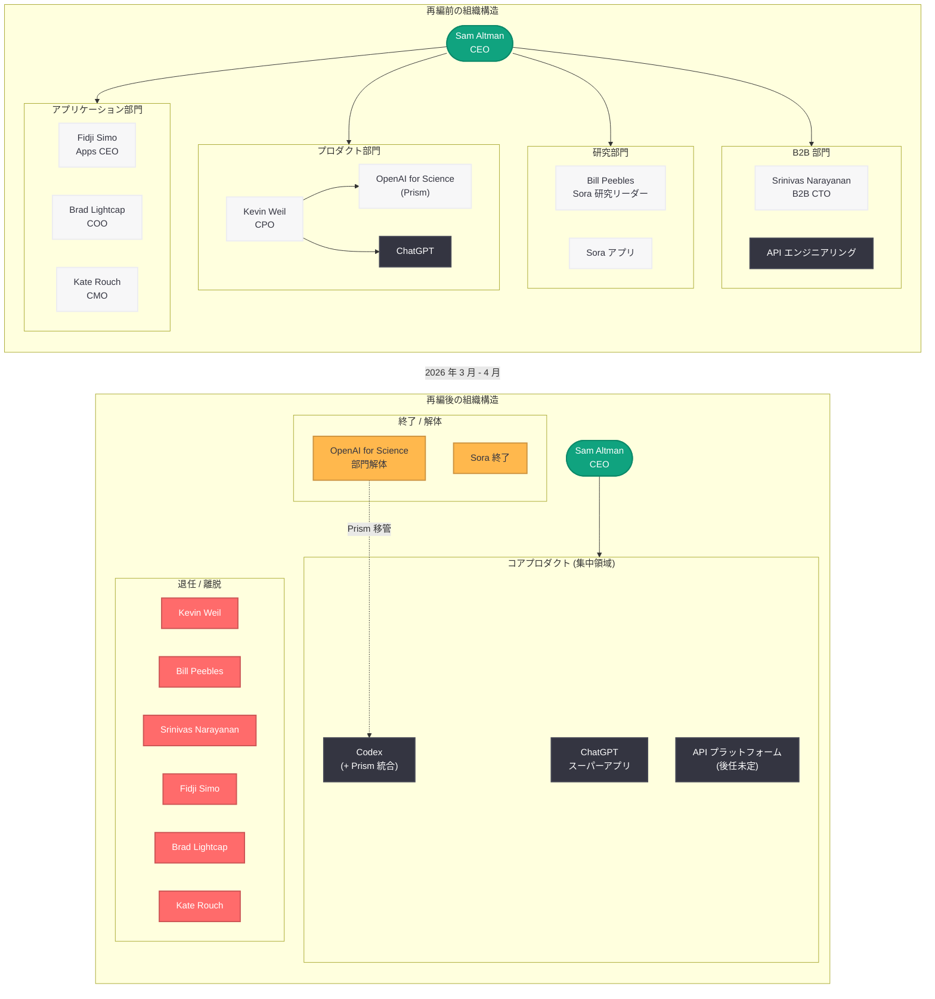

# OpenAI 幹部 3 名が同日退社: Kevin Weil、Bill Peebles、Srinivas Narayanan が一斉離脱

## メタデータ

| 項目 | 内容 |
|------|------|
| 発表日 | 2026-04-17 |
| ソース | The Information / WIRED / TechCrunch / CNBC / Business Insider / The Decoder / The Next Web |
| カテゴリ | 企業 / 人事 / 組織再編 |
| 公式リンク | [WIRED](https://www.wired.com/story/openai-executive-kevin-weil-leaving/)、[TechCrunch](https://techcrunch.com/2026/04/17/kevin-weil-and-bill-peebles-exit-openai-as-company-continues-to-shed-side-quests/)、[The Decoder](https://the-decoder.com/openai-loses-three-executives-in-one-swoop-as-restructuring-reshapes-its-product-lineup/) |

> **注記:** 本レポートは WIRED、TechCrunch、CNBC、Business Insider、The Decoder、The Next Web など複数の主要メディアの報道および The Information の調査報道、各人物の X (旧 Twitter) 投稿に基づいて作成されている。

## 概要

2026 年 4 月 17 日、OpenAI の上級幹部 3 名が同日に退社したことが複数の主要メディアによって一斉に報じられた。退社したのは、最高プロダクト責任者 (CPO) の Kevin Weil、動画生成モデル Sora の研究リーダーである Bill Peebles、そして B2B アプリケーション CTO 兼 API エンジニアリング責任者の Srinivas Narayanan の 3 名である。TechCrunch はこの出来事を「OpenAI が引き続き "サイドクエスト" (本筋から外れたプロジェクト) を整理している」と表現している。

この 3 名の同時離脱は、OpenAI が進める大規模な組織再編の一環として位置づけられる。2026 年 3 月の Sora 終了、同年 4 月初旬の CMO Kate Rouch の退任、アプリケーション事業 CEO Fidji Simo の医療休暇、COO Brad Lightcap のスペシャルプロジェクトへの異動に続く形であり、OpenAI の経営層からの人材流出が加速していることを示している。OpenAI はコンシューマー向けの実験的プロダクトから撤退し、エンタープライズ AI と ChatGPT スーパーアプリへの集中を鮮明にしている。

## 主な内容

### Kevin Weil -- 最高プロダクト責任者 (CPO) の退任

Kevin Weil は OpenAI の最高プロダクト責任者 (CPO) として経営チームの中核を担っていた。The Information の報道によれば、Weil の退任に伴い、同氏が率いていた「OpenAI for Science」部門は解体され、その研究チームは他の研究部門に分散配置される。

**OpenAI for Science 部門の再編:** Weil が統括していた科学研究向け AI ツール「Prism」とその開発チームは、Codex プロダクトチームに移管される。これは OpenAI がコーディング支援ツール Codex を戦略的な中核プロダクトとして位置づけ、科学研究向けの AI 機能を Codex エコシステムに統合する方向性を示している。

Weil は Instagram や Twitter (現 X) でのプロダクト開発経験を持つシリコンバレーの著名なプロダクトリーダーであり、OpenAI の製品戦略において重要な役割を果たしていた。同氏の退任は、OpenAI のプロダクト組織における大きな転換点を意味する。

### Bill Peebles -- Sora 研究リーダーの離脱

Bill Peebles は OpenAI の動画生成モデル Sora の研究開発を主導してきたリサーチリーダーである。同氏の退社は、OpenAI が 2026 年 3 月に計算資源 (コンピュート) の不足を理由に Sora アプリを終了した約 1 か月後のタイミングとなる。

**Sora 終了との関連:** 2026 年 3 月 25 日、OpenAI は Sora アプリの提供を終了し、Disney との 10 億ドル規模の提携も解消した。コンシューマー向けエンターテインメントから撤退し、ビジネス向けツールと IPO 準備に注力するという戦略転換の一環であった。Peebles にとって、自身が研究を牽引してきたプロダクトの終了は、OpenAI に留まる理由の喪失を意味したと考えられる。

Sora は 2024 年の初公開以来、AI による動画生成の可能性を示す先駆的なプロジェクトとして業界の注目を集めてきたが、コンピュートコストの高さと収益化の困難さが最終的にプロジェクトの存続を阻んだ。Peebles の退社は、OpenAI における Sora 関連の研究開発が実質的に終了したことを象徴するものである。

### Srinivas Narayanan -- B2B アプリケーション CTO の退任

Srinivas Narayanan は OpenAI の B2B (企業間取引) アプリケーション担当 CTO として、API エンジニアリングチームを統括してきた。同氏の退任は、他の 2 名とは異なり、組織再編よりも個人的な理由に基づくものとみられる。

Narayanan は X (旧 Twitter) に投稿し、退社後の時間を楽しみにしている旨を述べており、次のキャリアへの移行というよりも、一時的な休息を取る意向を示唆している。しかし、API エンジニアリングチームの責任者という戦略的に極めて重要なポジションからの離脱は、OpenAI の API プラットフォーム開発に影響を与える可能性がある。

API は OpenAI の収益の根幹を支える事業領域であり、エンタープライズ顧客へのサービス提供において中核的な役割を果たしている。Narayanan の後任がどのように選定され、API 戦略がどう継続されるかは、OpenAI の B2B 事業の今後を左右する重要な要素となる。

### 加速する幹部離脱の時系列

2026 年に入ってからの OpenAI 経営陣の主要な人事異動を時系列で整理すると、その規模と頻度の異常さが明確になる。

| 日付 | 人物 | 役職 | 理由 / 状況 |
|------|------|------|-------------|
| 2026-03-25 | -- | -- | Sora アプリ終了 (Peebles 退社の伏線) |
| 2026-04-03 | Fidji Simo | アプリケーション事業 CEO | 医療休暇 |
| 2026-04-03 | Brad Lightcap | COO | スペシャルプロジェクトへの異動 |
| 2026-04-03 | Kate Rouch | CMO | 退任 (乳がん回復に専念) |
| 2026-04-17 | Kevin Weil | CPO | 退任 (組織再編に伴う) |
| 2026-04-17 | Bill Peebles | Sora 研究リーダー | 退社 (Sora 終了後) |
| 2026-04-17 | Srinivas Narayanan | B2B アプリケーション CTO | 退任 (個人的理由) |

わずか 2 週間の間に 6 名の上級幹部が離脱または異動しており、OpenAI の経営体制は急速に変貌を遂げている。

### 戦略的背景: "サイドクエスト" の整理

TechCrunch が「サイドクエスト (side quests) の整理」と表現したように、OpenAI は本筋から外れたプロジェクトを次々と終了し、コアビジネスへの集中を加速させている。

**整理されたプロジェクトと方向性:**

- **Sora (動画生成):** 2026 年 3 月に終了。コンピュート不足と収益化困難が原因
- **OpenAI for Science:** Kevin Weil の退任に伴い部門解体。Prism チームは Codex に統合
- **コンシューマー向けエンターテインメント:** Disney との提携解消に象徴される撤退

**集中する領域:**

- **ChatGPT スーパーアプリ:** デスクトップアプリの強化、ライブラリ機能、音声対話、広告統合など、ワンストップ AI プラットフォームとしての進化
- **エンタープライズ AI:** API プラットフォーム、Codex (コーディング支援)、ChatGPT Enterprise / Team
- **IPO 準備:** 営利法人への転換、資金調達、企業評価額の最大化

## 技術的な詳細

### 組織再編に伴うプロダクト・チームの再配置

今回の 3 名の退社は、単なる人事異動にとどまらず、OpenAI のプロダクトポートフォリオとエンジニアリング組織の構造的な変更を伴っている。

#### Prism から Codex への統合

Kevin Weil が率いていた OpenAI for Science 部門の科学研究ツール「Prism」は、Codex プロダクトチームに移管される。この統合は以下の技術的な意味を持つ。

- **科学的推論能力の Codex への統合:** Prism が培った科学的データ分析、仮説生成、研究文献の理解といった能力が Codex のコーディング支援に組み込まれる可能性がある
- **Codex の適用領域拡大:** 従来のソフトウェア開発支援に加え、科学計算、データサイエンス、研究開発のワークフローをカバーする汎用的な AI エージェントとしての進化が見込まれる
- **リソース集中:** 分散していた研究リソースを Codex に集中させることで、開発速度と品質の向上を図る

#### API エンジニアリングの継続性

Narayanan の退任後、API エンジニアリングチームの組織体制がどのように再構成されるかは現時点では明らかでない。ただし、OpenAI が API を収益の中核として位置づけている以上、後任の選定と組織の安定化は最優先事項となる。

- **Responses API の進化:** 2026 年 3 月にリリースされた Responses API やコンピュータ環境連携の開発継続性への影響
- **SDK アップデート:** Python SDK v2.32 (WebSocket 対応) など、活発なリリースサイクルの維持
- **エンタープライズ機能:** ChatGPT Enterprise、Codex for Teams、柔軟な料金プランなどの B2B 機能開発

## アーキテクチャ

以下は、今回の幹部退社に伴う OpenAI の組織再編を示す Before / After の構造図である。

## 開発者への影響

今回の幹部 3 名の同時退社は、OpenAI のプロダクト戦略と API エコシステムに関わる開発者に対して複数の影響を及ぼす可能性がある。

### API 開発者への影響

- **API エンジニアリングの継続性:** Narayanan の退任により、API チームのリーダーシップに空白が生じる。新しいエンドポイントの追加、既存 API の改善、SDK のリリーススケジュールに遅延が生じる可能性がある。ただし、OpenAI が API を収益の中核と位置づけている以上、迅速な後任選定が見込まれる
- **B2B 機能の方向性:** B2B アプリケーション CTO の退任は、エンタープライズ向け API 機能 (カスタムモデル、ファインチューニング、専用インスタンスなど) の開発優先度に影響を与える可能性がある

### Codex エコシステムの開発者への影響

- **Codex の機能拡張:** Prism チームの Codex への統合により、Codex が科学計算やデータサイエンスの領域にも対応する可能性がある。Codex API や Codex for Teams を利用する開発者にとって、新たなユースケースが開拓される可能性がある
- **Codex の戦略的重要性の向上:** OpenAI がリソースを Codex に集中させていることから、Codex 関連の API やツールが今後さらに強化されることが予想される

### プロダクト戦略の変化に伴う影響

- **ChatGPT スーパーアプリへの集中:** OpenAI が ChatGPT を統合プラットフォームとして進化させる方向性がより鮮明になった。サードパーティ開発者は、ChatGPT プラグインやカスタム GPT のエコシステムにおけるポジショニングを再検討する必要がある
- **"サイドクエスト" 領域のリスク:** Sora (動画生成) や OpenAI for Science のように、OpenAI が投資対効果の低い領域から撤退するパターンが確認されたため、OpenAI のプラットフォームに依存したプロダクトを構築する際には、当該領域が OpenAI のコア戦略に合致しているかを慎重に評価する必要がある

### オープンソース / 競合への人材流出

- **退社した幹部の動向:** Kevin Weil や Bill Peebles のようなトップレベルの AI 人材が市場に戻ることで、競合他社 (Anthropic、Google DeepMind、Meta AI など) や AI スタートアップにとっての採用機会が生まれる。これは長期的に AI エコシステム全体の競争環境に影響を与える

## 関連リンク

- [WIRED: OpenAI Executive Kevin Weil Leaving](https://www.wired.com/story/openai-executive-kevin-weil-leaving/)
- [TechCrunch: Kevin Weil and Bill Peebles exit OpenAI as company continues to shed side quests](https://techcrunch.com/2026/04/17/kevin-weil-and-bill-peebles-exit-openai-as-company-continues-to-shed-side-quests/)
- [The Decoder: OpenAI loses three executives in one swoop as restructuring reshapes its product lineup](https://the-decoder.com/openai-loses-three-executives-in-one-swoop-as-restructuring-reshapes-its-product-lineup/)
- [関連レポート: OpenAI が Sora を終了、Disney との 10 億ドル提携も解消](2026-03-25-openai-sora-shutdown-disney-exit.md)
- [関連レポート: OpenAI CMO Kate Rouch が退任](2026-04-03-openai-cmo-kate-rouch-steps-down.md)
- [関連レポート: OpenAI 経営陣の人事異動: Fidji Simo が医療休暇、Brad Lightcap が新役職へ](2026-04-03-openai-leadership-shuffle-simo-leave.md)
- [関連レポート: Codex をほぼすべてに活用](2026-04-16-codex-for-almost-everything.md)
- [関連レポート: ChatGPT Pro 100 Codex Plan](2026-04-11-chatgpt-pro-100-codex-plan.md)
- [OpenAI News](https://openai.com/news)

## まとめ

2026 年 4 月 17 日の Kevin Weil (CPO)、Bill Peebles (Sora 研究リーダー)、Srinivas Narayanan (B2B CTO) の同時退社は、OpenAI の組織再編が新たな段階に入ったことを明確に示すものである。3 月の Sora 終了、4 月初旬の Fidji Simo、Brad Lightcap、Kate Rouch の離脱と合わせると、わずか 1 か月弱の間に経営チームの主要メンバー 6 名が離脱または異動するという、かつてない規模の組織変動が進行している。

その背景にあるのは、OpenAI の明確な戦略転換である。動画生成 (Sora) や科学研究ツール (Prism / OpenAI for Science) といった実験的な "サイドクエスト" を整理し、ChatGPT スーパーアプリ、Codex (コーディング支援 AI)、エンタープライズ API という収益性の高いコアビジネスにリソースを集中させる方向性が鮮明になった。Prism チームの Codex への統合は、この戦略の具体的な表れである。

一方で、API エンジニアリングの責任者である Narayanan の退任は、OpenAI の収益の根幹を支える B2B 事業にとってリスク要因でもある。また、これほど短期間での大規模な幹部離脱は、組織の安定性や機関知識の喪失という観点から懸念材料となり得る。開発者やエンタープライズ顧客にとっては、OpenAI の戦略的な優先領域を見極め、自社の依存度を適切に管理することが今後ますます重要になるだろう。
