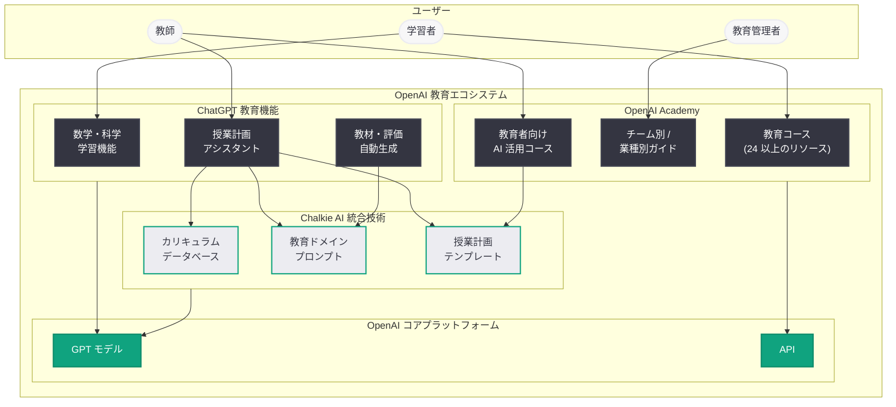

# OpenAI が EdTech スタートアップ Chalkie AI を買収: 教育分野への本格参入を加速

## メタデータ

| 項目 | 内容 |
|------|------|
| 発表日 | 2026-04-18 |
| ソース | EdTech Innovation Hub |
| カテゴリ | M&A / 教育戦略 |
| 公式リンク | [EdTech Innovation Hub](https://edtechinnovationhub.com/openai-acquires-chalkie-ai-lesson-planning-platform-for-teachers) |

## 概要

OpenAI は 2026 年 4 月 18 日、教員向け AI 授業計画プラットフォームを提供する EdTech スタートアップ Chalkie AI を買収した。Chalkie AI は、AI を活用して教師が授業計画 (レッスンプラン) を効率的に作成できるプラットフォームを開発・運営しており、今回の買収は OpenAI の教育分野における戦略をさらに強化するものである。

本買収は、OpenAI が 2026 年に入って展開してきた教育戦略の一連の取り組みと密接に関連している。3 月の「AI Education Opportunity」研究の公表、「ChatGPT Math & Science Learning」機能のリリース、そして 4 月 10 日の OpenAI Academy のローンチに続く形で、Chalkie AI の買収は教育エコシステムの構築を加速させる戦略的な一手である。また、Astral (開発者ツール)、TBPN (メディア)、Hiro (パーソナルファイナンス) に続く 2026 年 5 件目の買収であり、OpenAI がドメイン特化型スタートアップの積極的な取得を通じて ChatGPT プラットフォームの価値を拡大するパターンが明確になっている。

## 主な内容

### Chalkie AI の概要とプロダクト

Chalkie AI は、教師の授業計画作成を AI で支援する EdTech スタートアップである。教育現場において、授業計画の作成は教師にとって時間と労力を要する業務の一つであり、Chalkie AI はこの課題を AI 技術で解決することを目指していた。

Chalkie AI のプラットフォームが提供していた主な機能は以下の通りである。

- **AI 授業計画生成:** カリキュラムの目標や学年、科目に基づいて、AI が構造化されたレッスンプランを自動生成
- **カスタマイズ機能:** 教師が生成されたプランを自身の教育方針や生徒のニーズに合わせて柔軟に編集・調整
- **カリキュラム準拠:** 各国・地域の教育基準やカリキュラムに準拠した授業計画の作成を支援
- **教材提案:** 授業内容に適した教材やアクティビティの提案機能

### 買収の背景と形態

今回の買収は、OpenAI の近年の買収パターンから、人材とテクノロジーの両方を獲得することを目的とした「アクハイヤー」型の買収である可能性が高い。Astral、TBPN、Hiro といった直近の買収においても、対象企業のサービスが停止または OpenAI に統合される形態が取られており、Chalkie AI についても同様のパターンが想定される。

買収の戦略的意義は以下の点にある。

- **教育ドメインの専門知識の獲得:** Chalkie AI チームが持つ教育工学 (EdTech) の専門知識と、教育現場のニーズに対する深い理解
- **授業計画生成技術の取得:** カリキュラムに準拠したレッスンプラン生成のための AI モデルやプロンプトエンジニアリングのノウハウ
- **教育市場へのアクセス:** Chalkie AI が構築してきた教師コミュニティとの関係性およびユーザーインサイト

### OpenAI の教育戦略における位置づけ

Chalkie AI の買収は、OpenAI が 2026 年に入って体系的に推進してきた教育戦略の重要な構成要素として位置づけられる。以下は、OpenAI の教育関連の主要な取り組みの時系列である。

| 日付 | 取り組み | 概要 |
|------|---------|------|
| 2026-03-05 | AI Education Opportunity | 教育分野における AI 活用の機会均等を推進する研究の公表 |
| 2026-03-10 | ChatGPT Math & Science Learning | ChatGPT に数学・科学のインタラクティブ学習機能を追加 |
| 2026-04-10 | OpenAI Academy ローンチ | 24 以上の教育リソースを備えた AI 教育プラットフォームの正式公開 |
| 2026-04-18 | Chalkie AI 買収 | 教員向け授業計画 AI プラットフォームの買収 (本件) |

これらの取り組みは、OpenAI が教育分野を「学習者支援」と「教育者支援」の両面から包括的にカバーする戦略を展開していることを示している。ChatGPT Math & Science Learning と OpenAI Academy が主に学習者側を支援するのに対し、Chalkie AI の買収は教育者 (教師) 側の支援を強化するものであり、教育エコシステムの両輪が揃う形となる。

### OpenAI の 2026 年買収一覧

2026 年に入り、OpenAI はドメイン特化型スタートアップの買収を急速に加速させている。

| 日付 | 対象 | 領域 |
|------|------|------|
| 2026-03-09 | Promptfoo | AI 評価 |
| 2026-03-19 | Astral | Python 開発者ツール (uv, Ruff) |
| 2026-04-02 | TBPN | AI メディアネットワーク |
| 2026-04-14 | Hiro | AI パーソナルファイナンス |
| 2026-04-18 | Chalkie AI | EdTech / 授業計画 |

この一連の買収は、OpenAI が汎用 AI プラットフォームから、開発者ツール、メディア、金融、教育といった多角的な領域に事業基盤を拡大していることを明確に示している。特に 4 月に入ってからは TBPN、Hiro、Chalkie AI と矢継ぎ早に買収を実施しており、買収ペースの加速が顕著である。

## 技術的な詳細

### Chalkie AI 技術の ChatGPT / OpenAI Academy への統合展望

Chalkie AI の技術とチームが OpenAI に合流することで、以下のような技術的統合が想定される。

#### ChatGPT 教育機能への統合

- **授業計画アシスタント:** ChatGPT の対話インターフェースを通じて、教師が対話的に授業計画を作成・修正できる機能の追加
- **カリキュラム準拠レスポンス:** 各国・地域の教育基準に基づいた回答を生成する機能の強化。教師が指定した学年・科目・カリキュラム基準に沿った提案が可能に
- **教材生成:** 授業計画に連動したワークシート、クイズ、評価ルーブリックの自動生成

#### OpenAI Academy への統合

- **教育者向けコース:** OpenAI Academy に教師向けの AI 活用コースを追加し、AI を活用した授業設計の手法を体系的に学習できるカリキュラムの提供
- **授業計画テンプレート:** Academy 上で利用可能な、AI 支援付きの授業計画テンプレートライブラリの構築
- **教育者コミュニティ:** Chalkie AI のユーザーベースを活用した教育者コミュニティの形成と、ベストプラクティスの共有基盤の構築

#### 技術的な統合ポイント

- **プロンプトテンプレート:** Chalkie AI が蓄積した教育ドメイン特化型のプロンプトテンプレートを ChatGPT の教育機能に統合
- **カリキュラムデータベース:** 各国・地域の教育基準・カリキュラム情報のデータベースを ChatGPT の知識ベースに組み込み
- **教育コンテンツ生成パイプライン:** 授業計画からワークシート、評価問題までを一貫して生成するコンテンツパイプラインの構築

## アーキテクチャ

以下は、Chalkie AI の統合を含む OpenAI の教育エコシステムの全体像である。

## 開発者への影響

今回の買収は主に教育分野のプロダクト戦略に関するものであるが、開発者やエコシステムに対しても以下の影響が考えられる。

### EdTech 開発者への影響

- **教育 API の拡張可能性:** Chalkie AI の技術が統合されることで、将来的に授業計画生成やカリキュラム準拠コンテンツ生成に関する API が OpenAI プラットフォームに追加される可能性がある。EdTech 開発者にとっては新たな統合機会となり得る
- **GPTs / カスタム GPT との関係:** 授業計画生成機能が ChatGPT にネイティブ統合されることで、同領域のカスタム GPT やサードパーティツールとの競合が生じる可能性がある
- **教育コンテンツ生成の高度化:** OpenAI の API を利用して教育コンテンツを生成している開発者にとって、カリキュラム準拠やペダゴジー (教授法) に基づいたコンテンツ生成の精度向上が期待される

### プラットフォーム開発者全般への影響

- **ドメイン特化型機能の拡充パターン:** OpenAI が金融 (Hiro)、教育 (Chalkie AI) と相次いでドメイン特化型スタートアップを買収するパターンは、今後も他の領域 (医療、法律、不動産など) で同様の動きが続く可能性を示唆している。プラットフォーム開発者は、OpenAI のネイティブ機能と競合しないポジショニングを意識する必要がある
- **教育機関向けソリューション開発:** OpenAI Academy と Chalkie AI の技術を基盤として、教育機関向けのカスタムソリューションを構築する機会が拡大する可能性がある

### EdTech 業界への示唆

- **AI ネイティブ EdTech の台頭:** OpenAI のような大手 AI プラットフォーマーが教育分野に本格参入することで、既存の EdTech スタートアップは差別化戦略の再考を迫られる
- **買収ターゲットの可能性:** 教育分野の他の AI スタートアップも、OpenAI やその他の大手 AI 企業による買収の候補となる可能性がある

## 関連リンク

- [EdTech Innovation Hub: OpenAI acquires Chalkie AI](https://edtechinnovationhub.com/openai-acquires-chalkie-ai-lesson-planning-platform-for-teachers)
- [関連レポート: OpenAI Academy を正式ローンチ](2026-04-10-openai-academy-launch.md)
- [関連レポート: AI の教育活用が機会拡大につながることを確実にする](2026-03-05-ai-education-opportunity.md)
- [関連レポート: OpenAI が Hiro を買収](2026-04-14-openai-acquires-hiro.md)
- [関連レポート: OpenAI が TBPN を買収](2026-04-02-openai-acquires-tbpn.md)
- [関連レポート: OpenAI が Astral を買収](2026-03-19-openai-to-acquire-astral.md)
- [関連レポート: OpenAI が Promptfoo を買収](2026-03-09-openai-to-acquire-promptfoo.md)
- [OpenAI Academy (公式)](https://openai.com/academy)
- [OpenAI News](https://openai.com/news)

## まとめ

OpenAI による EdTech スタートアップ Chalkie AI の買収は、同社の教育分野への本格参入を加速させる戦略的な一手である。Chalkie AI は教師向けの AI 授業計画プラットフォームを提供しており、その技術と人材が OpenAI に合流することで、ChatGPT の教育機能および OpenAI Academy の教育者支援機能が大幅に強化されることが期待される。本買収は、2026 年 3 月の「AI Education Opportunity」研究、「ChatGPT Math & Science Learning」機能、4 月の OpenAI Academy ローンチに続く教育戦略の延長線上に位置し、学習者支援と教育者支援の両面から教育エコシステムを構築するという OpenAI の包括的なビジョンを明確にするものである。また、Promptfoo、Astral、TBPN、Hiro に続く 2026 年 5 件目の買収として、OpenAI がドメイン特化型スタートアップの積極的な取得を通じて事業基盤を急速に拡大している戦略が改めて浮き彫りとなった。教育分野において、AI が教師の業務効率化と学習者の学習体験向上の双方に貢献する未来が、より具体的な形を帯びてきたと言える。
