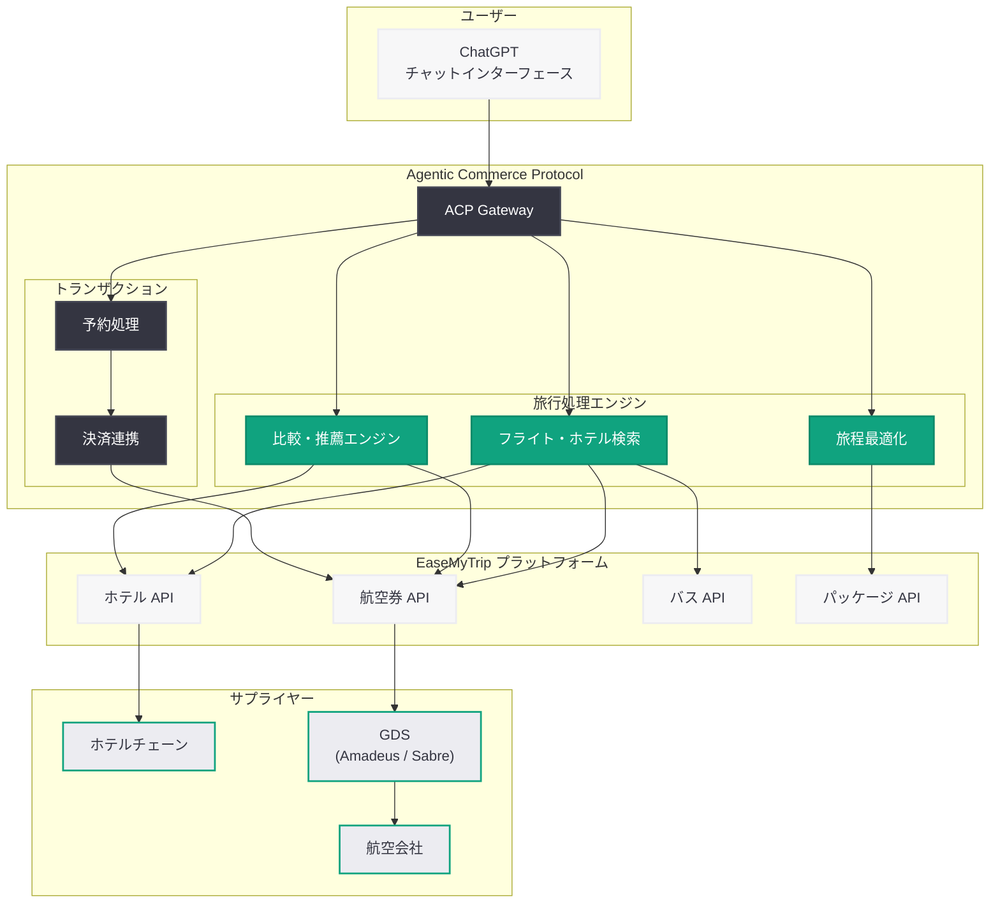

# ChatGPT が EaseMyTrip を統合: インド旅行市場における Agentic Commerce の実現

## メタデータ

| 項目 | 内容 |
|------|------|
| 発表日 | 2026-04-19 |
| ソース | MSN / 複数メディア |
| カテゴリ | Product / パートナーシップ / コマース |
| 公式リンク | -- (メディア報道に基づく) |

> **注記:** 本レポートは MSN をはじめとする複数のニュースメディアの報道に基づいて作成されており、OpenAI の公式ブログによる発表ではない。正確な詳細については OpenAI の公式発表を確認されたい。

## 概要

OpenAI の ChatGPT がインド最大級のオンライン旅行代理店 (OTA) である EaseMyTrip を統合したことが、2026 年 4 月 19 日に複数のメディアで報じられた。この統合により、ChatGPT ユーザーはチャットインターフェース内で航空券、ホテル、バス、ホリデーパッケージの検索、比較、予約を直接行えるようになる。これは 2026 年 3 月 24 日に発表された Agentic Commerce Protocol (ACP) を活用した具体的な統合事例であり、ChatGPT がチャットボットからコマースプラットフォームへと進化する動きが現実のものとなっていることを示している。

EaseMyTrip はインドの国立証券取引所 (NSE) およびボンベイ証券取引所 (BSE) に上場する公開企業であり、航空券予約を中心に幅広い旅行サービスを提供するインド有数の OTA プラットフォームである。旅行は検索、比較、予約、旅程管理といった複数ステップのワークフローを伴う高付加価値領域であり、AI エージェントが最も価値を発揮できるユースケースの一つである。インドは世界で最も急速に成長するデジタル旅行市場の一つであり、今回の統合は ChatGPT の Agentic Commerce 戦略がグローバルに拡大していることを裏付ける重要な事例といえる。

## 主な内容

### EaseMyTrip 統合の詳細

ChatGPT と EaseMyTrip の統合により、ユーザーは対話型インターフェースを通じて以下の旅行サービスにアクセスできるようになる。

- **航空券の検索・比較・予約:** 出発地、目的地、日程、予算などの条件を自然言語で指定し、最適なフライトオプションを AI が提案。複数の航空会社の運賃をサイドバイサイドで比較可能
- **ホテル予約:** 旅行先のホテルを目的、予算、ロケーションなどの条件に基づいて検索・予約。レビューや評価を含むリッチな情報表示
- **バス予約:** インド国内の主要都市間バス路線の検索と予約
- **ホリデーパッケージ:** フライト、宿泊、観光を含むパッケージツアーの提案と予約
- **旅程の最適化:** AI が旅行の目的や好みに応じて、最適な旅程を提案・調整

### EaseMyTrip の概要

EaseMyTrip (Easy Trip Planners Limited) は、インドのオンライン旅行業界における主要プレーヤーである。

| 項目 | 内容 |
|------|------|
| 正式名称 | Easy Trip Planners Limited |
| 設立年 | 2008 年 |
| 上場先 | NSE / BSE (インド) |
| 主要サービス | 航空券、ホテル、バス、鉄道、ホリデーパッケージ |
| 市場ポジション | インド最大級の OTA の一つ |
| 特徴 | 手数料無料モデルによる低コスト航空券予約 |

EaseMyTrip は「手数料なし」を売りにした航空券予約サービスで急成長を遂げた企業であり、インドの価格感度の高い消費者層に強いリーチを持つ。インドの国内線を中心に、国際線、ホテル、バスなど旅行に関わる幅広いサービスをワンストップで提供しており、ChatGPT との統合によってこれらのサービスが AI を介した新しいチャネルで利用可能になる。

### Agentic Commerce Protocol による統合

今回の EaseMyTrip 統合は、2026 年 3 月 24 日に OpenAI が発表した Agentic Commerce Protocol (ACP) の枠組みの中で実現されている。ACP はサードパーティの加盟店が ChatGPT の商品推薦フローにプラグインできるように設計された標準化プロトコルであり、EaseMyTrip はこのプロトコルを通じて旅行商品のデータフィードを ChatGPT に提供している。

**ACP を通じた旅行統合のポイント:**

- **リアルタイムデータ連携:** 航空券の空席状況、運賃、ホテルの空室情報がリアルタイムで ChatGPT に反映される
- **構造化された旅行データ:** フライトスケジュール、座席クラス、手荷物規定、キャンセルポリシーなどの詳細情報が構造化データとして提供される
- **シームレスな予約フロー:** ChatGPT 内での検索・比較から EaseMyTrip の予約・決済フローへの円滑な遷移を実現
- **パーソナライズされた提案:** ユーザーの旅行目的、予算、好みに基づいた AI 駆動の旅行プラン提案

### インド市場戦略

EaseMyTrip の統合は、OpenAI のインド市場戦略における重要な一手である。以下の要因がインド市場の戦略的重要性を裏付けている。

**インドのデジタル旅行市場の動向:**

- **市場規模:** インドのオンライン旅行市場は年率 15-20% の成長を続けており、2026 年時点で世界有数の規模に達している
- **デジタル化の加速:** UPI (Unified Payments Interface) に代表されるデジタル決済インフラの普及により、オンライン旅行予約が急速に一般化している
- **若年層のユーザーベース:** インドの人口の約 50% が 25 歳以下であり、AI ネイティブな旅行体験への需要が高い
- **国内旅行の爆発的成長:** インド国内線の利用者数は過去数年で急増しており、LCC (格安航空会社) の拡大と相まって旅行予約のデジタル化が進んでいる

**OpenAI のインド市場における展開:**

| 日付 | 施策 | 意義 |
|------|------|------|
| 2026-03-24 | Agentic Commerce Protocol の発表 | コマース統合の基盤を確立 |
| 2026-04-19 | EaseMyTrip 統合 | インド旅行市場への参入 |
| 2026-04-19 | Walmart との提携報道 | 小売コマースの拡大 |
| 2026-04-20 | JioStar CEO を APAC 事業責任者に採用 | インド / APAC の組織体制を強化 |

EaseMyTrip の統合と JioStar CEO の APAC 事業責任者への採用がほぼ同時期に報じられたことは、OpenAI がインド市場を APAC 戦略の中核に据えていることを鮮明に示している。

### 他のコマース統合との比較

ChatGPT の Agentic Commerce 戦略は、複数の業種・地域で並行して展開されている。EaseMyTrip の統合を他の主要な統合事例と比較する。

| 統合先 | 業種 | 地域 | 特徴 |
|--------|------|------|------|
| EaseMyTrip | 旅行 (OTA) | インド | 航空券・ホテル・バスの検索・予約 |
| Walmart | 小売 (総合) | 米国 | 日用品・食料品の商品発見・購入 |
| 一般小売 (ACP 参加企業) | 小売 (各種) | 米国中心 | 商品検索・比較・チェックアウト |

**旅行分野の独自性:**

旅行は他の小売コマースと比較して、AI エージェントが特に高い価値を提供できる領域である。

- **複雑な意思決定:** 日程、予算、目的地、航空会社の選好、乗り継ぎ、ホテルのロケーションなど、多数の変数を考慮した意思決定が必要
- **マルチステップのワークフロー:** 検索、比較、予約、決済、旅程管理、変更・キャンセルといった複数のステップにまたがるプロセス
- **パーソナライゼーションの余地:** ビジネス旅行、家族旅行、一人旅など、旅行の目的に応じた高度なカスタマイズが可能
- **高い客単価:** 旅行の取引金額は日用品と比較して高額であり、コマースプラットフォームとしての収益性が高い

## 技術的な詳細

### Agentic Commerce Protocol と旅行統合のアーキテクチャ

EaseMyTrip と ChatGPT の統合は、Agentic Commerce Protocol を介した標準化されたデータ交換に基づいている。旅行商品は一般的な物販商品と異なり、在庫 (座席・部屋) がリアルタイムで変動し、価格も動的に変化するため、以下のような技術的特性が求められる。

- **リアルタイム在庫同期:** GDS (Global Distribution System) や EaseMyTrip の在庫管理システムとの低レイテンシでのデータ連携
- **動的価格処理:** イールドマネジメントに基づく価格変動をリアルタイムで反映
- **マルチサプライヤー集約:** 複数の航空会社やホテルチェーンの在庫を統合的に検索・表示
- **予約セッション管理:** 検索から予約完了までのセッションを一貫して管理し、価格保証と座席確保を実現

### アーキテクチャ図



### 旅行データスキーマの想定

ACP を通じた旅行データの交換には、以下のような構造化データが用いられると想定される。

```json
{
  "type": "travel_search_result",
  "provider": "easemytrip",
  "results": [
    {
      "type": "flight",
      "airline": "IndiGo",
      "flight_number": "6E-2001",
      "departure": {
        "airport": "DEL",
        "city": "New Delhi",
        "datetime": "2026-05-15T06:30:00+05:30"
      },
      "arrival": {
        "airport": "BOM",
        "city": "Mumbai",
        "datetime": "2026-05-15T08:45:00+05:30"
      },
      "price": {
        "amount": 4500,
        "currency": "INR"
      },
      "class": "economy",
      "baggage": "15kg",
      "booking_url": "https://www.easemytrip.com/..."
    }
  ]
}
```

> **注:** 上記の JSON スキーマは ACP を活用した旅行データ交換の一般的なパターンの想定であり、実際の API 仕様とは異なる場合がある。詳細は公式ドキュメントを参照してください。

## 開発者への影響

### 旅行テック開発者への機会

EaseMyTrip と ChatGPT の統合は、旅行テクノロジー分野の開発者に新たな機会をもたらす。

- **ACP 旅行データフィードの構築:** 旅行関連事業者は ACP に準拠した旅行データフィードを構築することで、ChatGPT エコシステムへの参入が可能になる。航空券、ホテル、レンタカー、アクティビティなど、旅行の各セグメントでの統合機会が拡大する
- **旅行 AI エージェントの開発:** OpenAI API を活用して、旅行計画、予約管理、旅程最適化などの機能を持つカスタム AI エージェントの開発が促進される
- **多言語・多通貨対応:** インド市場向けの統合がモデルケースとなり、ヒンディー語をはじめとする多言語対応や INR (インドルピー) を含む多通貨処理の実装が求められる

### OTA および旅行事業者への影響

- **ACP への早期対応:** EaseMyTrip の事例により、他の OTA や旅行事業者も ACP への対応を検討する必要性が高まる。特にインド市場では MakeMyTrip、Yatra、Cleartrip などの競合 OTA が対応を迫られる可能性がある
- **AI ファーストの商品設計:** ChatGPT を通じた旅行検索・予約が普及すれば、旅行商品そのものを AI エージェントが理解しやすい形で設計・構造化する必要が生じる
- **新たな顧客獲得チャネル:** ChatGPT を介した旅行予約は、従来の検索エンジン広告や比較サイトとは異なる新しい顧客獲得チャネルとなる。特に自然言語での旅行相談から予約に至るコンバージョンは、従来のファネルとは質的に異なるユーザー体験を提供する

### 日本の開発者への示唆

- **インバウンド旅行への応用:** EaseMyTrip 統合のモデルを参考に、日本のインバウンド旅行市場向けの ACP 統合を検討する余地がある。じゃらん、楽天トラベル、一休.com などの国内 OTA が ACP に対応すれば、ChatGPT を通じた訪日旅行の検索・予約が実現する可能性がある
- **APAC 統合の連携:** OpenAI の APAC 戦略強化により、日本-インド間の旅行需要を AI で取り込むクロスボーダーな統合機会が生まれる可能性がある

## 関連リンク

- [MSN - OpenAI's ChatGPT app integrates EaseMyTrip](https://www.msn.com/)
- [EaseMyTrip 公式サイト](https://www.easemytrip.com/)
- [関連レポート: ChatGPT における商品発見機能の強化 -- Agentic Commerce Protocol の導入](2026-03-24-powering-product-discovery-in-chatgpt.md)
- [関連レポート: ChatGPT コマース戦略の転換](2026-03-20-chatgpt-commerce-strategy-pivot.md)
- [関連レポート: OpenAI、JioStar CEO をアジア太平洋事業責任者に採用](2026-04-20-openai-hires-jiostar-ceo-apac.md)
- [OpenAI News](https://openai.com/news)

## まとめ

ChatGPT と EaseMyTrip の統合は、OpenAI が 2026 年 3 月 24 日に発表した Agentic Commerce Protocol が実際のビジネスに適用された重要な事例である。インド最大級の OTA プラットフォームとの連携により、ChatGPT ユーザーは航空券、ホテル、バスの検索・比較・予約を対話型インターフェースで完結できるようになる。旅行は複雑な意思決定と多段階のワークフローを伴う高付加価値領域であり、AI エージェントが最も価値を発揮できるユースケースの一つである。

本統合の意義は、単なる一企業との連携にとどまらない。翌日の 2026 年 4 月 20 日に報じられた JioStar CEO の APAC 事業責任者への採用と併せて、OpenAI がインドおよびアジア太平洋市場を戦略的重点地域として本格的に開拓していることを示している。同日に報じられた Walmart との提携と合わせると、ChatGPT の Agentic Commerce 戦略は小売と旅行という二大消費カテゴリにおいて、米国とインドという二大市場で同時に展開されている構図が浮かび上がる。今後、ACP に対応する旅行事業者や OTA が増加すれば、AI を介した旅行予約が消費者行動の新たな標準となる可能性がある。旅行テクノロジーに携わる開発者や事業者にとって、ACP への早期対応が競争優位性を左右する局面が近づいている。
