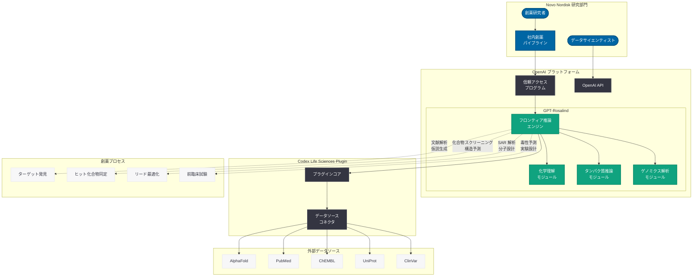
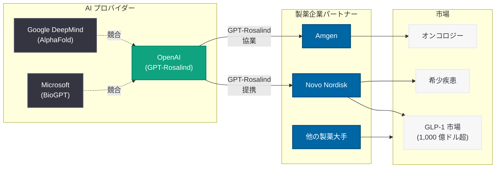

# Novo Nordisk が OpenAI と提携: GPT-Rosalind を活用した AI 創薬の加速

## メタデータ

| 項目 | 内容 |
|------|------|
| 発表日 | 2026-04-19 |
| ソース | MSN / 複数メディアソース (Reuters スタイル報道) |
| カテゴリ | パートナーシップ / ライフサイエンス / 創薬 |
| 公式リンク | [MSN - Novo Nordisk teams up with OpenAI](https://www.msn.com/) |

> **注記:** 本レポートは MSN、Reuters、Bloomberg などの複数メディアソースに基づいて作成されている。OpenAI 公式ブログからの発表ではなく、報道機関の記事および関連する公開情報をもとに内容を構成している。

## 概要

2026 年 4 月 19 日、時価総額で世界最大の製薬企業である Novo Nordisk が OpenAI との提携を発表した。この提携は、OpenAI が 4 月 16 日に発表したライフサイエンス特化型フロンティア推論モデル「GPT-Rosalind」を活用し、AI 駆動の創薬を加速することを目的としている。Ozempic や Wegovy といった GLP-1 受容体作動薬で世界的に知られる Novo Nordisk がこの提携に踏み切ったことは、GPT-Rosalind の商業的価値が発表からわずか 3 日で大手製薬企業に認められたことを意味する。

本提携は、製薬業界における AI 活用の新たな段階を示すものである。GPT-Rosalind の発表時に Amgen との協業が最初の事例として報じられたが、Novo Nordisk の参画はそれに続く 2 番目の大型提携であり、ライフサイエンス AI 市場の急速な拡大を示唆している。この報道を受けて Novo Nordisk の株価はプレマーケットで 2% 以上上昇しており、投資家が AI 創薬の可能性を高く評価していることがうかがえる。

## 主な内容

### 提携の概要と戦略的意義

Novo Nordisk と OpenAI の提携は、GPT-Rosalind を Novo Nordisk の創薬パイプラインに統合し、ターゲット発見から候補化合物の最適化に至るまでの研究プロセスを加速することを目指している。この提携の戦略的意義は以下の点にある。

- **世界最大の製薬企業による検証:** Novo Nordisk は時価総額で世界最大の製薬企業であり、同社が GPT-Rosalind を採用したことは、モデルの信頼性と実用性に対する強力な裏付けとなる
- **GPT-Rosalind 発表からわずか 3 日:** 4 月 16 日の GPT-Rosalind 発表から 3 日後という迅速な提携は、大手製薬企業が以前から OpenAI との交渉を進めていた可能性を示唆している
- **Amgen に続く 2 番目の大型提携:** GPT-Rosalind の商業展開が本格的に始動していることを裏付ける事例である
- **GLP-1 研究への AI 適用:** 1,000 億ドル規模の GLP-1 受容体作動薬市場における研究開発に AI が本格的に活用される可能性が開かれた

### GPT-Rosalind の能力と製薬企業への価値

GPT-Rosalind は、2026 年 4 月 16 日に OpenAI が発表したライフサイエンス研究に特化したフロンティア推論モデルである。DNA の X 線結晶学のパイオニアである Rosalind Franklin に因んで命名されたこのモデルは、以下の能力を備えている。

- **化学分野の深い理解:** 低分子化合物、化学反応、分子特性に関する高度な推論能力
- **タンパク質工学の支援:** タンパク質の構造、機能、変異の影響に関する推論
- **ゲノミクス解析:** 遺伝子発現データ、バリアント解析、パスウェイ分析の支援
- **50 以上の科学ツールとの連携:** AlphaFold、PubMed、UniProt、ChEMBL など主要な科学データベースとの統合
- **研究ワークフロー全般の加速:** 仮説生成から実験設計、データ解析までの包括的な支援

Novo Nordisk のような大規模な創薬パイプラインを持つ製薬企業にとって、これらの能力は研究の各段階におけるボトルネックを解消し、候補化合物の特定から前臨床試験への移行を加速する可能性がある。

### Novo Nordisk の AI 戦略と GLP-1 市場

Novo Nordisk は、Ozempic (糖尿病治療) と Wegovy (肥満治療) という 2 つの GLP-1 受容体作動薬で世界的な成功を収めている。GLP-1 受容体作動薬市場は 1,000 億ドルを超える規模に成長しており、同社はこの領域でのリーダーシップを維持するために積極的な研究開発投資を続けている。

OpenAI との提携は、Novo Nordisk の AI 戦略における重要な一歩であり、以下の研究分野での活用が想定される。

- **次世代 GLP-1 受容体作動薬の開発:** 既存薬の改良や新たな適応症の探索における分子設計の加速
- **肥満治療の新規ターゲット発見:** GLP-1 以外の肥満関連ターゲットの同定と検証
- **希少疾患への展開:** Novo Nordisk が注力する希少疾患領域における新規治療標的の探索
- **バイオシミラー対策:** 競合他社のバイオシミラー参入に備えた次世代パイプラインの強化

### 創薬プロセスにおける AI の役割

現在の創薬プロセスは、ターゲット発見から規制当局の承認まで通常 10 年から 15 年を要する。GPT-Rosalind の活用により、特に初期段階のプロセスが加速されることが期待されている。

| 創薬段階 | 従来の所要期間 | AI による改善可能性 |
|---------|-------------|----------------|
| ターゲット発見 | 2 - 3 年 | 文献解析と仮説生成の自動化により大幅短縮 |
| ヒット化合物同定 | 1 - 2 年 | 化合物スクリーニングの効率化 |
| リード最適化 | 1 - 2 年 | SAR 解析と分子設計の加速 |
| 前臨床試験 | 2 - 3 年 | 毒性予測と実験設計の支援 |
| 臨床開発 | 4 - 7 年 | 患者層別化とバイオマーカー分析 |

GPT-Rosalind は特にターゲット発見からリード最適化までの初期段階において最も大きなインパクトを持つと考えられており、Novo Nordisk の研究チームがこれらのプロセスを従来よりも効率的に遂行できるようになることが期待される。

### 市場への影響と株価反応

本提携の報道を受けて、Novo Nordisk の株価はプレマーケットで 2% 以上の上昇を記録した。この株価反応は、投資家が AI 創薬の商業的価値を認識し始めていることを示す重要なシグナルである。

市場への影響は以下の観点から注目される。

- **AI 創薬セクターの活性化:** Novo Nordisk と OpenAI の提携は、AI 創薬関連銘柄全体の注目度を高める可能性がある
- **競合他社への圧力:** Eli Lilly、Pfizer、Roche などの競合大手製薬企業に対して、AI 創薬への投資加速を促すプレッシャーとなる
- **OpenAI のライフサイエンス事業の拡大:** GPT-Rosalind を軸とした製薬企業との提携が相次ぐことで、OpenAI の B2B ライフサイエンス事業が新たな収益源として確立される可能性がある
- **Google DeepMind との競争激化:** AlphaFold を擁する Google DeepMind に対して、OpenAI が製薬企業とのパートナーシップで攻勢をかける構図が鮮明になった

## 技術的な詳細

### 製薬企業における GPT-Rosalind の統合パターン

Novo Nordisk のような大手製薬企業が GPT-Rosalind を創薬ワークフローに統合する際の想定されるパターンを以下に示す。

```python
from openai import OpenAI

client = OpenAI()

# GLP-1 受容体作動薬の次世代分子設計支援
response = client.chat.completions.create(
    model="gpt-rosalind",
    messages=[
        {
            "role": "system",
            "content": (
                "You are a medicinal chemistry expert specializing in "
                "GLP-1 receptor agonists and metabolic disease drug discovery. "
                "Analyze molecular structures, predict binding affinities, "
                "and suggest structural modifications to improve "
                "pharmacokinetic properties."
            )
        },
        {
            "role": "user",
            "content": (
                "Analyze the structure-activity relationship of semaglutide "
                "(the active ingredient in Ozempic/Wegovy) and suggest "
                "modifications that could improve oral bioavailability "
                "while maintaining GLP-1 receptor binding affinity. "
                "Consider the fatty acid side chain modifications and "
                "amino acid substitutions that have shown promise "
                "in recent literature."
            )
        }
    ],
    max_tokens=8192
)

print(response.choices[0].message.content)
```

### 創薬パイプラインとの統合ワークフロー

```python
from openai import OpenAI

client = OpenAI()

# ターゲット発見フェーズでの活用例
# 肥満関連の新規治療ターゲット探索
response = client.chat.completions.create(
    model="gpt-rosalind",
    messages=[
        {
            "role": "system",
            "content": (
                "You are a target discovery specialist with expertise in "
                "metabolic diseases, obesity biology, and receptor pharmacology. "
                "Use available scientific literature and genomics data to "
                "identify and validate novel drug targets."
            )
        },
        {
            "role": "user",
            "content": (
                "Beyond GLP-1 and GIP receptors, identify 5 novel therapeutic "
                "targets for obesity treatment based on recent GWAS studies "
                "and functional genomics data. For each target, provide:\n"
                "1. Target name and gene\n"
                "2. Biological rationale for obesity relevance\n"
                "3. Druggability assessment\n"
                "4. Existing tool compounds or clinical candidates\n"
                "5. Key risks and validation experiments needed"
            )
        }
    ],
    tools=[
        {
            "type": "function",
            "function": {
                "name": "search_pubmed",
                "description": "Search PubMed for biomedical literature",
                "parameters": {
                    "type": "object",
                    "properties": {
                        "query": {
                            "type": "string",
                            "description": "PubMed search query"
                        },
                        "max_results": {
                            "type": "integer",
                            "description": "Maximum number of results"
                        }
                    },
                    "required": ["query"]
                }
            }
        }
    ],
    tool_choice="auto",
    max_tokens=8192
)

print(response.choices[0].message.content)
```

> **注:** 上記のコード例は、公開情報に基づく想定的な利用パターンである。GPT-Rosalind は信頼アクセスプログラム (Trusted Access Program) を通じた限定提供であり、Novo Nordisk との提携における具体的な API 利用形態や統合方法の詳細は公開されていない。

## アーキテクチャ

### Novo Nordisk における GPT-Rosalind 統合の想定アーキテクチャ



### 製薬業界における AI 創薬の競争構図



## 開発者への影響

### ライフサイエンス AI アプリケーション開発の拡大

Novo Nordisk と OpenAI の提携は、ライフサイエンス分野で AI アプリケーションを構築する開発者にとって、以下の重要な示唆を持つ。

- **製薬企業向け AI ソリューションの需要増:** 世界最大の製薬企業が GPT-Rosalind を採用したことで、他の製薬企業からも同様のソリューション需要が増加することが予想される。API を活用した創薬支援ツール、データ解析パイプライン、研究ワークフロー自動化ツールの開発機会が拡大する
- **GLP-1 関連研究ツールの需要:** GLP-1 受容体作動薬は製薬業界で最も注目される領域であり、この分野に特化した AI ツールやプラグインの開発が求められる可能性がある
- **規制対応の重要性:** 製薬企業向けのアプリケーションでは、GxP (Good Practice) 規制への準拠、データの監査証跡、バリデーション要件など、一般的なソフトウェア開発以上に厳格な品質管理が求められる

### 信頼アクセスプログラムと開発者エコシステム

GPT-Rosalind が信頼アクセスプログラム経由で提供されていることは、開発者にとって以下の考慮事項がある。

- **早期アクセスの確保:** 製薬企業との提携が相次ぐ中、信頼アクセスプログラムへの早期申請が競争優位性の確保につながる
- **Codex Life Sciences Plugin の活用:** オープンソースで公開されている Life Sciences Plugin を活用し、Novo Nordisk のような大手製薬企業の研究ワークフローに適合するカスタムプラグインを開発する機会がある
- **セキュリティとコンプライアンス:** 製薬企業の研究データは極めて機密性が高いため、API 連携におけるデータ暗号化、アクセス制御、データ残留ポリシーへの対応が必須となる

### 競合 AI プラットフォームとの比較検討

開発者は、製薬企業向けソリューションの構築にあたり、複数の AI プラットフォームを比較検討する必要がある。

| プラットフォーム | 強み | 提供形態 |
|--------------|------|---------|
| OpenAI GPT-Rosalind | 創薬ワークフロー全般の推論、50 以上のツール連携 | 信頼アクセスプログラム (API) |
| Google DeepMind AlphaFold | タンパク質構造予測の実績、ノーベル賞受賞技術 | オープンアクセス (一部) |
| Microsoft BioGPT | 生物医学テキストマイニング | Azure 経由 |

## 関連リンク

- [GPT-Rosalind 公式発表ページ](https://openai.com/index/introducing-gpt-rosalind)
- [OpenAI Research](https://openai.com/research)
- [OpenAI Trusted Access Program](https://openai.com/index/scaling-trusted-access-for-cyber-defense)
- [OpenAI API ドキュメント](https://platform.openai.com/docs)
- [Novo Nordisk 公式サイト](https://www.novonordisk.com/)
- [GPT-5 による科学研究の加速 (関連レポート)](./2026-03-18-accelerating-science-gpt-5.md)
- [GPT-Rosalind の発表 (関連レポート)](./2026-04-16-introducing-gpt-rosalind.md)
- [Reuters](https://www.reuters.com/)
- [Bloomberg](https://www.bloomberg.com/)

## まとめ

Novo Nordisk と OpenAI の提携は、GPT-Rosalind の発表からわずか 3 日後に実現した大型パートナーシップであり、AI 創薬の商業的実用性が大手製薬企業に急速に認知されていることを示す画期的な出来事である。時価総額で世界最大の製薬企業が OpenAI のライフサイエンス特化型モデルを採用したことは、Amgen との協業に続く 2 番目の事例として、GPT-Rosalind のエコシステム拡大を強く裏付けている。

本提携の最大の意義は、1,000 億ドル超の GLP-1 受容体作動薬市場を牽引する Novo Nordisk が、次世代治療薬の開発に AI を本格的に活用する姿勢を明確にした点にある。創薬プロセスの 10 年から 15 年というタイムラインの短縮に向けて、GPT-Rosalind の化学理解、タンパク質推論、ゲノミクス解析の能力がどこまで貢献できるかが今後の焦点となる。Google DeepMind の AlphaFold との競争が激化する中、OpenAI が製薬業界における主要な AI パートナーとしての地位を確立できるかどうかが、ライフサイエンス AI 市場全体の方向性を左右するだろう。
