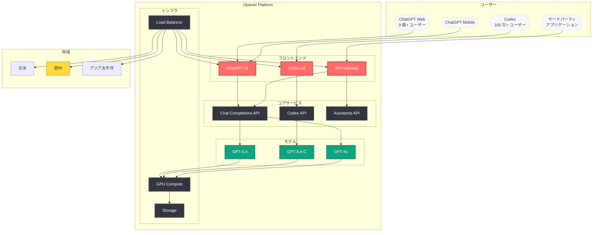

# ChatGPT / Codex / API Platform 大規模障害: 約 4 時間にわたり主要サービスが利用不能に

## メタデータ

| 項目 | 内容 |
|------|------|
| 発生日 | 2026-04-20 |
| ソース | OpenAI Status Page / 複数メディア |
| カテゴリ | インフラ / サービス障害 |
| 公式リンク | https://status.openai.com |

> **注記:** 本レポートは OpenAI の公式ステータスページ (status.openai.com) および複数のニュースメディアの報道に基づいて作成されている。

## 概要

2026 年 4 月 20 日、OpenAI の主要サービスである ChatGPT、Codex、API Platform が約 4 時間 13 分にわたって利用不能となる大規模障害が発生した。インシデントは UTC 14:35 に報告され、UTC 18:48 に解決が確認された。影響度は「Major」(重大) と分類され、9 億人以上の ChatGPT ユーザー、160 万人以上の Codex ユーザー、そして世界中の API 開発者に影響を与えた。

この障害は単独のインシデントにとどまらず、同日には欧州における ChatGPT の会話エラー、ChatGPT Business のアップグレード問題、Codex のエラーレート上昇、さらに翌日にかけて GPT-5.4-C モデルの問題など、複数の関連インシデントが連鎖的に発生した。Free Press Journal や The Plunge Daily をはじめとする複数のメディアが「ChatGPT is down」として報じ、ソーシャルメディア上でも広範な影響が報告された。

## 主な内容

### メインインシデント: ChatGPT / Codex / API Platform の利用不能

ステータスページに記録されたインシデント「Users unable to load ChatGPT, Codex and API Platform」の詳細なタイムラインは以下の通りである。

| 時刻 (UTC) | ステータス | 経過時間 | 内容 |
|-------------|-----------|---------|------|
| 14:35 | Investigating | 0 分 | 初期レポート。ユーザーが ChatGPT、Codex、API Platform を読み込めない事象を確認 |
| 15:13 | Investigating | 38 分 | 調査継続。影響範囲の特定が進む |
| 15:29 | Investigating | 54 分 | 引き続き調査中 |
| 16:03 | Investigating | 1 時間 28 分 | 根本原因の調査が続く |
| 16:48 | Monitoring | 2 時間 13 分 | 修正が適用され、回復状況の監視段階に移行 |
| 17:43 | Monitoring | 3 時間 8 分 | サービスの安定性を引き続き監視 |
| 18:17 | Monitoring | 3 時間 42 分 | 回復の最終確認中 |
| 18:48 | Resolved | 4 時間 13 分 | インシデント解決を宣言 |

**主な特徴:**

- **影響度:** Major (重大) -- OpenAI ステータスページにおける最高レベルの分類
- **調査フェーズ:** 約 2 時間 13 分 (14:35 - 16:48) -- 原因特定と修正適用に要した時間
- **監視フェーズ:** 約 2 時間 (16:48 - 18:48) -- 修正後の安定性確認に要した時間
- **影響サービス:** ChatGPT (Web / モバイル)、Codex、API Platform の 3 サービスすべて

### 関連インシデント

メインの障害に加え、同日には以下の関連インシデントが発生し、サービスの不安定さが継続的であったことが示されている。

#### 1. 欧州における ChatGPT 会話エラーの上昇

| 項目 | 内容 |
|------|------|
| インシデント名 | Elevated errors for ChatGPT conversations in Europe |
| 影響度 | Minor |
| 発生時刻 | 17:29 UTC |
| 解決時刻 | 19:17 UTC |
| 期間 | 約 1 時間 48 分 |

メインインシデントの監視フェーズ中に発生しており、サービス回復の過程で欧州地域に追加的な問題が生じたことを示唆している。

#### 2. ChatGPT Business のアップグレード / シート追加の問題

| 項目 | 内容 |
|------|------|
| インシデント名 | Users may encounter issue with ChatGPT Business after upgrade or adding new seats |
| 影響度 | None (メンテナンス) |
| 発生時刻 | 07:13 UTC |
| 解決時刻 | 19:33 UTC |
| 期間 | 約 12 時間 20 分 |

メインインシデントに先行して発生しており、メンテナンス作業が障害の一因となった可能性がある。

#### 3. Codex のエラーレート上昇

| 項目 | 内容 |
|------|------|
| インシデント名 | Some users will see higher error rates on Codex |
| 影響度 | Minor |
| 発生時刻 | 23:16 UTC |
| 解決時刻 | 2026-04-21 00:24 UTC |
| 期間 | 約 1 時間 8 分 |

メインインシデント解決後にも Codex で追加の問題が発生しており、完全な安定化には時間を要したことがわかる。

#### 4. GPT-5.4-C モデルの Codex における問題 (監視中)

| 項目 | 内容 |
|------|------|
| インシデント名 | Some users may encounter issues with GPT-5.4-C model in Codex |
| 影響度 | Minor |
| 発生時刻 | 2026-04-21 02:34 UTC |
| ステータス | 監視中 (4 月 21 日時点) |

翌日にかけても GPT-5.4-C モデル固有の問題が発生しており、障害の余波が続いている状況である。

### 影響範囲

今回の障害は、OpenAI のサービスエコシステム全体に広範な影響を与えた。

- **ChatGPT ユーザー:** 9 億人以上のアクティブユーザーが影響を受けた。Web 版およびモバイルアプリの両方でサービスが利用不能となり、個人ユーザーからエンタープライズ顧客まで幅広い範囲に障害が波及した
- **Codex ユーザー:** 160 万人以上の開発者が AI コーディングアシスタントを利用できない状態となった。進行中のコード生成タスクやプルリクエストのレビューが中断された
- **API 開発者:** 世界中の API 開発者が影響を受け、OpenAI API に依存するサードパーティアプリケーションやサービスが機能停止した。本番環境で OpenAI API を利用している企業は、エンドユーザーへのサービス提供に支障をきたした
- **メディア報道:** Free Press Journal、The Plunge Daily をはじめとする複数の国際メディアが「ChatGPT is down」として報道し、障害の規模が広く認知された

## 技術的な詳細

### ステータスページタイムライン分析

OpenAI のステータスページに記録された更新頻度とフェーズ遷移から、インシデント対応の特徴を分析する。

**調査フェーズの更新頻度:**

```
14:35 ─── 初期報告
  │ (38 分)
15:13 ─── 更新 1
  │ (16 分)
15:29 ─── 更新 2
  │ (34 分)
16:03 ─── 更新 3
  │ (45 分)
16:48 ─── Monitoring に移行
```

- 初期対応から最初の更新までに 38 分を要しており、問題の複雑さが伺える
- 15:13 から 15:29 の 16 分間隔は、原因の絞り込みが進んだ段階と推測される
- 16:03 以降、Monitoring への移行まで 45 分を要しており、修正の適用と検証に時間がかかったことがわかる

**監視フェーズの更新頻度:**

```
16:48 ─── Monitoring 開始
  │ (55 分)
17:43 ─── 更新 1
  │ (34 分)
18:17 ─── 更新 2
  │ (31 分)
18:48 ─── Resolved
```

- 監視フェーズが約 2 時間継続しており、段階的な回復プロセスを経たことがわかる
- 更新間隔が徐々に短くなっていることから、安定化が進むにつれて確認の頻度が上がったと推測される

### 障害の連鎖パターン

同日に発生した 5 件のインシデントを時系列で並べると、障害の連鎖パターンが浮かび上がる。

```
07:13 ─── ChatGPT Business メンテナンス開始
  │
14:35 ─── メインインシデント発生 (Major)
  │
17:29 ─── 欧州 ChatGPT エラー発生 (Minor)
  │
18:48 ─── メインインシデント解決
19:17 ─── 欧州エラー解決
19:33 ─── Business メンテナンス完了
  │
23:16 ─── Codex エラーレート上昇 (Minor)
  │
00:24 ─── Codex エラー解決 (4/21)
  │
02:34 ─── GPT-5.4-C モデル問題 (Minor, 監視中)
```

## アーキテクチャ

以下の図は、今回の障害で影響を受けたサービスとその関係性を示している。



**図の凡例:**
- 赤色 (affected): 障害により直接影響を受けたフロントエンドサービス
- 黄色 (warning): 追加の問題が発生した地域 (欧州)
- 緑色 (openai): モデルレイヤー
- 暗色 (dark): コアサービスおよびインフラ

## 開発者への影響

### API 開発者への直接的影響

- **サービス中断:** API Platform が約 4 時間 13 分にわたり利用不能となり、OpenAI API に依存するすべてのアプリケーションがリクエストの処理に失敗した。Chat Completions、Assistants API、Embeddings などの全エンドポイントが影響を受けた
- **エラーレスポンス:** 障害期間中、API リクエストに対してサーバーエラー (5xx) が返却されたと推定される。適切なエラーハンドリングを実装していないアプリケーションでは、ユーザー体験の大幅な劣化が発生した
- **SLA への影響:** OpenAI の API 利用規約における稼働率保証に対して、4 時間以上のダウンタイムは月間稼働率を約 0.56% 低下させる計算となる

### Codex 開発者への影響

- **開発ワークフローの中断:** Codex を日常的に利用する 160 万人以上の開発者が、AI コーディングアシスタントなしでの作業を余儀なくされた
- **GPT-5.4-C モデルの不安定性:** メインインシデント解決後も GPT-5.4-C モデルに固有の問題が翌日まで続いており、Codex の信頼性に対する懸念が生じている

### レジリエンスのベストプラクティス

今回の障害を踏まえ、OpenAI API に依存するアプリケーションの開発者は以下の対策を検討すべきである。

```python
import time
from openai import OpenAI, APIError, APIConnectionError, RateLimitError

client = OpenAI()

def resilient_chat_completion(messages, max_retries=3, base_delay=1.0):
    """
    指数バックオフとフォールバックを実装した
    レジリエントな Chat Completions 呼び出し
    """
    for attempt in range(max_retries):
        try:
            response = client.chat.completions.create(
                model="gpt-5.4",
                messages=messages,
                timeout=30.0
            )
            return response
        except APIConnectionError:
            # 接続エラー: サービス障害の可能性
            delay = base_delay * (2 ** attempt)
            print(f"接続エラー。{delay} 秒後にリトライ...")
            time.sleep(delay)
        except APIError as e:
            if e.status_code >= 500:
                # サーバーエラー: リトライ
                delay = base_delay * (2 ** attempt)
                print(f"サーバーエラー ({e.status_code})。{delay} 秒後にリトライ...")
                time.sleep(delay)
            else:
                raise
        except RateLimitError:
            delay = base_delay * (2 ** attempt) * 2
            print(f"レートリミット。{delay} 秒後にリトライ...")
            time.sleep(delay)

    # 全リトライ失敗時のフォールバック
    print("OpenAI API が利用不能です。フォールバック処理を実行します。")
    return None
```

**推奨される対策:**

1. **指数バックオフ付きリトライ:** API エラー発生時に指数バックオフを使用して自動リトライを実装する
2. **タイムアウト設定:** API リクエストに適切なタイムアウトを設定し、長時間のハングアップを防止する
3. **ヘルスチェック監視:** https://status.openai.com の API を定期的にチェックし、障害の早期検知を実現する
4. **フォールバック戦略:** クリティカルなアプリケーションでは、代替モデルや代替プロバイダーへのフォールバックを検討する
5. **サーキットブレーカーパターン:** 連続的なエラーが検出された場合にリクエストを一時停止し、サービス回復後に段階的に再開する仕組みを導入する

## 関連リンク

- [OpenAI Status Page](https://status.openai.com)
- [Free Press Journal - ChatGPT is down 報道](https://www.freepressjournal.in/)
- [The Plunge Daily - ChatGPT is down 報道](https://theplungedaily.com/)
- [関連レポート: OpenAI、JioStar CEO を APAC 事業責任者に採用](2026-04-20-openai-hires-jiostar-ceo-apac.md)
- [OpenAI API リファレンス](https://platform.openai.com/docs/api-reference)
- [OpenAI News](https://openai.com/news)

## まとめ

2026 年 4 月 20 日に発生した ChatGPT / Codex / API Platform の大規模障害は、OpenAI のサービス史上でも最大級のインシデントの一つであった。約 4 時間 13 分にわたり 3 つの主要サービスが同時に利用不能となり、9 億人以上の ChatGPT ユーザー、160 万人以上の Codex ユーザー、そして世界中の API 開発者に影響が及んだ。

特に注目すべきは、メインインシデントの解決後も欧州地域の ChatGPT エラー、Codex のエラーレート上昇、GPT-5.4-C モデルの問題が連鎖的に発生したことである。これは、OpenAI のインフラにおける複雑な依存関係と、大規模障害からの完全な回復には相当な時間を要することを示している。

AI サービスが社会インフラとしての重要性を増す中で、今回の障害は OpenAI に依存するすべてのユーザーと開発者に対して、レジリエンス設計の重要性を改めて認識させる出来事となった。API 開発者は、指数バックオフ付きリトライ、タイムアウト設定、フォールバック戦略の導入を通じて、サービス障害に対する耐性を強化することが推奨される。
