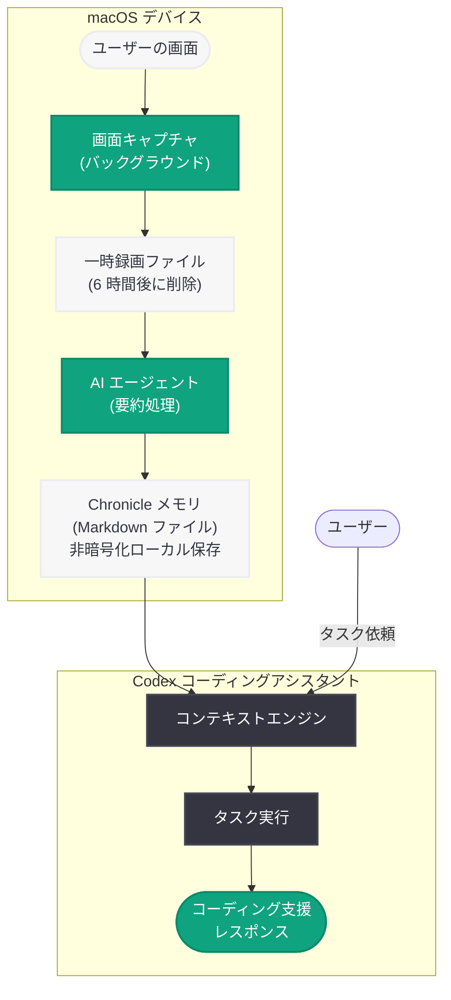
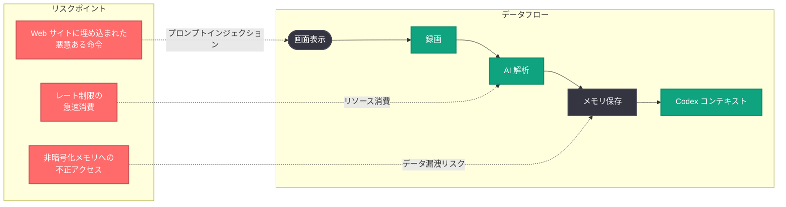

# OpenAI Codex に「Chronicle」機能を追加: 画面録画から作業コンテキストを自動記憶

## メタデータ

| 項目 | 内容 |
|------|------|
| 発表日 | 2026-04-20 |
| ソース | The Decoder / OpenAI |
| カテゴリ | 製品 / 開発者ツール / Codex |
| 公式リンク | https://openai.com/index/codex-chronicle/ |

> **注記:** 本レポートは The Decoder の報道および OpenAI の公式情報に基づいて作成されている。

## 概要

OpenAI は 2026 年 4 月 20 日、コーディングアシスタントアプリ Codex に新機能「Chronicle」を導入した。Chronicle はユーザーの画面録画をバックグラウンドで実行し、AI エージェントがその録画内容を要約して Markdown ファイルとしてローカルに保存する仕組みである。Codex は保存された記憶 (メモリ) を将来のタスクのコンテキストとして活用し、ユーザーが毎回作業内容を説明し直す必要をなくす。

Chronicle は macOS 上の ChatGPT Pro サブスクライバー向けにオプトイン方式のプレビューとして提供が開始された。ただし、EU、英国、スイスでは利用できない。OpenAI 自身がプロンプトインジェクション攻撃のリスク、メモリの非暗号化保存、レート制限の急速な消費といったセキュリティ上の懸念を警告している点が注目される。

## 主な内容

### Chronicle の仕組み

Chronicle は画面録画を起点とした自動コンテキスト構築システムである。

1. **バックグラウンド録画:** Chronicle はバックグラウンドで macOS の画面録画機能を利用してユーザーの作業画面を継続的に記録する
2. **AI エージェントによる要約:** 録画された内容を AI エージェントが解析し、ユーザーが使用しているツール、取り組んでいるプロジェクト、参照しているドキュメントなどの情報を抽出・要約する
3. **Markdown ファイルとしてローカル保存:** 要約はデバイス上に Markdown ファイルとして保存される。これがコンテキストメモリとして機能する
4. **Codex のコンテキストとして活用:** Codex が新しいタスクを実行する際、保存された Chronicle メモリを参照し、ユーザーの作業状況を理解した上でコーディング支援を提供する
5. **録画の自動削除:** 録画データは一時的に保持され、6 時間後に自動的に削除される

### 利用条件

Chronicle の利用には以下の条件を満たす必要がある。

| 条件 | 詳細 |
|------|------|
| サブスクリプション | ChatGPT Pro (月額 $200) |
| 対応 OS | macOS のみ |
| 提供形態 | オプトインプレビュー |
| 有効化手順 | Codex 設定 → 「Personalization」 → 「Memories」 → 「Chronicle」 |
| 必要な権限 | macOS の画面録画権限およびアクセシビリティ権限 |

### 地域制限

Chronicle は以下の地域では利用できない。

- **EU (欧州連合):** GDPR をはじめとするプライバシー規制への対応が理由と推測される
- **英国:** UK GDPR および関連法規制による制約
- **スイス:** スイス連邦データ保護法 (nDSG) への対応

画面録画という性質上、個人データの大量収集が不可避であり、欧州の厳格なデータ保護規制のもとでは提供が困難であると考えられる。この地域制限は、OpenAI が規制リスクを意識した慎重なロールアウト戦略を取っていることを示している。

### セキュリティ・プライバシー上の懸念

OpenAI 自身が以下のリスクを公式に警告している点は極めて異例であり、透明性の観点から評価できる一方、機能の成熟度に対する懸念も生じさせる。

- **プロンプトインジェクション攻撃のリスク:** 表示されている Web サイトやドキュメントに悪意のある命令が埋め込まれている場合、Chronicle がそれを記録し、Codex のコンテキストとして取り込んでしまう可能性がある。これにより、間接的なプロンプトインジェクション攻撃が成立するリスクがある
- **非暗号化のローカル保存:** Chronicle のメモリは暗号化されずにデバイスに保存される。端末の盗難やマルウェア感染などにより、保存されたメモリが第三者にアクセスされるリスクがある
- **レート制限の急速な消費:** Chronicle は画面録画の解析に AI 処理を継続的に使用するため、API のレート制限を急速に消費する。ChatGPT Pro の利用枠に大きな影響を与える可能性がある

## 技術的な詳細

### 動作フロー

Chronicle の技術的な動作は以下のフローで構成される。

1. **画面キャプチャ:** macOS のスクリーンキャプチャ API を通じて画面を定期的に記録
2. **ローカル処理:** 録画データは一時ファイルとしてローカルに保存
3. **AI 解析:** AI エージェントが録画内容を解析し、以下の情報を抽出する。
   - 使用中の IDE やツール
   - 開いているファイルやプロジェクト
   - 参照している Web ページやドキュメント
   - 作業のコンテキスト (バグ修正、新機能開発など)
4. **メモリ生成:** 抽出された情報を構造化された Markdown ファイルとして保存
5. **コンテキスト注入:** Codex がタスクを実行する際、関連する Chronicle メモリを自動的に取得してプロンプトのコンテキストに注入
6. **録画の自動削除:** 6 時間経過後に録画データを自動削除

### 設定手順

Chronicle を有効化するための手順は以下の通りである。

1. macOS の「システム設定」→「プライバシーとセキュリティ」→「画面録画」で Codex アプリに権限を付与
2. macOS の「システム設定」→「プライバシーとセキュリティ」→「アクセシビリティ」で Codex アプリに権限を付与
3. Codex アプリの設定を開く
4. 「Personalization」→「Memories」→「Chronicle」を有効化

## アーキテクチャ

### データフローのセキュリティ観点

## 開発者への影響

### コーディングワークフローの変革

- **コンテキストスイッチの削減:** Chronicle が作業履歴を記憶するため、Codex に対して毎回プロジェクトの背景や使用技術を説明する必要がなくなる。複数のプロジェクトを並行して進める開発者にとって特に大きな生産性向上が見込まれる
- **暗黙知の活用:** IDE の設定、デバッグ手順、参照ドキュメントなど、通常はプロンプトに含めにくい暗黙的なコンテキストが自動的に Codex に共有されるようになる
- **ペアプログラミングに近い体験:** Chronicle により、Codex がユーザーの作業を「見ている」状態が常に維持されるため、人間のペアプログラマーに近い文脈理解が可能になる

### セキュリティに関する注意点

- **機密コードの露出リスク:** 画面録画によりプロプライエタリなコード、API キー、認証情報などが Chronicle メモリに記録される可能性がある。企業環境での利用には特に注意が必要である
- **プロンプトインジェクション対策:** 信頼できないソースの Web ページを開いた状態で Chronicle を使用する場合、間接的なプロンプトインジェクションに注意が必要である
- **エンタープライズポリシーとの整合性:** 多くの企業がスクリーンキャプチャツールの使用を制限しており、Chronicle の導入には情報セキュリティ部門との事前調整が不可欠である

### ChatGPT Pro のコスト対効果

- **レート制限の消費:** Chronicle による継続的な AI 処理がレート制限を急速に消費するため、ChatGPT Pro ($200/月) のプランにおける実質的なコスト対効果を慎重に評価する必要がある
- **利用バランスの管理:** Chronicle を常時有効にするか、特定の作業セッションのみで有効にするかの運用判断が重要になる

## 関連リンク

- [OpenAI Codex Chronicle 公式ページ](https://openai.com/index/codex-chronicle/)
- [The Decoder - OpenAI's Codex now watches your screen to remember what you're working on](https://the-decoder.com/openais-codex-now-watches-your-screen-to-remember-what-youre-working-on/)
- [関連レポート: ChatGPT Pro $100 Codex プラン](2026-04-11-chatgpt-pro-100-codex-plan.md)
- [関連レポート: Codex for Almost Everything](2026-04-16-codex-for-almost-everything.md)
- [関連レポート: Codex Hooks](2026-03-31-codex-hooks.md)
- [OpenAI News](https://openai.com/news)

## まとめ

OpenAI の Codex Chronicle は、画面録画を通じてユーザーの作業コンテキストを自動的に記録・記憶し、AI コーディングアシスタントの文脈理解を根本的に向上させる野心的な機能である。ユーザーが使用しているツール、取り組んでいるプロジェクト、参照しているドキュメントを AI が継続的に把握することで、毎回のコンテキスト説明を不要にし、開発体験を大幅に改善する可能性を持つ。

一方で、OpenAI 自身がプロンプトインジェクション攻撃のリスク、メモリの非暗号化保存、レート制限の急速な消費を公式に警告している点は、この機能がまだ成熟段階にないことを示唆している。EU、英国、スイスでの提供が見送られたことも、画面録画という手法が持つプライバシー上の根本的な課題を浮き彫りにしている。ChatGPT Pro サブスクライバー限定かつオプトインのプレビューとして慎重にロールアウトされている点は評価できるが、企業環境での採用にあたっては、機密情報の保護、セキュリティポリシーとの整合性、コスト対効果を十分に検討する必要がある。AI コーディングアシスタントが「ユーザーの画面を見る」という新たなパラダイムの始まりとして、今後の進化と安全対策の強化を注視する価値がある。
