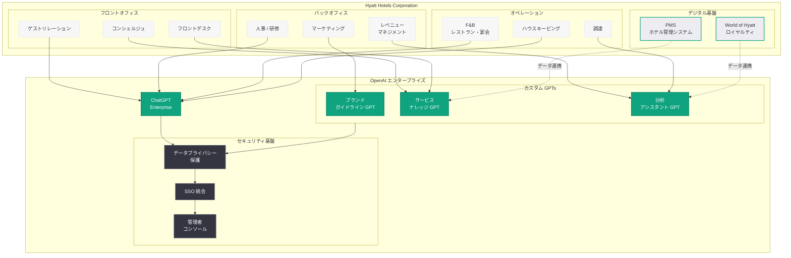

# Hyatt Hotels が ChatGPT Enterprise で AI 活用を推進: ホスピタリティ業界における大規模 AI 導入の先進事例

## メタデータ

| 項目 | 内容 |
|------|------|
| 発表日 | 2026-04-20 |
| ソース | OpenAI News/Blog (Global Affairs) |
| カテゴリ | エンタープライズ / カスタマーストーリー / ホスピタリティ |
| 公式リンク | [openai.com/index/hyatt-advances-ai-with-chatgpt-enterprise](https://openai.com/index/hyatt-advances-ai-with-chatgpt-enterprise/) |

> **注記:** 本レポートは OpenAI サイトマップの新規エントリ (URL スラッグおよび最終更新日時) に基づいて作成されている。記事公開ページへの直接アクセスが Cloudflare の保護により制限され、archive.org にもアーカイブが存在しなかったため、URL スラッグから推測される内容および OpenAI の過去のエンタープライズ事例記事のパターンをもとに構成している。正確な詳細については OpenAI の公式記事 (https://openai.com/index/hyatt-advances-ai-with-chatgpt-enterprise/) を参照されたい。

## 概要

世界的なホスピタリティ企業である Hyatt Hotels Corporation が、ChatGPT Enterprise を導入して AI 活用を推進している事例が、2026 年 4 月 20 日に OpenAI の公式サイトで公開された。URL スラッグ「hyatt-advances-ai-with-chatgpt-enterprise」が示す通り、Hyatt は ChatGPT Enterprise を活用して組織全体での AI 導入を加速させていると考えられる。

Hyatt は世界 75 か国以上で 1,300 を超えるホテルおよびリゾート施設を運営するグローバルホスピタリティ企業であり、Park Hyatt、Grand Hyatt、Andaz、Hyatt Regency など多様なブランドポートフォリオを展開している。ChatGPT Enterprise の有料ビジネスユーザーが 900 万人を超え、OpenAI がエンタープライズ顧客の拡大を積極的に進める中、ホスピタリティ業界を代表する Hyatt の導入事例は、サービス産業における AI 活用の可能性を示す重要なケーススタディとして位置付けられる。本事例は、CyberAgent (2026 年 4 月 9 日)、Stadler (2026 年 3 月 27 日)、Wayfair (2026 年 3 月 11 日)、Rakuten (2026 年 3 月 11 日) に続くエンタープライズ導入事例の公開であり、OpenAI のエンタープライズ戦略が業界横断的に拡大していることを裏付けている。

## 主な内容

### Hyatt Hotels Corporation の概要

Hyatt Hotels Corporation は 1957 年に設立されたシカゴ本社のグローバルホスピタリティ企業であり、ニューヨーク証券取引所 (NYSE: H) に上場している。

- **グローバル展開:** 世界 75 か国以上で 1,300 を超えるホテル、リゾート、オールインクルーシブ施設を運営。ラグジュアリーからセレクトサービスまで幅広いセグメントをカバーする
- **ブランドポートフォリオ:** Park Hyatt、Grand Hyatt、Hyatt Regency、Andaz、Hyatt Centric、Thompson Hotels、Alila、Caption by Hyatt など、20 以上のブランドを展開
- **従業員規模:** グローバルで数万人規模の従業員を擁し、フロントオフィスからバックオフィスまで多様な職種が存在する
- **テクノロジーへの取り組み:** ゲストエクスペリエンスの向上とオペレーション効率化のためにテクノロジー投資を積極的に行ってきた実績を持つ。World of Hyatt ロイヤルティプログラムのデジタル化やモバイルチェックインなど、デジタルトランスフォーメーションを推進している

### ChatGPT Enterprise の活用想定

URL スラッグ「advances AI with ChatGPT Enterprise」から、Hyatt が ChatGPT Enterprise を組織全体で活用し、AI の導入を「前進」させていることが読み取れる。ホスピタリティ業界の特性と ChatGPT Enterprise の機能を踏まえ、以下の活用領域が想定される。

#### ゲストサービスとコンシェルジュ業務

- **ゲスト対応の品質向上:** 問い合わせ対応、コンシェルジュサービス、クレーム対応などにおいて、一貫性のある高品質なコミュニケーションを支援。多言語対応が求められるグローバルホテルチェーンにとって、ChatGPT の多言語能力は特に有用
- **パーソナライズされた提案:** ゲストの嗜好や滞在目的に応じた観光スポット、レストラン、アクティビティの提案をスタッフが効率的に作成
- **社内ナレッジベースの活用:** 各ホテルの施設情報、周辺情報、ポリシーなどを ChatGPT Enterprise のカスタム GPTs に集約し、スタッフがリアルタイムで参照

#### オペレーション効率化

- **バックオフィス業務の自動化:** 財務レポート、人事関連文書、マーケティング資料の作成支援により、管理部門の生産性を向上
- **トレーニングとオンボーディング:** 新規スタッフ向けの研修資料作成、FAQ の整備、標準業務手順書の更新を効率化。1,300 以上の施設で統一された品質基準を維持するために有効
- **サプライチェーンと調達:** 食材、リネン、アメニティなどの調達プロセスにおけるデータ分析と意思決定の支援

#### レベニューマネジメントとマーケティング

- **市場分析と価格戦略:** 競合分析、需要予測データの解釈、料金設定の検討をサポート。ホスピタリティ業界では客室単価 (ADR) と稼働率 (OCC) の最適化が収益の鍵を握る
- **マーケティングコンテンツの作成:** 各ブランド、各施設に合わせたマーケティングコピー、ソーシャルメディア投稿、メールキャンペーンの制作を効率化
- **World of Hyatt ロイヤルティプログラム:** 会員向けのパーソナライズされたコミュニケーション、特典提案、エンゲージメント施策の立案を支援

#### セキュリティとコンプライアンス

- **データプライバシーの確保:** ChatGPT Enterprise のビジネスデータがモデルのトレーニングに使用されない保証は、ゲストの個人情報や予約データを扱うホスピタリティ企業にとって必須要件
- **管理者コントロール:** グローバルに分散する 1,300 以上の施設での利用を一元的に管理し、ブランド基準とセキュリティポリシーの統一を実現
- **SSO 統合:** 既存の社内認証基盤との統合により、全世界のスタッフがセキュアにアクセス

### ホスピタリティ業界における AI 導入の文脈

Hyatt の ChatGPT Enterprise 導入は、ホスピタリティ業界全体で進む AI 活用のトレンドの中で捉える必要がある。

**業界の AI 導入動向:**

- **労働力不足への対応:** ホスピタリティ業界は世界的に人材確保が課題となっており、AI による業務効率化は人手不足を補う有力な手段である
- **ゲストエクスペリエンスの高度化:** 旅行者の期待値が高まる中、パーソナライズされたサービスの提供が競争優位の源泉となっている。AI はこの高度なパーソナライゼーションを実現するためのインフラとなり得る
- **オペレーション効率化の圧力:** コスト上昇圧力の中で、バックオフィス業務や定型業務の効率化が経営課題として重要度を増している
- **デジタルトランスフォーメーションの加速:** COVID-19 パンデミック以降、ホスピタリティ業界ではデジタル化が急速に進み、モバイルチェックイン、デジタルキー、非接触型サービスが普及した。AI はこのデジタル化の次なる段階として位置付けられる

**他のホスピタリティ・旅行企業の AI 動向:**

| 企業 | AI 活用の動向 |
|------|---------------|
| Hilton | AI を活用したカスタマーサービスと運営効率化 |
| Marriott | デジタルコンシェルジュと AI チャットボットの展開 |
| Booking.com | AI 搭載の旅行計画アシスタント |
| EaseMyTrip | ChatGPT を統合した旅行予約体験 (2026 年 4 月) |

Hyatt が ChatGPT Enterprise を選択した点は、汎用的な AI チャットボットではなく、エンタープライズグレードのセキュリティと管理機能を備えたプラットフォームを通じて、組織全体での AI 活用を戦略的に推進する意思を示している。

## アーキテクチャ

以下は、Hyatt のホテルオペレーションにおける ChatGPT Enterprise の活用アーキテクチャの想定図である。

## 開発者への影響

Hyatt の ChatGPT Enterprise 導入事例は、ホスピタリティ業界およびサービス産業全般における AI 統合のモデルケースとして、以下の示唆を開発者に提供する。

- **ホスピタリティ特化の AI ソリューション需要:** 大手ホテルチェーンが ChatGPT Enterprise を採用したことで、PMS (Property Management System)、CRM、レベニューマネジメントシステムなど既存のホスピタリティテクノロジースタックと OpenAI API を統合するソリューションへの需要が高まる。ホテル業務に特化したカスタム GPTs やワークフローの開発機会が拡大する
- **多言語・多文化対応のエンタープライズパターン:** 75 か国以上で運営する Hyatt の事例は、多言語・多文化環境での ChatGPT Enterprise の大規模展開モデルとして参考になる。地域ごとのカスタマイズとグローバルなガバナンスを両立させるアーキテクチャパターンは、同様のグローバル企業への展開に応用可能である
- **サービス産業向けエンタープライズ API パターン:** IT 企業やテクノロジー企業ではなく、サービス産業の大規模企業が ChatGPT Enterprise を導入した事例として、非技術職の従業員が AI を活用するためのインターフェース設計やオンボーディング手法に関する知見が蓄積される。API を活用したカスタムインテグレーションだけでなく、ChatGPT Enterprise の標準機能 (カスタム GPTs、管理者コンソール) を中心とした展開パターンが重要になる
- **ゲストデータのプライバシーとコンプライアンス:** ホスピタリティ業界では GDPR、CCPA をはじめとする各国のプライバシー規制への準拠が必須であり、ChatGPT Enterprise のデータ保護機能がこの要件を満たしている点は、同様の規制環境下にある企業の開発者にとって導入判断の重要な参考となる
- **エンタープライズ AI の業界横断的拡大:** テクノロジー (CyberAgent)、小売 (Wayfair)、製造 (Stadler)、EC/通信 (Rakuten) に続いてホスピタリティ (Hyatt) が加わったことで、ChatGPT Enterprise の適用領域が業界を問わず拡大していることが明確になった。この流れは、あらゆる業界の開発者にとって OpenAI のエンタープライズプラットフォームを前提としたソリューション構築の機会が増大していることを意味する

## 関連リンク

- [Hyatt advances AI with ChatGPT Enterprise (公式)](https://openai.com/index/hyatt-advances-ai-with-chatgpt-enterprise/)
- [関連レポート: OpenAI、エンタープライズ AI の次なるフェーズを発表](2026-04-08-next-phase-of-enterprise-ai.md)
- [関連レポート: CyberAgent が ChatGPT Enterprise と Codex で AI 活用を加速](2026-04-09-cyberagent-chatgpt-enterprise-codex.md)
- [関連レポート: Wayfair が OpenAI と提携しカタログ管理とカスタマーサポートを強化](2026-03-11-wayfair-openai-catalog-support.md)
- [関連レポート: STADLER が ChatGPT でナレッジワークを変革](2026-03-27-stadler-chatgpt-knowledge-work.md)
- [関連レポート: Rakuten が Codex で問題修復速度を 2 倍に向上](2026-03-11-rakuten-codex.md)
- [関連レポート: ChatGPT と EaseMyTrip の統合でインド旅行予約を変革](2026-04-19-chatgpt-easemytrip-india-travel.md)
- [ChatGPT Enterprise](https://openai.com/chatgpt/enterprise)
- [OpenAI News](https://openai.com/news)

## まとめ

世界 75 か国以上で 1,300 を超えるホテルを運営する Hyatt Hotels Corporation が ChatGPT Enterprise を導入して AI 活用を推進している事例が、OpenAI の公式サイトで公開された。ホスピタリティ業界を代表するグローバル企業の導入事例として、コンシェルジュ業務やゲストサービスの品質向上、バックオフィスの効率化、レベニューマネジメントの高度化、マーケティングの生産性向上など、多岐にわたる活用が想定される。

本事例の意義は、OpenAI のエンタープライズ戦略がテクノロジー企業の枠を超え、ホスピタリティやサービス産業にまで浸透していることを明確に示した点にある。CyberAgent (広告・メディア)、Wayfair (小売)、Stadler (製造)、Rakuten (EC・通信) といった多様な業界の導入事例に Hyatt (ホスピタリティ) が加わったことで、ChatGPT Enterprise が業界を問わず適用可能なエンタープライズ AI プラットフォームとしての地位を確立しつつあることが裏付けられた。労働力不足やコスト上昇圧力に直面するホスピタリティ業界において、エンタープライズグレードのセキュリティとガバナンスを備えた AI プラットフォームの導入は、今後さらに加速すると予想される。
