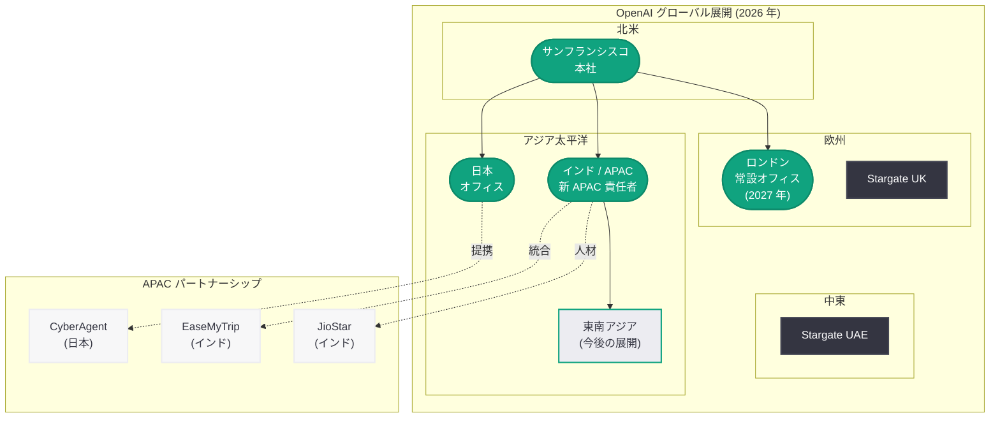

# OpenAI、JioStar CEO をアジア太平洋事業責任者に採用: APAC 市場への本格進出を加速

## メタデータ

| 項目 | 内容 |
|------|------|
| 発表日 | 2026-04-20 |
| ソース | MSN / 複数メディア |
| カテゴリ | 企業 / 人事 / グローバル展開 |
| 公式リンク | -- (メディア報道に基づく) |

> **注記:** 本レポートは MSN をはじめとする複数のニュースメディアの報道に基づいて作成されており、OpenAI の公式ブログによる発表ではない。正確な詳細については OpenAI の公式発表を確認されたい。

## 概要

OpenAI がインドの JioStar (Reliance Jio と Star India の合弁企業) の CEO をアジア太平洋 (APAC) 事業の責任者として採用したことが、2026 年 4 月 20 日に複数のメディアで報じられた。JioStar は 4 億人以上のユーザーを擁する Jio のデジタルプラットフォーム基盤を持つ大規模メディア企業であり、同社の CEO を招聘したことは、OpenAI が APAC 市場、特にインドを中心とした高成長地域への本格的な進出を加速させる意図を明確に示している。

今回の採用は、OpenAI が進める大規模なグローバル展開戦略の文脈で捉える必要がある。2026 年 4 月 13 日のロンドン常設オフィス開設計画の発表、4 月 9 日の CyberAgent との日本市場における提携、3 月 17 日の日本向けティーンセーフティブループリント、そして 4 月 10 日の OpenAI Academy のグローバル展開など、OpenAI は地域ごとの戦略的拠点とパートナーシップの構築を急速に進めている。一方で、4 月 17 日に Kevin Weil (CPO)、Bill Peebles (Sora 研究リーダー)、Srinivas Narayanan (B2B CTO) の幹部 3 名が同日退社するなど、経営陣の大規模な再編が進行中である。APAC 事業責任者の新設は、この組織再編の中で国際事業の強化を図る動きとして注目される。

## 主な内容

### JioStar CEO の採用と APAC 事業責任者ポジション

OpenAI が JioStar の CEO を APAC 事業のトップとして迎え入れたことは、同社にとって初めてのアジア太平洋地域専任のシニアリーダー採用とみられる。

- **大規模デジタルプラットフォームの経験:** JioStar CEO は、Reliance Jio の 4 億人以上のモバイルユーザー基盤と Star India の放送・ストリーミング事業を統合した大規模メディアプラットフォームの経営経験を持つ。この経験は、APAC 地域で数億人規模のユーザーベースを持つ AI サービスの展開に直結する
- **インド市場への深い知見:** インドは世界最大の人口を抱え、デジタル化が急速に進む市場である。JioStar での経験を通じて培われたインド市場への理解は、OpenAI のインド戦略において極めて貴重な資産となる
- **APAC リーダーシップの新設:** 専任の APAC 責任者ポジションの設置は、OpenAI がアジア太平洋地域を独立した戦略的重点地域として位置づけていることを示す

### JioStar の背景

JioStar は、Reliance Industries 傘下の Reliance Jio と Walt Disney Company 傘下の Star India の合弁企業として設立されたインド最大級のメディア・エンターテインメント企業である。

- **Reliance Jio:** 2016 年の参入以来、インドのデジタル通信市場に革命をもたらした。低価格のデータ通信サービスにより 4 億人以上のユーザーを獲得し、インドのデジタルトランスフォーメーションの牽引役となっている。JioMart (EC)、JioCinema (動画配信)、JioSaavn (音楽) など、多角的なデジタルエコシステムを構築している
- **Star India:** インド最大のメディア・放送企業の一つであり、Disney+ Hotstar を通じたストリーミングサービスやクリケットの放映権など、インドのエンターテインメント産業における中核的な存在である
- **JioStar の規模:** 両社の統合により、インドのデジタルメディア・通信市場において圧倒的なリーチを持つ企業が誕生した。この規模のプラットフォームを率いた経験は、OpenAI の APAC 展開にとって戦略的に極めて重要である

### APAC 市場戦略と OpenAI のグローバル展開

今回の採用は、OpenAI のグローバル展開戦略における APAC 地域の位置づけをより鮮明にするものである。

**APAC 地域での既存の動き:**

| 日付 | 施策 | 地域 / 対象 |
|------|------|-------------|
| 2026-03-17 | 日本向けティーンセーフティブループリント | 日本 |
| 2026-04-09 | CyberAgent との ChatGPT Enterprise / Codex 提携 | 日本 |
| 2026-04-10 | OpenAI Academy のグローバル展開 | グローバル (APAC 含む) |
| 2026-04-20 | JioStar CEO を APAC 事業責任者に採用 | APAC 全域 (インド中心) |

**APAC 市場の重要性:**

- **インド市場の潜在力:** 14 億人以上の人口を持つインドは、デジタルサービスの普及率が急速に上昇している。ChatGPT のインド市場での利用は拡大を続けており、EaseMyTrip との統合など具体的な事業展開も進んでいる
- **日本市場の深化:** CyberAgent との提携や日本オフィスの運営を通じて、エンタープライズ AI の浸透が着実に進んでいる
- **東南アジアの成長機会:** インドネシア、ベトナム、タイなどの東南アジア諸国は AI サービスの需要が急増しており、APAC 統括拠点の設置により効率的な市場開拓が可能になる

### 幹部退社と組織再編の文脈

今回の採用は、OpenAI の経営陣が大規模に入れ替わる過渡期に行われた点が注目される。

**2026 年 4 月の主要人事異動:**

| 日付 | 人物 / 施策 | 内容 |
|------|-------------|------|
| 2026-04-03 | Fidji Simo | アプリケーション事業 CEO、医療休暇 |
| 2026-04-03 | Brad Lightcap | COO、スペシャルプロジェクトへの異動 |
| 2026-04-03 | Kate Rouch | CMO、退任 |
| 2026-04-17 | Kevin Weil | CPO、退任 |
| 2026-04-17 | Bill Peebles | Sora 研究リーダー、退社 |
| 2026-04-17 | Srinivas Narayanan | B2B CTO、退任 |
| 2026-04-20 | JioStar CEO | APAC 事業責任者として採用 (新規) |

幹部の離脱が続く一方で、APAC 事業の強化に向けた新たなリーダーの採用が行われたことは、OpenAI がコアビジネス (ChatGPT スーパーアプリ、エンタープライズ AI、API プラットフォーム) への集中とグローバル展開の両立を図っていることを示している。実験的なプロジェクト (Sora、OpenAI for Science) を整理する一方で、収益成長に直結するグローバル市場の開拓には積極的に投資する姿勢が鮮明である。

### グローバル展開の全体像

## 開発者への影響

JioStar CEO の APAC 事業責任者への採用は、OpenAI の API やプラットフォームを利用する開発者に対して以下の影響をもたらす可能性がある。

### APAC 地域の開発者への恩恵

- **ローカライズの強化:** APAC 専任のリーダーシップが確立されたことで、ヒンディー語、タミル語、ベンガル語をはじめとするインド言語や東南アジア言語への対応が強化される可能性がある。多言語対応の充実は、APAC 地域で AI アプリケーションを開発する開発者にとって直接的な恩恵となる
- **API パフォーマンスの改善:** APAC 地域でのインフラ投資が加速すれば、同地域からの API レイテンシの改善やデータセンターの拡充が期待される
- **開発者イベントとコミュニティ:** インドや東南アジアでの開発者カンファレンス、ハッカソン、ワークショップの開催頻度が増加する可能性がある

### エンタープライズ開発者への影響

- **インド市場向け API 統合の拡大:** EaseMyTrip との統合に続き、インドの主要テクノロジー企業やスタートアップとの API 連携が増加する可能性がある。これにより、ChatGPT API や Codex を活用したインド市場向けのソリューション開発機会が拡大する
- **エンタープライズサポートの充実:** APAC 専任チームの設立により、同地域のエンタープライズ顧客向けのテクニカルサポートやカスタマーサクセスが強化されることが見込まれる
- **パートナーシップ機会:** APAC 地域でのパートナーエコシステムの構築が加速し、OpenAI のプラットフォーム上でサービスを提供するサードパーティ開発者にとっての市場機会が拡大する

### 日本の開発者への影響

- **APAC 統括の恩恵:** 日本オフィスが APAC 統括の傘下に入る場合、地域全体のリソース配分や戦略策定において日本市場の位置づけがより明確になる。一方で、インド重視の戦略にシフトするリスクも考慮する必要がある
- **CyberAgent 事例の展開:** 日本市場におけるエンタープライズ AI の成功事例が APAC 全体のモデルケースとして活用される可能性がある

## 関連リンク

- [MSN - OpenAI hires India's JioStar CEO to lead Asia-Pacific operations](https://www.msn.com/)
- [関連レポート: OpenAI 幹部 3 名が同日退社](2026-04-17-openai-triple-executive-exit.md)
- [関連レポート: OpenAI、2027 年にロンドン初の常設オフィスを開設](2026-04-13-openai-london-office-2027.md)
- [関連レポート: CyberAgent が ChatGPT Enterprise と Codex で AI 活用を加速](2026-04-09-cyberagent-chatgpt-enterprise-codex.md)
- [関連レポート: 日本向けティーンセーフティブループリント](2026-03-17-japan-teen-safety-blueprint.md)
- [OpenAI News](https://openai.com/news)

## まとめ

OpenAI が JioStar の CEO をアジア太平洋事業の責任者として採用したことは、同社のグローバル展開戦略が新たな段階に入ったことを示す重要な人事である。4 億人以上のユーザーを擁する Jio のデジタルプラットフォームと Star India のメディア事業を統合した JioStar の経営経験を持つ人材の招聘は、OpenAI が APAC 市場、特にインドにおいて大規模なユーザーベースの構築を本格的に目指していることを明確にしている。

この動きは、2026 年 4 月 17 日の幹部 3 名同時退社に象徴される経営陣の大規模再編の中で行われた点も注目に値する。OpenAI は Sora や OpenAI for Science といった実験的プロジェクトを整理する一方で、ChatGPT スーパーアプリとエンタープライズ AI を軸としたグローバル展開には積極的に投資を続けている。ロンドン常設オフィス (欧州)、日本オフィスと CyberAgent 提携 (日本)、そして今回の APAC 事業責任者の採用 (インド / アジア太平洋) という一連の施策は、OpenAI が IPO 準備と並行して世界の主要成長市場における事業基盤の構築を急ピッチで進めていることを裏付けている。APAC 地域の開発者やエンタープライズ顧客にとっては、OpenAI のサービスやサポートが今後さらに充実する可能性が高く、今後の展開を注視する価値がある。
