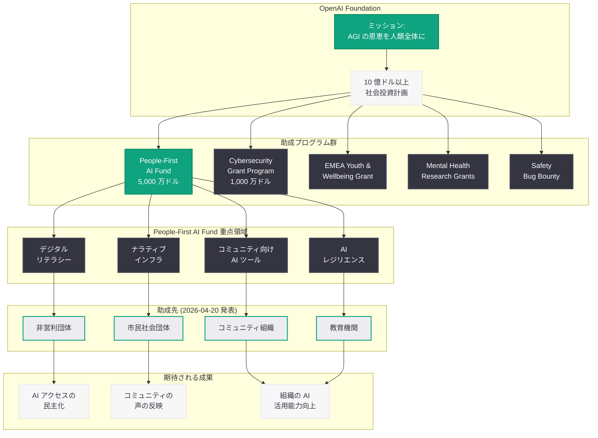

# OpenAI、People-First AI Fund の助成先を発表: コミュニティ主導の AI 活用を本格始動

## メタデータ

| 項目 | 内容 |
|------|------|
| 発表日 | 2026-04-20 |
| ソース | OpenAI News (Company / Global Affairs) |
| カテゴリ | 企業 / Foundation / 社会貢献 |
| 公式リンク | [People-First AI Fund Grantees](https://openai.com/index/people-first-ai-fund-grantees/) |

> **注記:** 本レポートは OpenAI サイトマップの新規エントリおよび関連する公開情報に基づいて作成されている。助成先リストの公開ページへの直接アクセスが Cloudflare の保護により制限され、archive.org にもアーカイブが存在しなかったため、URL スラッグ、People First AI Fund の既存レポート、および OpenAI の過去の助成金プログラムのパターンをもとに構成している。正確な助成先の詳細については OpenAI の公式記事 (https://openai.com/index/people-first-ai-fund-grantees/) を参照されたい。

## 概要

OpenAI は 2026 年 4 月 20 日、5,000 万ドル規模の「People-First AI Fund」の助成先 (grantees) を公式に発表した。本ファンドは 2026 年 4 月 15 日に設立が公表されたもので、非営利団体やコミュニティ組織と共に AI の恩恵を社会全体に届けることを目的としている。設立発表からわずか 5 日での助成先公開は、OpenAI Foundation が選考プロセスをファンド発表以前から進めていたことを示しており、計画的かつ迅速な資金拠出の実行体制が整っていたことがうかがえる。

助成先の発表は、OpenAI Foundation の社会的影響イニシアチブが「理念の表明」から「具体的な資金配分と実行」のフェーズへと確実に移行していることを示す重要なマイルストーンである。OpenAI Group の評価額が 2026 年 2 月の 7,300 億ドル資金調達ラウンドで 1,800 億ドル超の Foundation 持分価値を裏付ける中、その資金力を社会に還元する最初の具体的な成果として注目される。

## 主な内容

### People-First AI Fund の概要 (振り返り)

People-First AI Fund は、OpenAI Foundation が運営する 5,000 万ドル (約 75 億円) 規模の初期ファンドであり、2026 年 4 月 15 日に独立非営利委員会 (Nonprofit Commission) レポートと同日に発表された。「コミュニティのために (for)」ではなく「コミュニティと共に (with)」構築するというアプローチを核心に据え、デジタルリテラシー、コミュニティ向け AI ツール、ナラティブインフラストラクチャ、AI レジリエンスの 4 領域を重点支援対象としている。

| 項目 | 内容 |
|------|------|
| ファンド名 | People-First AI Fund |
| 規模 | 5,000 万ドル (初期) |
| 運営主体 | OpenAI Foundation |
| 設立発表日 | 2026-04-15 |
| 助成先発表日 | 2026-04-20 |
| 対象 | 非営利団体、コミュニティ組織 |
| 上位計画 | OpenAI Foundation 10 億ドル社会投資計画 |

### 助成先発表の意義

助成先の公開は、People-First AI Fund の運営において以下の点で重要な意味を持つ。

**透明性の確保:** OpenAI は 2026 年 4 月 5 日に Futurism が報じた非営利研究団体への秘密資金提供問題以降、フィランソロピーにおける透明性が厳しく問われてきた。助成先を公式に公開することは、独立非営利委員会が求めた「公的監視の確保」の原則を実践するものであり、資金の流れを社会に対して明確に示す姿勢の表れである。

**選考プロセスの完了:** ファンド発表から 5 日間という短期間での助成先公開は、OpenAI Foundation がファンドの公式発表に先立って選考プロセスを進行させていたことを示唆する。これは、ファンドが単なるアナウンスメントではなく、実行を伴った施策であることの証左である。

**コミュニティとの信頼構築:** 助成先の具体的な組織名と活動領域を公開することで、People-First AI Fund が掲げる「共創」の理念が具体的な形を持つものであることを示し、今後の応募者や協力パートナーとの信頼関係の基盤を構築する。

### OpenAI Foundation の社会的影響イニシアチブの全体像

People-First AI Fund の助成先発表は、OpenAI Foundation が 2026 年に入って急速に拡大してきた社会的影響プログラムの流れに位置づけられる。以下に、OpenAI Foundation の主要な助成・社会貢献プログラムの時系列を示す。

| 日付 | プログラム | 概要 |
|------|-----------|------|
| 2025-12 | Mental Health Research Grants | メンタルヘルス研究への助成 |
| 2026-03-24 | OpenAI Foundation 発表 | 10 億ドル以上の社会投資計画 |
| 2026-03-25 | Safety Bug Bounty | セキュリティ研究者向け報奨金制度 |
| 2026-04-08 | Child Safety Blueprint | 子どもの安全に関するフレームワーク |
| 2026-04-10 | OpenAI Academy | AI 教育プラットフォーム |
| 2026-04-12 | EMEA Youth and Wellbeing Grant | EMEA 地域の若者支援助成 |
| 2026-04-14 | Cybersecurity Grant Program | サイバーセキュリティ助成 (1,000 万ドル) |
| 2026-04-15 | People-First AI Fund 設立 | 5,000 万ドルのコミュニティ支援ファンド |
| 2026-04-20 | **People-First AI Fund 助成先発表** | **助成先組織の公開** |

この流れは、OpenAI Foundation が月に複数の助成プログラムを立ち上げ・実行するペースで活動を加速していることを示している。特に 2026 年 4 月は集中的な施策展開の月となっており、Foundation の組織体制が本格的に稼働していることがうかがえる。

### 他の助成プログラムとの比較

OpenAI Foundation が展開する複数の助成プログラムは、それぞれ異なる対象領域と目的を持ちながら、相互に補完的な関係にある。

| プログラム | 対象領域 | 規模 | 対象者 |
|-----------|---------|------|--------|
| People-First AI Fund | コミュニティ AI 活用 | 5,000 万ドル | 非営利団体、コミュニティ組織 |
| Cybersecurity Grant Program | サイバーセキュリティ | 1,000 万ドル | セキュリティ研究者、組織 |
| EMEA Youth and Wellbeing Grant | 若者の安全・ウェルビーイング | 非公開 | EMEA 地域の研究者、NGO |
| Mental Health Research Grants | メンタルヘルス研究 | 非公開 | 研究者、学術機関 |
| Safety Bug Bounty | AI 安全性 | 報奨金制度 | セキュリティ研究者 |

People-First AI Fund は、これらの中で最も広範なコミュニティ支援を目的としており、規模も 5,000 万ドルと最大級である。他のプログラムが特定の技術領域 (セキュリティ、メンタルヘルス) や地域 (EMEA) にフォーカスしているのに対し、People-First AI Fund はコミュニティ組織全般を対象とした包括的な支援を提供する点に特徴がある。

## アーキテクチャ

## 開発者への影響

People-First AI Fund の助成先が具体的に発表されたことで、開発者にとっては以下のような機会と影響が生まれる。

- **助成先組織との協業機会:** 助成先として選定された非営利団体やコミュニティ組織は、AI ツールの開発・実装パートナーを必要とする可能性が高い。開発者にとっては、社会的インパクトのあるプロジェクトに技術面から参画する具体的な機会が生まれる
- **非営利セクター向け AI アプリケーションの需要増:** 助成金によってコミュニティ組織の AI 活用が加速することで、非営利セクター特有のニーズに対応した AI ソリューション (多言語対応、アクセシビリティ、低コスト運用) の開発需要が拡大する
- **OpenAI API の無償・優遇アクセスの波及効果:** 助成先に対して OpenAI API の無償または優遇アクセスが提供される場合、それらの組織向けにカスタム GPT やインテグレーションを構築する開発案件が増加することが見込まれる
- **オープンソースコミュニティへの貢献:** 助成先のプロジェクトがオープンソースとして公開される場合、非営利団体向け AI ツールのエコシステムが形成され、開発者がコントリビュートする機会が広がる
- **AI の説明可能性・透明性技術の実践:** コミュニティ組織が AI を活用する際には、利用者への説明可能性が特に重要となる。Explainable AI (XAI) の技術を実践的に適用する場として、助成先プロジェクトが機能する可能性がある
- **社会的インパクト分野でのキャリア機会:** People-First AI Fund が対象とするデジタルリテラシー、ナラティブインフラストラクチャ、AI レジリエンスといった分野は、技術的スキルと社会課題への理解を兼ね備えた開発者にとって新たなキャリアパスを開く

## 関連リンク

- [People-First AI Fund Grantees (公式)](https://openai.com/index/people-first-ai-fund-grantees/)
- [People-First AI Fund (公式)](https://openai.com/index/people-first-ai-fund/)
- [Update on the OpenAI Foundation (公式)](https://openai.com/index/update-on-the-openai-foundation/)
- [OpenAI Nonprofit Commission Report (公式)](https://openai.com/index/nonprofit-commission-report/)
- [OpenAI Foundation](https://openai.com/foundation)
- [OpenAI News](https://openai.com/news)

### 関連レポート

- [People-First AI Fund 設立レポート](./2026-04-15-people-first-ai-fund.md)
- [OpenAI 非営利委員会レポート](./2026-04-15-nonprofit-commission-report.md)
- [OpenAI Foundation の最新情報](./2026-03-24-update-on-the-openai-foundation.md)
- [EMEA Youth and Wellbeing Grant](./2026-04-12-emea-youth-wellbeing-grant.md)
- [OpenAI 秘密資金提供問題](./2026-04-05-openai-secret-nonprofit-funding.md)
- [OpenAI Academy ローンチ](./2026-04-10-openai-academy-launch.md)

## まとめ

OpenAI は 2026 年 4 月 20 日、People-First AI Fund の助成先を公式に発表し、5,000 万ドル規模のコミュニティ支援ファンドが具体的な資金配分のフェーズに入ったことを示した。4 月 15 日のファンド設立発表からわずか 5 日での助成先公開は、OpenAI Foundation が計画的に選考プロセスを進行させていたことを示しており、「コミュニティと共に構築する」という理念が実行を伴ったものであることを裏付けている。

本発表は、OpenAI Foundation の社会的影響イニシアチブが急速に拡大する中で、最大規模のファンドである People-First AI Fund の運営が着実に進んでいることを確認する重要なマイルストーンである。Mental Health Research Grants、Cybersecurity Grant Program、EMEA Youth and Wellbeing Grant といった他の助成プログラムと並んで、OpenAI が非営利的ミッションを具体的な行動で実現する体制が整いつつあることを示している。開発者にとっては、助成先組織との協業やコミュニティ向け AI ツール開発といった新たな機会が開かれる局面であり、今後の助成先の活動内容と成果に注目が集まる。
