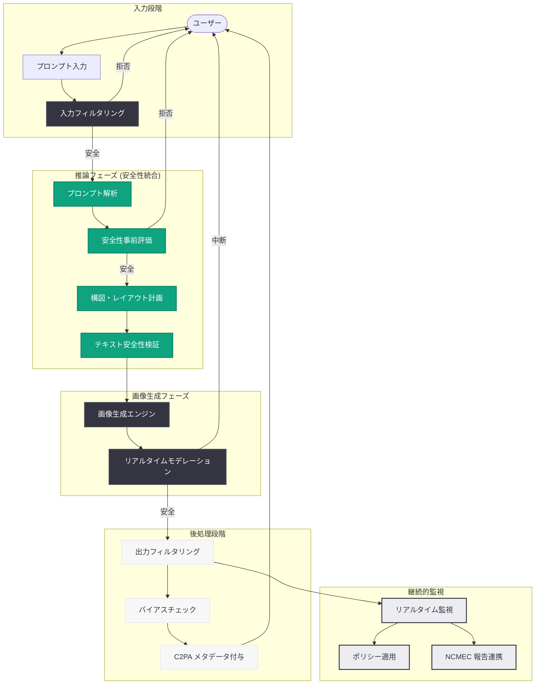

# ChatGPT Images 2.0 System Card: 次世代画像生成モデルの安全性評価と緩和策

## メタデータ

| 項目 | 内容 |
|------|------|
| 発表日 | 2026-04-21 |
| ソース | OpenAI Safety / Research |
| カテゴリ | 安全性 / 研究 / System Card |
| 公式リンク | [openai.com](https://openai.com/index/chatgpt-images-2-0-system-card/) |

> **注記:** 本レポートは OpenAI が公開した System Card の情報に基づいて作成されている。ChatGPT Images 2.0 の製品概要については [関連レポート](2026-04-21-chatgpt-images-2-0.md) を、API の技術詳細については [GPT Image 2 API レポート](2026-04-21-gpt-image-2-api.md) を参照のこと。

## 概要

OpenAI は 2026 年 4 月 21 日、ChatGPT Images 2.0 の発表と同時に、同モデルの安全性評価と緩和策を詳述した System Card を公開した。System Card は、OpenAI が GPT-5.4 Thinking System Card や GPT-5.3 Instant System Card に続いて公開してきた透明性文書の一環であり、モデルの安全性に関する評価手法、特定されたリスク領域、および講じられた緩和策を包括的にまとめたものである。

ChatGPT Images 2.0 は、推論ステップを導入した次世代画像生成モデルであり、フォトリアリスティックな画像生成、正確な多言語テキストレンダリング、Web 接続による動的情報統合といった高度な能力を備えている。これらの能力向上に伴い、ディープフェイクの悪用リスク、CSAM (児童性的搾取コンテンツ) の生成防止、バイアスの排除、敵対的入力への耐性といった安全性課題が一層重要になっている。本 System Card は、こうしたリスクに対して OpenAI がどのような評価と対策を実施したかを明らかにしている。

## 主な内容

### 安全性評価フレームワーク

OpenAI は ChatGPT Images 2.0 に対して、Preparedness Framework に基づく多層的な安全性評価を実施している。評価は以下の 4 段階で体系的に行われた。

1. **事前評価 (Pre-deployment Evaluation):** モデルリリース前にレッドチーミングおよび自動化テストを実施し、リスク領域を特定
2. **敵対的テスト (Adversarial Testing):** 外部の専門家チームによるジェイルブレイク試行やプロンプトインジェクション攻撃に対する耐性評価
3. **人間評価 (Human Evaluation):** 多様な背景を持つ評価者による生成画像のバイアス、品質、安全性の主観的評価
4. **継続的モニタリング (Post-deployment Monitoring):** リリース後のリアルタイム監視と異常検知による安全性の維持

### リスク領域と緩和策

System Card では、画像生成モデルに固有のリスク領域として以下の項目が特定され、それぞれに対する緩和策が講じられている。

| リスク領域 | リスクの概要 | 緩和策 |
|-----------|-------------|--------|
| ディープフェイク | 実在人物の偽画像生成 | 顔検出フィルタ、著名人画像生成の制限 |
| CSAM | 児童の性的搾取コンテンツ | 多層検出システム、NCMEC 報告連携 |
| 暴力・ゴア | 過激な暴力表現の生成 | コンテンツフィルタリング、プロンプト拒否 |
| ヘイト表現 | 差別的・憎悪的な画像 | バイアス検出、ポリシーベースのフィルタ |
| 知的財産侵害 | 著作権のあるキャラクター等 | スタイル模倣の制限、学習データの管理 |
| テキスト安全性 | 画像内有害テキストの描画 | 推論ステップでのテキスト内容検証 |

### ディープフェイク・フォトリアリズムへの対策

ChatGPT Images 2.0 はフォトリアリスティックな画像を高精度で生成できるため、ディープフェイクの悪用が特に懸念される領域である。OpenAI は以下の対策を実施している。

- **実在人物の検出と制限:** 特定の実在人物を模倣する画像生成リクエストを検出し、拒否するシステムを導入。著名人や公人の顔特徴に対する生成制限を強化
- **推論ステップでの安全性チェック:** Images 2.0 の「考えてから描く」推論フェーズにおいて、生成前にコンテンツの安全性を評価する。これにより、従来の事後フィルタリングでは検出困難だった巧妙な有害コンテンツの生成を未然に防止
- **フォトリアリズムの段階的制御:** 生成画像のリアリズム度合いに応じた追加的な安全性チェックを適用し、人物を含む高写実画像に対してはより厳格なモデレーションを実施

### C2PA メタデータと来歴追跡

OpenAI は生成画像の来歴追跡のために C2PA (Coalition for Content Provenance and Authenticity) 規格を採用している。

- **自動メタデータ埋め込み:** ChatGPT Images 2.0 で生成されたすべての画像に、C2PA 準拠のメタデータが自動的に埋め込まれる
- **生成元証明:** メタデータには、OpenAI の AI モデルによって生成されたことを示す署名情報が含まれる
- **改ざん検出:** 画像が編集・加工された場合にメタデータの整合性が崩れるため、改ざんの有無を検証可能
- **エコシステムとの連携:** Content Authenticity Initiative (CAI) のエコシステムと連携し、ソーシャルメディアプラットフォームやニュースメディアでの来歴検証を支援

### 多言語安全性

Images 2.0 の多言語テキストレンダリング能力に伴い、言語ごとの安全性評価が実施されている。

- **CJK 文字の安全性:** 日本語、中国語、韓国語のテキストを含む画像生成において、有害なテキストコンテンツが描画されないよう言語別のフィルタリングを実装
- **アラビア文字・デーヴァナーガリー文字:** 右から左に書く言語や、複雑な文字結合規則を持つ言語においても、安全性フィルタが正確に機能することを検証
- **多言語プロンプト攻撃への耐性:** 異なる言語を組み合わせたプロンプトインジェクション攻撃 (多言語ジェイルブレイク) に対する耐性テストを実施

### バイアス評価

生成画像における人口統計学的バイアスの評価と緩和が重点的に行われている。

- **表現の多様性:** 人物を含む画像生成において、性別、人種、年齢、体型などの表現が特定の属性に偏らないよう評価・調整
- **職業・役割のステレオタイプ:** 特定の職業や社会的役割に関する画像生成で、ステレオタイプを強化するような表現が発生しないかを体系的に評価
- **文化的感受性:** 宗教的シンボル、文化的慣習、歴史的文脈に関する画像生成における文化的感受性を評価し、不適切な表現を防止

## 技術的な詳細

### 安全性パイプラインの構成

ChatGPT Images 2.0 の安全性パイプラインは、入力段階から出力段階まで複数のレイヤーで構成される。

1. **入力フィルタリング:** プロンプトテキストの有害性を分類器で評価し、ポリシー違反のリクエストを拒否
2. **推論フェーズ安全性チェック:** モデルの推論ステップにおいて、生成計画の安全性を内部的に評価
3. **生成時モデレーション:** 画像生成プロセス中にリアルタイムでコンテンツを評価し、有害な画像の生成を中断
4. **出力フィルタリング:** 生成完了後の画像に対して最終的な安全性チェックを実施
5. **メタデータ付与:** C2PA 準拠のメタデータを埋め込み、来歴追跡を可能にする

### レッドチーミングの手法

外部の専門家チームによるレッドチーミングでは、以下の攻撃手法が体系的にテストされた。

- **直接的プロンプト攻撃:** 明示的に有害コンテンツの生成を要求するプロンプト
- **間接的プロンプト攻撃:** 比喩表現、暗号化された指示、段階的エスカレーションによる制限回避の試行
- **多言語攻撃:** 複数言語の混合や低リソース言語を利用した安全フィルタの回避試行
- **画像編集攻撃:** 既存画像の編集機能を悪用して有害コンテンツを生成する試行
- **文脈操作:** 無害な要素の組み合わせにより、全体として有害な画像を生成する試行

## アーキテクチャ

## 開発者への影響

System Card の公開により、開発者は画像生成 AI を組み込んだアプリケーションにおける安全性設計の具体的な指針を得ることができる。

- **多層的モデレーションの実装:** OpenAI の安全性パイプラインを参考に、入力段階、生成段階、出力段階それぞれでモデレーションを実装することが推奨される
- **C2PA メタデータの活用:** API 経由で生成された画像に含まれる C2PA メタデータを検証し、コンテンツの来歴追跡を自社サービスに組み込むことが可能
- **バイアス監視:** 人物を含む画像を大量生成するユースケースでは、生成結果の属性分布を監視し、偏りがないことを定期的に確認すべきである
- **CSAM 対策の義務:** 画像生成機能を提供するサービスでは、CSAM 検出と報告の仕組みを義務的に実装する必要がある
- **ディープフェイク規制への対応:** 各国で進むディープフェイク規制に対応するため、AI 生成画像の明示的なラベリングと来歴追跡の実装が不可欠である
- **EU AI Act との整合性:** EU AI Act における高リスク AI システムの要件に対応するための透明性報告の参考資料として活用できる
- **能力と制限の理解:** モデルの安全性フィルタは完全ではなく、新たな攻撃手法に対して継続的な更新が必要であることを認識すべきである

## 関連リンク

- [ChatGPT Images 2.0 System Card](https://openai.com/index/chatgpt-images-2-0-system-card/)
- [関連レポート: ChatGPT Images 2.0 製品概要](2026-04-21-chatgpt-images-2-0.md)
- [関連レポート: GPT Image 2 API](2026-04-21-gpt-image-2-api.md)
- [OpenAI Preparedness Framework](https://openai.com/preparedness)
- [C2PA (Coalition for Content Provenance and Authenticity)](https://c2pa.org/)
- [OpenAI 使用ポリシー](https://openai.com/policies/usage-policies)
- [GPT-5.4 Thinking System Card レポート](2026-03-05-gpt-5-4-thinking-system-card.md)

## まとめ

ChatGPT Images 2.0 System Card は、次世代画像生成モデルの安全性に関する包括的な評価と緩和策を公開した重要な透明性文書である。フォトリアリスティックな画像生成能力の飛躍的な向上に伴い、ディープフェイク、CSAM、バイアス、多言語安全性といった多岐にわたるリスク領域が特定され、推論フェーズでの事前安全性チェック、多層的フィルタリング、C2PA メタデータによる来歴追跡、レッドチーミングによる敵対的テストなど、多面的な緩和策が講じられている。

特筆すべきは、Images 2.0 の「考えてから描く」推論アーキテクチャが安全性においても大きな役割を果たしている点である。生成前の推論フェーズでコンテンツの安全性を事前に評価する仕組みは、従来の事後フィルタリングに依存するアプローチと比較して、より根本的な安全性の向上をもたらしている。開発者にとっては、本 System Card が画像生成 AI アプリケーションにおける安全性設計のベストプラクティスとして、また各国の規制対応における参考資料として有用である。AI の能力向上と安全性確保のバランスは、画像生成分野においてますます重要な課題となっており、OpenAI の System Card 公開は業界全体の透明性向上に貢献するものといえる。
