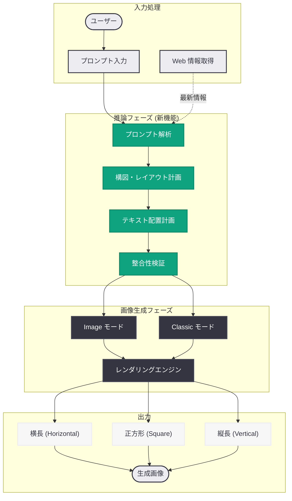
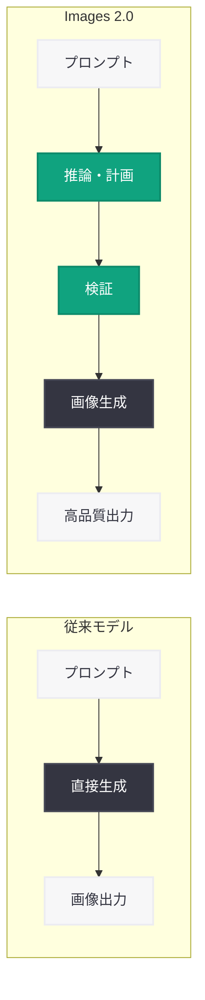

# ChatGPT Images 2.0: AI が「考えてから描く」次世代画像生成モデルを発表

## メタデータ

| 項目 | 内容 |
|------|------|
| 発表日 | 2026-04-21 |
| ソース | OpenAI News |
| カテゴリ | 製品 / 画像生成 / ChatGPT |
| 公式リンク | https://openai.com/index/introducing-chatgpt-images-2-0/ |

> **注記:** 本レポートは OpenAI の公式発表および VentureBeat、TechCrunch、The Verge、WIRED、Engadget、PetaPixel、9to5Mac、Business Insider 等の報道に基づいて作成されている。

## 概要

OpenAI は 2026 年 4 月 21 日、ChatGPT の画像生成機能を大幅にアップグレードした「ChatGPT Images 2.0」を発表した。最大の特徴は、画像を生成する前に AI が「考える」ステップ (推論・計画フェーズ) を導入した点である。従来のモデルがプロンプトから直接ピクセルを生成していたのに対し、Images 2.0 はまず構図、要素配置、テキストレイアウトなどを論理的に計画してから描画を実行する。これにより、複雑なインフォグラフィック、プレゼンテーションスライド、地図、マンガ風アートなど、従来の画像生成 AI が苦手としていた高度な表現が可能になった。

さらに、多言語テキストレンダリングにおいても飛躍的な進化を遂げている。CJK 文字 (中国語・日本語・韓国語) やアラビア文字、デーヴァナーガリー文字など非ラテン文字を正確に描画でき、Web 接続機能により最新の情報を取り込んだ画像を生成できる。複数の主要テックメディアが「画像生成の新時代」と評する一方、Business Insider は本物の写真と見分けがつかないレベルのリアルな画像を生成できることから、ディープフェイクに関する懸念も指摘している。

## 主な内容

### 「考えてから描く」推論ベースの画像生成

ChatGPT Images 2.0 の根幹を成すのが、生成前の推論・計画ステップである。

1. **プロンプト解析:** ユーザーの入力テキストを意味的に解析し、要求される画像の構成要素を特定する
2. **構図計画:** 画像全体のレイアウト、要素の配置、テキストの位置関係を論理的に計画する
3. **整合性チェック:** テキストのスペリング、数値の正確性、視覚的な整合性を事前に検証する
4. **画像生成:** 計画に基づいて高品質な画像を生成する

この推論ステップにより、従来のモデルで頻発していた以下の問題が大幅に改善された。

| 従来の課題 | Images 2.0 での改善 |
|-----------|-------------------|
| テキストのスペルミス | 推論ステップで事前に正確性を検証 |
| 指の本数の異常 | 人体構造の論理的な計画による改善 |
| 構図の破綻 | レイアウトの事前計画による安定化 |
| 複雑な図表の生成不可 | 構造化されたレイアウト計画で対応 |

### 多言語テキストレンダリング

Images 2.0 は画像内のテキスト描画において革新的な進歩を実現した。日本語の漢字・ひらがな・カタカナ、中国語の簡体字・繁体字、韓国語のハングルなど CJK 文字を高精度で描画できるほか、アラビア文字やデーヴァナーガリー文字など非ラテン文字にも対応する。フォントスタイルの制御 (明朝体、ゴシック体、手書き風など) や、一つの画像内での複数言語の混合表現も可能である。

### 多様な出力形式と生成モード

Images 2.0 は複数の生成モードとアスペクト比をサポートしている。

- **Image モード:** 推論ステップを最大限に活用した高品質生成モード
- **Classic モード:** 従来の直接生成方式による高速生成モード
- **アスペクト比:** Horizontal (横長)、Square (正方形)、Vertical (縦長) から選択可能

### Web 接続による情報統合

Images 2.0 は Web 接続機能を備えており、画像生成時にインターネットから最新の統計データやニュースを取得してインフォグラフィックに反映したり、実在する場所の地理情報を取り込んだ地図を生成したりできる。

### 高度なユースケース

推論ベースのアプローチにより、以下のような高度なユースケースが実現された。

- **インフォグラフィック:** データの可視化、フローチャート、統計グラフを含む高品質な図を単一プロンプトで生成
- **プレゼンテーションスライド:** タイトル、本文、図表を適切に配置したスライドの生成
- **マンガ風アート:** コマ割り、吹き出し、効果線を含むマンガスタイルの画像生成
- **地図・雑誌レイアウト:** 地理情報を反映した概念図や、テキストと画像を組み合わせた雑誌風デザイン

## 技術的な詳細

### API からの利用

ChatGPT Images 2.0 は ChatGPT のインターフェースおよび API 経由で利用可能である。Images API では `gpt-image-2` モデルを指定する。

### コードサンプル

```python
from openai import OpenAI

client = OpenAI()

# Images API を使用した多言語テキスト入り画像生成
response = client.images.generate(
    model="gpt-image-2",
    prompt=(
        "日本の桜の風景を描いた絵葉書デザイン。"
        "上部に「春の便り」と毛筆体で、"
        "下部に 'Greetings from Japan' と英語で記載。"
        "横長のレイアウト。"
    ),
    size="1792x1024",
    quality="hd",
    n=1,
)
print(response.data[0].url)
```

## アーキテクチャ



### 従来モデルとの比較



## 開発者への影響

- **プロダクション品質の画像生成:** 推論ステップの導入により、インフォグラフィックやスライドの自動生成が実用レベルに到達した。マーケティングコンテンツや社内資料の自動生成ワークフローを構築できる
- **多言語対応の簡素化:** CJK 文字を含む多言語テキストを正確に描画できるため、ローカライゼーションパイプラインにおける画像テキストの生成が大幅に効率化される
- **Web 接続による動的コンテンツ:** リアルタイムデータを反映した画像を生成できるため、ダッシュボードやレポートの視覚化ツールとしての活用が広がる
- **ディープフェイク対策の必要性:** Business Insider が指摘するように、写実的な画像生成能力の向上に伴い、C2PA メタデータを活用した来歴追跡やコンテンツの真正性検証メカニズムの実装が推奨される
- **レイテンシとコスト:** 推論ステップの追加により生成時間が長くなる可能性があるため、非同期処理の検討とトークン消費量の管理が必要である

## 関連リンク

- [ChatGPT Images 2.0 公式発表](https://openai.com/index/introducing-chatgpt-images-2-0/)
- [OpenAI Images API リファレンス](https://platform.openai.com/docs/api-reference/images)
- [OpenAI 利用規約 - 画像生成ポリシー](https://openai.com/policies/usage-policies)
- [OpenAI News](https://openai.com/news)
- [関連レポート: GPT-5.4 Vision ドキュメント理解](2026-03-07-gpt-5-4-vision-document-understanding.md)

## まとめ

ChatGPT Images 2.0 は、画像生成 AI に「推論」の概念を本格的に導入した画期的なアップデートである。「考えてから描く」というアプローチにより、テキストの正確な描画、複雑な構図の実現、多言語対応といった従来モデルの弱点を克服し、インフォグラフィック、プレゼンテーションスライド、マンガ風アートなど多様な高度ユースケースを実現した。Web 接続機能による最新情報の取り込みも、実用性を大きく高めている。

一方で、写実的な画像生成能力の飛躍的な向上は、ディープフェイクや偽情報に関する社会的懸念を増大させている。開発者にとっては、画像生成アプリケーションの可能性が大きく広がる一方で、コンテンツの真正性検証やモデレーション機能の実装がこれまで以上に重要になる。Images 2.0 は画像生成 AI の新たな標準を打ち立てるものであり、その技術的進歩と社会的責任のバランスをどのように取るかが、今後の業界全体の課題となるだろう。
