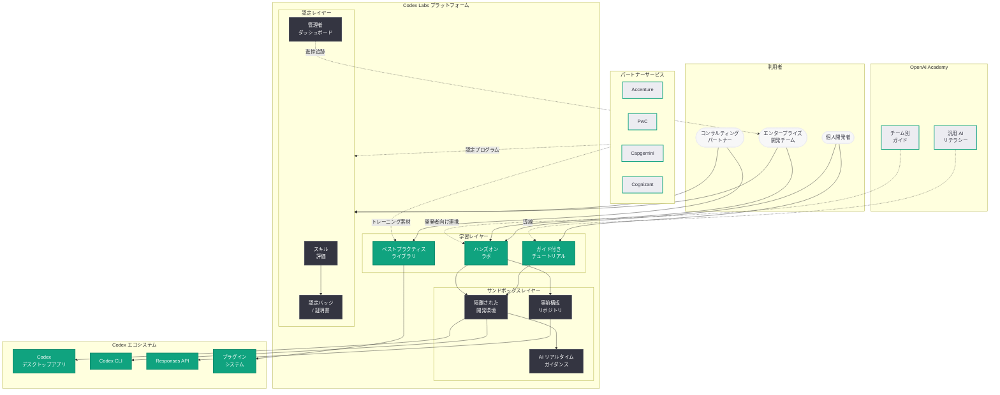
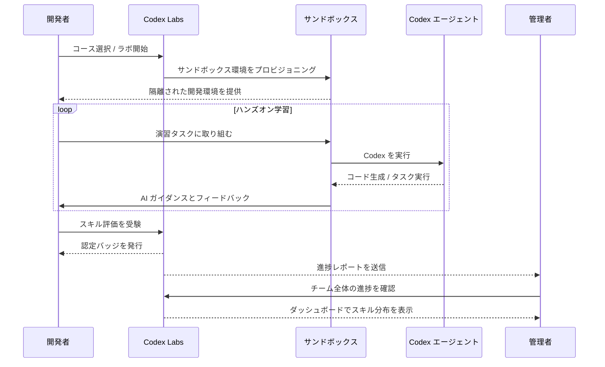

# Codex Labs 発表: 開発者向けトレーニング・実験プラットフォーム

## メタデータ

| 項目 | 内容 |
|------|------|
| 発表日 | 2026-04-21 |
| ソース | OpenAI News / SiliconANGLE |
| カテゴリ | 製品 / 開発者ツール / Codex |
| 公式リンク | [openai.com/index/codex-labs](https://openai.com/index/codex-labs/) |

> **注記:** 本レポートは OpenAI の公式発表 (URL スラッグ「codex-labs」) および SiliconANGLE 等の外部報道に基づいて作成している。公式記事ページは Cloudflare の保護により直接アクセスが制限されていたため、複数のニュースソースを照合して内容を構成している。正確な詳細については OpenAI の公式記事 (https://openai.com/index/codex-labs/) を参照されたい。

## 概要

OpenAI は 2026 年 4 月 21 日、開発者向けのトレーニングおよび実験プラットフォーム「Codex Labs」を発表した。Codex Labs は、開発者が Codex を効果的に活用するためのガイド付きチュートリアル、ハンズオンラボ、サンドボックス実験環境を提供する包括的なプラットフォームである。

本発表は、同日に公開された「Scaling Codex to enterprises worldwide」(エンタープライズ向け Codex 展開の加速) および「ChatGPT Images 2.0」と同時に行われたものであり、OpenAI の 2026 年 4 月 21 日アナウンスメントの三本柱の一つを構成している。Codex の週間アクティブユーザー (WAU) が 400 万人に到達する中、急増する利用者に対して体系的な学習パスと実験環境を提供することで、Codex エコシステム全体の底上げを図る戦略的な取り組みである。

SiliconANGLE は本サービスを「developer training service」と報じており、Accenture、PwC、Capgemini、Cognizant といったコンサルティングパートナーによるエンタープライズ導入支援と連携する形で、企業の開発チームが Codex を最大限に活用するためのハンズオントレーニングプログラムを提供するものと位置づけられる。

## 主な内容

### Codex Labs の概要

Codex Labs は、OpenAI が提供する開発者向けのトレーニング・実験プラットフォームであり、以下の目的で設計されている。

- **スキル習得の体系化:** Codex の基本操作からエンタープライズ向け高度活用まで、段階的に学べるカリキュラムを提供
- **実践的な学習環境:** 実際のプロジェクトを模したサンドボックス環境で、リスクなく Codex の各機能を試行できる
- **ベストプラクティスの共有:** OpenAI が推奨する Codex 活用パターンやアンチパターンを学べる教材を整備
- **エンタープライズ導入の加速:** 企業内の開発チームが短期間で Codex を業務に組み込めるよう、組織的なトレーニングプログラムを提供

2026 年 4 月 10 日にローンチされた OpenAI Academy が ChatGPT を中心とした汎用的な AI リテラシー教育を担うのに対し、Codex Labs は AI コーディングエージェントに特化した深い技術トレーニングを提供する位置づけである。

### トレーニング機能

Codex Labs のトレーニング機能は、複数のレベルと形式で構成されると考えられる。

**初級コース (Getting Started):**
- Codex のセットアップと初期設定
- 基本的なプロンプトの書き方とベストプラクティス
- ファイル操作、コード生成、テスト生成の基礎
- Codex CLI とデスクトップアプリの使い分け

**中級コース (Intermediate):**
- 複雑なタスクの分解とマルチステップ指示
- Computer Use 機能の活用方法
- プラグインシステムの利用と開発
- 永続メモリの効果的な設定と運用

**上級コース (Advanced / Enterprise):**
- Codex Hooks と Automations を活用した CI/CD パイプライン統合
- Responses API を用いたカスタムエージェントの構築
- 大規模コードベースでのモダナイゼーション戦略
- セキュリティ監査とコンプライアンス対応

**ハンズオンラボ:**
- 事前構成された開発環境でのインタラクティブな演習
- 実際のコードベースを使用したリファクタリング演習
- バグ修正・テスト生成のシナリオベース学習
- チーム演習によるコラボレーションワークフローの実践

### エンタープライズ向けプログラム

Codex Labs は、エンタープライズ顧客の組織的な Codex 導入を支援するために、以下のようなプログラムを提供すると想定される。

- **カスタムトレーニングプラン:** 企業の技術スタックや業務要件に合わせたオーダーメイドのカリキュラム設計
- **スキル評価とバリデーション:** 開発者の Codex スキルレベルを評価し、認定バッジやスキル証明を発行するプログラム
- **管理者ダッシュボード:** チーム全体のトレーニング進捗、スキルレベル、利用パターンを可視化する管理ツール
- **ROI 測定フレームワーク:** Codex 導入による生産性向上効果を定量的に測定するためのメトリクスとレポーティング

エンタープライズ向けプログラムは、同日発表された Scaling Codex to enterprises worldwide における組織変革マネジメントの中核を担う要素として設計されている。大企業が Codex を全社展開する際、技術的な導入だけでなく開発者のスキルアップが不可欠であり、Codex Labs はこの課題に対する OpenAI の体系的な回答となる。

### コンサルティングパートナーとの連携

Codex Labs は、Accenture、PwC、Capgemini、Cognizant の 4 社のコンサルティングパートナーとの連携においても重要な役割を果たす。

- **パートナー向けトレーニング素材:** コンサルティングパートナーが顧客企業へのトレーニングを実施する際に使用するカリキュラムと教材を Codex Labs が提供
- **認定コンサルタントプログラム:** パートナー企業のコンサルタントが Codex Labs の上級プログラムを修了し、認定を取得することで、公認のトレーニング提供者として活動できる仕組み
- **共同開発コンテンツ:** パートナー企業のドメイン知識と OpenAI の技術知見を組み合わせた業界特化型トレーニングコンテンツの共同開発
- **導入支援ツールキット:** パートナーがエンタープライズ顧客への導入時に利用する、アセスメントツール、PoC テンプレート、展開ガイドラインの提供

## 技術的な詳細

### プラットフォームの技術基盤

Codex Labs のサンドボックス実験環境は、以下の技術要素で構成されると推定される。

- **隔離された実行環境:** 各ラボセッションで独立したコンテナ環境を提供し、ユーザーが安全にコード実行や Codex 操作を実験できる
- **事前構成リポジトリ:** 各演習に最適化されたサンプルリポジトリが自動的にプロビジョニングされ、即座にハンズオン学習を開始できる
- **リアルタイムフィードバック:** ユーザーの操作に対して AI がリアルタイムでガイダンスを提供し、最適なプラクティスへの誘導を行う
- **進捗追跡 API:** 組織管理者が REST API を通じてチームメンバーのトレーニング進捗を取得し、外部システムと連携できる

### OpenAI Academy との統合

Codex Labs は、2026 年 4 月 10 日にローンチされた OpenAI Academy と以下のように統合される。

| 側面 | OpenAI Academy | Codex Labs |
|------|---------------|------------|
| 対象 | 全ユーザー (初心者〜ビジネスユーザー) | 開発者 (初級〜上級エンジニア) |
| 内容 | ChatGPT 全般の活用、チーム別・業種別ガイド | Codex 特化のコーディング・エージェント技術 |
| 形式 | ガイド、チュートリアル (24 以上のリソース) | ハンズオンラボ、サンドボックス、認定プログラム |
| 目的 | AI リテラシーの向上 | Codex のプロフェッショナルスキル習得 |
| 連携 | Academy から Codex Labs への導線を提供 | Labs の修了者が Academy の上級コンテンツにアクセス |

## アーキテクチャ

以下は、Codex Labs プラットフォームの全体アーキテクチャを示す図である。

### 学習フロー

## 開発者への影響

- **体系的なスキル習得パスの確立:** これまで Codex の学習は公式ドキュメントやコミュニティの知見に依存していたが、Codex Labs の登場により、初心者から上級者まで体系的にスキルを習得できる公式のパスが確立される。開発者は自身のレベルに合わせた学習計画を立てやすくなる

- **実験環境による安全な試行:** サンドボックス環境の提供により、本番環境に影響を与えることなく Codex の新機能やベストプラクティスを試すことができる。特に Computer Use、Automations、プラグイン開発といった高度な機能の習得において、隔離された実験環境の価値は大きい

- **エンタープライズ導入の障壁低下:** 企業が Codex を全社展開する際の最大の課題の一つは、開発者のスキルギャップである。Codex Labs のカスタムトレーニングプランと認定プログラムにより、組織的なスキルアップが効率化され、導入から定着までの期間短縮が期待できる

- **認定によるキャリア価値の向上:** Codex Labs の認定バッジやスキル証明は、AI コーディングエージェントのスキルを客観的に示す手段となる。特にコンサルティングパートナー経由での認定プログラムは、AI 導入コンサルタントとしてのキャリアパスにおいて重要な差別化要因となる可能性がある

- **Codex エコシステムの成熟:** トレーニングプラットフォームの登場は、Codex が実験的なツールから成熟したエンタープライズプラットフォームへと進化していることを示す指標である。プラグイン開発者向けのトレーニングが充実することで、サードパーティエコシステムの成長も加速するだろう

- **400 万ユーザーへの学習リソース提供:** 週間アクティブユーザー 400 万人という規模に対して、統一的な学習リソースを提供することは、ユーザー体験の品質向上とサポートコスト削減の両面で戦略的に重要である

## 関連リンク

- [Codex Labs (公式)](https://openai.com/index/codex-labs/)
- [関連レポート: OpenAI、グローバルコンサルティング企業と連携し Codex のエンタープライズ展開を加速](2026-04-21-scaling-codex-enterprises.md)
- [関連レポート: Codex が「ほぼ万能」のスーパーアプリに進化](2026-04-16-codex-for-almost-everything.md)
- [関連レポート: OpenAI Academy を正式ローンチ](2026-04-10-openai-academy-launch.md)
- [関連レポート: OpenAI、エンタープライズ AI の次なるフェーズを発表](2026-04-08-next-phase-of-enterprise-ai.md)
- [関連レポート: Codex がチーム向けに柔軟な従量課金制を導入](2026-04-02-codex-flexible-pricing-for-teams.md)
- [関連レポート: Codex Chronicle によるスクリーンメモリ機能](2026-04-20-codex-chronicle-screen-memory.md)
- [関連レポート: Codex Hooks](2026-03-31-codex-hooks.md)
- [関連レポート: ChatGPT Images 2.0](2026-04-21-chatgpt-images-2-0.md)
- [OpenAI News](https://openai.com/news)

## まとめ

OpenAI は 2026 年 4 月 21 日、開発者向けトレーニング・実験プラットフォーム「Codex Labs」を発表した。Codex Labs は、ガイド付きチュートリアル、ハンズオンラボ、サンドボックス実験環境、スキル認定プログラムを通じて、開発者が Codex を効果的に活用するための体系的な学習パスを提供する。同日発表された Scaling Codex to enterprises worldwide と密接に連携し、Accenture、PwC、Capgemini、Cognizant といったコンサルティングパートナーが顧客企業にトレーニングを提供する際の基盤としても機能する。Codex の WAU が 400 万人に達した現在、増大する利用者に対して統一的かつ高品質な学習リソースを提供することは、エコシステム全体の成熟度を高める上で不可欠な施策である。Codex Labs の登場は、OpenAI が Codex を単なるコーディングツールではなく、トレーニング・認定・パートナーエコシステムを備えた包括的なエンタープライズプラットフォームとして確立しようとしていることを明確に示している。
