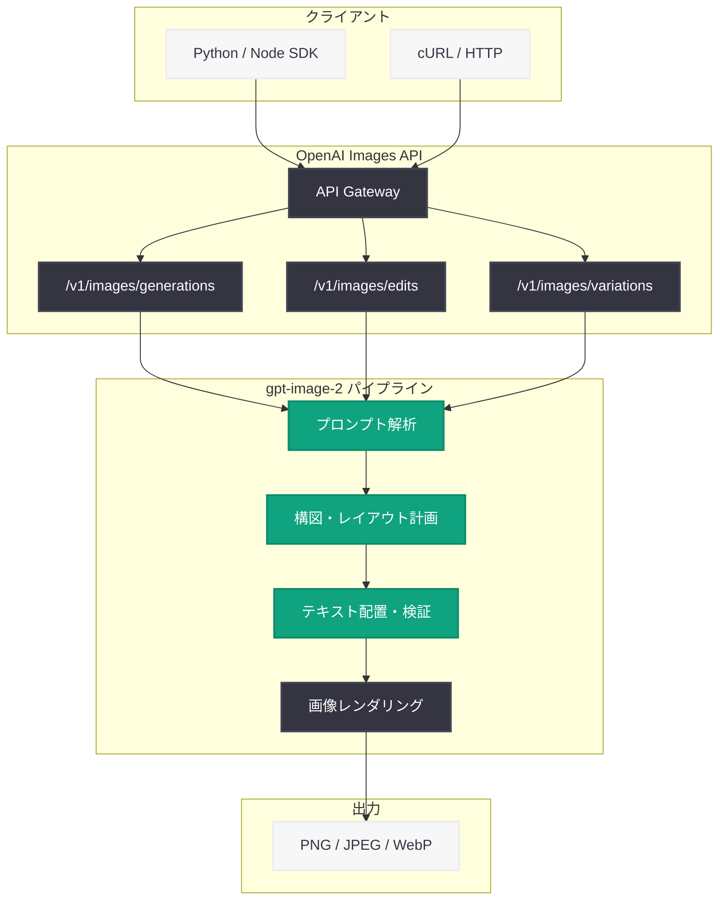

# GPT Image 2 モデル API 提供開始: 開発者向け次世代画像生成 API

## メタデータ

| 項目 | 内容 |
|------|------|
| 発表日 | 2026-04-21 |
| ソース | OpenAI API Changelog / OpenAI Developers |
| カテゴリ | API 更新 / 画像生成 / 開発者ツール |
| 公式リンク | [Image Generation Guide](https://developers.openai.com/api/docs/guides/image-generation/) |

> **注記:** 本レポートは OpenAI の公式開発者ドキュメントおよび API Changelog の情報に基づいて作成されている。ChatGPT Images 2.0 のコンシューマー向け機能については、[関連レポート](2026-04-21-chatgpt-images-2-0.md) を参照のこと。

## 概要

OpenAI は 2026 年 4 月 21 日、Images API を通じて `gpt-image-2` モデルを開発者向けに提供開始した。本モデルは同日発表された ChatGPT Images 2.0 の API 版であり、従来の DALL-E 3 を大幅に上回る画像生成能力を開発者が自らのアプリケーションに組み込めるようになる。

最大の特徴は、画像生成プロセスに推論 (reasoning) ステップを導入した点である。テキストプロンプトから直接ピクセルを生成するのではなく、構図計画、テキスト配置、整合性検証を経てから画像を描画する。これにより、正確なテキストレンダリング、多言語対応、インフォグラフィック生成といった従来の課題で飛躍的な品質向上を実現した。generation (生成)、editing (編集)、variations (バリエーション) の 3 操作をサポートし、PNG、JPEG、WebP の出力形式に対応する。

## 主な内容

### gpt-image-2 モデルの主要機能

`gpt-image-2` は推論モデルの技術を画像生成に適用した次世代モデルであり、既存の Images API エンドポイントを通じて利用可能である。DALL-E 3 を使用しているアプリケーションからの移行が容易な設計となっている。

- **推論ベース生成:** プロンプト解析、構図計画、テキスト配置計画、整合性検証を経て画像を生成
- **テキストレンダリング:** 画像内テキストを高精度で描画。スペルミスや文字化けが大幅に減少
- **多言語サポート:** CJK 文字 (日本語・中国語・韓国語)、アラビア文字、デーヴァナーガリー文字等に対応
- **インフォグラフィック:** データ可視化、フローチャート、統計グラフを含む複雑な図表の生成が可能
- **出力形式:** PNG、JPEG、WebP

### Images API エンドポイント

1. **`POST /v1/images/generations`:** テキストプロンプトから新しい画像を生成
2. **`POST /v1/images/edits`:** 既存画像に対するテキスト指示による編集
3. **`POST /v1/images/variations`:** 既存画像のバリエーション生成

### DALL-E 3 との比較

| 観点 | DALL-E 3 | gpt-image-2 |
|------|----------|-------------|
| テキスト描画精度 | 長文でスペルミスが頻発 | 推論ステップにより高精度な描画 |
| 多言語テキスト | 英語中心、CJK 文字は不安定 | CJK、アラビア文字等を正確に描画 |
| 複雑な構図 | 要素が多いと破綻しやすい | レイアウト計画により安定した構図 |
| インフォグラフィック | 実用レベルに未到達 | 図表を単一プロンプトで生成可能 |
| 生成アプローチ | プロンプトから直接生成 | 推論・計画フェーズを経て生成 |

## 技術的な詳細

### API パラメータ

| パラメータ | 型 | 説明 |
|-----------|-----|------|
| `model` | string | `"gpt-image-2"` を指定 |
| `prompt` | string | 画像生成のためのテキストプロンプト |
| `n` | integer | 生成する画像の枚数 (デフォルト: 1) |
| `size` | string | 画像サイズ (例: `"1024x1024"`、`"1792x1024"`、`"1024x1792"`) |
| `quality` | string | 画質設定 (`"standard"` または `"hd"`) |
| `response_format` | string | レスポンス形式 (`"url"` または `"b64_json"`) |

### コードサンプル

#### 基本的な画像生成

```python
from openai import OpenAI

client = OpenAI()

# gpt-image-2 による画像生成
response = client.images.generate(
    model="gpt-image-2",
    prompt="A modern tech startup office with large windows, natural lighting, "
           "and a whiteboard showing an architecture diagram with the text "
           "'System Design v2.0'",
    size="1024x1024",
    quality="hd",
    n=1,
)

image_url = response.data[0].url
print(f"Generated image: {image_url}")
```

#### 多言語テキスト入りインフォグラフィックの生成

```python
from openai import OpenAI

client = OpenAI()

# 日本語テキストを含むインフォグラフィックの生成
response = client.images.generate(
    model="gpt-image-2",
    prompt=(
        "企業向けインフォグラフィック。タイトルは「AI 導入ガイド 2026」。"
        "3 つのステップを図示: "
        "1. データ整備 (Data Preparation)、"
        "2. モデル選定 (Model Selection)、"
        "3. 本番デプロイ (Production Deployment)。"
        "各ステップにアイコンと日英バイリンガルの説明テキスト。"
        "白背景にプロフェッショナルなデザイン。"
    ),
    size="1024x1792",
    quality="hd",
    n=1,
)

print(response.data[0].url)
```

#### 画像編集 (Inpainting)

```python
from openai import OpenAI
from pathlib import Path

client = OpenAI()

# 既存画像のマスク領域を編集
response = client.images.edit(
    model="gpt-image-2",
    image=Path("original.png"),
    mask=Path("mask.png"),
    prompt="Replace the background with a sunset over the ocean",
    size="1024x1024",
    n=1,
)

print(response.data[0].url)
```

## アーキテクチャ



## 開発者への影響

- **DALL-E 3 からの移行:** `model` パラメータを `"dall-e-3"` から `"gpt-image-2"` に変更するだけで移行可能。エンドポイントとパラメータ構造は維持されており、コード変更は最小限で済む
- **プロダクション品質の画像生成:** マーケティング資料、製品カタログ、教育コンテンツなどのプロダクション品質画像を API 経由で自動生成するワークフローが実現可能になった
- **多言語アプリケーション:** CJK 文字を含む多言語テキストの正確な描画により、グローバルアプリケーションでのローカライズされた画像生成が大幅に簡素化される
- **レイテンシの考慮:** 推論フェーズの追加により生成時間が長くなる可能性がある。リアルタイム性が求められるユースケースでは、非同期処理やキューイングの導入を検討すべきである
- **コスト管理:** `quality` パラメータを `"standard"` に設定することで、品質とコストのバランスを調整できる
- **コンテンツモデレーション:** 写実的な画像生成能力の向上に伴い、C2PA メタデータの検証や独自のモデレーションパイプラインの実装が推奨される

## 関連リンク

- [Image Generation Guide](https://developers.openai.com/api/docs/guides/image-generation/)
- [Images API リファレンス](https://platform.openai.com/docs/api-reference/images)
- [OpenAI API Changelog](https://platform.openai.com/docs/changelog)
- [OpenAI Python SDK](https://github.com/openai/openai-python)
- [関連レポート: ChatGPT Images 2.0](2026-04-21-chatgpt-images-2-0.md)

## まとめ

`gpt-image-2` モデルの API 提供開始により、開発者は推論ベースの次世代画像生成能力を自らのアプリケーションに組み込めるようになった。従来の DALL-E 3 と同じ Images API エンドポイントを使用しつつ、`model` パラメータの変更だけで移行可能な設計である。正確なテキストレンダリング、多言語サポート、インフォグラフィック生成といった機能は、マーケティング自動化、教育コンテンツ生成、グローバルアプリケーション開発など幅広いユースケースを開拓する。推論ステップに伴うレイテンシとコストの増加には注意が必要だが、画像生成 API の品質が実用レベルに到達したことで、開発者にとっての画像生成ワークフローは新たな段階に入ったといえる。
