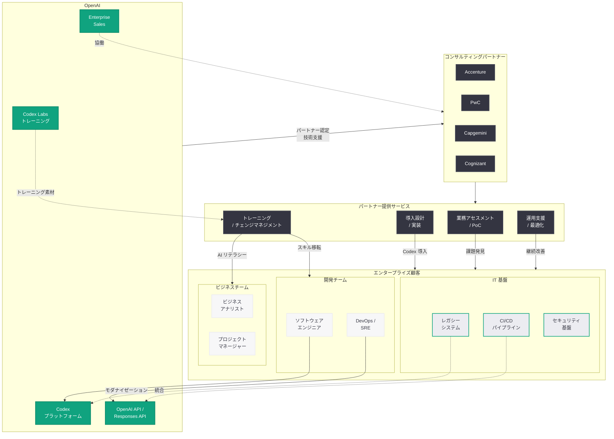
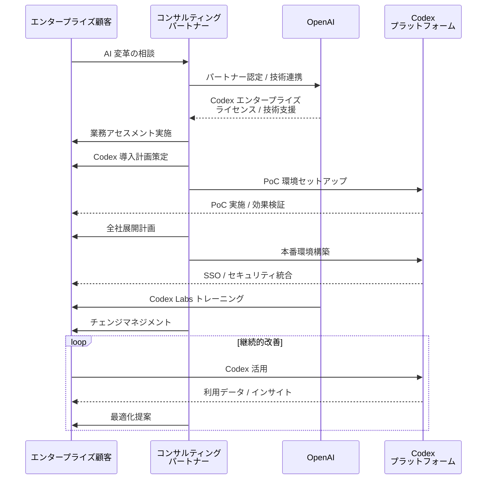

# OpenAI、グローバルコンサルティング企業と連携し Codex のエンタープライズ展開を加速

## メタデータ

| 項目 | 内容 |
|------|------|
| 発表日 | 2026-04-21 |
| ソース | OpenAI News / WSJ / Reuters |
| カテゴリ | ビジネス / エンタープライズ / Codex |
| 公式リンク | [openai.com/index/scaling-codex-to-enterprises-worldwide](https://openai.com/index/scaling-codex-to-enterprises-worldwide/) |

> **注記:** 本レポートは OpenAI の公式発表 (URL スラッグ「scaling-codex-to-enterprises-worldwide」) および WSJ、Reuters、Benzinga、Finimize、qz.com、SiliconANGLE、Neowin 等の外部報道を総合して作成している。公式記事ページは Cloudflare の保護により直接アクセスが制限されていたため、複数のニュースソースを照合して内容を構成している。正確な詳細については OpenAI の公式記事 (https://openai.com/index/scaling-codex-to-enterprises-worldwide/) を参照されたい。

## 概要

OpenAI は 2026 年 4 月 21 日、Codex のエンタープライズ展開を世界規模で加速するため、Accenture、PwC、Capgemini、Cognizant といった大手グローバルコンサルティング企業との戦略的パートナーシップを発表した。「Scaling Codex to enterprises worldwide」と題された本発表は、OpenAI の Go-to-Market (GTM) 戦略における大きな転換点を示すものであり、コンサルティングファームをセールスおよび導入チャネルとして活用することで、大企業への Codex 浸透を一気に進める狙いがある。

Codex は週間アクティブユーザー数 (WAU) が 400 万人に到達しており、わずか 2 週間前の 300 万人から急成長を遂げている。この急成長の背景には、2026 年 4 月 16 日のスーパーアプリ化や、エンタープライズ向け機能の拡充がある。しかし、大企業への本格的な導入には、業務プロセスの理解、既存システムとの統合、組織変革マネジメントといった専門的なコンサルティング能力が不可欠である。今回のパートナーシップは、この課題を解決するためのスケーラブルなアプローチとして設計されている。

## 主な内容

### コンサルティングパートナーの概要

今回発表されたパートナー 4 社は、いずれもグローバルで大規模なコンサルティングおよびテクノロジーサービスを提供する企業であり、Fortune 500 企業をはじめとする大企業顧客基盤を有している。

| パートナー | 本社所在地 | 従業員規模 | 主な強み |
|-----------|-----------|-----------|---------|
| Accenture | アイルランド / 米国 | 約 73 万人 | テクノロジーコンサルティング、デジタルトランスフォーメーション |
| PwC | 英国 | 約 36 万人 | 監査、税務、経営コンサルティング、テクノロジーアドバイザリー |
| Capgemini | フランス | 約 36 万人 | IT サービス、コンサルティング、デジタルエンジニアリング |
| Cognizant | 米国 / インド | 約 35 万人 | IT サービス、デジタルトランスフォーメーション、AI/ML 実装 |

これらのパートナーは合計で 180 万人以上の従業員を擁し、世界中の主要企業に対してテクノロジー導入支援を提供している。各社はすでに AI 関連のプラクティスを有しており、OpenAI の Codex をサービスポートフォリオに組み込むことで、既存顧客に対する AI コーディングエージェントの提案・導入・運用支援を行う体制が構築される。

### Go-to-Market 戦略の転換

OpenAI がコンサルティングファームを GTM チャネルとして活用する戦略は、B2B エンタープライズ市場における重要な転換点である。

**従来のアプローチ:**
- OpenAI の直販チーム (Enterprise Sales) による直接的な顧客獲得
- 製品主導成長 (PLG: Product-Led Growth) による個人・チーム単位での導入拡大
- ChatGPT Enterprise および Codex のセルフサービスでの導入

**新たなアプローチ:**
- コンサルティングファームが既存の顧客リレーションシップを活用し、Codex の導入を提案
- パートナー企業が業務プロセスの分析、導入計画の策定、PoC の実施、全社展開を一貫して支援
- パートナーのドメイン知識を活かした業界特化型のソリューション構築
- パートナー経由での導入後の継続的なサポートと最適化

WSJ は「OpenAI Is Working With Consultants to Sell Codex」と報じ、Reuters は「OpenAI leans on global consultancies to expand Codex use in large companies」と伝えている。qz.com は「OpenAI is partnering with major consultancies to push its AI coding agent into big companies」と表現しており、いずれもコンサルティングファームをチャネルパートナーとして活用する戦略の重要性を強調している。

### Codex の成長指標

Codex の急速な成長を示す指標は以下の通りである。

- **週間アクティブユーザー (WAU):** 400 万人 (2026 年 4 月 21 日時点)
- **2 週間前の WAU:** 300 万人 (Neowin 報道、2026 年 4 月上旬時点)
- **成長率:** 2 週間で約 33% 増加 (100 万人増)

この急激な成長は、以下の要因に起因すると考えられる。

1. **2026 年 4 月 16 日のスーパーアプリ化:** Computer Use、プラグイン、メモリなどの大規模機能追加により、Codex の利用価値が飛躍的に向上
2. **全 ChatGPT ユーザーへのアクセス開放:** 開発者に限定されていた Codex が全 ChatGPT アカウント保有者に開放されたことで、ユーザーベースが大幅に拡大
3. **エンタープライズ導入の加速:** 2026 年 4 月 8 日の「次なるエンタープライズ AI フェーズ」発表以降、企業導入が加速
4. **料金プランの柔軟化:** 2026 年 4 月 2 日のチーム向け柔軟な従量課金制の導入により、導入障壁が低下

### エンタープライズ導入のユースケース

コンサルティングパートナーを通じた Codex のエンタープライズ導入では、以下のようなユースケースが想定される。

- **ソフトウェア開発の生産性向上:** レガシーコードの現代化 (モダナイゼーション)、コードレビューとセキュリティ監査の自動化、テスト生成とカバレッジ向上、ドキュメント生成
- **業務プロセスの自動化:** RPA との統合、データパイプラインの構築と最適化、レポート生成の自動化、社内ツールの開発と保守
- **組織全体の AI トランスフォーメーション:** 開発チームの AI リテラシー向上、ガバナンスフレームワーク策定、ROI 測定と効果検証、スケーラブルな展開モデルの設計

### Codex Labs 開発者トレーニングサービス

SiliconANGLE の報道によると、今回のコンサルティングパートナーシップと併せて、Codex Labs と呼ばれる開発者トレーニングサービスも展開されている。Codex Labs は、企業の開発チームが Codex を最大限に活用するためのハンズオントレーニングプログラムを提供するものであり、コンサルティングパートナーによる導入支援と組み合わせることで、企業全体での Codex 活用の定着を促進する役割を担う。

## 技術的な詳細

### エンタープライズ向け Codex の技術基盤

エンタープライズ環境での Codex 導入においては、以下の技術的要件が重要となる。

- **セキュリティとコンプライアンス:** ビジネスデータがモデルトレーニングに使用されない保証、SOC 2 Type II / ISO 27001 認証への準拠、SSO および SCIM によるユーザー管理統合、データ所在地 (Data Residency) 要件への対応
- **管理とガバナンス:** 管理者コンソールによる一元的なポリシー管理、利用状況のモニタリングとレポーティング、カスタム GPTs によるドメイン知識の集約、API 経由での既存システムとの統合
- **スケーラビリティ:** 大規模組織 (数千人〜数万人規模) での同時利用対応、部門別・プロジェクト別のリソース管理、段階的なロールアウトを支援する展開機能

## アーキテクチャ

以下は、コンサルティングパートナーシップを通じた Codex エンタープライズ導入のモデルを示す図である。

### エンタープライズ導入フロー

## 開発者への影響

- **エンタープライズ導入の加速:** コンサルティングパートナーを通じた大企業への Codex 導入が進むことで、Codex がエンタープライズ開発の標準ツールとして定着する可能性が高まる。開発者は Codex の習熟が職業上の重要なスキルとなることを認識すべきである
- **レガシーモダナイゼーションの需要増大:** 大企業が Codex を導入する際、既存のレガシーシステムのモダナイゼーションが主要なユースケースとなる。COBOL、VB.NET、古い Java コードベースなどの現代化プロジェクトにおいて、Codex を活用した自動変換やリファクタリングの需要が急増すると予想される
- **API 統合の開発機会:** エンタープライズ環境では、Codex と既存の CI/CD パイプライン、プロジェクト管理ツール、セキュリティスキャナーなどとの統合が必須となる。OpenAI API / Responses API を活用したカスタムインテグレーションの開発機会が拡大する
- **コンサルティングキャリアの選択肢:** Accenture、PwC、Capgemini、Cognizant がパートナーとなったことで、AI コーディングエージェントの導入コンサルタントという新たなキャリアパスが開かれる。開発スキルとビジネスコンサルティングスキルを兼ね備えた人材への需要が高まる
- **Codex Labs トレーニングの活用:** 開発者トレーニングサービスである Codex Labs の展開により、体系的な学習リソースが利用可能になる。企業内の開発チームは、パートナー経由でのトレーニングプログラムを活用して Codex のスキルを効率的に習得できる
- **競争環境への影響:** コンサルティングファームという強力な販売チャネルを獲得したことで、Codex は GitHub Copilot や Amazon Q Developer、Google Gemini Code Assist との競争において優位に立つ可能性がある。開発者はツール選定において、エンタープライズサポート体制も含めた総合的な評価が求められる

## 関連リンク

- [Scaling Codex to enterprises worldwide (公式)](https://openai.com/index/scaling-codex-to-enterprises-worldwide/)
- [関連レポート: Codex が「ほぼ万能」のスーパーアプリに進化](2026-04-16-codex-for-almost-everything.md)
- [関連レポート: OpenAI、エンタープライズ AI の次なるフェーズを発表](2026-04-08-next-phase-of-enterprise-ai.md)
- [関連レポート: Codex がチーム向けに柔軟な従量課金制を導入](2026-04-02-codex-flexible-pricing-for-teams.md)
- [関連レポート: CyberAgent が ChatGPT Enterprise と Codex で AI 活用を加速](2026-04-09-cyberagent-chatgpt-enterprise-codex.md)
- [関連レポート: Rakuten が Codex で問題修復速度を 2 倍に向上](2026-03-11-rakuten-codex.md)
- [関連レポート: ChatGPT Pro $100 プラン](2026-04-11-chatgpt-pro-100-codex-plan.md)
- [関連レポート: Codex Chronicle によるスクリーンメモリ機能](2026-04-20-codex-chronicle-screen-memory.md)
- [OpenAI Enterprise](https://openai.com/chatgpt/enterprise)
- [OpenAI News](https://openai.com/news)

## まとめ

OpenAI は Codex のエンタープライズ展開を加速するため、Accenture、PwC、Capgemini、Cognizant という 4 社のグローバルコンサルティング企業との戦略的パートナーシップを発表した。合計 180 万人以上の従業員を擁するこれらのパートナーが持つ Fortune 500 企業との既存リレーションシップを活用することで、大企業への Codex 導入を一気にスケールさせる構えである。

Codex の WAU が 2 週間で 300 万人から 400 万人へと 33% 増加している急成長のモメンタムに、コンサルティングファームという強力な GTM チャネルが加わることで、エンタープライズ AI コーディングエージェント市場における OpenAI の地位は大幅に強化される。業務アセスメント、導入設計、トレーニング、運用支援という一貫したサービス提供モデルは、大企業が AI コーディングエージェントを組織全体で活用する上での最大の障壁であった「導入と定着」の課題を解決するものである。Codex Labs 開発者トレーニングサービスとの組み合わせにより、技術的な導入だけでなく組織的な変革も支援する包括的なエコシステムが構築されつつある。本発表は、OpenAI が製品開発企業からエンタープライズプラットフォーム企業へと進化する過程における重要なマイルストーンである。
