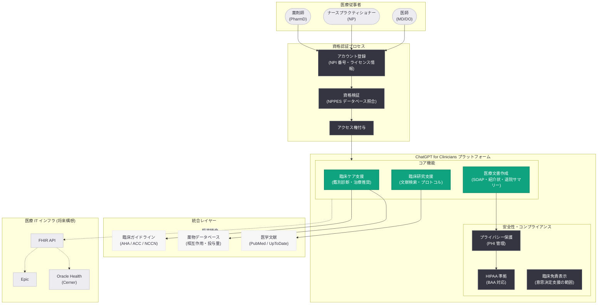
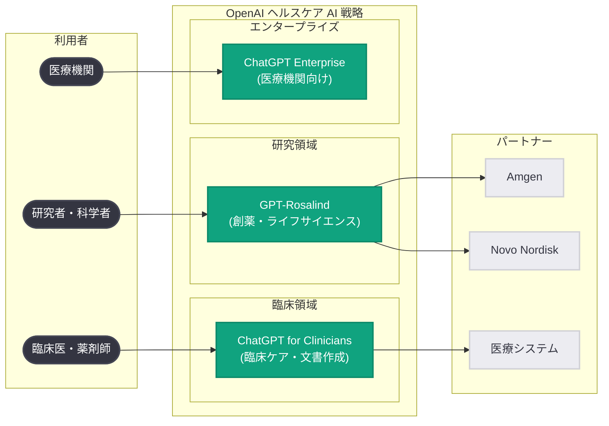

# ChatGPT for Clinicians を米国の医療従事者に無料提供: 臨床ケア、文書作成、研究を AI で支援

## メタデータ

| 項目 | 内容 |
|------|------|
| 発表日 | 2026-04-22 |
| ソース | OpenAI News |
| カテゴリ | Product / ヘルスケア |
| 公式リンク | [Making ChatGPT better for clinicians](https://openai.com/index/making-chatgpt-better-for-clinicians) |

> **注記:** 本レポートは OpenAI の公式発表に基づいて作成されている。公式ページへの直接アクセスが制限されていたため、公式の説明文および関連する公開情報をもとに内容を構成している。正確な詳細については [公式ページ](https://openai.com/index/making-chatgpt-better-for-clinicians) を参照されたい。

## 概要

OpenAI は 2026 年 4 月 22 日、医療従事者向けの専用プロダクト「ChatGPT for Clinicians」を、資格認証済みの米国の医師 (physicians)、ナースプラクティショナー (nurse practitioners)、薬剤師 (pharmacists) に対して無料で提供することを発表した。ChatGPT for Clinicians は、臨床ケアの支援、医療文書の作成、臨床研究の促進を目的として設計された ChatGPT の特化バージョンであり、医療現場固有のニーズに最適化されたインターフェースと機能を備えている。

本発表は、OpenAI が特定の専門職向けに ChatGPT を無料で提供するという画期的な取り組みであり、ヘルスケア分野における AI 活用の普及を加速するための戦略的な一歩である。2026 年 4 月 16 日に発表されたライフサイエンス特化型モデル GPT-Rosalind が創薬・研究領域をターゲットとしていたのに対し、ChatGPT for Clinicians は日常の臨床業務を担う医療従事者を直接的な対象としている。これにより、OpenAI のヘルスケア AI 戦略は研究 (GPT-Rosalind) と臨床現場 (ChatGPT for Clinicians) の両面をカバーする包括的なものとなった。

米国では医療従事者の燃え尽き症候群 (バーンアウト) が深刻な社会問題となっており、事務作業や文書作成に費やされる膨大な時間がその主要因の一つとされている。ChatGPT for Clinicians は、こうした負担を軽減し、医療従事者が患者ケアにより多くの時間を割けるようにすることを目指している。

## 主な内容

### ChatGPT for Clinicians の概要

ChatGPT for Clinicians は、標準的な ChatGPT とは異なり、臨床業務に特化した機能とインターフェースを備えた専用プロダクトである。主な特徴は以下の通りである。

| 機能領域 | 内容 |
|---------|------|
| 臨床ケア支援 | エビデンスに基づいた臨床判断の支援、鑑別診断の検討、治療ガイドラインの参照 |
| 医療文書作成 | 診療録、紹介状、退院サマリーなどの臨床文書のドラフト作成支援 |
| 臨床研究支援 | 最新の医学文献の検索・要約、臨床試験情報の整理、研究プロトコルの検討 |
| 医学知識参照 | 薬物相互作用、ガイドライン、エビデンスベースの治療推奨へのアクセス |

### 対象となる医療従事者

ChatGPT for Clinicians の無料提供は、以下の資格を持つ米国の医療従事者を対象としている。

- **医師 (Physicians):** MD (Doctor of Medicine) または DO (Doctor of Osteopathic Medicine) の資格を持つ医師
- **ナースプラクティショナー (Nurse Practitioners):** 高度実践看護師として認定されたナースプラクティショナー
- **薬剤師 (Pharmacists):** PharmD (Doctor of Pharmacy) の資格を持つ薬剤師

これらの医療従事者は、OpenAI が提供する資格認証プロセスを経てアクセス権を取得する。対象を米国の医療従事者に限定しているのは、米国の医療資格認証システムとの連携が先行して整備されたためと考えられ、今後の国際展開も視野に入れている可能性がある。

### 資格認証プロセス

ChatGPT for Clinicians へのアクセスには、医療従事者としての資格認証が必要である。認証プロセスの想定される流れは以下の通りである。

1. **アカウント登録:** OpenAI のプラットフォーム上で医療従事者アカウントの申請を行う
2. **資格情報の提出:** NPI (National Provider Identifier) 番号、医療ライセンス番号、所属医療機関などの情報を提出する
3. **資格の検証:** OpenAI または提携する認証サービスが、提出された資格情報を米国の医療資格データベース (NPPES など) と照合して検証する
4. **アクセス権の付与:** 認証が完了すると、ChatGPT for Clinicians の全機能にアクセスできるようになる

NPI 番号は米国の医療従事者に一意に割り当てられる 10 桁の識別番号であり、CMS (Centers for Medicare & Medicaid Services) が管理する NPPES (National Plan and Provider Enumeration System) データベースで検証可能である。このような既存の認証インフラを活用することで、効率的かつ信頼性の高い資格認証が実現できる。

### 臨床ケア支援の具体的な活用場面

ChatGPT for Clinicians は、日常の臨床業務において以下のような場面で活用が想定される。

**鑑別診断の検討:**
患者の症状、検査結果、病歴に基づいて鑑別診断のリストを生成し、各診断の可能性と推奨される追加検査を提示する。臨床医の意思決定を補助するツールとして機能し、最終的な診断は医師が行う。

**治療ガイドラインの参照:**
最新の臨床ガイドライン (AHA、ACC、NCCN など) に基づいた治療推奨を迅速に参照できる。特に複雑な合併症を持つ患者に対して、複数のガイドラインを横断的に検討する際に有用である。

**薬物相互作用の確認:**
多剤併用療法における薬物相互作用のリスクを評価し、代替薬の提案や投与量調整の検討を支援する。薬剤師にとっては、処方監査の効率化につながる。

**患者教育資料の作成:**
疾患の説明、治療計画、服薬指導などの患者向け説明資料を、患者の理解レベルに合わせて作成する。

### 医療文書作成の効率化

医療従事者のバーンアウトの主要因の一つである文書作成の負担を軽減するため、ChatGPT for Clinicians は以下の文書作成支援機能を提供する。

- **SOAP ノートの作成:** 診察内容に基づいて Subjective (主観)、Objective (客観)、Assessment (評価)、Plan (計画) 形式の診療録ドラフトを生成
- **紹介状・返書の作成:** 他科への紹介状や返書のテンプレートに基づいた文書作成
- **退院サマリーの作成:** 入院経過、治療内容、退院後の指示を含む退院サマリーのドラフト生成
- **事前承認申請書:** 保険会社への事前承認 (Prior Authorization) 申請に必要な臨床根拠の文書化支援
- **臨床研究関連文書:** IRB (Institutional Review Board) 申請書、研究プロトコルのドラフト作成

### 標準的な ChatGPT との違い

ChatGPT for Clinicians は、標準的な ChatGPT と比較して以下の点で差別化されている。

| 項目 | 標準的な ChatGPT | ChatGPT for Clinicians |
|------|----------------|----------------------|
| 医学知識の深さ | 一般的な医学知識 | 臨床実践に最適化された深い医学知識 |
| 臨床推論 | 基本的な推論 | エビデンスベースの構造化された臨床推論 |
| 文書テンプレート | 汎用テンプレート | 医療文書 (SOAP ノート、紹介状等) に特化したテンプレート |
| ガイドライン統合 | 限定的 | 最新の臨床ガイドラインとの統合 |
| 注意喚起・免責 | 一般的な免責表示 | 臨床意思決定における明確な免責と制限の表示 |
| 価格 | サブスクリプション制 | 認証済み医療従事者に無料 |

## 技術的な詳細

### プライバシーと HIPAA コンプライアンス

医療分野における AI ツールの導入にあたり、最も重要な課題の一つがプライバシー保護と HIPAA (Health Insurance Portability and Accountability Act) への準拠である。ChatGPT for Clinicians が医療現場で広く採用されるためには、以下のようなコンプライアンス要件への対応が不可欠である。

**データ保護の原則:**
- **PHI (Protected Health Information) の取り扱い:** 患者の保護対象医療情報が AI モデルの学習データに使用されないことの保証
- **データの暗号化:** 転送時 (in transit) および保管時 (at rest) のデータ暗号化
- **アクセス制御:** 認証済み医療従事者のみがアクセスできる厳格なアクセス管理
- **監査ログ:** 全ての操作の監査証跡を維持し、コンプライアンス監査に対応

**BAA (Business Associate Agreement):**
HIPAA の規定に基づき、OpenAI が医療機関との間で BAA を締結することが、臨床業務での本格利用の前提条件となる。BAA は、OpenAI が HIPAA の Privacy Rule および Security Rule に基づいて PHI を保護する義務を規定する契約である。

**重要な注意事項:**
ChatGPT for Clinicians の利用にあたっては、医療従事者が患者の特定可能な情報を入力する際の運用ガイドラインが設定されている可能性が高い。De-identification (個人識別情報の除去) を行った上で臨床シナリオを入力することが推奨される運用モデルが想定される。

### 既存の医療ワークフローとの統合

ChatGPT for Clinicians が医療現場で実効性を発揮するためには、既存の医療 IT インフラとの統合が重要な要素となる。

**EHR (電子健康記録) との連携:**
Epic、Cerner (Oracle Health)、MEDITECH などの主要 EHR システムとの統合が今後の展開として期待される。API を介した EHR 連携により、以下のワークフローが実現される可能性がある。

- 患者データの自動取得と文脈の把握
- 診療録の EHR への直接入力
- オーダーエントリーの支援
- アラートと臨床意思決定支援 (CDS) の連携

**FHIR (Fast Healthcare Interoperability Resources) 標準:**
医療データの相互運用性を確保するため、HL7 FHIR 標準に基づいたデータ交換が想定される。FHIR API を活用することで、異なる EHR システム間でも一貫したデータアクセスが可能となる。

## アーキテクチャ

### ChatGPT for Clinicians の認証とアクセスフロー

### OpenAI ヘルスケア AI 戦略の全体像

## 開発者への影響

### ヘルスケア AI アプリケーション開発の機会拡大

ChatGPT for Clinicians の無料提供は、ヘルスケア AI エコシステム全体に波及効果をもたらす。開発者にとっての主な影響と機会は以下の通りである。

- **API を活用した医療アプリケーション開発:** ChatGPT for Clinicians の成功は、OpenAI API を活用した医療分野向けアプリケーションの開発需要を拡大させる可能性がある。EHR 連携、遠隔医療支援、臨床意思決定支援システム (CDSS) などの領域で新たな開発機会が生まれる
- **FHIR 標準対応の開発スキルの重要性:** 医療データの相互運用性を確保するために、HL7 FHIR 標準に基づいた API 開発のスキルがこれまで以上に重要となる。OpenAI API と FHIR API を組み合わせたソリューション開発が今後の有望な領域である
- **HIPAA コンプライアンス対応:** 医療分野でのアプリケーション開発では、HIPAA への準拠が必須要件となる。PHI の取り扱い、暗号化、アクセス制御、監査ログなどのセキュリティ要件を満たすアーキテクチャ設計が求められる
- **認証・検証システムの構築:** NPI 番号を活用した医療従事者の資格認証システムは、医療分野のアプリケーションにおける共通課題であり、このパターンを参考にした認証フローの設計が他のプロダクトでも応用できる

### 医療 AI 市場への影響

- **無料提供モデルの影響:** 認証済みの医療従事者に対する無料提供は、競合する医療 AI ツール (UpToDate、DynaMed、Epocrates など) のビジネスモデルに対して大きな競争圧力となる
- **医療機関の AI 導入加速:** 個々の医療従事者が無料でアクセスできることで、ボトムアップでの AI 導入が促進され、結果として医療機関全体での ChatGPT Enterprise 導入につながる可能性がある
- **規制環境の変化:** 医療従事者への AI ツールの大規模な提供は、FDA (Food and Drug Administration) をはじめとする規制当局の対応を加速させる可能性がある。AI/ML ベースの SaMD (Software as a Medical Device) に関する規制フレームワークの整備が求められる

### 注意すべきリスクと課題

- **AI の臨床判断への依存リスク:** ChatGPT for Clinicians はあくまで臨床意思決定の「支援」ツールであり、最終的な判断は医療従事者が行う必要がある。AI への過度な依存を防ぐための適切なガードレールと教育が重要である
- **医療過誤への責任の所在:** AI が支援した臨床判断が誤った結果をもたらした場合の法的責任の所在は、未解決の課題として残る
- **情報の正確性と最新性:** 医学知識は日々更新されるため、モデルの知識が最新の臨床ガイドラインやエビデンスを反映していることを継続的に保証する仕組みが必要である

## 関連リンク

- [Making ChatGPT better for clinicians - OpenAI 公式](https://openai.com/index/making-chatgpt-better-for-clinicians)
- [OpenAI News](https://openai.com/news/)
- [GPT-Rosalind の発表 (関連レポート)](./2026-04-16-introducing-gpt-rosalind.md)
- [Novo Nordisk と OpenAI の提携 (関連レポート)](./2026-04-19-novo-nordisk-openai-gpt-rosalind.md)
- [エンタープライズ AI の次なるフェーズ (関連レポート)](./2026-04-08-next-phase-of-enterprise-ai.md)
- [GPT-5 による科学研究の加速 (関連レポート)](./2026-03-18-accelerating-science-gpt-5.md)
- [OpenAI Academy の発表 (関連レポート)](./2026-04-10-openai-academy-launch.md)
- [OpenAI API ドキュメント](https://platform.openai.com/docs)
- [HHS - HIPAA for Professionals](https://www.hhs.gov/hipaa/for-professionals/index.html)
- [NPI Registry - NPPES](https://npiregistry.cms.hhs.gov/)

## まとめ

OpenAI が ChatGPT for Clinicians を米国の認証済み医療従事者 (医師、ナースプラクティショナー、薬剤師) に無料で提供するという決定は、ヘルスケア AI の普及に向けた大きな転換点となる。臨床ケアの支援、医療文書作成の効率化、臨床研究の促進という 3 つの柱を通じて、医療従事者の日常業務を直接的に改善することを目指すこのプロダクトは、2026 年 4 月 16 日に発表された GPT-Rosalind (創薬・ライフサイエンス研究向け) と合わせて、OpenAI のヘルスケア AI 戦略の両輪を形成している。

本プロダクトの最大の意義は、医療従事者のバーンアウトという深刻な社会課題に AI を通じてアプローチする点にある。無料提供という価格戦略は、個々の医療従事者レベルでの AI 活用を促進し、ボトムアップでの医療機関全体への AI 導入を加速させる効果が期待される。一方で、HIPAA コンプライアンス、AI の臨床判断への依存リスク、医療過誤時の法的責任など、解決すべき課題も多い。OpenAI がこれらの課題にどのように対処し、医療現場からの信頼を獲得していくかが、ChatGPT for Clinicians の長期的な成功を左右する鍵となるだろう。
