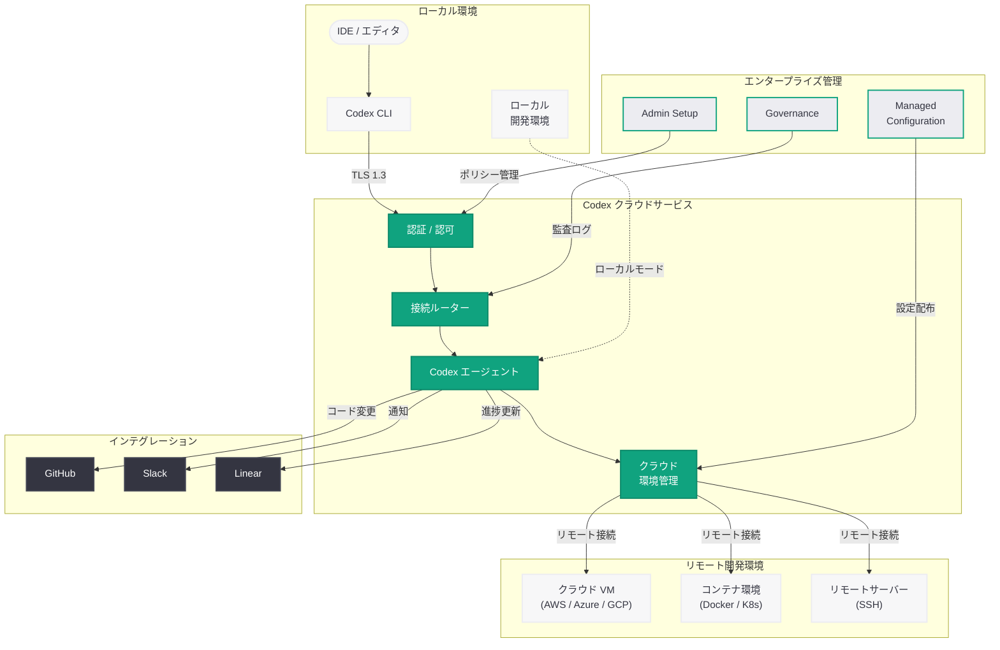
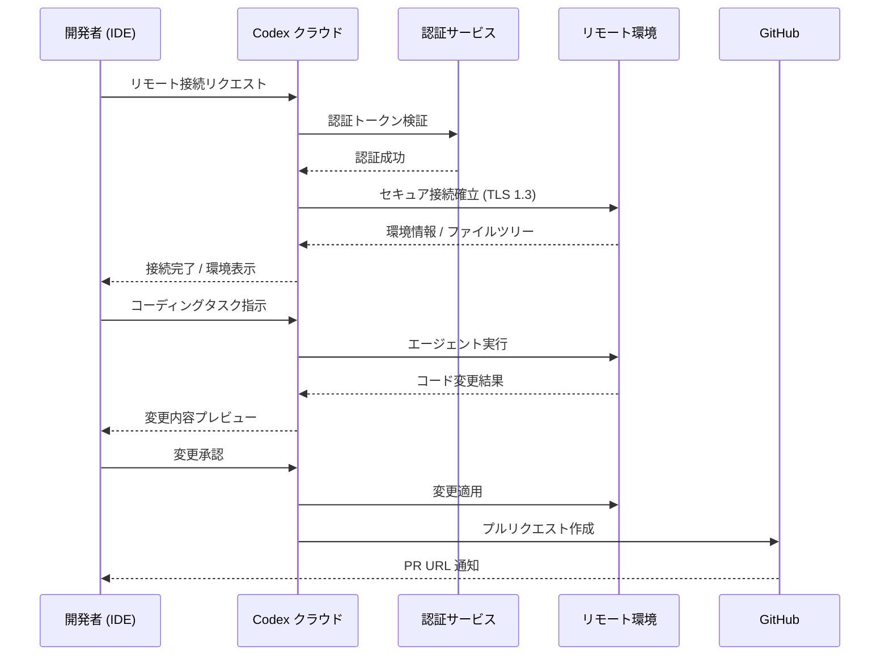

# Codex Remote Connections: クラウド環境からのリモート接続機能を提供開始

## メタデータ

| 項目 | 内容 |
|------|------|
| 発表日 | 2026-04-22 |
| ソース | OpenAI Developers |
| カテゴリ | 開発者ツール / Codex / インフラ |
| 公式リンク | [developers.openai.com/codex/cloud/environments/](https://developers.openai.com/codex/cloud/environments/) |

> **注記:** 本レポートは OpenAI Developers の公式ドキュメントに基づいて作成されている。

## 概要

OpenAI は 2026 年 4 月 22 日、Codex のクラウド環境においてリモート接続機能 (Remote Connections) の提供を開始した。本機能は、Codex エージェントがローカルリポジトリだけでなく、クラウド上にホストされたリモート開発環境に直接接続してコーディング作業を実行できるようにするものである。これにより、開発者はリモートサーバー、クラウド VM、コンテナ化された開発環境上のコードベースに対して Codex の AI コーディング支援をシームレスに適用できるようになる。

本機能は、同週に発表された「Scaling Codex to enterprises worldwide」(エンタープライズ向け Codex 展開の加速) と連動する形で提供されており、エンタープライズ環境で一般的なリモート開発インフラとの親和性を高める戦略的な機能追加である。開発者向けドキュメントサイト (developers.openai.com) の Codex クラウドセクション配下に位置付けられ、Cloud Environments、Internet Access、Integrations (GitHub、Slack、Linear) といった既存のクラウド機能群と統合される形で提供されている。

## 主な内容

### リモート接続の概要

Codex Remote Connections は、Codex エージェントがリモート環境上のコードベースに対して直接アクセスし、コード生成、リファクタリング、バグ修正、テスト作成などのタスクを実行できる機能である。従来、Codex のクラウド機能はローカル環境とクラウド環境の 2 つの動作モードを提供していたが、Remote Connections の追加により、第 3 のモードとして外部のリモート開発環境への接続が可能となった。

主な特徴は以下の通りである。

- **リモート環境への直接接続:** SSH やセキュアなトンネリングプロトコルを介して、クラウド VM、コンテナ、リモートサーバーに接続
- **既存インフラとの統合:** 企業が運用する既存の開発インフラ (AWS、Azure、GCP 上の開発環境など) をそのまま活用可能
- **セキュアな通信:** エンタープライズグレードの暗号化通信を通じたリモートアクセス
- **永続的なセッション管理:** リモート環境との接続セッションを維持し、長時間のタスク実行に対応

### クラウド環境との統合

Remote Connections は、Codex の既存クラウドアーキテクチャと密接に統合されている。開発者向けドキュメントのナビゲーション構造から、以下の階層関係が確認できる。

| カテゴリ | パス | 概要 |
|---------|------|------|
| Cloud Environments | codex/cloud/environments/ | クラウド環境の基本設定と管理 |
| Remote Connections | codex/cloud/remote-connections/ | リモート環境への接続設定 |
| Internet Access | codex/cloud/internet-access/ | クラウド環境からのインターネットアクセス設定 |
| Local Environments | codex/app/local-environments/ | ローカル開発環境の設定 |

この構造は、Codex がローカル環境、クラウド環境、リモート環境の 3 つのレイヤーをカバーする包括的な開発プラットフォームへと進化していることを示している。Remote Connections はクラウド環境の拡張として位置付けられ、クラウド環境で利用可能なインターネットアクセス機能やインテグレーション機能と連携して動作する。

### エンタープライズ機能

Remote Connections はエンタープライズ向けの管理機能と統合されており、大規模な組織での安全な運用を支援する。

- **Admin Setup (管理者セットアップ):** 組織の管理者がリモート接続のポリシーを一元管理できる。接続先の許可リスト、認証方式、アクセス制御ルールを組織レベルで設定可能
- **Governance (ガバナンス):** リモート接続の利用状況を監視し、コンプライアンス要件に準拠した運用を確保する。接続ログの監査、データフローの追跡、ポリシー違反の検知などを提供
- **Managed Configuration (マネージド設定):** 接続設定をテンプレート化し、チームや部門単位で標準化された構成を配布できる。個々の開発者が独自に設定する必要がなく、一貫性のある環境を維持可能

これらのエンタープライズ機能は、前日に発表されたコンサルティングパートナーシップ (Accenture、PwC、Capgemini、Cognizant) を通じた大企業への Codex 導入を技術面から支える基盤となる。

### サポートされるインテグレーション

Remote Connections は以下の外部サービスとのインテグレーションに対応している。

- **GitHub:** リモート環境上のリポジトリと GitHub のプルリクエスト、イシュー、コードレビューを連携。Codex エージェントがリモート環境でコードを修正し、その変更を直接 GitHub にプッシュするワークフローが実現可能
- **Slack:** リモート接続の状態通知、タスク完了の報告、エラーアラートを Slack チャンネルに送信。チーム全体でリモート環境上の Codex の動作状況をリアルタイムに共有可能
- **Linear:** リモート環境で実行された Codex のタスクを Linear のイシューやプロジェクトと紐づけ。コーディングタスクの進捗をプロジェクト管理ツール上で一元的に追跡可能

## 技術的な詳細

### 接続アーキテクチャ

Remote Connections の技術的な仕組みは、以下の要素で構成される。

1. **接続レイヤー:** ローカルの IDE や Codex クライアントから Codex クラウドサービスへの接続を確立する。認証には OAuth 2.0 ベースのトークン認証が使用される
2. **ルーティングレイヤー:** Codex クラウドサービスがリクエストを適切なリモート環境にルーティングする。接続先の環境は設定により指定され、動的な負荷分散にも対応する
3. **実行レイヤー:** リモート環境上で Codex エージェントが実際のコーディングタスクを実行する。ファイルシステムへのアクセス、ビルドツールの実行、テストの実行などが可能
4. **同期レイヤー:** リモート環境での変更をリアルタイムにクライアント側に反映し、GitHub 等の外部サービスと同期する

### セキュリティモデル

エンタープライズ環境での利用を想定し、以下のセキュリティ機能が実装されている。

- **エンドツーエンド暗号化:** クライアントからリモート環境までの全通信経路を TLS 1.3 で暗号化
- **ゼロトラスト認証:** 接続ごとに認証を検証し、セッションの有効期限管理を実施
- **ネットワーク分離:** リモート環境ごとにネットワークを分離し、環境間の不正アクセスを防止
- **監査ログ:** 全ての接続・操作をログに記録し、事後の監査に対応

## アーキテクチャ

### 接続フロー

## 開発者への影響

- **リモート開発ワークフローの統一:** これまで Codex の AI コーディング支援をリモート環境で利用するには、コードをローカルに同期する手間が必要であったが、Remote Connections によりリモート環境上で直接 Codex を活用できるようになる。特に大規模なモノレポやビルド環境がリモートに依存するプロジェクトで大きなメリットがある
- **エンタープライズ導入の障壁低下:** セキュリティ要件の厳しいエンタープライズ環境では、コードをローカルにダウンロードすることが制限されるケースが多い。Remote Connections により、コードをリモート環境に保持したまま Codex を利用できるため、セキュリティポリシーに準拠した形での導入が容易になる
- **クラウド開発環境との親和性:** GitHub Codespaces、AWS Cloud9、Google Cloud Shell などのクラウド IDE を日常的に利用している開発者にとって、Codex のリモート接続は自然なワークフロー拡張となる
- **CI/CD パイプラインとの連携強化:** リモート環境上で Codex がコード変更を行い、そのまま CI/CD パイプラインを実行してテスト結果を確認するといったエンドツーエンドの自動化が可能になる
- **チーム開発の効率化:** Slack と Linear のインテグレーションにより、リモート環境上での Codex の作業状況をチーム全体で共有でき、非同期の協働開発が促進される

## 関連リンク

- [Codex Cloud Environments (公式)](https://developers.openai.com/codex/cloud/environments/)
- [関連レポート: OpenAI、グローバルコンサルティング企業と連携し Codex のエンタープライズ展開を加速](2026-04-21-scaling-codex-enterprises.md)
- [関連レポート: Codex Chronicle によるスクリーンメモリ機能](2026-04-20-codex-chronicle-screen-memory.md)
- [関連レポート: Codex が「ほぼ万能」のスーパーアプリに進化](2026-04-16-codex-for-almost-everything.md)
- [関連レポート: Codex がチーム向けに柔軟な従量課金制を導入](2026-04-02-codex-flexible-pricing-for-teams.md)
- [関連レポート: Codex Hooks](2026-03-31-codex-hooks.md)
- [関連レポート: Codex Subagents とカスタムエージェント](2026-03-16-codex-subagents-custom-agents.md)
- [OpenAI Developers](https://developers.openai.com/)
- [OpenAI News](https://openai.com/news)

## まとめ

OpenAI は Codex のクラウド機能にリモート接続 (Remote Connections) を追加し、開発者がリモート環境上のコードベースに対して Codex の AI コーディング支援を直接適用できるようにした。本機能は、ローカル環境とクラウド環境に続く第 3 の接続モードとして位置付けられ、AWS、Azure、GCP 上の VM やコンテナ環境、SSH 接続可能なリモートサーバーへのセキュアな接続を提供する。

エンタープライズ向けには Admin Setup、Governance、Managed Configuration といった管理機能が統合されており、組織全体でのリモート接続ポリシーの一元管理が可能である。GitHub、Slack、Linear とのインテグレーションにより、リモート環境上での Codex の作業をチーム開発のワークフローにシームレスに組み込むことができる。本発表は、前日のコンサルティングパートナーシップによるエンタープライズ展開の加速と連動しており、大企業のリモート開発インフラに対応する技術基盤としての役割を担う。Codex がローカル、クラウド、リモートの全環境をカバーする統合型 AI コーディングプラットフォームへと進化する重要な一歩である。
