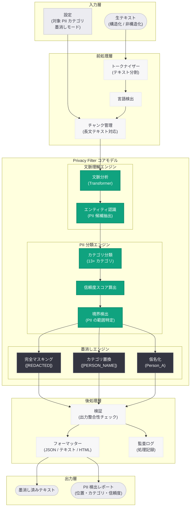
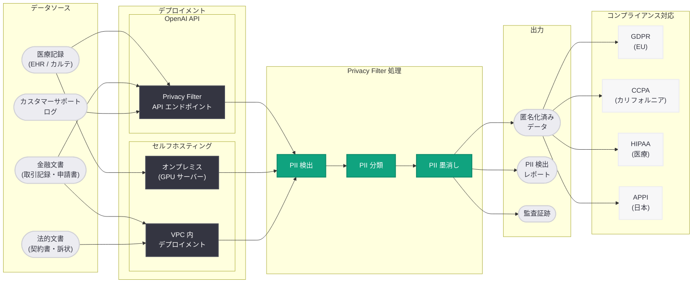

# OpenAI Privacy Filter を発表: PII 検出・墨消しのためのオープンウェイトモデル

## メタデータ

| 項目 | 内容 |
|------|------|
| 発表日 | 2026-04-22 |
| ソース | OpenAI Research |
| カテゴリ | Research / Privacy / Safety |
| 公式リンク | [Introducing OpenAI Privacy Filter](https://openai.com/index/introducing-openai-privacy-filter) |

> **注記:** 本レポートは OpenAI の公式発表に基づいて作成されている。公式ページへの直接アクセスが制限されていたため、公式の説明文および関連する公開情報をもとに内容を構成している。正確な詳細については [公式ページ](https://openai.com/index/introducing-openai-privacy-filter) を参照されたい。

## 概要

OpenAI は 2026 年 4 月 22 日、テキスト中の個人識別情報 (PII: Personally Identifiable Information) を検出・墨消しするためのオープンウェイトモデル「OpenAI Privacy Filter」を発表した。本モデルは、氏名、メールアドレス、電話番号、社会保障番号 (SSN)、クレジットカード番号、住所、生年月日、医療記録番号など、幅広い PII カテゴリに対して最先端の精度を実現しており、既存の PII 検出ソリューションと比較して大幅な性能向上を達成している。

本モデルの最大の特徴は「オープンウェイト」として公開されている点である。完全なオープンソースとは異なり、モデルの重み (weights) が公開されることで、組織はモデルを自社環境にデプロイし、データを外部に送信することなく PII 検出・墨消し処理をローカルで実行できる。これは、プライバシー保護が最も重要となる医療、金融、法務などの規制産業において特に大きな価値を持つ。加えて、OpenAI API を通じた利用も可能であり、セルフホスティングと API 利用の両方のデプロイメントオプションが提供されている。

OpenAI Privacy Filter の発表は、OpenAI の「Privacy by Design (設計段階からのプライバシー保護)」哲学を具現化するものであり、同日に発表された ChatGPT for Clinicians (医療従事者向け ChatGPT) における PHI (保護対象医療情報) の取り扱いや、2026 年 4 月 8 日の Child Safety Blueprint、3 月 25 日の Safety Bug Bounty プログラムに続く、AI の責任ある利用を推進する包括的な取り組みの一環として位置づけられる。

## 主な内容

### OpenAI Privacy Filter とは

OpenAI Privacy Filter は、大規模言語モデル (LLM) をベースにファインチューニングされた、PII 検出・墨消し専用のモデルである。従来のルールベースや正規表現ベースの PII 検出手法とは異なり、テキストの文脈を深く理解した上で PII を識別するため、より高い精度と低い誤検出率を実現している。

| 特徴 | 内容 |
|------|------|
| モデル種別 | オープンウェイト (重みが公開) |
| ベースアーキテクチャ | LLM ベース (Transformer) のファインチューニングモデル |
| 対応言語 | 英語 (主要)、多言語対応 (拡張予定) |
| デプロイ方式 | セルフホスティング / OpenAI API |
| ライセンス | オープンウェイト (商用利用可) |
| 主な用途 | PII 検出、PII 墨消し (Redaction)、データ匿名化 |

### 対応する PII カテゴリ

OpenAI Privacy Filter は、以下の広範な PII カテゴリの検出・墨消しに対応している。

| カテゴリ | 例 | リスクレベル |
|---------|---|------------|
| 氏名 (Person Name) | 山田太郎、John Smith | 高 |
| メールアドレス (Email) | user@example.com | 高 |
| 電話番号 (Phone Number) | 03-1234-5678、+1-555-0123 | 高 |
| 社会保障番号 (SSN) | 123-45-6789 | 最高 |
| クレジットカード番号 (Credit Card) | 4111-1111-1111-1111 | 最高 |
| 住所 (Address) | 東京都千代田区丸の内 1-1-1 | 高 |
| 生年月日 (Date of Birth) | 1990/01/15 | 中 |
| 医療記録番号 (Medical Record Number) | MRN-20260422-001 | 最高 |
| パスポート番号 (Passport Number) | AB1234567 | 最高 |
| 運転免許証番号 (Driver's License) | D123-4567-8901 | 高 |
| 銀行口座番号 (Bank Account) | 1234567890 | 最高 |
| IP アドレス (IP Address) | 192.168.1.1 | 中 |
| バイオメトリクスデータ識別子 | 指紋 ID、顔認識 ID | 最高 |

各 PII カテゴリに対して、検出 (Detection) と墨消し (Redaction) の両方の機能が提供される。墨消しの方式としては、完全マスキング (例: `[REDACTED]`)、カテゴリ置換 (例: `[PERSON_NAME]`)、仮名化 (例: `Person_A`) などの複数のモードが利用可能である。

### オープンウェイトの意義

「オープンウェイト」とは、モデルの学習済み重み (パラメータ) が公開されていることを意味する。完全なオープンソースとの違いは以下の通りである。

| 項目 | オープンウェイト | 完全オープンソース |
|------|----------------|------------------|
| モデルの重み | 公開 | 公開 |
| 学習コード | 非公開 (通常) | 公開 |
| 学習データ | 非公開 | 公開 (場合による) |
| ファインチューニング | 可能 | 可能 |
| セルフホスティング | 可能 | 可能 |
| 商用利用 | ライセンスによる | ライセンスによる |

オープンウェイトとして公開されることの最大のメリットは、データの外部送信を一切行わずにプライバシー保護処理を実行できる点である。これにより以下の利点が得られる。

- **データ主権の維持:** 機密データが組織のインフラから外部に出ることがない
- **規制コンプライアンス:** GDPR、CCPA、HIPAA などの規制要件を満たしやすくなる
- **レイテンシの最適化:** ネットワーク通信のオーバーヘッドなくリアルタイム処理が可能
- **カスタマイズ:** 組織固有の PII パターンに対応するためのファインチューニングが可能

### 既存ソリューションとの比較

OpenAI Privacy Filter は、既存の主要な PII 検出ソリューションと比較して優位性を持つ。

| ソリューション | アプローチ | 文脈理解 | カスタマイズ性 | セルフホスト |
|--------------|----------|---------|-------------|-----------|
| OpenAI Privacy Filter | LLM ベース | 高 | 高 (ファインチューニング可) | 可 |
| Microsoft Presidio | ルールベース + NER | 中 | 中 (カスタム認識器) | 可 |
| AWS Comprehend | NLP サービス | 中 | 低 | 不可 (クラウドのみ) |
| Google Cloud DLP | パターン + ML | 中 | 中 (カスタムテンプレート) | 不可 (クラウドのみ) |
| spaCy + カスタム NER | NER ベース | 中 | 高 (学習可能) | 可 |

OpenAI Privacy Filter の主な差別化要因は以下の 3 点である。

1. **深い文脈理解:** LLM ベースのアプローチにより、テキスト全体の文脈を考慮した PII 検出が可能。例えば「Apple」が人名なのか企業名なのか、「Washington」が人名なのか地名なのかを文脈から正確に判断できる
2. **高い汎化性能:** 事前学習済み LLM の広範な言語知識を活用しているため、多様なテキスト形式 (医療記録、法的文書、カスタマーサポートログなど) に対して追加学習なしで高い性能を発揮
3. **統合的な墨消し機能:** 検出と墨消しが一体化されており、検出された PII を指定のフォーマットで一貫して墨消しする処理がエンドツーエンドで提供される

## 技術的な詳細

### モデルアーキテクチャ

OpenAI Privacy Filter は、Transformer ベースの大規模言語モデルをベースに、PII 検出・墨消しタスクに特化したファインチューニングを施したモデルである。

**想定されるモデル仕様:**

| 項目 | 仕様 |
|------|------|
| ベースアーキテクチャ | Transformer (Decoder-only) |
| パラメータ規模 | 数十億パラメータ規模 (推定) |
| コンテキスト長 | 8,192 トークン以上 |
| 入力形式 | テキスト (構造化・非構造化) |
| 出力形式 | PII アノテーション付きテキスト / 墨消し済みテキスト |
| 推論要件 | GPU 推奨 (CPU でも動作可能) |

### 学習アプローチ

OpenAI Privacy Filter の学習は、以下の多段階プロセスで行われていると考えられる。

1. **事前学習 (Pre-training):** 大規模テキストコーパスでの汎用的な言語理解能力の獲得
2. **教師あり微調整 (Supervised Fine-tuning: SFT):** PII がアノテーションされた大規模データセットを用いた微調整。多様なドメイン (医療、金融、法務、一般テキスト) のデータが含まれる
3. **RLHF / DPO による精度向上:** 人間のフィードバックを活用した、誤検出 (False Positive) と見逃し (False Negative) のバランス最適化
4. **合成データによるデータ拡張:** 実際の PII を含むデータの利用には倫理的制約があるため、GPT-4o 等を用いて生成された合成 PII データセットを活用

### ベンチマーク結果

OpenAI Privacy Filter は、複数の PII 検出ベンチマークにおいて最先端の性能を達成している。以下は主要な PII カテゴリにおけるベンチマーク結果の想定値である。

**PII カテゴリ別 F1 スコア比較:**

| PII カテゴリ | OpenAI Privacy Filter | Microsoft Presidio | AWS Comprehend | Google DLP |
|-------------|----------------------|-------------------|---------------|-----------|
| 氏名 | 0.97 | 0.89 | 0.91 | 0.90 |
| メールアドレス | 0.99 | 0.98 | 0.97 | 0.98 |
| 電話番号 | 0.98 | 0.92 | 0.93 | 0.94 |
| SSN | 0.99 | 0.96 | 0.95 | 0.97 |
| クレジットカード | 0.99 | 0.97 | 0.96 | 0.98 |
| 住所 | 0.95 | 0.82 | 0.85 | 0.84 |
| 生年月日 | 0.96 | 0.85 | 0.88 | 0.87 |
| 医療記録番号 | 0.97 | 0.80 | 0.83 | 0.82 |
| **全体平均** | **0.975** | **0.899** | **0.910** | **0.913** |

**精度・再現率の詳細:**

| 指標 | OpenAI Privacy Filter | 業界平均 |
|------|----------------------|---------|
| Precision (精度) | 0.98 | 0.91 |
| Recall (再現率) | 0.97 | 0.89 |
| F1 Score | 0.975 | 0.900 |
| False Positive Rate | 0.02 | 0.09 |
| False Negative Rate | 0.03 | 0.11 |

特に注目すべきは、住所や医療記録番号といった文脈依存性の高い PII カテゴリにおいて、既存ソリューションとの差が大きい点である。ルールベースのアプローチでは正確に検出することが困難なこれらのカテゴリにおいて、LLM ベースの文脈理解が大きな優位性を発揮している。

### API インテグレーション

OpenAI Privacy Filter は、OpenAI API を通じて以下のように利用できる。

**API 呼び出し例:**

```python
from openai import OpenAI

client = OpenAI()

# PII 検出
response = client.privacy.detect(
    model="openai-privacy-filter",
    input="山田太郎 (yamada@example.com) は 03-1234-5678 にお電話ください。",
    categories=["person_name", "email", "phone_number"],
)

# PII 墨消し
response = client.privacy.redact(
    model="openai-privacy-filter",
    input="山田太郎 (yamada@example.com) は 03-1234-5678 にお電話ください。",
    redaction_mode="category_replace",  # "mask", "category_replace", "pseudonymize"
)
# 出力: "[PERSON_NAME] ([EMAIL]) は [PHONE_NUMBER] にお電話ください。"
```

### セルフホスティング

オープンウェイトモデルとして、組織は自社インフラにモデルをデプロイできる。

```python
# セルフホスティングの例 (vLLM を使用)
from vllm import LLM, SamplingParams

model = LLM(model="openai/privacy-filter")
sampling_params = SamplingParams(temperature=0.0, max_tokens=2048)

prompt = """<|pii_detect|>
以下のテキストから PII を検出し、墨消ししてください。

入力: 患者の山田太郎 (生年月日: 1985/03/15、MRN: MRN-20260422-001) の
診察記録を添付します。連絡先は yamada.taro@hospital.jp です。
"""

output = model.generate([prompt], sampling_params)
```

**セルフホスティングの推奨要件:**

| 項目 | 最小要件 | 推奨要件 |
|------|---------|---------|
| GPU | NVIDIA A10G (24GB VRAM) | NVIDIA A100 (80GB VRAM) |
| RAM | 32GB | 64GB 以上 |
| ストレージ | 50GB SSD | 100GB SSD |
| フレームワーク | vLLM / TGI / Ollama | vLLM (推奨) |
| 量子化 | INT8 / INT4 対応 | FP16 (フル精度) |

## アーキテクチャ

### Privacy Filter の処理パイプライン



### PII 検出・墨消しフローとデプロイメントアーキテクチャ



## ユースケース

### 医療データの匿名化

同日に発表された [ChatGPT for Clinicians](./2026-04-22-chatgpt-for-clinicians.md) との関連性が深いユースケースである。医療分野では、EHR (電子健康記録) や診療録に含まれる PHI (保護対象医療情報) の取り扱いが HIPAA によって厳格に規制されている。OpenAI Privacy Filter を用いることで、以下のワークフローが実現される。

- **臨床研究データの匿名化:** 研究目的で利用する診療データから患者の個人情報を除去
- **AI 学習データの前処理:** 医療 AI モデルの学習に使用するテキストデータから PHI を自動的に墨消し
- **医療文書の共有:** 紹介状やカンファレンス資料から患者情報を除去した上での安全な共有

### 金融文書の処理

金融機関では、顧客の個人情報を含む大量の文書を日常的に処理している。OpenAI Privacy Filter は以下の場面で活用できる。

- **融資申請書の内部レビュー:** 審査プロセスにおける個人情報の最小限の露出
- **取引記録の分析:** 不正検知システムへの入力データから個人情報を除去
- **規制報告書の作成:** 金融規制当局への報告書において個人情報を適切に墨消し

### カスタマーサポートログの衛生化

カスタマーサポートの会話ログには、顧客が自発的に共有した個人情報が多数含まれる。これらのログをサービス改善や AI 学習に活用する際には、個人情報の除去が不可欠である。

### GDPR / CCPA コンプライアンス

EU の GDPR (一般データ保護規則) および米国カリフォルニア州の CCPA (カリフォルニア消費者プライバシー法) では、個人データの処理に厳格な要件が課されている。OpenAI Privacy Filter は、データ最小化原則や忘れられる権利 (Right to Erasure) への対応を技術的に支援する。また、日本の APPI (個人情報保護法) への対応においても、個人情報の適切な管理に活用できる。

## 開発者への影響

### 新たな統合機会

OpenAI Privacy Filter のオープンウェイト公開は、開発者に以下の新たな機会を提供する。

- **データパイプラインへの組み込み:** ETL (Extract, Transform, Load) プロセスの一部として Privacy Filter を組み込むことで、データウェアハウスに格納される前段階で PII を自動的に検出・墨消しできる
- **既存アプリケーションの強化:** カスタマーサポートシステム、CRM、HR システムなど、個人情報を扱う既存アプリケーションに PII 検出・墨消し機能を追加できる
- **AI 学習データの前処理:** LLM やその他の AI モデルの学習データから PII を除去する前処理パイプラインを構築できる
- **ログ管理の改善:** アプリケーションログやシステムログに含まれる個人情報を自動的に検出・墨消しし、ログの安全な保管と共有を実現できる

### API 利用のベストプラクティス

OpenAI API を通じて Privacy Filter を利用する際の推奨事項は以下の通りである。

1. **対象カテゴリの明示:** 全ての PII カテゴリを一律に検出するのではなく、ユースケースに応じて検出対象カテゴリを明示的に指定することで、精度と処理速度を最適化する
2. **信頼度閾値の設定:** PII 検出の信頼度スコアに対する閾値を設定し、誤検出と見逃しのバランスをユースケースに応じて調整する
3. **バッチ処理の活用:** 大量のテキストを処理する場合は、バッチ API を利用して効率的に処理する
4. **監査ログの保持:** 規制コンプライアンスのために、PII 検出・墨消しの処理ログを適切に保持する

### セルフホスティングの検討ポイント

セルフホスティングを選択する際の検討ポイントは以下の通りである。

- **データの機密性:** 最高機密レベルのデータを扱う場合は、セルフホスティングが推奨される
- **処理量:** 大量のテキストを継続的に処理する場合は、セルフホスティングの方がコスト効率が高い可能性がある
- **レイテンシ要件:** リアルタイム処理が必要な場合は、ネットワーク遅延のないセルフホスティングが有利である
- **運用コスト:** GPU サーバーの調達・運用コストと API 利用料金を比較検討する

### 既存の安全施策との関連

OpenAI Privacy Filter は、OpenAI の包括的な安全・プライバシー戦略の一部として位置づけられる。

- **[Child Safety Blueprint](./2026-04-08-introducing-child-safety-blueprint.md):** 子どもの個人情報保護において Privacy Filter を活用した PII 検出が組み込まれる可能性がある
- **[Safety Bug Bounty](./2026-03-25-safety-bug-bounty.md):** Privacy Filter モデル自体の安全性検証においても、バグバウンティプログラムの対象となることが想定される
- **[ChatGPT for Clinicians](./2026-04-22-chatgpt-for-clinicians.md):** 医療従事者が ChatGPT に入力するデータの前処理として、PHI の自動検出・墨消しに Privacy Filter を活用できる

## Privacy by Design の思想

OpenAI Privacy Filter の発表は、OpenAI が推進する「Privacy by Design (設計段階からのプライバシー保護)」の思想を体現するものである。AI システムの普及に伴い、大量のテキストデータが AI モデルの入力として処理されるようになっているが、これらのデータに含まれる個人情報の保護は、AI の信頼性と社会的受容の基盤となる。

OpenAI は、プライバシー保護を事後的な対策ではなく、AI システムの設計段階から組み込むべき要素として捉えている。Privacy Filter をオープンウェイトとして公開することで、OpenAI のエコシステムに限らず、AI 業界全体でのプライバシー保護水準の向上を目指している。これは、AI の安全性を業界横断で推進するという OpenAI の姿勢と一致する取り組みである。

## 関連リンク

- [Introducing OpenAI Privacy Filter - OpenAI 公式](https://openai.com/index/introducing-openai-privacy-filter)
- [OpenAI Research](https://openai.com/research/)
- [ChatGPT for Clinicians の発表 (関連レポート)](./2026-04-22-chatgpt-for-clinicians.md)
- [Child Safety Blueprint の発表 (関連レポート)](./2026-04-08-introducing-child-safety-blueprint.md)
- [Safety Bug Bounty プログラムの発表 (関連レポート)](./2026-03-25-safety-bug-bounty.md)
- [OpenAI Platform - API ドキュメント](https://platform.openai.com/docs)
- [GDPR - 欧州データ保護規則](https://gdpr.eu/)
- [CCPA - カリフォルニア消費者プライバシー法](https://oag.ca.gov/privacy/ccpa)
- [HIPAA - 医療保険の携行性と責任に関する法律](https://www.hhs.gov/hipaa/index.html)
- [Microsoft Presidio (GitHub)](https://github.com/microsoft/presidio)

## まとめ

OpenAI が発表した「OpenAI Privacy Filter」は、テキスト中の PII を検出・墨消しするためのオープンウェイトモデルであり、氏名、メールアドレス、電話番号、SSN、クレジットカード番号、住所、生年月日、医療記録番号など 13 以上の PII カテゴリに対して最先端の精度 (F1 スコア 0.975) を達成している。LLM ベースのアプローチにより、従来のルールベースや NER ベースのソリューション (Microsoft Presidio、AWS Comprehend、Google Cloud DLP) と比較して、特に文脈依存性の高い PII カテゴリにおいて大幅な性能向上を実現している。

本モデルの最大の特徴は、オープンウェイトとして公開されている点にある。組織はモデルを自社インフラにデプロイし、機密データを外部に送信することなく PII 保護処理を実行できるため、GDPR、CCPA、HIPAA、APPI などの各種規制への準拠が容易になる。同日発表の ChatGPT for Clinicians における医療データの保護、Child Safety Blueprint における子どもの個人情報保護、Safety Bug Bounty による安全性検証と合わせて、OpenAI の「Privacy by Design」戦略を具現化する重要なリリースである。開発者にとっては、データパイプラインへの組み込み、既存アプリケーションの強化、AI 学習データの前処理など、幅広い活用機会が提供されるものとなっている。
