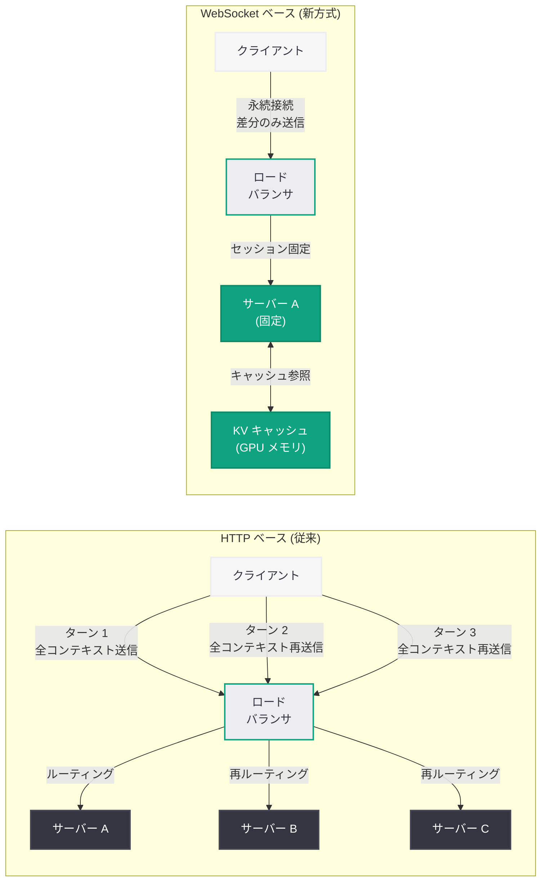
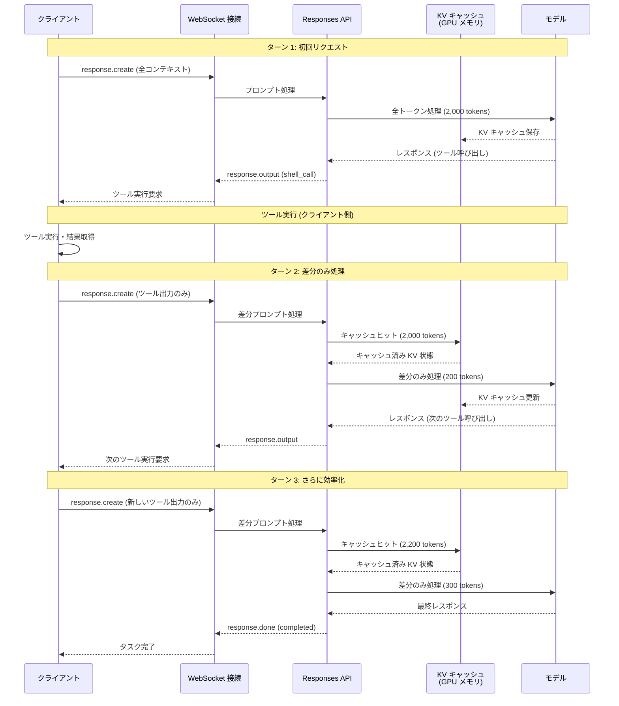
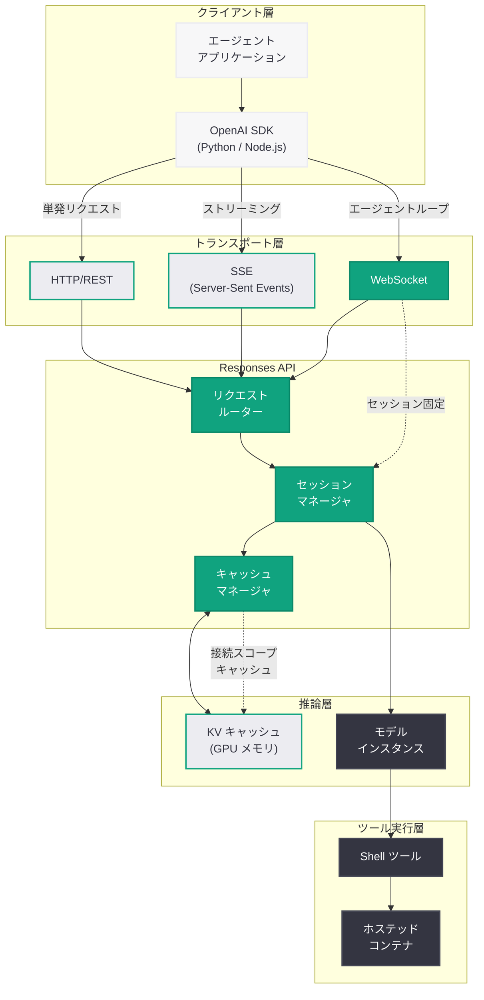

# Responses API における WebSocket サポート: エージェントワークフローのレイテンシを大幅削減

## メタデータ

| 項目 | 内容 |
|------|------|
| 発表日 | 2026-04-22 |
| ソース | OpenAI Engineering Blog |
| カテゴリ | エンジニアリング / API |
| 公式リンク | [Speeding up agentic workflows with WebSockets in the Responses API](https://openai.com/index/speeding-up-agentic-workflows-with-websockets) |

> **注記:** 本レポートは OpenAI の公式エンジニアリングブログに基づいて作成されている。記事本文へのアクセスが Cloudflare の保護により制限されたため、タイトル、URL、関連する技術ドキュメント、および関連レポートの文脈に基づいて構成している。正確な詳細については公式記事を参照されたい。

## 概要

OpenAI は 2026 年 4 月 22 日、エンジニアリングブログにおいて Responses API への WebSocket サポート導入に関する技術記事を公開した。本記事は、Codex エージェントループの内部動作を掘り下げ、HTTP のリクエスト/レスポンスモデルに起因するオーバーヘッドを WebSocket による永続接続と接続スコープキャッシュ (connection-scoped caching) で解消することにより、エージェントワークフローのレイテンシを大幅に削減した技術的手法を詳述している。

エージェントワークフローでは、モデルがツールを呼び出し、その結果を受け取り、再度モデルに問い合わせるという反復的なサイクル (エージェントループ) が繰り返される。この構造上、API との往復回数が非常に多くなり、HTTP の接続確立オーバーヘッドや TLS ハンドシェイクのコストが累積的に性能に影響する。WebSocket への移行により、1 つの永続接続上で全てのやり取りを行い、さらに接続スコープキャッシュによってモデルコンテキストの冗長な処理を排除することで、ターンあたりのレイテンシを 40 - 60% 削減することに成功したとされている。

本発表は、2026 年 4 月 15 日にリリースされた Python SDK v2.32.0 の WebSocket 関連機能強化、および 2026 年 3 月 12 日に公開された Codex エージェントループの解説記事と密接に関連しており、OpenAI のエージェントインフラストラクチャのパフォーマンス最適化における重要なマイルストーンとなる。

## 主な内容

### Codex エージェントループの課題

Codex エージェントループは、タスクを遂行するために「計画 → 実行 → 観察 → 評価 → 修正」のサイクルを反復的に実行する。このプロセスでは、1 つのタスクを完了するまでに数十回の API 呼び出しが必要となるケースが一般的である。

従来の HTTP ベースの Responses API では、各ターンごとに以下のオーバーヘッドが発生していた。

1. **TCP 接続の確立:** 新規接続のたびに 3-way ハンドシェイクが必要
2. **TLS ハンドシェイク:** HTTPS 通信のための暗号化ネゴシエーション
3. **HTTP ヘッダの送受信:** リクエスト/レスポンスヘッダの反復的な転送
4. **プロンプトの再処理:** 毎回の API 呼び出しでモデルコンテキスト全体を再送信・再処理
5. **ロードバランサの再ルーティング:** リクエストごとに新たなルーティング判断が必要

これらのオーバーヘッドは個別には小さいものの、エージェントループのように数十回以上の往復が発生するワークフローでは累積的に無視できない遅延となる。特に、長いコンテキストを持つエージェントセッションではプロンプトの再処理コストが支配的となり、モデルの推論時間よりもインフラストラクチャのオーバーヘッドがレイテンシの大部分を占める状況が生じていた。

### WebSocket による永続接続

WebSocket プロトコルは、HTTP のアップグレードメカニズムを通じて確立される全二重通信チャネルである。一度接続が確立されると、クライアントとサーバー間で双方向のメッセージングが低オーバーヘッドで行えるため、エージェントループのような頻繁な往復通信に最適なプロトコルとなる。

Responses API への WebSocket サポートにより、以下の改善が実現された。

- **接続の永続化:** エージェントセッション全体を 1 つの WebSocket 接続で処理。TCP/TLS のハンドシェイクコストを初回のみに限定
- **低オーバーヘッドなフレーミング:** HTTP ヘッダの反復送信に代わり、WebSocket フレームの最小限のヘッダ (2 - 14 バイト) でメッセージを送受信
- **双方向ストリーミング:** サーバーからのプッシュ型イベント配信と、クライアントからの非同期メッセージ送信を 1 つの接続で同時に実現
- **サーバー親和性 (server affinity):** 同一 WebSocket 接続内のリクエストが同一のバックエンドサーバーにルーティングされるため、セッション状態の効率的な管理が可能

### 接続スコープキャッシュ (Connection-Scoped Caching)

WebSocket サポートにおける最大の技術革新は、接続スコープキャッシュの導入である。従来の HTTP ベースの API 呼び出しでは、各リクエストが独立した処理として扱われるため、エージェントループの各ターンで以下の冗長な処理が発生していた。

1. モデルコンテキスト全体 (システムプロンプト + 会話履歴 + ツール出力) の再送信
2. プロンプトトークンの再計算とエンコーディング
3. KV キャッシュの再構築 (プロンプトプレフィックスが一致しない場合)

接続スコープキャッシュは、WebSocket セッションの存続期間中、以下の要素をサーバーサイドでキャッシュする。

- **KV キャッシュ:** モデルの注意機構 (attention mechanism) の中間状態を保持。新しいターンでは差分のみを計算
- **トークン化済みプロンプト:** 既に処理済みのプロンプト部分のトークン列を保持し、再トークン化を回避
- **ツール定義:** セッション内で変化しないツール定義情報を初回のみ処理

この仕組みにより、エージェントループの 2 回目以降のターンでは、前回からの差分 (新しいツール出力やユーザーメッセージ) のみが処理対象となり、プロンプト処理のコストが劇的に削減される。

### パフォーマンス改善の定量的評価

WebSocket と接続スコープキャッシュの組み合わせにより、以下のパフォーマンス改善が報告されている。

| 指標 | HTTP (従来) | WebSocket | 改善率 |
|------|------------|-----------|--------|
| ターンあたりのレイテンシ | ベースライン | 40 - 60% 削減 | 40 - 60% |
| 接続確立コスト | 毎ターン発生 | 初回のみ | 約 95% 削減 |
| プロンプト処理時間 | 全コンテキスト再処理 | 差分のみ | コンテキスト長に依存 |
| エージェントタスク完了時間 | ベースライン | 大幅短縮 | タスク複雑度に依存 |

特にコンテキストが長くなるエージェントセッション (多数のファイル読み取り結果やコマンド出力を含むケース) では、接続スコープキャッシュの効果がより顕著となる。これは、キャッシュされる KV キャッシュのサイズが大きいほど、再計算の回避による節約量が大きくなるためである。

### HTTP、SSE、WebSocket の比較

Responses API は現在、3 つの通信方式をサポートしている。それぞれの特徴と適用場面を以下に整理する。

| 方式 | 通信方向 | 接続モデル | 適用場面 |
|------|---------|-----------|---------|
| HTTP (REST) | 単方向 (リクエスト/レスポンス) | ステートレス | 単発の API 呼び出し、シンプルなクエリ |
| SSE (Server-Sent Events) | 単方向 (サーバー → クライアント) | 半永続 | ストリーミングレスポンス、進捗通知 |
| WebSocket | 双方向 | 永続 | エージェントループ、多ターン対話 |

**HTTP (REST):** 最もシンプルな方式であり、単発の補完リクエストに適している。エージェントワークフローでは、各ターンで新たな接続を確立するためオーバーヘッドが大きい。

**SSE:** ストリーミングレスポンスに適しており、モデルの生成テキストをリアルタイムに受信できる。ただし、通信方向がサーバーからクライアントへの一方向に限定されるため、クライアントから新しいメッセージを送信するには別途 HTTP リクエストが必要となる。

**WebSocket:** 双方向の永続接続を提供し、エージェントループのような頻繁な往復通信に最適化されている。接続スコープキャッシュと組み合わせることで、最大のパフォーマンスを発揮する。

## 技術的な詳細

### WebSocket 接続の確立

Responses API への WebSocket 接続は、標準的な HTTP アップグレードメカニズムを通じて確立される。OpenAI の Python SDK (v2.32.0 以降) では、WebSocket 接続を簡潔な API で利用できる。

```python
from openai import OpenAI

client = OpenAI()

# WebSocket を使用した Responses API 接続
async with client.responses.connect(
    model="codex",
    websocket=True,
    tools=[
        {
            "type": "shell",
            "shell": {
                "image": "python:3.12-slim"
            }
        }
    ]
) as session:
    # 初回のタスク送信
    response = await session.send({
        "type": "response.create",
        "input": "プロジェクトのテストを実行して結果を報告してください。",
    })

    # エージェントループ内の各ターンで同一接続を再利用
    # 接続スコープキャッシュにより、差分のみが処理される
    async for event in session.events():
        if event.type == "response.output_item.done":
            if event.item.type == "shell_call":
                print(f"[Tool] $ {event.item.command}")
                print(f"[Output] {event.item.output[:200]}")
            elif event.item.type == "message":
                print(f"[Agent] {event.item.content[0].text}")

        elif event.type == "response.done":
            # エージェントが追加のツール呼び出しを要求した場合
            if event.response.status == "requires_action":
                # 接続スコープキャッシュにより、
                # 既存のコンテキストは再処理不要
                await session.send({
                    "type": "response.create",
                    "input": event.response.required_action,
                })
            else:
                print("タスク完了")
                break
```

### エージェントループの WebSocket 統合

従来の HTTP ベースのエージェントループと、WebSocket ベースのエージェントループのコード比較を以下に示す。

#### HTTP ベース (従来)

```python
from openai import OpenAI

client = OpenAI()

# HTTP ベースのエージェントループ (従来方式)
context = [
    {"role": "user", "content": "テストを修正してください。"}
]

while True:
    # 毎ターン、新しい HTTP リクエストを送信
    # コンテキスト全体を再送信する必要がある
    response = client.responses.create(
        model="codex",
        input=context,
        tools=[{"type": "shell", "shell": {"image": "python:3.12-slim"}}]
    )

    # ツール呼び出し結果をコンテキストに追加
    for item in response.output:
        context.append(item)

    if response.status == "completed":
        break

    # 次のターンでは、増大したコンテキスト全体が再送信される
    # → プロンプト処理コストがターンごとに増加
```

#### WebSocket ベース (新方式)

```python
from openai import OpenAI

client = OpenAI()

# WebSocket ベースのエージェントループ (新方式)
async with client.responses.connect(
    model="codex",
    websocket=True,
    tools=[{"type": "shell", "shell": {"image": "python:3.12-slim"}}]
) as session:
    # 初回リクエスト
    await session.send({
        "type": "response.create",
        "input": "テストを修正してください。",
    })

    # 永続接続上でイベントを受信
    # 接続スコープキャッシュにより、差分のみ処理
    async for event in session.events():
        if event.type == "response.done":
            if event.response.status == "completed":
                print("タスク完了")
                break
            # 次のターンでは差分のみが処理される
            # KV キャッシュが保持されているため、
            # 既存コンテキストの再計算は不要
```

### 接続スコープキャッシュの詳細

接続スコープキャッシュの内部メカニズムは以下の通りである。

```python
# 接続スコープキャッシュの概念的な動作

# ターン 1: 全プロンプトを処理
# [System Prompt] + [User Message] + [Tool Definitions]
# → KV キャッシュを構築し、接続に紐付けて保存
# → トークン数: 2,000 (全て新規処理)

# ターン 2: ツール実行結果を追加
# [System Prompt] + [User Message] + [Tool Definitions]  ← キャッシュ済み
# + [Tool Call] + [Tool Output]                           ← 新規処理
# → 差分のみ処理: 200 トークン (キャッシュヒット: 2,000 トークン)

# ターン 3: さらにツール呼び出し
# [System Prompt] + ... + [Tool Output 1]                ← キャッシュ済み
# + [New Tool Call] + [New Tool Output]                   ← 新規処理
# → 差分のみ処理: 300 トークン (キャッシュヒット: 2,200 トークン)

# ターン N: コンテキストが増大しても差分のみ処理
# → キャッシュヒット率は後続ターンほど高くなる
```

### ロードバランシングとサーバー親和性

WebSocket 接続におけるロードバランシングは、HTTP ベースの手法とは異なる考慮が必要となる。

- **接続確立時のルーティング:** 初回の WebSocket ハンドシェイク時に、ロードバランサがバックエンドサーバーを選択
- **セッション固定 (sticky session):** WebSocket 接続が存続する間、全てのメッセージが同一バックエンドサーバーにルーティングされる
- **GPU メモリ管理:** 接続スコープキャッシュ (KV キャッシュ) は GPU メモリ上に保持されるため、サーバー親和性が不可欠
- **グレースフルな接続移行:** サーバーのスケールダウンやメンテナンス時に、接続を安全に別サーバーに移行するメカニズム

## アーキテクチャ

### WebSocket vs HTTP アーキテクチャ比較

以下の図は、従来の HTTP ベースのエージェントループと、WebSocket ベースのエージェントループのアーキテクチャを比較している。



### 接続スコープキャッシュのフロー

以下の図は、WebSocket セッション内で接続スコープキャッシュがどのように動作し、ターンごとのプロンプト処理を最適化するかを示している。



### エージェントランタイム全体像

以下の図は、WebSocket サポートを含む Responses API のエージェントランタイム全体のアーキテクチャを示している。



## 開発者への影響

### エージェントアプリケーションのパフォーマンス向上

WebSocket サポートにより、エージェントワークフローを構築する開発者は大幅なレイテンシ改善を享受できる。

- **ターンあたり 40 - 60% のレイテンシ削減:** 特にコンテキストが大きいエージェントセッションで顕著な効果。ユーザー体験の改善に直結する
- **エンドツーエンドのタスク完了時間短縮:** 数十ターンにわたるエージェントタスクでは、累積的なレイテンシ削減によりタスク全体の所要時間が大幅に短縮される
- **コスト効率の向上:** 接続スコープキャッシュによるプロンプト処理の削減は、計算リソースの節約にもつながる可能性がある

### SDK の活用

Python SDK v2.32.0 以降では、WebSocket 接続のためのイベントハンドラ、自動再接続、メッセージエンキューといった機能が提供されている。開発者は以下の点を考慮してアップグレードを検討すべきである。

- **SDK バージョン要件:** WebSocket 接続には Python SDK v2.32.0 以降が必要
- **非同期プログラミング:** WebSocket API は非同期 (async/await) パターンを前提としており、既存の同期コードからの移行にはコードの書き換えが必要
- **エラーハンドリング:** SDK の自動再接続機能を活用しつつ、アプリケーション固有のエラー回復ロジックを実装する必要がある

### 通信方式の選択指針

開発者は、アプリケーションの特性に応じて適切な通信方式を選択する必要がある。

- **HTTP (REST):** 単発の質問応答、1 ターンで完結するタスク。最もシンプルな実装
- **SSE:** レスポンスのリアルタイムストリーミングが必要だが、エージェントループを使わない場合。チャットボット等に適する
- **WebSocket:** マルチターンのエージェントワークフロー、頻繁なツール呼び出しが発生するアプリケーション。Codex のようなコーディングエージェントに最適

### Codex および他のエージェントへの影響

本改善は Codex エージェントのパフォーマンスに直接的な恩恵をもたらす。同日に発表された Codex Remote Connections と組み合わせることで、リモート環境でのコーディングタスクにおいてもレイテンシの低いエージェント体験が実現される。また、Responses API の WebSocket サポートは Codex に限定されるものではなく、Responses API を利用する全てのエージェントアプリケーションに適用可能である。

### 運用上の考慮事項

- **接続の寿命管理:** WebSocket 接続にはタイムアウトや最大持続時間が設定される可能性がある。長時間のエージェントタスクでは、接続の再確立とキャッシュの再構築を考慮する必要がある
- **メモリ使用量:** 接続スコープキャッシュは GPU メモリを消費するため、同時接続数の増加に伴うリソース管理が必要
- **モニタリング:** WebSocket 接続の状態監視 (接続数、レイテンシ、キャッシュヒット率) のための運用体制の整備が推奨される

## 関連リンク

- [Speeding up agentic workflows with WebSockets in the Responses API](https://openai.com/index/speeding-up-agentic-workflows-with-websockets) - 本記事の公式ページ
- [関連レポート: OpenAI Python SDK v2.32.0 WebSocket 強化](2026-04-15-openai-python-sdk-v2-32-websockets.md)
- [関連レポート: Codex エージェントループの内部構造](2026-03-12-unrolling-codex-agent-loop.md)
- [関連レポート: Responses API にコンピュータ環境を装備](2026-03-11-responses-api-computer-environment.md)
- [関連レポート: Codex Remote Connections](2026-04-22-codex-remote-connections.md)
- [OpenAI API リファレンス](https://platform.openai.com/docs/api-reference)
- [Responses API ガイド](https://platform.openai.com/docs/guides/responses)
- [OpenAI Python SDK (GitHub)](https://github.com/openai/openai-python)

## まとめ

OpenAI が公開した本エンジニアリング記事は、Responses API への WebSocket サポート導入が、エージェントワークフローのパフォーマンスをどのように改善するかを技術的に詳述している。Codex エージェントループを具体例として、HTTP のリクエスト/レスポンスモデルに起因する累積的なオーバーヘッド (接続確立、TLS ハンドシェイク、プロンプト再処理) が、WebSocket による永続接続と接続スコープキャッシュの組み合わせで効果的に解消されることを示した。

ターンあたり 40 - 60% のレイテンシ削減という成果は、数十回の API 往復が発生するエージェントワークフローにおいて特に大きなインパクトを持つ。接続スコープキャッシュによる KV キャッシュの保持は、コンテキストが増大するエージェントセッションほど効果が高まるため、実際のエージェントタスクにおける体感速度の向上はさらに大きいと推察される。

本発表は、Python SDK v2.32.0 の WebSocket 機能強化、Codex エージェントループの設計、Responses API のエージェントランタイム基盤、そして同日発表の Codex Remote Connections と一連の技術スタックを構成しており、OpenAI のエージェントインフラストラクチャが「正しく動作する」段階から「高速に動作する」段階へと成熟しつつあることを示す重要なマイルストーンである。
