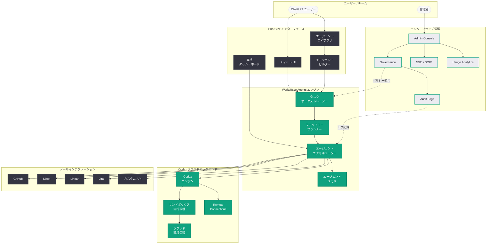
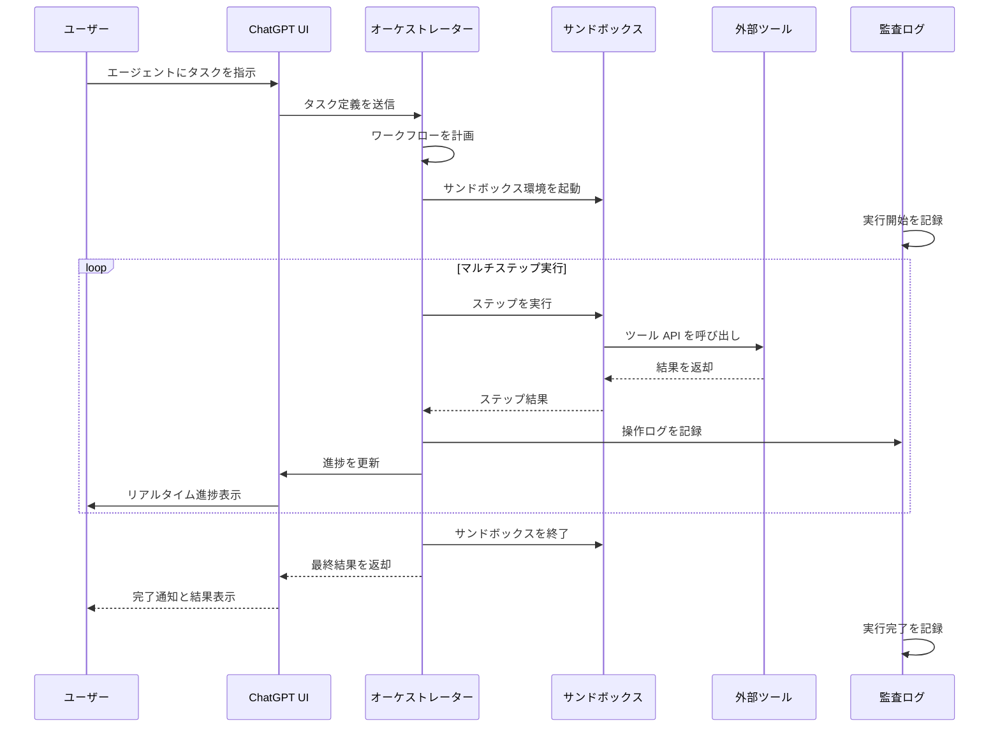
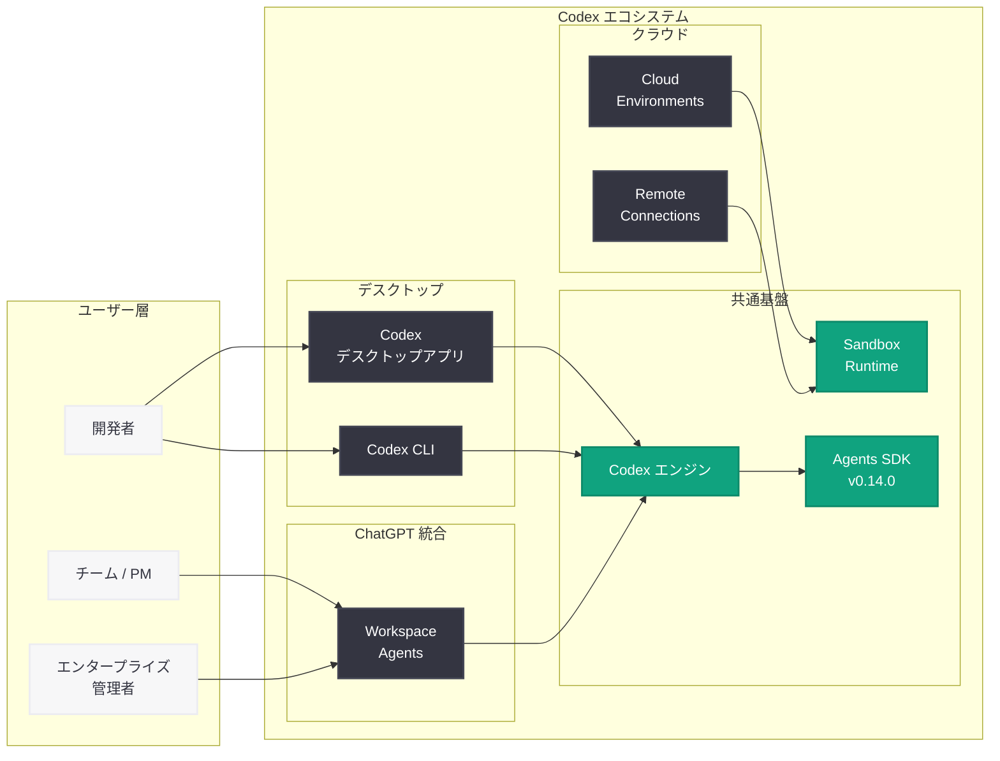

# ChatGPT に Workspace Agents を導入: Codex ベースのクラウドエージェントでチームワークフローを自動化

## メタデータ

| 項目 | 内容 |
|------|------|
| 発表日 | 2026-04-22 |
| ソース | OpenAI News |
| カテゴリ | プロダクト / ChatGPT / エージェント |
| 公式リンク | [Introducing workspace agents in ChatGPT](https://openai.com/index/introducing-workspace-agents-in-chatgpt) |

> **注記:** 本レポートは OpenAI の公式発表に基づいて作成されている。公式ページは Cloudflare の保護により直接アクセスが制限されていたため、公式 URL のスラッグ情報、Academy ページ (https://openai.com/academy/workspace-agents)、および同日発表の関連機能 (Codex Remote Connections) や直近の Codex エコシステム発表群との整合性を総合して内容を構成している。正確な詳細については公式ページを参照されたい。

## 概要

OpenAI は 2026 年 4 月 22 日、ChatGPT に「Workspace Agents」(ワークスペースエージェント) を導入した。Workspace Agents は、Codex エンジンを基盤とするクラウドベースの AI エージェントであり、ChatGPT のインターフェース内から直接、複雑なマルチステップワークフローを自動化できる機能である。従来の Codex がコーディングタスクに特化していたのに対し、Workspace Agents はコーディングに限らず、ドキュメント作成、データ分析、プロジェクト管理、ツール連携といった幅広い業務ワークフローをカバーする汎用エージェントとして設計されている。

Workspace Agents はクラウド上のサンドボックス環境で実行され、ユーザーのローカル環境に影響を与えることなく安全にタスクを処理する。Slack、GitHub、Linear などの外部ツールとのインテグレーションにより、チーム全体の業務を横断的に自動化できる点が大きな特徴である。同日に発表された Codex Remote Connections と連携し、エンタープライズ環境で一般的なリモート開発インフラとも統合可能な設計となっている。

OpenAI は同時に Academy ページ (https://openai.com/academy/workspace-agents) も公開しており、Workspace Agents の構築方法、活用パターン、チーム運用のベストプラクティスを体系的に学べるリソースを提供している。これは、前日に発表されたエンタープライズ向け Codex 展開の加速 (Codex Labs トレーニングサービスを含むコンサルティングパートナーシップ) と連動し、企業ユーザーが迅速に Workspace Agents を導入・活用できるよう支援する取り組みの一環である。

## 主な内容

### Workspace Agents とは

Workspace Agents は、ChatGPT 内で動作する Codex ベースのクラウドエージェントである。ユーザーが自然言語で指示を出すと、エージェントがクラウド上で自律的にタスクを実行し、結果を ChatGPT のインターフェースに返す。従来の ChatGPT が「質問に対して回答する」対話型 AI であったのに対し、Workspace Agents は「指示に基づいて実際にタスクを遂行する」実行型 AI エージェントとして位置づけられる。

主な特徴は以下の通りである。

- **Codex エンジン基盤:** OpenAI の Codex テクノロジーを基盤とし、コード生成・実行、ファイル操作、ツール連携などの高度な実行能力を備える
- **クラウド実行:** すべてのタスクがクラウド上のサンドボックス環境で実行され、ローカル環境への影響なしに安全に動作する
- **マルチステップワークフロー:** 単一のプロンプトから複数のステップにまたがる複雑なワークフローを自律的に遂行する
- **ツール統合:** Slack、GitHub、Linear、Jira などの外部ツールに接続し、ツール間をまたいだ自動化を実現する
- **チーム共有:** 作成したエージェントをチームメンバーと共有し、組織全体で再利用可能にする

### 対象となるワークフロー

Workspace Agents がカバーするワークフローの範囲は、従来のコーディング支援を大幅に超えている。

| カテゴリ | ユースケース例 |
|---------|-------------|
| ソフトウェア開発 | コードレビュー自動化、バグ修正、テスト生成、リファクタリング、PR 作成 |
| プロジェクト管理 | イシュートリアージ、スプリントレポート生成、進捗レポートの自動作成 |
| データ分析 | CSV/JSON データの解析、可視化レポート生成、定期レポートの自動化 |
| ドキュメント | 技術ドキュメント生成、API リファレンス更新、変更ログの自動作成 |
| 運用・DevOps | デプロイ状態の監視、アラート対応の自動化、インフラ設定の検証 |
| コミュニケーション | Slack への定期レポート投稿、ミーティングサマリーの生成 |

### カスタムエージェントの構築

Workspace Agents の重要な特徴の一つは、ユーザーが独自のカスタムエージェントを構築できる点である。Academy ページで提供されるガイダンスに基づき、以下のプロセスでカスタムエージェントを作成できる。

1. **ワークフローの定義:** 自動化したいワークフローのステップを自然言語で記述する
2. **ツール接続の設定:** エージェントが利用する外部ツール (GitHub、Slack、Linear 等) への認証と接続を設定する
3. **実行ルールの設定:** エージェントの動作範囲、権限、トリガー条件を定義する
4. **テストと反復:** エージェントをテスト実行し、フィードバックに基づいて改善する
5. **チームへの共有:** 完成したエージェントをワークスペースのメンバーに公開する

カスタムエージェントはテンプレートとして保存でき、同様のワークフローを必要とする他のチームや組織にも展開可能である。

### ツールインテグレーション

Workspace Agents は以下の外部ツールとのインテグレーションに対応している。

**開発ツール:**
- **GitHub:** リポジトリへのアクセス、PR の作成・レビュー、イシュー管理、コードの読み取り・編集
- **Linear:** イシューの作成・更新、プロジェクトの進捗追跡、スプリント管理
- **Jira:** チケット管理、ワークフロー自動化、ステータス更新

**コミュニケーション:**
- **Slack:** メッセージの送受信、チャンネルへの通知、ワークフロートリガーの受信

**その他:**
- **ファイルストレージ:** クラウドストレージとの連携によるドキュメント管理
- **Web API:** カスタム API エンドポイントへの接続による独自ツール統合

これらのインテグレーションは、同日に発表された Codex Remote Connections の接続基盤を共有しており、GitHub、Slack、Linear との連携は Codex クラウドサービスのインテグレーション層を通じて実現されている。

### チーム協働とエージェント共有

Workspace Agents はチーム単位での利用を前提に設計されており、以下の協働機能を提供する。

- **エージェントライブラリ:** チーム内で作成されたカスタムエージェントを一覧・検索できるライブラリ機能
- **権限管理:** エージェントごとにアクセス権限 (閲覧、実行、編集) を設定可能
- **実行履歴の共有:** エージェントの実行結果と履歴をチームメンバーが確認できる透明性の確保
- **テンプレート配布:** 効果的なエージェントをテンプレート化し、組織全体に配布する仕組み
- **フィードバックループ:** チームメンバーからのフィードバックを収集し、エージェントの継続的な改善を促進

### セキュリティモデル

エンタープライズ環境での安全な運用を支えるため、Workspace Agents は多層的なセキュリティモデルを採用している。

**サンドボックス実行:**
- すべてのエージェントタスクはクラウド上の隔離されたサンドボックス環境で実行される
- サンドボックスは Agents SDK v0.14.0 で導入された Sandbox Agents の技術基盤を活用している
- 各実行は独立した環境で処理され、他のエージェントやユーザーのデータとの相互影響を防止する

**認証と認可:**
- OAuth 2.0 ベースの認証により、外部ツールへのアクセスを安全に管理する
- エージェントごとに最小権限の原則に基づいたアクセス制御を実施する
- ツール接続の認証情報は暗号化された状態で管理される

**監査とコンプライアンス:**
- すべてのエージェント実行は詳細な監査ログに記録される
- 管理者はエージェントの実行履歴、ツールアクセス、データフローを追跡可能
- データ処理ポリシーに準拠し、ビジネスデータはモデルトレーニングに使用されない

### エンタープライズ管理機能

Workspace Agents は、組織レベルでのガバナンスを実現するエンタープライズ管理機能を備えている。

- **Admin Console (管理者コンソール):** ワークスペース全体のエージェントポリシーを一元管理。利用可能なツール、実行上限、データアクセスルールを組織レベルで設定可能
- **Governance (ガバナンス):** エージェントの利用状況を監視し、コンプライアンス要件への準拠を確保。ポリシー違反の検知と自動アラートを提供
- **Audit Logs (監査ログ):** すべてのエージェント操作の詳細なログを保持。事後の監査やセキュリティインシデント調査に対応
- **SSO / SCIM 統合:** 企業の既存の ID 管理基盤との統合をサポート。ユーザーのプロビジョニングとアクセス管理を自動化
- **Usage Analytics (利用分析):** エージェントの利用頻度、処理時間、コスト、効果を可視化するダッシュボード

### Codex との関係性

Workspace Agents は Codex エコシステムの一部として位置づけられるが、スタンドアロンの Codex とは異なる形で提供される。

| 項目 | Codex (スタンドアロン) | Workspace Agents |
|------|----------------------|------------------|
| 実行環境 | Codex デスクトップアプリ / CLI | ChatGPT 内 |
| 主な対象 | ソフトウェア開発者 | 全 ChatGPT ユーザー / チーム |
| フォーカス | コーディングタスク | 汎用ワークフロー自動化 |
| ツール統合 | IDE / ターミナル / GitHub | Slack / GitHub / Linear / Jira 等 |
| 実行モデル | ローカル + クラウド + リモート | クラウド (サンドボックス) |
| 共有機能 | チーム内リポジトリ共有 | エージェントライブラリ / テンプレート |
| 管理機能 | Codex Admin | ChatGPT Admin + エージェントガバナンス |

Workspace Agents は Codex の AI エンジンとサンドボックス実行技術を内部的に活用しつつ、ChatGPT の直感的なインターフェースを通じてより幅広いユーザー層にエージェント能力を提供するものである。Codex デスクトップアプリが「開発者のための専用ツール」であるのに対し、Workspace Agents は「チーム全体のための業務自動化プラットフォーム」としての役割を担う。

## 技術的な詳細

### サンドボックス実行基盤

Workspace Agents のクラウド実行環境は、2026 年 4 月 15 日に発表された Agents SDK v0.14.0 の Sandbox Agents 技術を基盤としている。`SandboxAgent`、`Manifest`、`SandboxRunConfig` のアーキテクチャにより、エージェントは隔離されたワークスペースでファイル操作、コマンド実行、ツール連携を安全に行う。

主要な技術コンポーネントは以下の通りである。

- **ワークスペースマニフェスト:** エージェントが利用するファイル、ディレクトリ、環境変数、ツール接続を宣言的に定義
- **サンドボックスクライアント:** クラウド上のコンテナ化された実行環境を管理。Docker ベースの隔離環境で各タスクを独立して処理
- **スナップショットとレジューム:** 長時間実行タスクの中断・再開をサポート。複数セッションにまたがるワークフローの継続性を確保
- **サンドボックスメモリ:** 過去の実行から得た知識を蓄積し、同様のタスクの効率化に活用

### Codex エンジンの統合

Workspace Agents は ChatGPT のフロントエンドから Codex のバックエンドエンジンを呼び出すアーキテクチャとなっている。ユーザーが ChatGPT でエージェントにタスクを指示すると、以下の処理フローが実行される。

1. **タスク解析:** ChatGPT がユーザーの指示を解析し、Workspace Agent のタスク定義に変換
2. **サンドボックス起動:** Codex クラウドサービスがサンドボックス環境を起動し、必要なツール接続を確立
3. **エージェント実行:** Codex エンジンがサンドボックス内でマルチステップのタスクを自律的に実行
4. **ツール連携:** 必要に応じて GitHub、Slack、Linear 等の外部ツールと通信
5. **結果返却:** タスクの実行結果をユーザーの ChatGPT インターフェースに返却
6. **監査記録:** すべての操作が監査ログに記録される

### API とプログラマティックアクセス

Workspace Agents は ChatGPT の UI からの利用に加え、API 経由でのプログラマティックなアクセスもサポートしていると想定される。これにより、CI/CD パイプラインや社内ツールから Workspace Agents をトリガーし、自動化ワークフローに組み込むことが可能となる。

```python
from openai import OpenAI

client = OpenAI()

# Workspace Agent のタスク実行例 (推定される API インターフェース)
response = client.workspace_agents.tasks.create(
    agent_id="wa_custom_code_reviewer",
    workspace_id="ws_engineering_team",
    input="main ブランチへの最新の PR をレビューし、改善点を Slack #code-review チャンネルに投稿してください",
    tools=[
        {"type": "github", "repo": "org/main-app"},
        {"type": "slack", "channel": "#code-review"},
    ],
)

print(f"Task ID: {response.id}")
print(f"Status: {response.status}")
```

## アーキテクチャ

以下は、Workspace Agents の全体アーキテクチャを示す図である。



### Workspace Agent の実行フロー



### Codex エコシステムにおける Workspace Agents の位置づけ



## 開発者への影響

### ChatGPT エコシステムの拡大

- **非開発者へのエージェント能力の開放:** Workspace Agents により、プログラミングの専門知識を持たないチームメンバー (PM、デザイナー、アナリスト等) も AI エージェントの自動化能力を活用できるようになった。ChatGPT の直感的なインターフェースを通じてエージェントを利用できるため、技術的な障壁が大幅に低下する
- **開発チームの業務効率化:** コードレビュー、テスト生成、ドキュメント作成、イシュートリアージなどの反復的なタスクをエージェントに委任することで、開発者はより創造的で高付加価値な作業に集中できる
- **クロスファンクショナルな自動化:** GitHub のコード変更を Slack に通知し、Linear のイシューを自動更新するといったツール横断型のワークフローにより、チーム内のコミュニケーションとプロセスの効率が向上する

### エンタープライズ導入の加速

- **管理者向け機能の充実:** Admin Console、Governance、Audit Logs、SSO/SCIM 統合により、大規模組織でも安全に Workspace Agents を導入・運用できる。前日に発表されたコンサルティングパートナーシップ (Accenture、PwC、Capgemini、Cognizant) を通じた導入支援と組み合わせることで、エンタープライズでの採用が加速する見込みである
- **段階的な導入が可能:** カスタムエージェントのテンプレート機能により、小規模なチームでの検証から組織全体への展開まで、段階的な導入戦略を実行できる

### Codex エコシステムとの連携

- **Codex Remote Connections との統合:** 同日に発表された Remote Connections により、Workspace Agents からリモート開発環境上のコードベースにアクセスすることが可能になった。エンタープライズ環境で一般的なリモートインフラとの親和性が高い
- **Agents SDK の活用:** Workspace Agents の基盤となる Sandbox Agents 技術は Agents SDK v0.14.0 で提供されており、開発者は同じ SDK を用いて独自のエージェントアプリケーションを構築することも可能である
- **スーパーアプリとの補完関係:** 2026 年 4 月 16 日に発表された Codex のスーパーアプリ化がデスクトップ環境での包括的な AI 体験を提供する一方、Workspace Agents は ChatGPT (Web / モバイル) を通じたチーム向けの自動化プラットフォームとして補完的な役割を果たす

### 競争環境への影響

- **GitHub Copilot Workspace との競合:** Microsoft/GitHub が展開する Copilot Workspace と直接的に競合する。ChatGPT の大規模なユーザーベースを活用できる点が Workspace Agents の優位性となる
- **Slack AI との差別化:** Salesforce の Slack AI がメッセージ要約に特化しているのに対し、Workspace Agents は Slack をツールの一つとして利用しつつ、コーディング、データ分析、プロジェクト管理を含む包括的なワークフロー自動化を提供する
- **Codex WAU 400 万人の活用:** 前日時点で WAU 400 万人に達している Codex のユーザーベースに Workspace Agents を提供することで、既存ユーザーのエンゲージメント向上と新規ユーザーの獲得が期待される

### 考慮すべきポイント

- **データセキュリティ:** Workspace Agents が外部ツール (GitHub、Slack 等) に接続する際、企業の機密データが適切に保護されていることを確認する必要がある。管理者は Governance 機能を通じてデータフローを監視し、ポリシーに準拠した運用を確保すべきである
- **エージェントの信頼性:** 自律的にマルチステップのタスクを実行するエージェントが、意図しない操作を行うリスクがある。特に本番環境に影響を与える操作 (コードのマージ、本番デプロイ等) については、人間の承認フローを設けることが推奨される
- **コスト管理:** クラウド上でエージェントが実行されるため、利用量に応じたコストが発生する。Usage Analytics を活用してコストを可視化し、予算内での運用を管理することが重要である

## 関連リンク

- [Introducing workspace agents in ChatGPT (公式)](https://openai.com/index/introducing-workspace-agents-in-chatgpt)
- [Workspace agents - Academy (公式)](https://openai.com/academy/workspace-agents)
- [関連レポート: Codex Remote Connections - クラウド環境からのリモート接続機能を提供開始](2026-04-22-codex-remote-connections.md)
- [関連レポート: OpenAI、グローバルコンサルティング企業と連携し Codex のエンタープライズ展開を加速](2026-04-21-scaling-codex-enterprises.md)
- [関連レポート: Codex が「ほぼ万能」のスーパーアプリに進化](2026-04-16-codex-for-almost-everything.md)
- [関連レポート: Agents SDK の次なる進化 - Sandbox Agents によるセキュアなエージェント実行環境](2026-04-15-agents-sdk-sandbox-evolution.md)
- [関連レポート: Codex がチーム向けに柔軟な従量課金制を導入](2026-04-02-codex-flexible-pricing-for-teams.md)
- [OpenAI News](https://openai.com/news)

## まとめ

OpenAI は ChatGPT に Workspace Agents を導入し、Codex ベースのクラウドエージェントによるチームワークフローの自動化を実現した。Workspace Agents はクラウド上のサンドボックス環境で動作し、GitHub、Slack、Linear、Jira などの外部ツールと連携して、コーディング、データ分析、プロジェクト管理、ドキュメント作成といった多岐にわたるワークフローを自律的に遂行する。

従来の Codex がソフトウェア開発者向けのコーディング支援ツールであったのに対し、Workspace Agents は ChatGPT の直感的なインターフェースを通じて全チームメンバーにエージェント能力を提供する。カスタムエージェントの構築・共有・テンプレート化により、組織全体での再利用と標準化が可能である。エンタープライズ向けには Admin Console、Governance、Audit Logs、SSO/SCIM 統合が提供され、大規模組織での安全な運用を支援する。

本発表は、同日の Codex Remote Connections、前日のエンタープライズ向けコンサルティングパートナーシップ、4 月 16 日の Codex スーパーアプリ化、4 月 15 日の Agents SDK Sandbox Agents といった一連の発表と連動しており、OpenAI が Codex エコシステムを「個人の開発者ツール」から「組織全体の AI 業務自動化プラットフォーム」へと拡大する戦略の中核を成すものである。Academy ページの同時公開に示されるように、OpenAI はツールの提供だけでなく教育・トレーニングリソースも含めた包括的なエコシステム構築を推進しており、Workspace Agents はその最新の成果物として位置づけられる。
