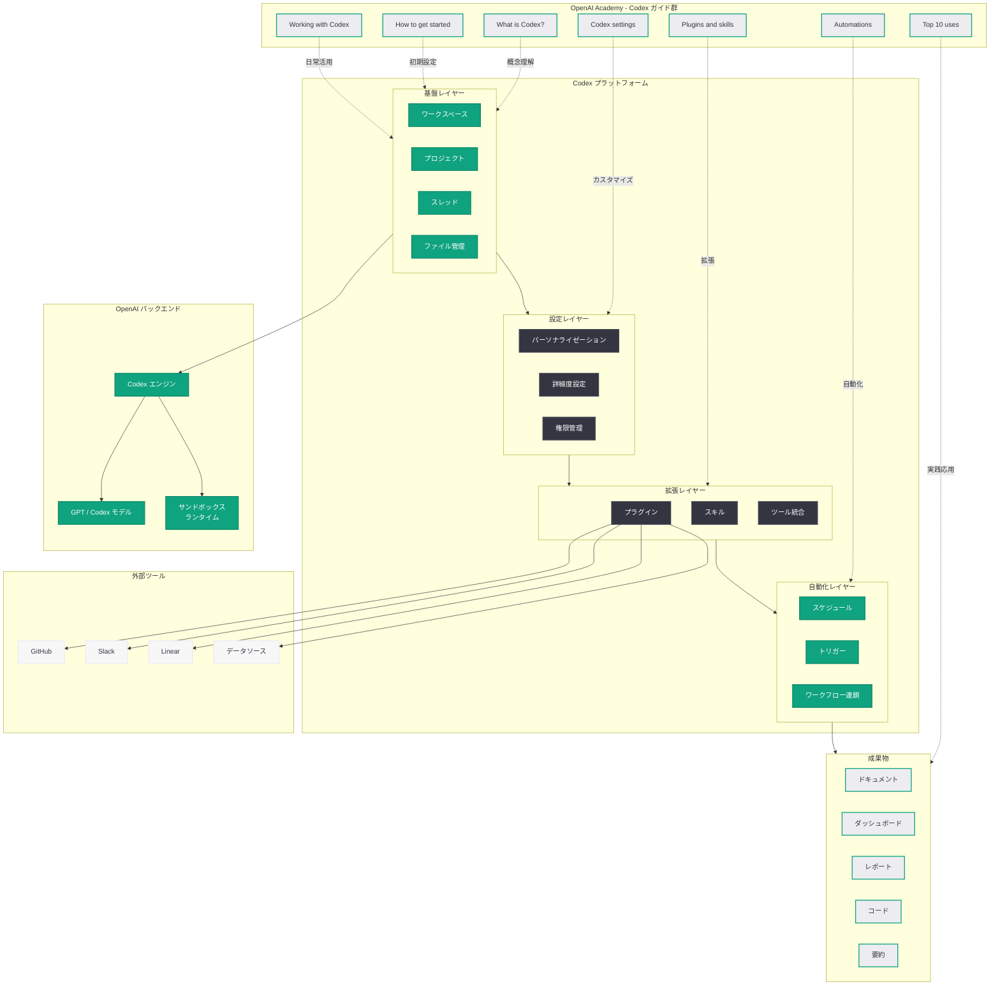
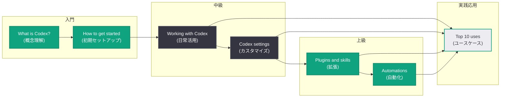
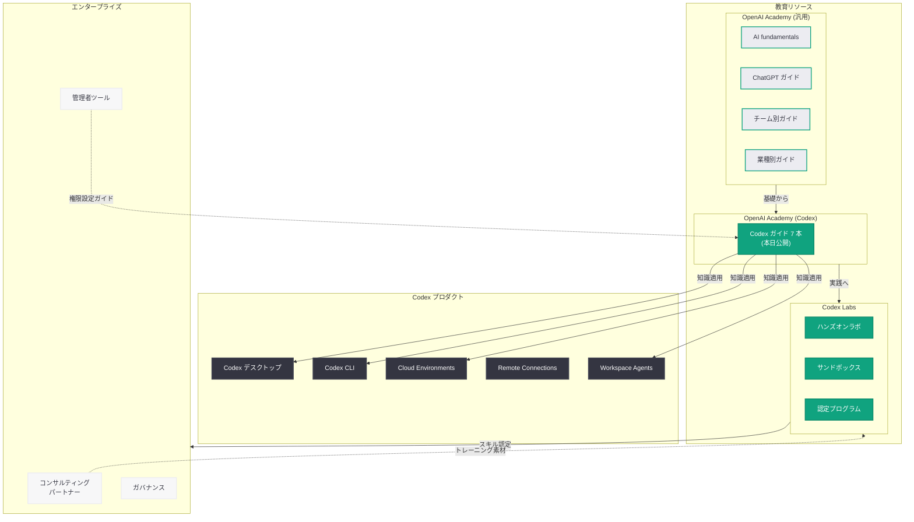

# Codex Academy 包括的入門ガイドを 7 本同時公開: OpenAI が Codex プラットフォームの体系的学習リソースを整備

## メタデータ

| 項目 | 内容 |
|------|------|
| 発表日 | 2026-04-23 |
| ソース | OpenAI Academy |
| カテゴリ | Education / Codex |
| 公式リンク | [OpenAI Academy](https://openai.com/academy/) |

> **注記:** 本レポートは OpenAI の RSS フィードで確認された 7 本の Academy 記事 (いずれも 2026 年 4 月 23 日 10:00 UTC に公開) の情報に基づいて作成している。各記事ページは Cloudflare の保護により直接アクセスが制限されていたため、RSS フィードの説明文、関連する Codex エコシステムの既存レポート群、および OpenAI Academy の既知のコンテンツ構造を総合して内容を構成している。正確な詳細については各公式ページを参照されたい。

## 概要

OpenAI は 2026 年 4 月 23 日、OpenAI Academy において Codex に特化した 7 本の教育ガイドを同時に公開した。これらのガイドは Codex プラットフォームの基本概念から実践的な活用法までを体系的にカバーする初の包括的学習リソースであり、「Codex とは何か」という入門レベルの解説から、オートメーション、プラグイン、設定のカスタマイズといった高度なトピックまでを網羅している。

今回の 7 本のガイドは以下の通りである。

| # | ガイド名 | 概要 |
|---|---------|------|
| 1 | What is Codex? | Codex の基本概念と「チャットを超えた」プラットフォームとしての位置づけ |
| 2 | How to get started with Codex | プロジェクトのセットアップ、スレッド作成、初回タスクの実行 |
| 3 | Working with Codex | ワークスペースの構成、スレッドとプロジェクト管理、ファイル操作 |
| 4 | Codex settings | パーソナライゼーション、詳細度、権限設定によるワークフローのカスタマイズ |
| 5 | Plugins and skills | プラグインとスキルを使ったツール接続、データアクセス、ワークフロー自動化 |
| 6 | Automations | スケジュールとトリガーを使ったレポート、要約、定期ワークフローの自動化 |
| 7 | Top 10 uses for Codex at work | ツール、ファイル、ワークフロー横断の実践的ユースケース 10 選 |

本発表は、同日に公開された GPT-5.5 と同時に行われたものであり、OpenAI が AI モデルの進化と並行して、Codex プラットフォームの教育・普及基盤を本格的に整備する姿勢を明確に示している。2026 年 4 月 10 日に正式ローンチされた OpenAI Academy が ChatGPT 全般の汎用的な AI リテラシー教育を担ってきたのに対し、今回の 7 本は Codex に完全特化した初のガイド群であり、Academy のコンテンツが開発者・パワーユーザー向けに本格拡張された転換点として位置づけられる。

また、4 月下旬に集中的に発表されてきた Codex エコシステムの急速な進化 -- Codex for (almost) everything (4/16)、Codex Labs (4/21)、Scaling Codex to enterprises (4/21)、Codex Remote Connections (4/22)、Workspace Agents (4/22) -- を踏まえ、これらの新機能を包括的に学習できる教育基盤が急務であったことがうかがえる。

## 主な内容

### 1. What is Codex? -- Codex の基本概念

**公式 URL:** https://openai.com/academy/what-is-codex

本ガイドは、Codex プラットフォームの全体像と「チャットを超えた」AI ツールとしての位置づけを解説する入門ガイドである。RSS フィードの説明文には「Learn how Codex helps you go beyond chat by automating tasks, connecting tools, and producing real outputs like docs and dashboards」と記載されており、以下の内容を扱っていると考えられる。

- **チャットを超えた AI プラットフォーム:** 従来の ChatGPT が「質問に答える」対話型ツールであるのに対し、Codex は「タスクを実行する」実行型プラットフォームであることの解説
- **タスクの自動化:** ドキュメント作成、ダッシュボード生成、データ分析など、実際の成果物を生み出す AI エージェントとしての能力
- **ツール連携:** GitHub、Slack、Linear などの外部ツールとの接続による業務ワークフローの統合
- **実際の出力物 (Real outputs):** チャットの応答ではなく、ドキュメント、ダッシュボード、コード、レポートといった具体的な成果物の生成

2026 年 4 月 16 日の「Codex for (almost) everything」で発表されたスーパーアプリ化 -- Computer Use、アプリ内ブラウザ、画像生成、永続メモリ、プラグインシステム、Automations の統合 -- を背景に、Codex が単なるコーディングツールから包括的な AI ワークプラットフォームへと進化した全体像を伝えるガイドである。

### 2. How to get started with Codex -- はじめの一歩

**公式 URL:** https://openai.com/academy/codex-how-to-start

Codex を初めて利用するユーザー向けのステップバイステップガイドである。「Learn how to get started with Codex by setting up projects, creating threads, and completing your first tasks with step-by-step guidance」との説明から、以下の内容が含まれると推定される。

- **初期セットアップ:** Codex アカウントの作成と初回ログイン手順
- **プロジェクトの作成:** 最初のプロジェクトを作成し、ファイルやコンテキストを設定する方法
- **スレッドの作成と活用:** Codex のスレッド機能を使ったタスク指示とコミュニケーションの基本
- **最初のタスクの実行:** 簡単なタスクを通じて Codex のワークフローを体験する実践的なウォークスルー

Codex の学習曲線を最小限に抑え、初回体験から価値を感じられるように設計されたオンボーディングガイドと位置づけられる。

### 3. Working with Codex -- 日常的な活用法

**公式 URL:** https://openai.com/academy/working-with-codex

ワークスペースのセットアップから日常的なタスク管理まで、Codex を業務に組み込むための包括的なガイドである。「Learn how to set up your Codex workspace, create threads and projects, manage files, and start completing tasks with step-by-step guidance」との説明に基づき、以下の内容をカバーしていると考えられる。

- **ワークスペースの構成:** プロジェクト、スレッド、ファイルの階層構造とその効果的な組織化
- **スレッドとプロジェクトの管理:** 複数のタスクを並行して管理するためのスレッド運用とプロジェクト構造のベストプラクティス
- **ファイル管理:** Codex 内でのファイルのアップロード、参照、編集、出力の管理方法
- **タスク完了のワークフロー:** タスクの指示から成果物の確認・承認までの一連のフローの最適化

前述の「How to get started」が初回体験に焦点を当てているのに対し、本ガイドは Codex を継続的に業務で活用するための中級レベルの内容を提供するものである。

### 4. Codex settings -- ワークフローのカスタマイズ

**公式 URL:** https://openai.com/academy/codex-settings

Codex の設定項目を網羅的に解説し、ユーザーごとのワークフローに最適化するためのガイドである。「Learn how to configure Codex settings, including personalization, detail level, and permissions, to run tasks smoothly and customize your workflow」との説明から、以下の設定カテゴリが含まれると推定される。

- **パーソナライゼーション設定:** コーディングスタイル、言語設定、出力フォーマットの好みなど、ユーザーの作業スタイルに合わせたカスタマイズ
- **詳細度の設定 (Detail level):** Codex の出力の詳細度 -- 簡潔な要約から詳細な説明まで -- を業務要件に応じて調整する機能
- **権限設定 (Permissions):** Codex がアクセスできるリソース (ファイル、ツール、外部サービス) の範囲と、操作の承認フローの設定
- **タスク実行の最適化:** タスクをスムーズに実行するためのパフォーマンス関連設定とトラブルシューティング

特に権限設定は、エンタープライズ環境での Codex 運用において重要な側面であり、2026 年 4 月 21 日に発表された「Scaling Codex to enterprises worldwide」における組織的なガバナンス要件との関連性が高い。

### 5. Plugins and skills -- ツール連携とワークフロー拡張

**公式 URL:** https://openai.com/academy/codex-plugins-and-skills

Codex のプラグインとスキル機能を活用したツール接続と反復可能なワークフローの構築方法を解説するガイドである。「Learn how to use Codex plugins and skills to connect tools, access data, and follow repeatable workflows to automate tasks and improve results」との説明に基づき、以下の内容が含まれると考えられる。

- **プラグインの利用:** 外部ツール (GitHub、Slack、Linear、データベースなど) に接続するプラグインのインストールと設定方法
- **スキルの活用:** 反復可能なワークフローをスキルとして定義し、一貫した品質でタスクを実行する方法
- **データアクセス:** プラグインを通じた外部データソースへのアクセスとデータの取り込み
- **結果の改善:** プラグインとスキルの組み合わせによるタスク実行品質の向上手法

2026 年 4 月 16 日の「Codex for (almost) everything」で導入されたプラグインシステム (50 以上の科学ツールに接続する Life Sciences プラグインを含む) と、OpenAI Academy で先行して公開されていた「Using skills」ガイドの Codex 版に相当するコンテンツである。プラグインエコシステムの拡大とサードパーティ開発者の参入促進に向けた教育基盤としても機能する。

### 6. Automations -- スケジュールとトリガーによる自動化

**公式 URL:** https://openai.com/academy/codex-automations

Codex のオートメーション機能を使って、手動作業なしに定期的なタスクを実行する方法を解説するガイドである。「Learn how to automate tasks in Codex using schedules and triggers to create reports, summaries, and recurring workflows without manual effort」との説明から、以下の内容が含まれると推定される。

- **スケジュール設定:** 日次、週次、月次など、時間ベースのスケジュールによる定期タスクの自動実行
- **トリガー設定:** ファイル変更、Git プッシュ、テスト失敗、Webhook 受信などのイベントに基づく条件付き自動実行
- **レポート自動生成:** 定期的な進捗レポート、コード品質レポート、データ分析レポートの自動生成
- **要約の自動作成:** 会議メモ、チャンネル要約、PR 変更要約などの定期的な要約タスク
- **ワークフローの連鎖:** 複数のオートメーションを連鎖させた複雑な自動化パイプラインの構築

本ガイドが対象とする Automations 機能は、2026 年 3 月 31 日に導入された Codex Hooks を基盤として発展したものであり、4 月 16 日のスーパーアプリ化で正式にリリースされた機能である。エンタープライズユーザーにとって、定期レポートやコンプライアンス監査の自動化は ROI に直結する重要な活用領域であり、本ガイドの実践的価値は高い。

### 7. Top 10 uses for Codex at work -- 業務活用ユースケース 10 選

**公式 URL:** https://openai.com/academy/top-10-use-cases-codex-for-work

Codex を業務で活用する実践的なユースケースを 10 項目にまとめたガイドである。「Explore 10 practical Codex use cases to automate tasks, create deliverables, and turn real inputs into outputs across tools, files, and workflows」との説明に基づき、以下のようなユースケースが含まれると推定される。

1. **コードレビューと品質改善:** PR のレビュー、コード品質の分析、改善提案の自動生成
2. **ドキュメント生成:** 技術ドキュメント、API リファレンス、変更ログの自動作成
3. **データ分析とレポート:** CSV、JSON、データベースからのデータ分析とダッシュボードの生成
4. **テスト生成:** ユニットテスト、結合テスト、E2E テストの自動生成
5. **ワークフロー自動化:** 反復的な業務プロセスのプラグインとスキルによる自動化
6. **プロジェクト管理:** イシュートリアージ、スプリントレポート、進捗追跡の自動化
7. **コミュニケーション支援:** Slack への定期レポート投稿、ミーティングサマリーの生成
8. **リファクタリングとモダナイゼーション:** レガシーコードの分析と段階的な近代化
9. **セキュリティ分析:** コードベースのセキュリティスキャンと脆弱性レポートの生成
10. **成果物の制作:** プレゼンテーション、提案書、レポートなどのビジネス成果物の作成

「real inputs into outputs across tools, files, and workflows」という表現が示す通り、Codex が単なるチャット AI ではなく、実際のインプットから具体的なアウトプットを生成するプラットフォームであることを実践例で示すガイドである。

## 技術的な詳細

### Codex プラットフォームの機能体系

今回の 7 本のガイドから、Codex プラットフォームが以下の機能レイヤーで構成されていることが体系的に整理できる。

| レイヤー | 機能 | 対応ガイド |
|---------|------|----------|
| 基盤レイヤー | ワークスペース、プロジェクト、スレッド、ファイル管理 | What is Codex? / How to get started / Working with Codex |
| 設定レイヤー | パーソナライゼーション、詳細度、権限管理 | Codex settings |
| 拡張レイヤー | プラグイン (外部ツール接続)、スキル (反復ワークフロー) | Plugins and skills |
| 自動化レイヤー | スケジュール、トリガー、ワークフロー連鎖 | Automations |
| 応用レイヤー | 業務ユースケース、成果物生成 | Top 10 uses for Codex at work |

### スレッドとプロジェクトの階層構造

複数のガイドで言及されている「スレッド」と「プロジェクト」は、Codex のタスク管理における核心的な概念である。

- **プロジェクト (Project):** 関連するタスク、ファイル、コンテキストをまとめる最上位の単位。業務プロジェクトやリポジトリに対応する
- **スレッド (Thread):** プロジェクト内の個別のタスクやワークフローを管理する単位。各スレッドは独立したコンテキストを保持し、Codex エージェントとの対話と成果物の履歴を追跡する
- **ファイル (File):** プロジェクトに関連するドキュメント、コード、データ。スレッド間で共有可能

この構造は、ChatGPT のプロジェクト機能 (2026 年 3 月 23 日の ChatGPT Library / Personal Files で拡張) を Codex のタスク実行モデルに最適化したものと考えられる。

### プラグインとスキルの技術的位置づけ

「Plugins and skills」ガイドが対象とする 2 つの機能は、Codex の拡張性において異なる役割を担っている。

**プラグイン (Plugins):**
- 外部ツールやサービスへの接続を提供する拡張機能
- OpenAI またはサードパーティが開発・配布
- GitHub、Slack、Linear、データベース、クラウドサービスなどとの統合
- 2026 年 4 月 16 日に Life Sciences プラグイン (50 以上の科学ツール接続) とともにリリース

**スキル (Skills):**
- 反復可能なワークフローをテンプレート化した実行パターン
- ユーザーまたはチームが定義・共有可能
- プロンプトテンプレート、ツール設定、実行手順を含む再利用可能な単位
- OpenAI Academy の「Using skills」ガイド (ChatGPT 向け) を Codex 向けに拡張

### Automations の技術基盤

「Automations」ガイドが対象とするオートメーション機能は、以下の技術要素で構成される。

**スケジュールベースの自動化:**
- cron 式に類似した時間ベースのスケジュール設定
- 日次、週次、月次、カスタム間隔でのタスク実行
- タイムゾーン対応とスケジュール管理 UI

**イベントベースのトリガー:**
- Webhook 受信による外部イベント連携
- ファイル変更、Git イベント、CI/CD パイプラインからのトリガー
- 条件付き実行ルール (フィルタリング、分岐)

**ワークフローオーケストレーション:**
- 複数ステップの連鎖実行
- エラーハンドリングとリトライロジック
- 実行結果の通知と監視

これらは 2026 年 3 月 31 日に導入された Codex Hooks の上位抽象化レイヤーとして設計されており、プログラミング知識なしにノーコードに近い形でオートメーションを構築できる点が特徴である。

## アーキテクチャ

以下は、7 本のガイドが対象とする Codex プラットフォームの全体アーキテクチャを示す図である。

### ガイド間の学習パスと依存関係

### Codex エコシステム全体における教育リソースの位置づけ

## 開発者への影響

### Codex の学習障壁の大幅な低下

今回の 7 本のガイドの同時公開は、Codex プラットフォームの学習障壁を大幅に引き下げるものである。

- **体系的な学習パスの確立:** 「What is Codex?」から「Top 10 uses」まで、概念理解から実践応用に至る一貫した学習パスが初めて整備された。これまで Codex の学習は公式ドキュメント、コミュニティの知見、試行錯誤に依存していたが、Academy ガイドの登場により初心者でも体系的にスキルを習得できる環境が整った
- **オンボーディングの効率化:** 「How to get started」と「Working with Codex」の 2 本のガイドにより、新規ユーザーが初回体験から日常的な活用に至るまでのオンボーディングプロセスが標準化される。企業内での Codex 導入時に、個々のチームメンバーが自律的に学習を進められる
- **段階的なスキルアップ:** 入門 (概念理解、初期セットアップ) から中級 (日常活用、設定カスタマイズ) を経て上級 (プラグイン、オートメーション) へと段階的にスキルを積み上げる設計により、ユーザーのレベルに応じた学習が可能となった

### エンタープライズ導入への影響

- **組織的な Codex スキルの底上げ:** 4 月 21 日に発表された Scaling Codex to enterprises において、Accenture、PwC、Capgemini、Cognizant とのコンサルティングパートナーシップが発表されたが、今回のガイドはこれらのパートナーが顧客企業にトレーニングを提供する際の基盤教材として機能する。パートナー経由での大規模な Codex 導入において、統一された教育コンテンツの存在は不可欠である
- **権限設定ガイドによるガバナンス支援:** 「Codex settings」ガイドの権限設定に関する内容は、エンタープライズ環境でのセキュリティポリシー策定とコンプライアンス対応の指針となる。組織の管理者が Codex の権限モデルを正確に理解し、適切なアクセス制御を実装するための参考資料として価値が高い
- **Automations ガイドによる ROI の可視化:** オートメーション機能は、反復的な業務プロセスの自動化を通じて直接的なコスト削減と効率向上に貢献する。本ガイドが提供する具体的な自動化パターン (レポート生成、要約作成、定期ワークフロー) は、経営層に対する Codex 投資の ROI 説明にも活用できる

### Codex エコシステムの成熟度指標

- **教育コンテンツの充実による信頼性向上:** 包括的な教育ガイドの存在は、プラットフォームの成熟度を示す重要な指標である。7 本のガイドが同時公開されたことは、Codex が「実験的なツール」から「本格的なプロダクション環境で使用されるプラットフォーム」へと成熟した証左と言える
- **OpenAI Academy のコンテンツ拡張:** 4 月 10 日のローンチ時に 24 以上のリソースが公開された Academy に、Codex 特化型の 7 本が追加されたことで、Academy のカバレッジが開発者・パワーユーザー層まで拡大した。今後、Codex Labs のハンズオンラボやサンドボックス環境との連携によるより実践的な学習体験の提供が期待される
- **GPT-5.5 との同日公開の意味:** 同日に GPT-5.5 という次世代モデルが発表される中で Codex ガイドも公開されたことは、OpenAI が「モデルの進化」と「プラットフォームの普及」を並行して推進する戦略を明確にしたものである。優れたモデルの価値を最大限に引き出すには、ユーザーがプラットフォームを効果的に活用できることが前提条件であり、教育ガイドはその基盤を提供する

### 競争環境における差別化

- **Anthropic Claude Code との比較:** Anthropic の Claude Code が主に開発者向けの CLI ツールとして提供されているのに対し、OpenAI は Codex Academy ガイドを通じてより幅広いユーザー層 (非開発者を含む) への教育リソースを整備している点で差別化が図られている
- **GitHub Copilot との対比:** GitHub Copilot が IDE 統合型のアプローチで開発者の既存ワークフローに溶け込む設計であるのに対し、Codex は独自のプラットフォーム (ワークスペース、プロジェクト、スレッド) を構築し、その教育ガイドを整備するアプローチを採っている。プラットフォーム型の強みは、エコシステム全体の統合性と拡張性にある
- **教育エコシステムの構築:** Academy (汎用 AI リテラシー) + Academy Codex ガイド (Codex 特化) + Codex Labs (ハンズオン) という三層構造の教育エコシステムは、競合他社に対する重要な差別化要因である

### 考慮すべきポイント

- **コンテンツの鮮度:** Codex は 2026 年 4 月だけでも複数の大型アップデートが行われており (スーパーアプリ化、Codex Labs、Remote Connections、Workspace Agents)、ガイドの内容が急速に陳腐化するリスクがある。教育コンテンツの継続的な更新体制の確保が重要である
- **学習から実践への橋渡し:** Academy ガイドは概念的な理解を提供するが、実際の業務での活用には Codex Labs のハンズオン環境での実践が不可欠である。ガイドからラボへのシームレスな導線設計が学習効果を左右する
- **多言語対応:** 現時点でガイドは英語で提供されていると推定されるが、Codex のグローバル展開に伴い、日本語を含む多言語でのガイド提供が望まれる

## 関連リンク

### 今回公開された 7 本のガイド

- [What is Codex?](https://openai.com/academy/what-is-codex)
- [How to get started with Codex](https://openai.com/academy/codex-how-to-start)
- [Working with Codex](https://openai.com/academy/working-with-codex)
- [Codex settings](https://openai.com/academy/codex-settings)
- [Plugins and skills](https://openai.com/academy/codex-plugins-and-skills)
- [Automations](https://openai.com/academy/codex-automations)
- [Top 10 uses for Codex at work](https://openai.com/academy/top-10-use-cases-codex-for-work)

### 関連する Codex エコシステムのレポート

- [関連レポート: Codex が「ほぼ万能」のスーパーアプリに進化 (2026-04-16)](2026-04-16-codex-for-almost-everything.md)
- [関連レポート: Codex Labs 発表 (2026-04-21)](2026-04-21-codex-labs.md)
- [関連レポート: Codex のエンタープライズ展開を加速 (2026-04-21)](2026-04-21-scaling-codex-enterprises.md)
- [関連レポート: Codex Remote Connections (2026-04-22)](2026-04-22-codex-remote-connections.md)
- [関連レポート: Workspace Agents を導入 (2026-04-22)](2026-04-22-workspace-agents-chatgpt.md)
- [関連レポート: OpenAI Academy を正式ローンチ (2026-04-10)](2026-04-10-openai-academy-launch.md)
- [関連レポート: GPT-5.5 発表 (2026-04-23)](2026-04-23-introducing-gpt-5-5.md)
- [関連レポート: Codex Hooks (2026-03-31)](2026-03-31-codex-hooks.md)
- [関連レポート: Codex がチーム向けに柔軟な従量課金制を導入 (2026-04-02)](2026-04-02-codex-flexible-pricing-for-teams.md)

### その他

- [OpenAI Academy (公式)](https://openai.com/academy/)
- [OpenAI News](https://openai.com/news)

## まとめ

OpenAI は 2026 年 4 月 23 日、OpenAI Academy において Codex プラットフォームに特化した 7 本の包括的ガイドを同時公開した。「What is Codex?」による概念的な入門から、「How to get started」「Working with Codex」による段階的なセットアップと活用法、「Codex settings」による環境カスタマイズ、「Plugins and skills」によるツール連携と拡張、「Automations」によるスケジュール・トリガーベースの自動化、そして「Top 10 uses for Codex at work」による実践的ユースケースまで、Codex の全機能レイヤーを網羅する体系的な教育リソースが初めて整備された。

本発表は、2026 年 4 月 10 日にローンチされた OpenAI Academy が ChatGPT 汎用ガイドから Codex 特化ガイドへとコンテンツを拡張した転換点であり、同時期に急速に進化する Codex エコシステム (スーパーアプリ化、Codex Labs、エンタープライズ展開、Remote Connections、Workspace Agents) の教育的な下支えとして機能する。GPT-5.5 と同日に公開されたことは、OpenAI が最先端モデルの提供とプラットフォーム教育の両輪を同時に推進する戦略を明確に示している。

7 本のガイドは、入門から上級までの段階的な学習パスを構成しており、個人開発者から Accenture、PwC といったコンサルティングパートナー経由でのエンタープライズ導入に至るまで、Codex の学習障壁を体系的に引き下げる効果が期待される。特にオートメーション、プラグイン、権限設定に関するガイドは、エンタープライズ環境での Codex 活用における ROI 向上とガバナンス確保に直結するコンテンツであり、WAU 400 万人を超える Codex ユーザーベースの更なる拡大と活用深化を後押しするものである。
