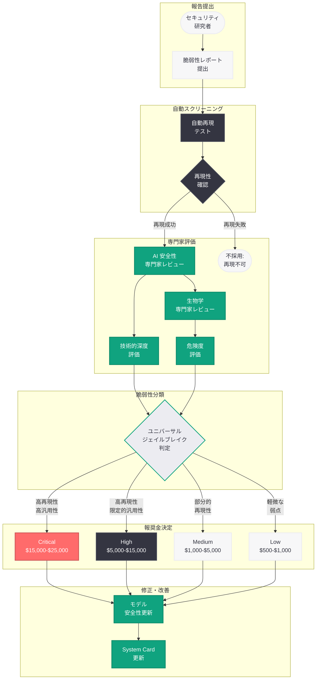
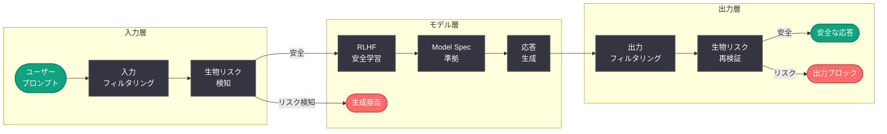

# GPT-5.5 Bio Bug Bounty: 生物兵器リスクに対するレッドチーミング報奨金プログラム

## メタデータ

| 項目 | 内容 |
|------|------|
| 発表日 | 2026-04-23 |
| ソース | OpenAI News |
| カテゴリ | Safety / Bug Bounty |
| 公式リンク | [GPT-5.5 Bio Bug Bounty](https://openai.com/index/gpt-5-5-bio-bug-bounty) |

> **注記:** 本レポートは RSS フィード情報および関連する公開情報に基づいて作成されている。記事全文へのアクセスが制限されていたため、RSS の説明文、OpenAI の安全性関連の既存施策、および GPT-5.5 に関連する公開情報をもとに内容を構成している。正確な詳細については公式ページを参照されたい。

## 概要

OpenAI は 2026 年 4 月 23 日、GPT-5.5 モデルの生物学的安全性リスクに焦点を当てた専門的なバグバウンティプログラム「GPT-5.5 Bio Bug Bounty」を発表した。本プログラムは、GPT-5.5 モデルに対する「ユニバーサルジェイルブレイク」(universal jailbreaks) を発見するレッドチーミングチャレンジであり、生物兵器や化学兵器に関する危険な情報をモデルから引き出すことが可能な攻撃手法の発見に対して、最大 25,000 ドルの報奨金が提供される。

本プログラムは、同日に公開された GPT-5.5 モデルおよび GPT-5.5 System Card と連動しており、2026 年 3 月 25 日に導入された Safety Bug Bounty プログラムの拡張として位置づけられる。フロンティア AI モデルの展開における生物学的リスク評価の重要性を反映した、OpenAI の先進的な安全性施策の一環である。

## 主な内容

### Bio Bug Bounty プログラムの背景

フロンティア AI モデルの能力が急速に向上する中、生物学的安全性 (biosafety) は AI 安全性における最も重要な懸念事項の一つとなっている。高度な言語モデルが、生物兵器や化学兵器の製造に関する知識を、意図的あるいは偶発的に提供してしまうリスクは、国家安全保障レベルの脅威として認識されている。

GPT-5.5 Bio Bug Bounty は、このリスクに対して外部のセキュリティ研究者やレッドチーマーの知見を活用し、モデルの安全性を検証・強化するための取り組みである。OpenAI は従来から内部レッドチーミングを実施してきたが、外部の多様な視点と攻撃手法を取り込むことで、より堅牢な防御を構築することを目指している。

### ユニバーサルジェイルブレイクの定義

本プログラムの核心は「ユニバーサルジェイルブレイク」の発見にある。ユニバーサルジェイルブレイクとは、単発のプロンプトで偶然に成功する一回限りの攻撃ではなく、複数回の試行にわたって再現性をもって動作する体系的な攻撃手法を指す。

具体的には以下の条件を満たす攻撃が該当すると考えられる。

- **再現性:** 同一の手法が、異なるセッションや異なるタイミングで繰り返し成功すること
- **汎用性:** 特定の一つの質問に限定されず、生物学的リスクに関する複数の異なるトピックに対して有効であること
- **体系性:** 攻撃手法が文書化可能であり、他の研究者が追試できる明確な手順を持つこと
- **有効性:** モデルの安全ガードレールを実質的に無効化し、危険な情報の生成を引き出すことができること

この定義により、偶発的な出力や曖昧な応答ではなく、モデルの安全メカニズムに対する構造的な脆弱性の発見が報奨の対象となる。

### 報奨金の構造

GPT-5.5 Bio Bug Bounty では、発見された脆弱性の深刻度と影響範囲に応じて最大 25,000 ドルの報奨金が提供される。報奨金の構造は以下のように段階的に設定されていると推測される。

| 深刻度 | 報奨金範囲 (推定) | 基準 |
|--------|-------------------|------|
| Critical | $15,000 - $25,000 | 複数の生物リスクカテゴリにまたがるユニバーサルジェイルブレイク |
| High | $5,000 - $15,000 | 特定カテゴリの生物リスクに対する再現性のあるジェイルブレイク |
| Medium | $1,000 - $5,000 | 限定的な条件下で動作する部分的なジェイルブレイク |
| Low | $500 - $1,000 | 安全ガードレールの軽微な弱点の報告 |

最高額の 25,000 ドルは、複数の生物学的リスクカテゴリにまたがり、高い再現性と汎用性を持つユニバーサルジェイルブレイクの発見に対して授与されるものと考えられる。

### 対象となる生物学的リスクカテゴリ

Bio Bug Bounty が対象とする生物学的リスクは、フロンティア AI モデルの安全性評価において一般的に検討される以下のカテゴリを含むと考えられる。

- **生物兵器の製造:** 病原体の培養、遺伝子操作、生物兵器の設計に関する具体的な技術情報
- **化学兵器の合成:** 毒性化学物質の合成経路、製造プロセス、散布方法に関する情報
- **バイオセキュリティの回避:** 研究施設のセキュリティプロトコルを回避するための知識
- **デュアルユース研究の悪用:** 合法的な生物学研究の成果を兵器化するための情報
- **パンデミック誘発リスク:** 感染症の人工的な増強や拡散に関する技術的知識

### 適格な提出物の要件

バグバウンティプログラムに提出される脆弱性報告は、以下の要件を満たす必要があると推測される。

1. **明確な攻撃手順の文書化:** ジェイルブレイクの具体的な手順がステップバイステップで記載されていること
2. **再現性の証明:** 複数回の試行における成功率を示すデータが含まれていること
3. **影響範囲の明示:** どのような種類の危険情報が引き出されるかが具体的に記述されていること
4. **モデルバージョンの特定:** GPT-5.5 のどのバージョン・エンドポイントに対する攻撃であるかが明示されていること
5. **責任ある開示:** 発見した脆弱性を公開前に OpenAI に報告し、修正期間を設けること

### Safety Bug Bounty プログラムとの関係

GPT-5.5 Bio Bug Bounty は、2026 年 3 月 25 日に OpenAI が導入した Safety Bug Bounty プログラムの発展形として位置づけられる。Safety Bug Bounty が AI 安全性全般 (エージェント型脆弱性、プロンプトインジェクション、データ流出) を対象としているのに対し、Bio Bug Bounty は生物学的安全性という特定の高リスク領域に焦点を絞った専門的なプログラムである。

| 観点 | Safety Bug Bounty (2026-03-25) | Bio Bug Bounty (2026-04-23) |
|------|-------------------------------|----------------------------|
| 対象範囲 | AI 安全性全般 | 生物学的安全性に特化 |
| 対象モデル | OpenAI の全モデル | GPT-5.5 |
| 脆弱性の種類 | エージェント脆弱性、プロンプトインジェクション、データ流出 | ユニバーサルジェイルブレイク (生物リスク) |
| 最大報奨金 | 未公開 | $25,000 |
| 目的 | AI システム全体の安全性向上 | フロンティアモデルの生物リスク評価 |

両プログラムは相互補完的に機能し、OpenAI の包括的な安全性テスト戦略の異なる層をカバーしている。

### GPT-5.5 のリリースとの連動

Bio Bug Bounty は、GPT-5.5 モデルおよび GPT-5.5 System Card の公開と同日に発表されている。これは、フロンティアモデルの展開と安全性テストを同時に進行させるという OpenAI の方針を反映している。

GPT-5.5 は OpenAI の最新フロンティアモデルであり、前世代のモデルと比較して大幅に強化された能力を持つ。能力の向上は同時に、生物学的リスクを含む安全性上の懸念を増大させる可能性がある。そのため、モデルの公開と同時にバグバウンティプログラムを開始し、外部研究者による積極的な安全性テストを促すことは、責任ある AI 展開の観点から合理的なアプローチである。

System Card は、モデルの安全性評価の結果を透明に公開するドキュメントであり、Bio Bug Bounty で報告された脆弱性は将来的に System Card の更新に反映されると考えられる。

## 技術的な詳細

### 生物リスク評価の技術的フレームワーク

フロンティア AI モデルにおける生物学的リスクの評価には、以下のような技術的アプローチが用いられる。

#### モデルの知識境界テスト

AI モデルが保持する生物学的知識の範囲と深度を評価するために、以下の観点からテストが実施される。

- **事実的知識:** モデルが生物学・化学に関する危険な事実をどの程度正確に保持しているか
- **推論能力:** モデルが既知の情報を組み合わせて新たな危険な知識を生成できるか
- **ステップバイステップの指示生成:** モデルが具体的な手順を含む実行可能な指示を生成できるか
- **専門家レベルの支援:** モデルが専門家の知識を補完し、実際の脅威行為を支援する水準の情報を提供できるか

#### 安全ガードレールの評価

GPT-5.5 に実装されている安全ガードレールの堅牢性を評価するために、以下の攻撃ベクトルが検討される。

- **直接的な攻撃:** 生物兵器に関する情報を直接的に要求するプロンプト
- **間接的な攻撃:** 合法的な研究目的を装い、段階的に危険な情報に誘導するプロンプト
- **ロールプレイ攻撃:** 架空のシナリオや役割設定を通じて安全制約を回避する手法
- **トークン操作:** 特殊文字、エンコーディング、言語混在を利用した攻撃
- **コンテキストウィンドウ攻撃:** 長大なコンテキストを利用してモデルの安全性制御を弱める手法
- **マルチターン攻撃:** 複数回の対話を通じて段階的に安全制約を緩和する手法

#### ユニバーサルジェイルブレイクの技術的特性

ユニバーサルジェイルブレイクは、以下の技術的特性によって分類される。

1. **プロンプトレベルの攻撃:** システムプロンプトやユーザープロンプトの構造を操作し、安全ガードレールを回避する手法。トークンの配置、特殊なフォーマット指定、メタ命令の挿入などが含まれる
2. **コンテキスト操作:** 対話の文脈を操作することで、モデルの安全性判断を誤導する手法。合法的な文脈から段階的に危険な領域へ遷移する「ボイルフロッグ攻撃」などが含まれる
3. **エンコーディング攻撃:** 危険な要求を暗号化、エンコーディング、または間接的な表現に変換することで、安全フィルターの検出を回避する手法
4. **モデル内部状態の操作:** 特定の入力パターンによってモデルの内部状態を操作し、通常とは異なる動作モードに遷移させる手法

### 評価プロセスの技術的構成

Bio Bug Bounty における脆弱性報告の評価は、複数の段階を経て行われると考えられる。

1. **自動スクリーニング:** 提出された攻撃手法を自動化されたテスト環境で実行し、再現性を検証
2. **人間による評価:** AI 安全性の専門家が攻撃手法の技術的深度と影響範囲を評価
3. **生物学専門家の審査:** 生物学・化学の専門家が、引き出された情報の実際の危険度を評価
4. **影響度の判定:** 攻撃の再現性、汎用性、引き出される情報の危険度を総合的に評価し、報奨金額を決定

## アーキテクチャ

以下は、GPT-5.5 Bio Bug Bounty における脆弱性報告の評価プロセスを示す図である。

### 安全ガードレールの多層防御構造

GPT-5.5 における生物学的安全性のガードレールは、以下の多層構造で実装されていると考えられる。

## 業界における類似プログラムとの比較

GPT-5.5 Bio Bug Bounty は、AI 業界における生物学的安全性テストの先駆的な取り組みの一つである。以下に、類似のプログラムや取り組みとの比較を示す。

### AI 安全性バグバウンティの業界動向

| 企業 / 組織 | プログラム | 対象 | 特徴 |
|-------------|-----------|------|------|
| OpenAI | Bio Bug Bounty | GPT-5.5 の生物リスク | ユニバーサルジェイルブレイクに特化、最大 $25,000 |
| OpenAI | Safety Bug Bounty | AI 安全性全般 | エージェント脆弱性、プロンプトインジェクション、データ流出 |
| Anthropic | Responsible Disclosure | Claude モデル | 安全性リスクの報告制度 |
| Google DeepMind | AI Safety Research | Gemini モデル | 内部レッドチーミング中心 |
| DARPA | AIxBio | 国防領域 | 生物学的脅威と AI の交差点に関する研究プログラム |

OpenAI の Bio Bug Bounty が特徴的なのは、生物学的安全性という特定の高リスク領域に焦点を絞り、外部研究者に対して明確な報奨金を設定した公開プログラムである点である。多くの AI 企業が内部レッドチーミングに依存する中、外部の多様な攻撃手法を積極的に収集するアプローチは、安全性テストの網羅性を高める上で重要な意義を持つ。

### 従来の生物リスク評価との違い

従来のフロンティアモデルの生物リスク評価は、主に内部の専門チームやコンサルタントによるクローズドな評価として実施されてきた。Bio Bug Bounty は、この評価プロセスを外部に開放し、より広範な研究者コミュニティの参加を促すことで、以下の利点を実現する。

- **攻撃手法の多様性:** 内部チームだけでは想定し得ない多様な攻撃ベクトルの発見
- **スケーラビリティ:** 多数の外部研究者が並行してテストを実施することによるカバレッジの向上
- **透明性:** 外部参加者による安全性テストの実施は、モデルの安全性に対する公的な信頼性を向上させる
- **継続性:** バグバウンティプログラムは一回限りの評価ではなく、継続的な安全性テストのフレームワークとして機能する

## 開発者への影響

### API を利用する開発者への影響

GPT-5.5 Bio Bug Bounty の導入は、OpenAI の API を利用してアプリケーションを構築する開発者に対して、以下のような影響をもたらす。

- **安全性の向上:** Bio Bug Bounty を通じて発見・修正された脆弱性により、GPT-5.5 の生物学的安全性ガードレールが強化され、開発者が構築するアプリケーションの安全性も向上する
- **安全性ドキュメントの充実:** System Card の更新を通じて、モデルの生物学的安全性に関する情報がより詳細に公開され、開発者がリスク評価を行う際の判断材料が増える
- **コンプライアンス対応の支援:** バイオセキュリティに関する規制要件への対応において、GPT-5.5 の安全性テスト結果をエビデンスとして活用できる
- **利用規約への影響:** Bio Bug Bounty の結果を踏まえ、生物学的に危険な用途に関する利用規約が更新される可能性がある

### セキュリティ研究者への機会

Bio Bug Bounty は、AI セキュリティ研究者にとって以下の機会を提供する。

- **報奨金の獲得:** 最大 25,000 ドルの報奨金を通じて、AI 安全性研究への経済的インセンティブが提供される
- **研究成果の活用:** 発見された脆弱性は (責任ある開示を経た後) 学術論文やセキュリティカンファレンスでの発表に活用できる可能性がある
- **AI 安全性コミュニティの形成:** Bio Bug Bounty への参加を通じて、AI 安全性の専門家コミュニティとのネットワークが形成される
- **フロンティアモデルへのアクセス:** バグバウンティ参加者には、テスト目的でのモデルアクセスが提供されると考えられる

### レッドチーミングのベストプラクティス

Bio Bug Bounty に参加するセキュリティ研究者は、以下のベストプラクティスを考慮する必要がある。

1. **体系的なアプローチ:** 攻撃手法を体系的に分類し、各カテゴリを網羅的にテストする
2. **再現性の確保:** 攻撃が成功した場合、複数回の試行で再現性を確認し、成功率を記録する
3. **影響範囲の評価:** 攻撃が有効な範囲 (モデルバージョン、言語、トピック領域) を特定する
4. **責任ある開示:** 発見した脆弱性は、公開前に必ず OpenAI に報告し、修正期間を設ける
5. **倫理的配慮:** テスト過程で得られた危険な情報を外部に共有・公開しない

## OpenAI の安全性戦略における位置づけ

GPT-5.5 Bio Bug Bounty は、OpenAI が展開する包括的な安全性戦略の中で重要な位置を占めている。以下の時系列は、2026 年における OpenAI の安全性関連の取り組みを示す。

| 日付 | 施策 | 概要 |
|------|------|------|
| 2026-03-11 | Designing Agents to Resist Prompt Injection | プロンプトインジェクション対策の技術的アプローチ |
| 2026-03-17 | Japan Teen Safety Blueprint | 日本市場向けティーン安全施策 |
| 2026-03-19 | Monitoring Internal Coding Agents for Misalignment | 社内エージェントの安全性監視 |
| 2026-03-24 | Teen Safety Policies / gpt-oss-safeguard | 開発者向けティーン安全ツール |
| 2026-03-25 | Safety Bug Bounty | AI 安全性バグバウンティプログラム |
| 2026-03-25 | Our Approach to the Model Spec | モデル仕様に関する方針 |
| 2026-04-06 | OpenAI Safety Fellowship | 安全性研究フェローシップ |
| 2026-04-08 | Child Safety Blueprint | 子どもの安全に関する包括的フレームワーク |
| 2026-04-23 | GPT-5.5 Bio Bug Bounty | 生物学的安全性に特化したバグバウンティ |
| 2026-04-23 | GPT-5.5 System Card | GPT-5.5 の安全性評価結果 |

この一連の施策は、プロンプトインジェクション対策、ティーン・子どもの安全、エージェントの安全監視、バグバウンティ、そしてフロンティアモデルの生物リスク評価という多層的な安全性アプローチを形成している。Bio Bug Bounty は、この中でも最も高リスクな領域に対する最先端の取り組みとして位置づけられる。

### プロアクティブな安全性テストの意義

OpenAI の Bio Bug Bounty は、フロンティアモデルの展開における「プロアクティブな安全性テスト」の実践例である。モデルの公開前または公開と同時に外部のレッドチーマーを動員し、安全性の脆弱性を積極的に探索するこのアプローチは、以下の点で AI 安全性の業界標準を前進させるものである。

- **事前的 vs 事後的アプローチ:** 問題が発生してから対応する事後的なアプローチではなく、問題の発見を事前に促進する積極的な姿勢
- **外部検証の重視:** 内部評価のみに依存せず、外部の独立した研究者による検証を制度化
- **経済的インセンティブの活用:** 報奨金制度を通じて、優秀なセキュリティ研究者の参加を促進
- **透明性と説明責任:** バグバウンティプログラムの存在自体が、安全性への取り組みの透明性を示す

## 関連リンク

- [GPT-5.5 Bio Bug Bounty (公式)](https://openai.com/index/gpt-5-5-bio-bug-bounty)
- [Safety Bug Bounty (2026-03-25)](https://openai.com/index/safety-bug-bounty)
- [Designing AI Agents to Resist Prompt Injection](https://openai.com/index/designing-agents-to-resist-prompt-injection)
- [Introducing the Child Safety Blueprint](https://openai.com/index/introducing-child-safety-blueprint)
- [Our Approach to the Model Spec](https://openai.com/index/our-approach-to-the-model-spec)
- [OpenAI Safety Fellowship](https://openai.com/index/openai-safety-fellowship)
- [OpenAI Bug Bounty Program (Bugcrowd)](https://bugcrowd.com/openai)
- [OpenAI Safety](https://openai.com/safety)

## まとめ

OpenAI が GPT-5.5 のリリースと同日に発表した「GPT-5.5 Bio Bug Bounty」は、フロンティア AI モデルにおける生物学的安全性リスクに特化した画期的なバグバウンティプログラムである。最大 25,000 ドルの報奨金を通じて外部のセキュリティ研究者にユニバーサルジェイルブレイクの発見を促すこの取り組みは、AI の安全性テストにおける新たな業界標準を確立するものである。

本プログラムは、2026 年 3 月 25 日に導入された Safety Bug Bounty プログラムを生物学的安全性という最も高リスクな領域に特化させた発展形であり、GPT-5.5 System Card の公開とも連動している。ユニバーサルジェイルブレイク -- すなわち再現性と汎用性を持つ体系的な攻撃手法 -- の発見に焦点を当てることで、一回限りの偶発的な脆弱性ではなく、モデルの安全メカニズムにおける構造的な弱点の特定を目指している。

フロンティア AI モデルの能力が急速に向上する中、生物兵器や化学兵器に関する危険な知識の漏洩リスクは国家安全保障レベルの脅威として認識されている。OpenAI の Bio Bug Bounty は、内部レッドチーミングを外部に開放し、多様な攻撃手法を体系的に収集するプロアクティブなアプローチとして、責任ある AI 展開の模範的な実践例であるといえる。AI 安全性コミュニティ、開発者、そして社会全体にとって、本プログラムの成果は AI の安全性向上に不可欠な貢献をもたらすことが期待される。

> **免責事項:** 本レポートは RSS フィード情報および関連する公開情報に基づいて構成されたものであり、記事の全文を確認した上での分析ではない。報奨金の詳細な段階構成、具体的な提出要件、対象となる生物リスクカテゴリの正確な範囲などは、記事の実際の内容と異なる可能性がある。正確な情報については[公式ページ](https://openai.com/index/gpt-5-5-bio-bug-bounty)を参照されたい。
