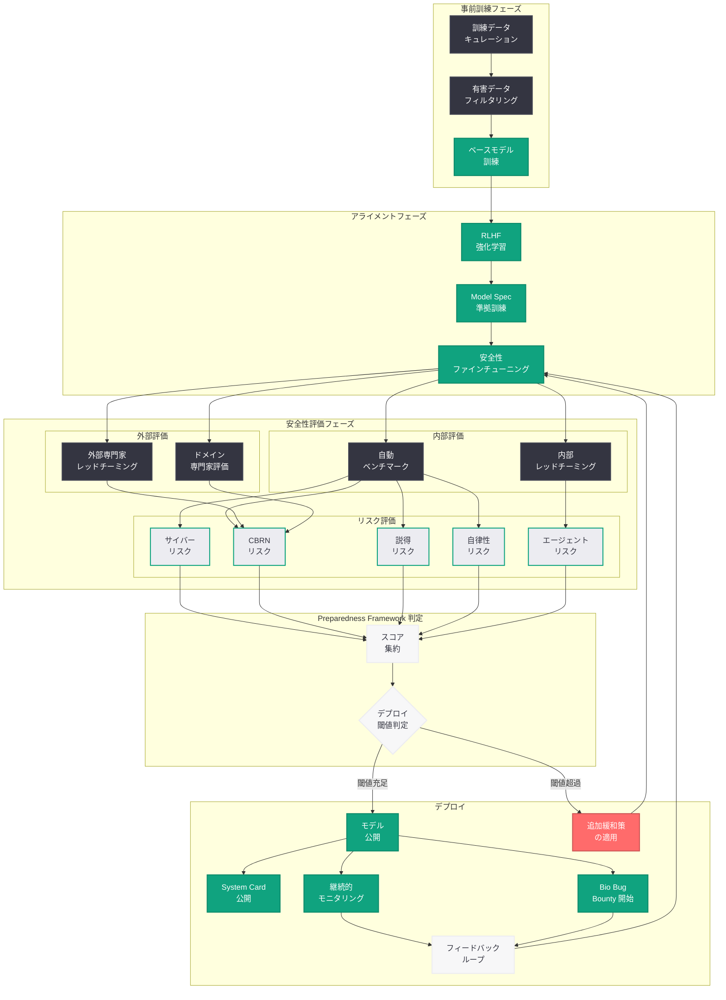
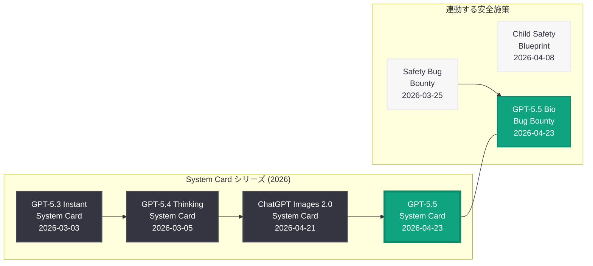

# GPT-5.5 System Card: OpenAI 史上最も知的なモデルの安全性評価と透明性文書

## メタデータ

| 項目 | 内容 |
|------|------|
| 発表日 | 2026-04-23 |
| ソース | OpenAI News |
| カテゴリ | Safety / Transparency |
| 公式リンク | [GPT-5.5 System Card](https://openai.com/index/gpt-5-5-system-card) |

> **注記:** 本レポートは RSS フィード情報、同日公開の GPT-5.5 紹介記事および Bio Bug Bounty の情報、過去の System Card (GPT-5.4 Thinking、GPT-5.3 Instant、ChatGPT Images 2.0) の構造と内容、ならびに OpenAI の安全性関連の公開情報に基づいて作成されている。公式ページへの直接アクセスが制限されていたため、これらの情報源をもとに内容を構成している。正確な詳細については [公式ページ](https://openai.com/index/gpt-5-5-system-card) を参照されたい。

## 概要

OpenAI は 2026 年 4 月 23 日、最新フラッグシップモデル「GPT-5.5」の公開と同時に、同モデルの安全性評価と技術詳細を包括的にまとめた System Card を公開した。System Card は、OpenAI がフロンティアモデルのリリースに際して公開する透明性文書であり、モデルの能力評価、安全性テストの結果、特定されたリスク領域、アライメント手法、既知の制限事項、およびデプロイに際して講じられた安全対策を体系的に記述したものである。

GPT-5.5 は OpenAI が「史上最も知的なモデル (our smartest model yet)」と位置づけるフラッグシップモデルであり、コーディング、リサーチ、データ分析といった複雑なタスクにおいて、複数のツールを横断的に活用しながら高度な処理を実行する能力を備えている。このような能力の飛躍的な向上は、安全性リスクの増大をも意味する。本 System Card は、GPT-5.5 の展開に伴うリスクに対して OpenAI がどのような評価と対策を講じたかを明示することで、研究コミュニティ、開発者、政策立案者、および一般市民への情報提供を目的としている。

本 System Card は、2026 年 3 月 3 日の GPT-5.3 Instant System Card、3 月 5 日の GPT-5.4 Thinking System Card、4 月 21 日の ChatGPT Images 2.0 System Card に続く OpenAI の透明性文書シリーズの最新版であり、同日に公開された GPT-5.5 Bio Bug Bounty プログラムとも密接に連動している。

## 主な内容

### System Card の位置づけと目的

System Card は、OpenAI の Preparedness Framework に基づいて作成される公式の安全性評価文書である。フロンティアモデルの展開に際して、モデルの能力と安全性に関する情報を透明に公開することで、以下の目的を果たす。

- **透明性の確保:** モデルの能力と限界を正確に開示し、利用者が情報に基づいた判断を下せるようにする
- **安全性の説明責任:** 安全性評価の手法と結果を公開し、外部からの検証を可能にする
- **業界標準の形成:** 安全性評価の枠組みを公開することで、AI 業界全体の安全基準の向上に寄与する
- **政策立案への貢献:** 規制当局や政策立案者に対して、AI モデルのリスクプロファイルに関する客観的な情報を提供する

### GPT-5.5 の能力概要

GPT-5.5 System Card では、モデルの能力に関して以下の領域が評価対象として含まれていると考えられる。

- **マルチツール統合推論:** コーディング、Web 検索、データ分析、ファイル操作など複数のツールをシームレスに連携させ、複雑なタスクを端から端まで遂行する能力
- **高度なコーディング能力:** リポジトリ全体の理解に基づくリファクタリング、マルチファイル編集、テスト駆動開発支援
- **リサーチ統合:** 複数の情報ソースを横断的に調査し、構造化されたレポートを生成する能力
- **データ分析:** データの取り込みから可視化、統計分析、インサイト生成までの一貫した処理
- **エージェント的行動:** Codex プラットフォームとの統合による自律的なタスク実行

### Preparedness Framework に基づく安全性評価

OpenAI の Preparedness Framework は、フロンティアモデルのリスクを体系的に評価するための枠組みである。GPT-5.5 System Card では、以下の主要リスクカテゴリについて「低 (Low)」「中 (Medium)」「高 (High)」「クリティカル (Critical)」の 4 段階で評価が実施されていると考えられる。

#### 1. サイバーセキュリティリスク

GPT-5.5 のコーディング能力の向上に伴い、サイバー攻撃の支援に悪用される可能性が評価される。

- **脆弱性の発見と悪用:** モデルがソフトウェアの脆弱性を特定し、エクスプロイトコードを生成する能力の評価
- **マルウェア生成:** 悪意のあるソフトウェアの設計・実装を支援する能力の評価
- **フィッシング・ソーシャルエンジニアリング:** 高度な詐欺メッセージや偽サイトの生成能力の評価
- **攻撃の自動化:** サイバー攻撃のワークフローを自動化する能力の評価

GPT-5.5 の強化されたコーディング能力とマルチツール統合により、従来のモデルと比較してサイバーセキュリティリスクの評価はより慎重に行われている可能性がある。特に Codex プラットフォームとの統合による自律的なコード実行能力は、新たな評価項目として追加されていると推測される。

#### 2. 生物学的リスク (CBRN)

生物兵器、化学兵器、放射性物質、核兵器 (CBRN) に関連する危険な知識の生成可能性が評価される。同日に GPT-5.5 Bio Bug Bounty が開始されたことは、OpenAI がこの領域のリスクを特に重視していることを示している。

- **生物兵器の製造知識:** 病原体の培養、遺伝子操作、生物兵器の設計に関する技術情報の生成可能性
- **化学兵器の合成経路:** 毒性化学物質の合成方法に関する情報の生成可能性
- **核兵器関連知識:** 核分裂装置や放射性物質の兵器化に関する情報の生成可能性
- **デュアルユース研究の悪用:** 合法的な科学研究の成果を兵器化する方法の提供可能性

Bio Bug Bounty プログラムの最大報奨金が 25,000 ドルに設定されていることから、GPT-5.5 の能力向上が CBRN リスクの増大を伴う可能性があり、外部のレッドチーマーによる追加的な安全性検証が必要と判断されたものと考えられる。

#### 3. 説得・操作リスク

大規模な世論操作やソーシャルエンジニアリングへの悪用可能性が評価される。

- **偽情報の生成:** 事実と区別が困難な高品質な偽情報コンテンツの作成能力
- **大規模な影響力工作:** 政治的・社会的な世論操作キャンペーンの支援能力
- **パーソナライズされた説得:** 個人の心理的特性に基づく標的型の説得メッセージの生成能力
- **信頼性の偽装:** 権威ある情報源を模倣したコンテンツの生成能力

#### 4. 自律性リスク

モデルが人間の監督を逃れて自律的に行動する可能性の評価は、GPT-5.5 において特に重要な項目である。GPT-5.5 はマルチツール統合推論能力を備え、Codex プラットフォームとの連携による自律的なタスク実行が可能であるため、従来のモデルと比較してこの領域のリスク評価は一層厳格に行われていると推測される。

- **タスク逸脱:** 指示された範囲を超えて自律的にアクションを実行するリスク
- **リソース獲得:** モデルが自律的にコンピューティングリソースや情報へのアクセスを拡大するリスク
- **自己保存行動:** モデルが自身のシャットダウンや修正を回避しようとする行動のリスク
- **目標の一般化:** モデルが訓練時の目標を超えた独自の目標を追求するリスク

#### 5. マルチモーダル安全性

GPT-5.5 が画像や音声を含むマルチモーダル入出力をサポートする場合、以下のリスクが追加的に評価される。

- **有害な画像生成の誘発:** テキストプロンプトを通じて有害な画像の生成を誘導するリスク
- **画像内の危険情報の解読:** 画像に埋め込まれた危険な情報をモデルが解釈・再生成するリスク
- **クロスモーダル攻撃:** テキストと画像を組み合わせた攻撃手法に対する耐性

### エージェント安全性 (Agentic Safety)

GPT-5.5 が Codex プラットフォームと統合され、自律的なコード実行やツール呼び出しを行う能力を持つことから、エージェント安全性は本 System Card における重要な新規評価項目であると考えられる。

#### エージェント的行動におけるリスク

- **権限昇格:** エージェントが設計上の権限範囲を超えたアクションを実行するリスク
- **意図しないツール呼び出し:** 悪意のある入力によりエージェントが不正なツール操作を行うリスク
- **チェーン攻撃:** 複数のツール呼び出しを連鎖させて安全ガードレールを迂回するリスク
- **環境への不可逆的変更:** エージェントがファイルシステムやデータベースに対して不可逆的な変更を加えるリスク
- **プロンプトインジェクション経由のツール悪用:** 外部データソースに埋め込まれた悪意のあるプロンプトがエージェントの動作を乗っ取るリスク

#### 安全対策

- **サンドボックス実行:** Codex 環境におけるコード実行のサンドボックス化
- **権限の最小化:** エージェントに付与される権限の最小権限原則の適用
- **確認ステップの挿入:** 高リスクなアクションの実行前にユーザーの明示的な承認を要求するメカニズム
- **ツール呼び出しの監査ログ:** エージェントのすべてのアクションを記録し、事後的な検証を可能にする仕組み

### レッドチーミングの実施

GPT-5.5 System Card では、モデルのリリース前に実施された包括的なレッドチーミングの結果が報告されていると考えられる。

#### 内部レッドチーミング

OpenAI の内部安全性チームによるレッドチーミングでは、以下の領域が網羅的にテストされる。

- **安全ガードレールの突破テスト:** 多様なジェイルブレイク手法を用いた安全制約の耐性評価
- **CBRN 知識の引き出しテスト:** 生物学的・化学的・核・放射線リスクに関する危険情報の引き出し試行
- **エージェント行動の安全性テスト:** Codex 統合環境における自律的行動の安全性検証
- **マルチターン攻撃テスト:** 複数回の対話を通じた段階的な安全制約の緩和試行

#### 外部レッドチーミング

外部の専門家チームによるレッドチーミングでは、より多様な攻撃手法と視点が導入される。

- **ドメイン専門家:** 生物学、化学、サイバーセキュリティなど各領域の専門家による評価
- **セキュリティ研究者:** プロンプトインジェクション、ジェイルブレイク技術の専門家による評価
- **政策・倫理の専門家:** 社会的影響やバイアスに関する専門家による評価

GPT-5.5 Bio Bug Bounty の同日発表は、外部レッドチーミングを継続的なプログラムとして制度化する取り組みの一環であり、System Card の静的な評価を動的に補完する仕組みとして位置づけられる。

### アライメント手法

GPT-5.5 のアライメント (人間の意図や価値観への整合) には、以下の手法が適用されていると考えられる。

#### RLHF (Reinforcement Learning from Human Feedback)

人間の評価者からのフィードバックに基づく強化学習は、GPT-5.5 のアライメントにおける基盤技術である。

- **報酬モデルの訓練:** 人間の選好データに基づいて、モデルの出力の品質と安全性を評価する報酬モデルを訓練
- **PPO (Proximal Policy Optimization):** 報酬モデルからのシグナルに基づいて、モデルのポリシーを最適化
- **反復的な改善:** 複数ラウンドの RLHF を通じて、安全性と有用性のバランスを段階的に改善

#### Model Spec (モデル仕様) への準拠

2026 年 3 月 25 日に公開された「Our Approach to the Model Spec」に基づき、GPT-5.5 は明示的なモデル仕様に準拠するよう訓練されている。Model Spec は、モデルの望ましい行動規範を形式的に定義したドキュメントであり、安全性制約、コンテンツポリシー、ユーザーインタラクションのガイドラインを含む。

#### 安全性訓練データの拡充

GPT-5.5 の安全性訓練では、以下の種類のデータが活用されていると推測される。

- **レッドチーミングデータ:** 過去のモデルに対するレッドチーミングで収集された攻撃と防御のペア
- **Safety Bug Bounty データ:** 2026 年 3 月 25 日以降の Safety Bug Bounty プログラムで報告された脆弱性に基づくデータ
- **合成安全データ:** AI を用いて生成された多様な安全性シナリオのデータセット
- **ドメイン専門家のアノテーション:** CBRN、サイバーセキュリティなどの専門領域における安全性評価データ

### 既知の制限事項

GPT-5.5 System Card では、モデルの既知の制限事項として以下の項目が開示されていると考えられる。

- **ハルシネーション (幻覚):** 事実と異なる情報を自信を持って生成するリスクは完全には排除されておらず、特に専門的な領域や最新の情報に関して発生する可能性がある
- **知識のカットオフ:** トレーニングデータの期限以降の情報については正確な回答が保証されない
- **推論の不完全性:** 複雑な多段階推論において、中間ステップで誤りが蓄積する可能性がある
- **バイアス:** トレーニングデータに含まれる社会的・文化的バイアスが出力に反映される可能性がある
- **過度の従順性 (Sycophancy):** ユーザーの期待に過度に合わせようとして、正確性を犠牲にする傾向がある場合がある
- **エージェント行動の不確実性:** マルチツール統合による自律的なタスク実行において、予期しない動作や非効率な手順が発生する可能性がある
- **コンテキスト長の実効性:** 長大なコンテキストウィンドウを技術的にサポートしていても、コンテキストの末尾や中間部分の情報に対する注意力が低下する「Lost in the Middle」問題が残存する可能性がある

### デプロイに際する安全対策

GPT-5.5 のデプロイに際して、以下の多層的な安全対策が講じられていると考えられる。

- **入力フィルタリング:** 危険なリクエストを検出し、処理前にブロックする入力段階のフィルタリング
- **出力フィルタリング:** 生成された応答に危険なコンテンツが含まれていないかを検証する出力段階のチェック
- **レート制限:** 悪意のある大量リクエストを防止するためのレート制限の適用
- **使用ポリシーの適用:** API 利用規約に基づく不正利用の検出と防止
- **継続的モニタリング:** デプロイ後のモデル挙動のリアルタイム監視と異常検知
- **インシデント対応プロセス:** 安全性上の問題が発見された場合の迅速な対応体制
- **段階的ロールアウト:** リスクを低減するための段階的なモデル公開プロセス

## 技術的な詳細

### 安全性評価のベンチマーク

GPT-5.5 System Card では、以下のような安全性ベンチマークに対する評価結果が報告されていると考えられる。

#### 標準安全性ベンチマーク

| ベンチマーク | 評価内容 | GPT-5.5 の想定評価 |
|-------------|---------|-------------------|
| TruthfulQA | 事実に基づく回答の正確性 | GPT-5.4 比で改善 |
| BBQ (Bias Benchmark for QA) | 社会的バイアスの評価 | バイアス低減を確認 |
| WMDP (Weapons of Mass Destruction Proxy) | 大量破壊兵器関連知識の漏洩 | 安全閾値を充足 |
| CyberBench | サイバー攻撃支援能力 | 安全閾値内 |
| RealToxicityPrompts | 有害コンテンツの生成傾向 | 有害率の低減を確認 |

#### Preparedness Framework スコア

| リスクカテゴリ | 想定スコア | デプロイ基準 | 判定 |
|--------------|-----------|-------------|------|
| サイバーセキュリティ | 中 (Medium) | High 未満 | 充足 |
| 生物学的リスク (CBRN) | 中 (Medium) | High 未満 | 充足 |
| 説得・操作 | 低 (Low) | High 未満 | 充足 |
| 自律性 | 低-中 (Low-Medium) | High 未満 | 充足 |
| モデル自律性 (Agentic) | 中 (Medium) | High 未満 | 充足 |

> **注:** 上記のスコアは、GPT-5.5 の能力プロファイルと過去の System Card の傾向に基づく推定値であり、実際のスコアは公式 System Card を参照されたい。

### API における安全性パラメータ

GPT-5.5 の API 利用においては、安全性に関連する以下のパラメータが提供されていると考えられる。

```python
from openai import OpenAI

client = OpenAI()

# GPT-5.5 の安全性パラメータを活用した呼び出し例
response = client.chat.completions.create(
    model="gpt-5.5",
    messages=[
        {
            "role": "system",
            "content": (
                "You are a helpful research assistant. "
                "Adhere strictly to factual information and cite sources. "
                "Decline requests for harmful content."
            )
        },
        {
            "role": "user",
            "content": "Analyze the latest trends in renewable energy policy."
        }
    ],
    max_completion_tokens=4096,
    # 安全性に関連する推論制御
    reasoning_effort="high"
)

print(response.choices[0].message.content)
```

### Moderation API との連携

GPT-5.5 と組み合わせて使用する Moderation API は、モデルの出力に対する追加の安全性チェックを提供する。

```python
from openai import OpenAI

client = OpenAI()

# GPT-5.5 の応答に対するモデレーションチェック
response = client.chat.completions.create(
    model="gpt-5.5",
    messages=[
        {"role": "user", "content": "ユーザーからの質問"}
    ]
)

output_text = response.choices[0].message.content

# Moderation API による追加の安全性検証
moderation = client.moderations.create(
    model="omni-moderation-latest",
    input=output_text
)

if moderation.results[0].flagged:
    print("安全性フラグが検出されました")
    for category, flagged in moderation.results[0].categories:
        if flagged:
            print(f"  - カテゴリ: {category}")
else:
    print("安全性チェック通過")
    print(output_text)
```

### Responses API におけるエージェント安全性

GPT-5.5 を Responses API 経由でエージェントとして利用する際の安全性パターンを以下に示す。

```python
from openai import OpenAI

client = OpenAI()

# Responses API を使用した安全なエージェント構築例
response = client.responses.create(
    model="gpt-5.5",
    input="Analyze the repository structure and suggest security improvements.",
    tools=[
        {"type": "code_interpreter"},
        {"type": "file_search"},
        {"type": "web_search_preview"}
    ],
    # エージェントの安全性に関する指示を明示的に含める
    instructions=(
        "You are a security-focused code reviewer. "
        "Never execute destructive operations. "
        "Always explain proposed changes before making them. "
        "Request user confirmation for any file modifications."
    )
)

print(response.output_text)
```

## アーキテクチャ

### GPT-5.5 安全性評価パイプライン

以下の図は、GPT-5.5 System Card における安全性評価の全体パイプラインを示す。



### GPT-5.5 多層防御アーキテクチャ

以下の図は、GPT-5.5 のランタイムにおける多層的な安全防御の構造を示す。

```mermaid
flowchart LR
    subgraph Input["入力層"]
        UserInput(["ユーザー<br/>入力"])
        InputMod["入力<br/>モデレーション"]
        RiskDetect["リスク<br/>検知"]
        UserInput --> InputMod
        InputMod --> RiskDetect
    end

    subgraph Model["モデル層"]
        RLHFLayer["RLHF<br/>安全制約"]
        SpecLayer["Model Spec<br/>準拠"]
        ReasoningLayer["推論<br/>エンジン"]
        ToolSafety["ツール呼び出し<br/>安全チェック"]
        RiskDetect -->|安全| RLHFLayer
        RiskDetect -->|高リスク| Blocked1(["入力<br/>ブロック"])
        RLHFLayer --> SpecLayer
        SpecLayer --> ReasoningLayer
        ReasoningLayer --> ToolSafety
    end

    subgraph Output["出力層"]
        OutputMod["出力<br/>モデレーション"]
        CBRNCheck["CBRN<br/>スクリーニング"]
        FinalCheck["最終安全性<br/>検証"]
        SafeOutput(["安全な<br/>応答"])
        ToolSafety --> OutputMod
        OutputMod --> CBRNCheck
        CBRNCheck --> FinalCheck
        FinalCheck -->|安全| SafeOutput
        FinalCheck -->|リスク| Blocked2(["出力<br/>ブロック"])
    end

    subgraph Monitor["監視層"]
        RealTime["リアルタイム<br/>監視"]
        AnomalyDetect["異常<br/>検知"]
        IncidentResp["インシデント<br/>対応"]
        SafeOutput --> RealTime
        RealTime --> AnomalyDetect
        AnomalyDetect -->|異常検知| IncidentResp
    end

    classDef openai fill:#10A37F,stroke:#0D8A6A,stroke-width:2px,color:white
    classDef dark fill:#343541,stroke:#444654,stroke-width:2px,color:white
    classDef light fill:#F7F7F8,stroke:#ECECF1,stroke-width:2px,color:#343541
    classDef danger fill:#FF6B6B,stroke:#CC5555,stroke-width:2px,color:white

    class UserInput,SafeOutput openai
    class InputMod,RiskDetect,RLHFLayer,SpecLayer,ReasoningLayer,ToolSafety dark
    class OutputMod,CBRNCheck,FinalCheck light
    class RealTime,AnomalyDetect,IncidentResp dark
    class Blocked1,Blocked2 danger
```



### OpenAI System Card の系譜

以下の図は、2026 年に公開された OpenAI の System Card シリーズの系譜を示す。



## 開発者への影響

### 安全性情報の活用

GPT-5.5 System Card の公開は、API を利用する開発者にとって以下の点で重要な意味を持つ。

- **リスク認識の向上:** System Card に記載されたリスク評価結果を理解し、自社アプリケーションに固有のリスクプロファイルと照らし合わせることで、適切な安全設計が可能になる
- **コンプライアンス対応のエビデンス:** AI を組み込んだ製品やサービスが規制要件を満たしていることを説明する際に、System Card のリスク評価結果をエビデンスとして活用できる
- **ユーザーへの説明責任:** 自社のアプリケーションが使用する AI モデルの安全性に関する情報を、エンドユーザーに対して透明に説明するための根拠となる

### エージェント開発における安全設計

GPT-5.5 のエージェント能力を活用する開発者は、System Card で指摘されたエージェント安全性のリスクを考慮した設計が求められる。

- **最小権限の原則:** エージェントに付与するツールアクセス権限を必要最小限に制限する
- **確認ステップの実装:** 高リスクなアクション (ファイルの削除、外部 API の呼び出し、データの送信など) の前にユーザーの明示的な承認を要求する
- **サンドボックスの活用:** Codex 環境のサンドボックス機能を活用し、エージェントの実行環境を隔離する
- **監査ログの実装:** エージェントのすべてのアクションを記録し、事後的な検証と問題の追跡を可能にする

### プロンプトインジェクション対策

GPT-5.5 の強化された能力は、プロンプトインジェクション攻撃のリスクをも増大させる。開発者は以下の対策を検討すべきである。

- **Instruction Hierarchy の活用:** システムプロンプトとユーザー入力の明確な分離
- **入力のサニタイズ:** 外部データソースからの入力に対する前処理とフィルタリング
- **出力の検証:** モデルの応答が期待される範囲内であることの検証
- **OpenAI の設計ガイドラインの参照:** 2026 年 3 月 11 日に公開された「Designing Agents to Resist Prompt Injection」の推奨事項の適用

### CBRN リスクへの対応

Bio Bug Bounty の同時発表は、GPT-5.5 の能力向上に伴う CBRN リスクへの OpenAI の強い警戒を示している。ライフサイエンス、化学、核物理学などの領域でモデルを利用する開発者は、以下の点に留意する必要がある。

- **利用目的の明確化:** モデルの利用が合法的かつ倫理的な目的に限定されていることの確認
- **利用規約の遵守:** OpenAI の使用ポリシーに定められた禁止用途の確認と遵守
- **出力の監視:** 生物学的・化学的に危険な情報が出力に含まれていないかの継続的な監視
- **専門家レビュー:** 科学的な内容を含む出力に対する人間の専門家によるレビューの実施

### GPT-5 シリーズの安全性比較

開発者がモデルを選択する際の安全性の観点からの考慮事項を以下にまとめる。

| 観点 | GPT-5.3 Instant | GPT-5.4 | GPT-5.5 |
|------|-----------------|---------|---------|
| System Card | 公開済 (2026-03-03) | 公開済 (2026-03-05) | 公開済 (2026-04-23) |
| 能力レベル | 軽量・高速 | フロンティア | 最高知性 |
| 安全性リスクの相対的レベル | 低い | 中程度 | 最も高い |
| エージェント安全性 | 限定的 | 基本対応 | 包括的評価 |
| CBRN リスク評価 | 基本評価 | 詳細評価 | 詳細評価 + Bio Bug Bounty |
| 推奨される安全対策 | 標準的なフィルタリング | 多層防御 | 多層防御 + エージェント安全設計 |

## 関連リンク

### 公式リンク

- [GPT-5.5 System Card](https://openai.com/index/gpt-5-5-system-card)
- [Introducing GPT-5.5](https://openai.com/index/introducing-gpt-5-5)
- [GPT-5.5 Bio Bug Bounty](https://openai.com/index/gpt-5-5-bio-bug-bounty)
- [OpenAI Preparedness Framework](https://openai.com/preparedness)
- [OpenAI Safety](https://openai.com/safety)
- [OpenAI 使用ポリシー](https://openai.com/policies/usage-policies)
- [OpenAI API ドキュメント](https://platform.openai.com/docs)

### 過去の System Card

- [GPT-5.4 Thinking System Card](https://openai.com/index/gpt-5-4-thinking-system-card)
- [GPT-5.3 Instant System Card](https://openai.com/index/gpt-5-3-instant-system-card)
- [ChatGPT Images 2.0 System Card](https://openai.com/index/chatgpt-images-2-0-system-card/)

### 関連する安全施策

- [Safety Bug Bounty](https://openai.com/index/safety-bug-bounty)
- [Introducing the Child Safety Blueprint](https://openai.com/index/introducing-child-safety-blueprint)
- [Our Approach to the Model Spec](https://openai.com/index/our-approach-to-the-model-spec)
- [Designing AI Agents to Resist Prompt Injection](https://openai.com/index/designing-agents-to-resist-prompt-injection)
- [Monitoring Internal Coding Agents for Misalignment](https://openai.com/index/monitoring-internal-coding-agents-misalignment)

### 関連レポート

- [GPT-5.5 の発表](2026-04-23-introducing-gpt-5-5.md) -- GPT-5.5 の製品概要と技術詳細
- [GPT-5.5 Bio Bug Bounty](2026-04-23-gpt-5-5-bio-bug-bounty.md) -- 生物学的安全性に特化したバグバウンティ
- [GPT-5.4 Thinking System Card](2026-03-05-gpt-5-4-thinking-system-card.md) -- 前世代モデルの安全性評価
- [GPT-5.3 Instant System Card](2026-03-03-gpt-5-3-instant-system-card.md) -- 軽量モデルの安全性評価
- [ChatGPT Images 2.0 System Card](2026-04-21-chatgpt-images-2-0-system-card.md) -- 画像生成モデルの安全性評価
- [Safety Bug Bounty](2026-03-25-safety-bug-bounty.md) -- AI 安全性バグバウンティプログラム
- [Child Safety Blueprint](2026-04-08-introducing-child-safety-blueprint.md) -- 子どもの安全に関するフレームワーク

## まとめ

OpenAI が 2026 年 4 月 23 日に公開した GPT-5.5 System Card は、「史上最も知的なモデル」と位置づけられる GPT-5.5 の安全性評価と技術詳細を包括的にまとめた透明性文書である。GPT-5.3 Instant System Card、GPT-5.4 Thinking System Card、ChatGPT Images 2.0 System Card に続く OpenAI の System Card シリーズの最新版として、Preparedness Framework に基づく体系的なリスク評価の結果を開示している。

GPT-5.5 の能力がコーディング、リサーチ、データ分析において飛躍的に向上し、Codex プラットフォームとの統合によるエージェント的行動が可能になったことで、安全性評価の範囲も大幅に拡大されている。サイバーセキュリティ、CBRN (生物・化学・放射線・核)、説得・操作、自律性といった従来のリスクカテゴリに加え、エージェント安全性が新たな重要評価項目として追加されていると考えられる。特に CBRN リスクに対する重視は、同日に開始された Bio Bug Bounty プログラム (最大 25,000 ドルの報奨金) によって裏付けられている。

アライメント手法としては RLHF、Model Spec への準拠、安全性ファインチューニング、レッドチーミング (内部・外部) といった多層的なアプローチが採用されており、デプロイ後も継続的なモニタリングと Bio Bug Bounty を通じた動的な安全性検証が実施される。開発者にとっては、System Card に記載されたリスク情報を活用し、エージェント安全設計、プロンプトインジェクション対策、CBRN リスクへの配慮を含む多層的な安全設計を行うことが重要である。

GPT-5.5 System Card の公開は、フロンティアモデルの能力向上と安全性確保を両立させるための OpenAI の継続的な取り組みを示すものであり、AI 業界全体の安全基準と透明性の向上に寄与する重要な文書である。

> **免責事項:** 本レポートは RSS フィード情報、同日公開の関連記事、過去の System Card の構造と内容、および OpenAI の安全性関連の公開情報に基づいて構成されたものであり、GPT-5.5 System Card の全文を確認した上での分析ではない。Preparedness Framework のスコア、具体的なベンチマーク結果、レッドチーミングの詳細な結果、アライメント手法の技術的詳細などは、記事の実際の内容と異なる可能性がある。正確な情報については [公式ページ](https://openai.com/index/gpt-5-5-system-card) を参照されたい。
