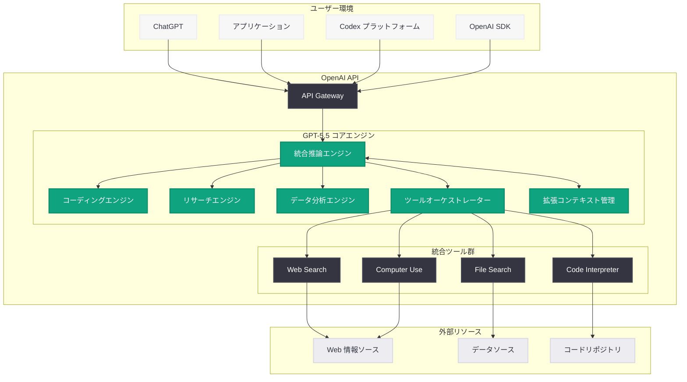
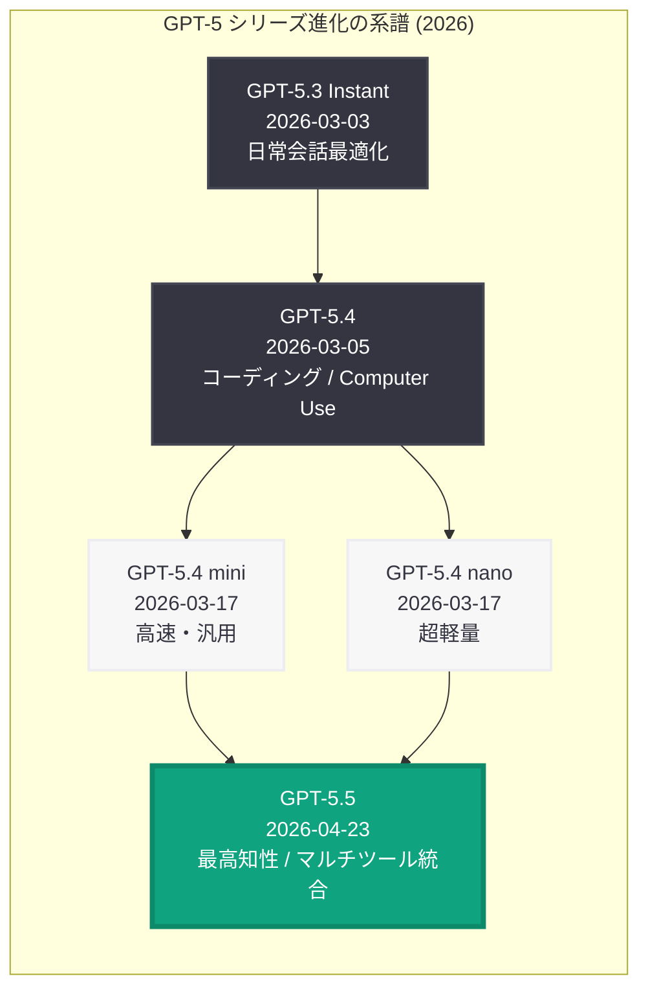
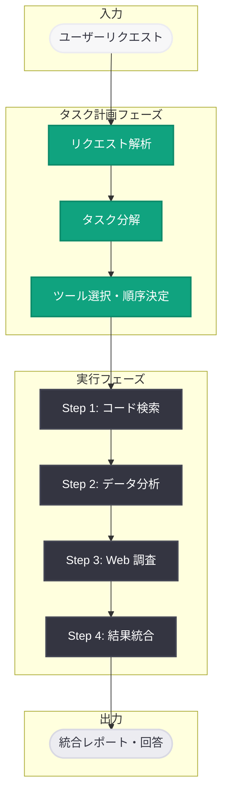

# GPT-5.5 の発表: OpenAI 史上最も知的なモデル -- コーディング、リサーチ、データ分析を統合する次世代 AI

## メタデータ

| 項目 | 内容 |
|------|------|
| 発表日 | 2026-04-23 |
| ソース | OpenAI News |
| カテゴリ | Product |
| 公式リンク | [Introducing GPT-5.5](https://openai.com/index/introducing-gpt-5-5) |

> **注記:** 本レポートは OpenAI の公式発表に基づいて作成されている。公式ページへの直接アクセスが制限されていたため、公式の説明文および関連する公開情報をもとに内容を構成している。正確な詳細については [公式ページ](https://openai.com/index/introducing-gpt-5-5) を参照されたい。

## 概要

OpenAI は 2026 年 4 月 23 日、最新のフラッグシップモデル「GPT-5.5」を発表した。OpenAI はこれを「史上最も知的なモデル (our smartest model yet)」と位置づけており、前世代の GPT-5.4 を上回る速度と能力を兼ね備えている。特にコーディング、リサーチ、データ分析といった複雑なタスクにおいて、複数のツールを横断的に活用しながら高度な処理を実行できる点が最大の特徴である。

GPT-5.5 は、2026 年に入ってから急速に進化してきた GPT-5 シリーズの最新到達点となる。3 月 3 日の GPT-5.3 Instant、3 月 5 日の GPT-5.4、3 月 17 日の GPT-5.4 mini / nano を経て、約 1 か月半ぶりのメジャーアップデートとして登場した。同日には GPT-5.5 System Card および GPT-5.5 Bio Bug Bounty プログラム、さらに Codex Academy ガイド (オートメーション、プラグイン、スキル) も公開されており、OpenAI のエコシステム全体が新モデルを中心に大きく拡張されている。

## 主な内容

### 「史上最も知的なモデル」の意味

GPT-5.5 が「smartest model yet」と評される背景には、単なるベンチマークスコアの向上だけでなく、タスク遂行における総合的な知性の飛躍がある。

- **マルチツール統合推論:** コーディング、Web 検索、データ分析、ファイル操作など複数のツールをシームレスに連携させ、一つの複雑なタスクを端から端まで遂行する能力
- **深い文脈理解:** 長大なドキュメントやコードベース全体を把握した上で、本質的な洞察を導き出す推論力の向上
- **自律的なタスク分解:** 複雑な問題を適切なサブタスクに自動分解し、最適なツールを選択して段階的に解決する計画能力
- **精度と速度の両立:** GPT-5.4 対比で推論精度を向上させつつ、応答速度も改善するという従来トレードオフとされていた 2 つの指標を同時に向上

### コーディング能力の飛躍

GPT-5.5 は、コーディングタスクにおいて GPT-5 シリーズ史上最高の性能を達成している。

- **大規模リファクタリング:** リポジトリ全体のアーキテクチャを理解した上での包括的なリファクタリング提案と実行
- **マルチファイル編集:** 複数のファイルにまたがる変更を整合性を保ちながら一貫して実施
- **テスト駆動開発支援:** コード変更に対応したユニットテスト・統合テストの自動生成と既存テストの修正
- **デバッグの高度化:** スタックトレース、ログ、コードの相互参照による根本原因の特定精度が向上
- **多言語対応の拡充:** Python、JavaScript、TypeScript、Rust、Go、Java、C++、C#、Kotlin、Swift など主要言語のサポートがさらに強化

### リサーチ能力の強化

GPT-5.5 は、調査・研究タスクにおいても大幅な進化を遂げている。

- **深層 Web 検索:** 複数の情報ソースを横断的に調査し、矛盾する情報を検出・評価する能力
- **論文分析:** 学術論文の構造的な理解、要約、批判的評価を高精度で実行
- **ファクトチェック:** 主張の根拠を自動的に検証し、信頼性の評価を付与
- **レポート生成:** 調査結果を構造化されたレポートとして自動的にまとめる能力

### データ分析のクロスツール統合

GPT-5.5 の最も革新的な特徴の一つが、データ分析における複数ツールの横断的な活用である。

- **データ取り込みから可視化まで:** CSV、Excel、JSON、データベースなど多様なソースからデータを取り込み、分析、可視化までを一貫して実行
- **統計分析の自動化:** 記述統計、相関分析、回帰分析などの統計手法を自動的に選択・適用
- **インサイトの自動発見:** データのパターンや異常値を自動検出し、ビジネスインサイトとして提示
- **コード生成による再現性:** 分析プロセスを Python / R コードとして出力し、分析の再現性を担保

### GPT-5.4 からの進化ポイント

| 特性 | GPT-5.4 | GPT-5.5 |
|------|---------|---------|
| 総合知性 | フロンティアモデル | 史上最高の知性 |
| コーディング | 最先端 | さらに向上 |
| リサーチ | 高性能 | クロスツール統合リサーチ |
| データ分析 | 対応 | ツール横断型の統合分析 |
| 応答速度 | 標準 | 高速化 |
| ツール統合 | ツール検索対応 | マルチツール統合推論 |
| Computer Use | 対応 | 強化・安定化 |
| コンテキスト長 | 1M トークン | 1M トークン以上 (拡張の可能性) |
| Codex 統合 | 基本対応 | Codex Academy との深い連携 |

## 技術的な詳細

### API モデル名

GPT-5.5 は OpenAI API の Chat Completions エンドポイントおよび Responses API から以下のモデル名で利用可能と想定される。

- **フラッグシップモデル:** `gpt-5.5`

### コードサンプル: 基本的な Chat Completions API の呼び出し

```python
from openai import OpenAI

client = OpenAI()

# GPT-5.5 による基本的な対話
response = client.chat.completions.create(
    model="gpt-5.5",
    messages=[
        {
            "role": "system",
            "content": "You are a senior software architect with deep expertise in distributed systems."
        },
        {
            "role": "user",
            "content": "Design a fault-tolerant event sourcing architecture for a financial trading platform."
        }
    ],
    max_tokens=4096
)

print(response.choices[0].message.content)
```

### コードサンプル: ストリーミングによるリアルタイム応答

```python
from openai import OpenAI

client = OpenAI()

# GPT-5.5 のストリーミング応答
stream = client.chat.completions.create(
    model="gpt-5.5",
    messages=[
        {
            "role": "system",
            "content": "You are a data scientist. Analyze data and provide actionable insights."
        },
        {
            "role": "user",
            "content": (
                "Analyze the following quarterly revenue data and identify trends:\n"
                "Q1: $2.3M, Q2: $2.8M, Q3: $2.1M, Q4: $3.5M, "
                "Q5: $3.2M, Q6: $4.1M, Q7: $3.8M, Q8: $5.2M"
            )
        }
    ],
    stream=True
)

for chunk in stream:
    if chunk.choices[0].delta.content is not None:
        print(chunk.choices[0].delta.content, end="", flush=True)
print()
```

### コードサンプル: Function Calling によるマルチツール統合

GPT-5.5 の強みであるマルチツール統合を活用した例を以下に示す。

```python
import json
from openai import OpenAI

client = OpenAI()

# マルチツール定義
tools = [
    {
        "type": "function",
        "function": {
            "name": "search_codebase",
            "description": "Search for code patterns, functions, or classes in a repository",
            "parameters": {
                "type": "object",
                "properties": {
                    "query": {
                        "type": "string",
                        "description": "Search query for code patterns"
                    },
                    "language": {
                        "type": "string",
                        "description": "Programming language filter"
                    }
                },
                "required": ["query"]
            }
        }
    },
    {
        "type": "function",
        "function": {
            "name": "run_analysis",
            "description": "Execute data analysis on a dataset",
            "parameters": {
                "type": "object",
                "properties": {
                    "dataset_path": {
                        "type": "string",
                        "description": "Path to the dataset file"
                    },
                    "analysis_type": {
                        "type": "string",
                        "enum": ["descriptive", "correlation", "regression", "clustering"],
                        "description": "Type of analysis to perform"
                    }
                },
                "required": ["dataset_path", "analysis_type"]
            }
        }
    },
    {
        "type": "function",
        "function": {
            "name": "web_search",
            "description": "Search the web for current information",
            "parameters": {
                "type": "object",
                "properties": {
                    "query": {
                        "type": "string",
                        "description": "Search query"
                    }
                },
                "required": ["query"]
            }
        }
    }
]

# GPT-5.5 によるマルチツール活用
response = client.chat.completions.create(
    model="gpt-5.5",
    messages=[
        {
            "role": "system",
            "content": (
                "You are a research assistant that can search codebases, "
                "analyze data, and search the web. Use multiple tools as "
                "needed to provide comprehensive answers."
            )
        },
        {
            "role": "user",
            "content": (
                "Our API response times have increased by 40% this week. "
                "Search our codebase for recent changes to the request handler, "
                "analyze the performance metrics dataset, and check if there are "
                "any known issues with our cloud provider."
            )
        }
    ],
    tools=tools,
    tool_choice="auto"
)

# ツール呼び出しの処理
message = response.choices[0].message
if message.tool_calls:
    print(f"GPT-5.5 selected {len(message.tool_calls)} tools:")
    for tool_call in message.tool_calls:
        func = tool_call.function
        args = json.loads(func.arguments)
        print(f"  - {func.name}: {json.dumps(args, indent=2)}")
```

### コードサンプル: Responses API での利用

GPT-5.5 は OpenAI の Responses API でも利用可能と想定される。

```python
from openai import OpenAI

client = OpenAI()

# Responses API を使用したリサーチタスク
response = client.responses.create(
    model="gpt-5.5",
    input="Summarize the latest advances in quantum error correction published in 2026.",
    tools=[
        {"type": "web_search_preview"}
    ]
)

print(response.output_text)
```

### コードサンプル: Codex との統合利用

GPT-5.5 は Codex プラットフォームとの深い統合が想定される。

```python
from openai import OpenAI

client = OpenAI()

# Codex タスクとしての非同期コード生成
codex_response = client.responses.create(
    model="gpt-5.5",
    input=(
        "Refactor the authentication module to use OAuth 2.0 with PKCE flow. "
        "Update all related test files and ensure backward compatibility. "
        "Create a migration guide document."
    ),
    tools=[
        {"type": "code_interpreter"},
        {"type": "file_search"}
    ]
)

print(codex_response.output_text)
```

> **注:** 上記のコード例は一般的な利用パターンの想定であり、実際の API パラメータやツール指定の詳細は公式ドキュメントを参照されたい。

## アーキテクチャ

### GPT-5.5 のシステムアーキテクチャ



### GPT-5 シリーズの系譜



### マルチツール統合の動作フロー



## 開発者への影響

### コーディングワークフローの変革

GPT-5.5 の登場により、ソフトウェア開発のワークフローが根本的に変化する可能性がある。

- **エンドツーエンドの開発支援:** 要件定義からコード実装、テスト、デプロイまでの一連のプロセスを AI が一貫して支援。Codex プラットフォームとの連携により、非同期でのコードタスク実行が実用的なレベルに到達
- **コードレビューの高度化:** リポジトリ全体のコンテキストを踏まえた精緻なコードレビューが可能になり、セキュリティ脆弱性やパフォーマンスボトルネックの検出精度が向上
- **技術的負債の解消:** 大規模リファクタリングやアーキテクチャ移行を AI が計画・実行支援することで、技術的負債の解消が加速

### リサーチ・分析業務の効率化

GPT-5.5 のマルチツール統合能力は、リサーチや分析業務に大きなインパクトをもたらす。

- **自動調査レポート:** Web 検索、論文分析、データ分析を組み合わせた包括的な調査レポートの自動生成
- **意思決定支援:** データドリブンなインサイトの抽出から、アクションプランの提案までを一気通貫で実行
- **競合分析の自動化:** 公開情報の収集、分析、レポート化を自動的に実行し、戦略立案を支援

### Codex プラットフォームとの統合

GPT-5.5 は同日公開の Codex Academy ガイドとともに、Codex プラットフォームの中核モデルとしての役割を担うことが期待される。

- **オートメーション:** 定型的な開発タスクの自動化パイプラインを GPT-5.5 ベースで構築
- **プラグイン:** サードパーティツールとの連携プラグインを活用した拡張エコシステム
- **スキル:** カスタムスキルの定義により、チーム固有のワークフローに GPT-5.5 を適応

### GPT-5 シリーズのモデル選択ガイド

GPT-5.5 の追加により、開発者は用途に応じてさらに細かくモデルを選択できるようになった。

| ユースケース | 推奨モデル | 理由 |
|-------------|-----------|------|
| 最高精度のコーディング・リサーチ | GPT-5.5 | 最高の知性とマルチツール統合 |
| 高度な専門タスク | GPT-5.4 | 高性能かつ安定した実績 |
| 汎用開発・エージェント | GPT-5.4 mini | コストと性能のバランス |
| 大量 API / サブエージェント | GPT-5.4 nano | 超低レイテンシ・最低コスト |
| 日常会話・カスタマーサポート | GPT-5.3 Instant | 高速応答・自然な対話 |

### 移行時の考慮事項

- **プロンプトの最適化:** GPT-5.5 はマルチツール統合を前提とした設計のため、ツール定義を含むプロンプトの再設計が効果的である
- **コスト管理:** フラッグシップモデルとしてトークン単価が GPT-5.4 以上になる可能性があるため、モデルルーティングによるコスト最適化を検討すべき
- **段階的移行:** GPT-5.4 からの移行は、まず非本番環境でのベンチマーク比較を実施し、性能向上を確認した上で本番環境に適用する段階的アプローチが推奨される
- **System Card の確認:** 同日公開の GPT-5.5 System Card を確認し、安全性ガイドラインや制限事項を把握した上で統合を進めることが重要
- **セキュリティ:** GPT-5.5 Bio Bug Bounty プログラムが同時に開始されたことから、安全性に対する OpenAI の姿勢が伺える。プロダクション利用時にはセキュリティレビューを実施すべきである

## 関連リンク

- [GPT-5.5 公式発表ページ](https://openai.com/index/introducing-gpt-5-5)
- [OpenAI API ドキュメント](https://platform.openai.com/docs)
- [OpenAI モデル一覧](https://platform.openai.com/docs/models)
- [OpenAI Pricing](https://openai.com/pricing)
- [Codex プラットフォーム](https://openai.com/index/codex)

### 関連レポート

- [GPT-5.4 の発表](2026-03-05-introducing-gpt-5-4.md) -- GPT-5.5 の前世代フラッグシップモデル
- [GPT-5.4 mini / nano の発表](2026-03-17-introducing-gpt-5-4-mini-and-nano.md) -- GPT-5.4 ファミリーの小型バリアント
- [GPT-5.3 Instant の発表](2026-03-03-gpt-5-3-instant.md) -- 日常会話最適化モデル
- [ChatGPT Images 2.0 の発表](2026-04-21-chatgpt-images-2-0.md) -- 推論ベース画像生成の革新
- [Codex Labs の発表](2026-04-21-codex-labs.md) -- Codex プラットフォームの新機能
- [Codex Remote Connections](2026-04-22-codex-remote-connections.md) -- Codex のリモート接続機能
- [Scaling Codex for Enterprises](2026-04-21-scaling-codex-enterprises.md) -- エンタープライズ向け Codex の拡張

## まとめ

GPT-5.5 は、OpenAI が「史上最も知的なモデル」と位置づける最新のフラッグシップモデルであり、2026 年に入ってから急速に進化してきた GPT-5 シリーズの集大成と言える存在である。最大の革新はマルチツール統合推論であり、コーディング、リサーチ、データ分析という 3 つの高度なタスクを、複数のツールを横断的に活用しながらシームレスに遂行する能力を備えている。GPT-5.4 からの進化として、推論精度の向上と応答速度の改善を同時に達成した点も注目に値する。

同日に公開された GPT-5.5 System Card、Bio Bug Bounty プログラム、Codex Academy ガイドは、OpenAI が新モデルの性能向上と安全性確保、そしてエコシステムの拡張を三位一体で推進していることを示している。開発者にとっては、GPT-5.3 Instant から GPT-5.5 まで用途に応じた豊富なモデル選択肢が揃い、Codex プラットフォームとの統合によりソフトウェア開発の自動化が新たな段階に入ったことを意味する。

今後は GPT-5.5 の実際のベンチマーク結果やコミュニティでの実践的な評価が蓄積されることで、その真のポテンシャルが明らかになるだろう。GPT-5.5 mini や nano といった小型バリアントの登場も予想され、GPT-5 シリーズのエコシステムがさらに拡大していくことが期待される。
