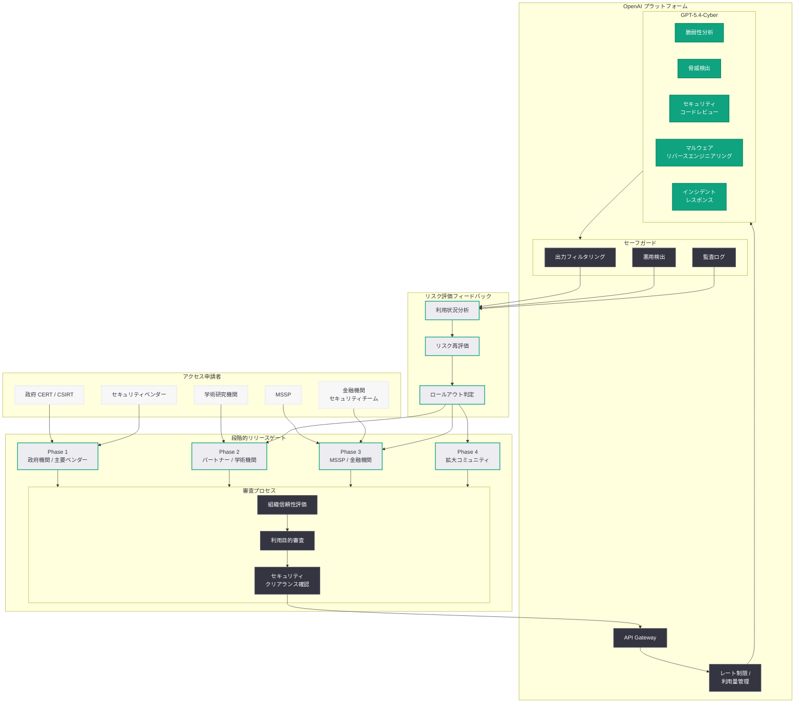
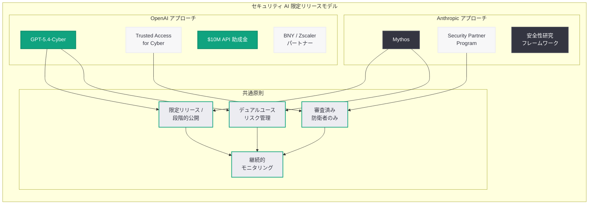

# GPT-5.4-Cyber の限定リリース: Anthropic に続く段階的公開アプローチの採用

## メタデータ

| 項目 | 内容 |
|------|------|
| 発表日 | 2026-04-24 |
| ソース | OpenAI API / News |
| カテゴリ | API 更新 / Security |
| 公式リンク | [GPT-5.4-Cyber](https://openai.com/index/gpt-5-4-cyber) |

> **注記:** 本レポートは Mashable をはじめとする複数のニュースソースの報道に基づいて作成されている。OpenAI の公式ページへの直接アクセスが制限されていたため、報道内容および過去の関連レポート ([2026-04-14: Trusted Access プログラムの拡大](./2026-04-14-scaling-trusted-access-cyber-defense.md)、[2026-04-16: サイバー防衛エコシステムの加速](./2026-04-16-accelerating-cyber-defense-ecosystem.md)) の情報を基に構成している。

## 概要

OpenAI は 2026 年 4 月 24 日、サイバーセキュリティ特化モデル GPT-5.4-Cyber の限定リリースを正式に発表した。Mashable をはじめとする複数のメディアが「OpenAI follows Anthropic's lead in limited release of GPT-5.4-Cyber」と報じたように、今回のリリースは Anthropic がセキュリティ特化モデルで採用してきた段階的かつ制御されたリリース手法を OpenAI が明確に踏襲したものとして注目を集めている。

GPT-5.4-Cyber は全ユーザーに一般公開されるのではなく、審査を通過したセキュリティ研究者および組織のみに提供される。サイバーセキュリティ AI のデュアルユースリスク (防衛と攻撃の双方に利用可能なリスク) を考慮し、OpenAI は段階的なロールアウト計画を策定している。4 月 14 日の Trusted Access プログラム拡大、4 月 16 日のエコシステム助成金プログラム発表に続く今回の動きは、OpenAI のサイバーセキュリティ戦略が新たなフェーズに入ったことを示している。

## 主な内容

### Anthropic のアプローチに倣う限定リリース

今回の発表において最も注目すべき点は、OpenAI が Anthropic のセキュリティ特化モデルにおけるリリース戦略を明確に参照し、同様の限定リリースアプローチを採用したことである。Anthropic は Mythos サイバーセキュリティモデルにおいて、一般公開に先立ち審査済みの防衛者に限定的にアクセスを提供する手法を確立しており、OpenAI はこの業界プラクティスを自社のリリース戦略に取り入れた。

限定リリースの主な特徴は以下の通りである。

- **審査制アクセス:** GPT-5.4-Cyber へのアクセスは、Trusted Access for Cyber プログラムの審査を通過した組織および個人に限定される。一般の API ユーザーは現時点で利用できない
- **段階的ロールアウト:** サイバーセキュリティリスクの評価に基づき、段階的にアクセス範囲を拡大する計画が策定されている。第 1 段階では政府機関の CERT、大手セキュリティベンダー、学術研究機関が対象となる
- **利用目的の制限:** 防衛目的での利用に厳格に限定され、攻撃的セキュリティテスト (レッドチーミング) への利用には追加の審査が必要となる
- **継続的な監視と評価:** リリース後もモデルの利用状況を継続的に監視し、悪用の兆候がないか評価を行う

### サイバーセキュリティ特化の強化機能

GPT-5.4-Cyber は GPT-5.4 をベースに、サイバーセキュリティ防衛に特化した以下の機能が強化されている。

- **脆弱性分析:** CVE データベースとの深い統合により、既知および未知の脆弱性を高精度で特定する。CVSS スコアに基づく自動的な重大度評価と修復ガイダンスを提供する
- **脅威検出:** ネットワークログ、エンドポイントテレメトリ、脅威インテリジェンスフィードをリアルタイムで分析し、MITRE ATT&CK フレームワークに対応した脅威マッピングを生成する
- **セキュリティコードレビュー:** GPT-5.4 の 1M トークンコンテキストウィンドウを活用した大規模コードベースのセキュリティ監査。OWASP Top 10 を含む包括的な脆弱性検出が可能
- **マルウェアリバースエンジニアリング:** バイナリ解析、コード難読化解除、挙動分析といった高度なマルウェア解析を支援する
- **インシデントレスポンス自動化:** セキュリティインシデントの検出、トリアージ、封じ込め手順の自動生成により、対応時間を大幅に短縮する

### デュアルユースリスクへの慎重なアプローチ

OpenAI が限定リリースを採用した背景には、サイバーセキュリティ AI のデュアルユースリスクに対する慎重な姿勢がある。

- **攻撃への転用リスク:** 脆弱性分析やマルウェア解析の能力は、防衛だけでなく攻撃にも転用可能である。OpenAI はこのリスクを認識し、アクセス制御と出力制御の両面でセーフガードを実装している
- **責任ある AI セキュリティの確立:** Anthropic と同様に、セキュリティ特化モデルの責任あるリリースの業界標準を形成することを目指している
- **段階的リスク評価:** 限定リリースの各段階で利用データを分析し、リスク評価を更新した上で次の段階に進むという慎重なプロセスを採用している
- **Red teaming の実施:** リリース前に外部のセキュリティ専門家による包括的な Red teaming を実施し、悪用シナリオの洗い出しと対策を講じている

### 段階的ロールアウト計画

報道によれば、GPT-5.4-Cyber のロールアウトは以下の段階で進行する見込みである。

| フェーズ | 対象 | 時期 (予定) |
|---------|------|-----------|
| Phase 1 | 政府 CERT/CSIRT、主要セキュリティベンダー | 2026 年 4 月 (現在) |
| Phase 2 | Trusted Access パートナー企業、学術研究機関 | 2026 年 5 月 |
| Phase 3 | 認定 MSSP、金融機関セキュリティチーム | 2026 年 6 月 |
| Phase 4 | API 助成金受給者、拡大された防衛者コミュニティ | 2026 年下半期 |

## 技術的な詳細

### GPT-5.4-Cyber API の基本利用

限定リリースの対象者は、OpenAI API を通じて GPT-5.4-Cyber にアクセスする。以下は基本的な利用パターンである。

```python
from openai import OpenAI

client = OpenAI()

# 脆弱性分析の基本例
response = client.chat.completions.create(
    model="gpt-5.4-cyber",
    messages=[
        {
            "role": "system",
            "content": (
                "You are a cybersecurity vulnerability analyst. "
                "Analyze the provided code or system configuration for "
                "security vulnerabilities. Classify findings by CVSS score "
                "and provide actionable remediation guidance."
            )
        },
        {
            "role": "user",
            "content": (
                "Analyze this web application code for vulnerabilities:\n\n"
                "```python\n"
                "from flask import Flask, request\n"
                "import sqlite3\n\n"
                "app = Flask(__name__)\n\n"
                "@app.route('/search')\n"
                "def search():\n"
                "    query = request.args.get('q')\n"
                "    conn = sqlite3.connect('app.db')\n"
                "    cursor = conn.execute(\n"
                "        f\"SELECT * FROM products WHERE name LIKE '%{query}%'\"\n"
                "    )\n"
                "    results = cursor.fetchall()\n"
                "    return {'results': results}\n"
                "```"
            )
        }
    ],
    max_tokens=4096
)

print(response.choices[0].message.content)
```

### 脅威インテリジェンス分析

MITRE ATT&CK フレームワークに基づく構造化された脅威分析を実行する例である。

```python
from openai import OpenAI
import json

client = OpenAI()


def analyze_threat_indicators(iocs: list[str]) -> dict:
    """
    IoC (Indicators of Compromise) のリストを分析し、
    MITRE ATT&CK マッピングと脅威評価を返す。
    """
    ioc_text = "\n".join(f"- {ioc}" for ioc in iocs)

    response = client.chat.completions.create(
        model="gpt-5.4-cyber",
        messages=[
            {
                "role": "system",
                "content": (
                    "You are a threat intelligence analyst with deep expertise "
                    "in the MITRE ATT&CK framework. Analyze the provided "
                    "indicators of compromise and produce a structured threat "
                    "assessment. Map each indicator to relevant ATT&CK "
                    "techniques and provide confidence scores."
                )
            },
            {
                "role": "user",
                "content": (
                    "Analyze these indicators of compromise:\n\n"
                    f"{ioc_text}\n\n"
                    "Provide:\n"
                    "1. Threat actor attribution (if possible)\n"
                    "2. MITRE ATT&CK technique mapping\n"
                    "3. Kill chain phase identification\n"
                    "4. Severity assessment\n"
                    "5. Recommended defensive actions"
                )
            }
        ],
        max_tokens=8192,
        response_format={"type": "json_object"}
    )

    return json.loads(response.choices[0].message.content)


# 使用例
indicators = [
    "DNS query to c2-beacon-7f3a.example-malware.net",
    "Outbound HTTPS to 203.0.113.42:8443 every 60s",
    "PowerShell: IEX(New-Object Net.WebClient).DownloadString(...)",
    "Registry: HKCU\\Software\\Microsoft\\Windows\\CurrentVersion\\Run\\svchost",
    "Scheduled task 'WindowsUpdate' executing from %TEMP%"
]

result = analyze_threat_indicators(indicators)
print(json.dumps(result, indent=2))
```

### セキュリティコードレビューの自動化

大規模コードベースに対するセキュリティ監査を自動化する例である。

```python
from openai import OpenAI
from pathlib import Path

client = OpenAI()


def security_code_review(file_paths: list[str]) -> str:
    """
    複数のソースファイルに対してセキュリティコードレビューを実行する。
    GPT-5.4-Cyber の大規模コンテキストウィンドウを活用し、
    ファイル間の依存関係を考慮した包括的な監査を行う。
    """
    code_content = ""
    for path in file_paths:
        content = Path(path).read_text()
        code_content += f"\n--- {path} ---\n{content}\n"

    response = client.chat.completions.create(
        model="gpt-5.4-cyber",
        messages=[
            {
                "role": "system",
                "content": (
                    "You are a senior security code auditor. Perform a "
                    "comprehensive security review of the provided codebase. "
                    "Identify vulnerabilities across the OWASP Top 10 "
                    "categories, insecure cryptographic practices, "
                    "authentication/authorization flaws, and injection "
                    "vulnerabilities. Consider cross-file data flows and "
                    "trust boundaries. Rate each finding by CVSS v3.1."
                )
            },
            {
                "role": "user",
                "content": (
                    "Perform a security audit of this codebase:\n\n"
                    f"{code_content}\n\n"
                    "Focus on:\n"
                    "1. SQL/NoSQL injection vectors\n"
                    "2. Authentication and session management\n"
                    "3. Cross-site scripting (XSS)\n"
                    "4. Insecure deserialization\n"
                    "5. Sensitive data exposure\n"
                    "6. Security misconfiguration\n"
                    "7. Cryptographic weaknesses"
                )
            }
        ],
        max_tokens=8192
    )

    return response.choices[0].message.content
```

### Anthropic Mythos との API 比較

限定リリースモデルの競合比較として、OpenAI と Anthropic のサイバーセキュリティ特化モデルの位置づけを以下に示す。

| 観点 | GPT-5.4-Cyber (OpenAI) | Mythos (Anthropic) |
|------|------------------------|-------------------|
| ベースモデル | GPT-5.4 | Claude (非公開バージョン) |
| リリース方式 | 限定リリース (審査制) | 限定リリース (審査制) |
| アクセスプログラム | Trusted Access for Cyber | Anthropic Security Partner Program |
| 脅威分析フレームワーク | MITRE ATT&CK 対応 | MITRE ATT&CK 対応 |
| コンテキストウィンドウ | 1M トークン (GPT-5.4 ベース) | 非公開 |
| 主な差別化要素 | 1,000 万ドル助成金エコシステム | 安全性研究の深い知見 |

## アーキテクチャ

以下の図は、GPT-5.4-Cyber の限定リリースにおけるアクセス制御とセーフガードの全体構造を示している。Anthropic のアプローチに倣った段階的リリースのゲーティングメカニズムが中心に位置する。



### 業界における限定リリースモデルの比較

以下の図は、OpenAI と Anthropic が採用する限定リリースアプローチの共通構造を示している。



## 開発者への影響

### 限定リリースがもたらす新たな開発パラダイム

- **審査プロセスへの早期対応:** GPT-5.4-Cyber へのアクセスを希望する開発者は、Trusted Access for Cyber プログラムへの参加申請を早期に開始する必要がある。審査には組織の信頼性評価、利用目的の明確化、セキュリティクリアランスの確認が含まれるため、数週間から数ヶ月の期間を見込むべきである
- **段階的アクセスを前提とした開発計画:** ロールアウトが段階的に進むため、開発者は自組織がどのフェーズでアクセスを得られるかを把握した上で開発計画を策定する必要がある。Phase 1 対象外の組織は、標準の GPT-5.4 でプロトタイピングを進め、アクセス取得後に GPT-5.4-Cyber に移行する戦略が有効である
- **コンプライアンス体制の整備:** 全リクエストの監査証跡が記録されるため、開発者は適切なログ管理、データ保持ポリシー、インシデント対応手順を事前に整備しておく必要がある

### Anthropic モデルとの並行活用

- **マルチモデルアーキテクチャの設計:** BNY が OpenAI と Anthropic の双方のサイバーセキュリティモデルを採用しているように、両社のモデルを並行活用するアーキテクチャの需要が高まっている。開発者はベンダーアグノスティックな抽象化レイヤーを設計し、モデルの切り替えやフォールバックを容易にすべきである
- **コンセンサス分析の実装:** 複数のセキュリティ AI モデルの出力を統合し、合意に基づく脅威評価を生成する「コンセンサスアプローチ」が新たなベストプラクティスとして確立されつつある
- **ベンダーロックインの回避:** 限定リリースモデルに依存しすぎない設計を心がけ、代替モデルへの移行が容易なアーキテクチャを採用することが推奨される

### セキュリティツールエコシステムの拡大

- **SIEM/SOAR 統合の標準化:** GPT-5.4-Cyber の限定リリースに伴い、主要な SIEM/SOAR プラットフォームとの統合 SDK やコネクタの開発が加速する見込みである
- **API 助成金の活用:** 1,000 万ドルの API 助成金プログラム (4 月 16 日発表) と組み合わせることで、資金的制約のあるスタートアップや研究機関でも GPT-5.4-Cyber を活用した製品開発に着手できる
- **オープンソースセキュリティツールへの波及:** 限定リリースの対象者がオープンソースのセキュリティツールに GPT-5.4-Cyber を統合することで、コミュニティ全体の防衛能力が向上する可能性がある

## 関連リンク

- [GPT-5.4-Cyber (公式)](https://openai.com/index/gpt-5-4-cyber)
- [サイバー防衛の新時代に向けた Trusted Access プログラムの拡大 (関連レポート 4/14)](./2026-04-14-scaling-trusted-access-cyber-defense.md)
- [サイバー防衛エコシステムの加速: 1,000 万ドルの API 助成金 (関連レポート 4/16)](./2026-04-16-accelerating-cyber-defense-ecosystem.md)
- [Trusted Access for Cyber (初期プログラム)](https://openai.com/index/trusted-access-for-cyber/)
- [GPT-5.4 の発表](https://openai.com/index/introducing-gpt-5-4)
- [OpenAI Safety](https://openai.com/safety)
- [OpenAI API ドキュメント](https://platform.openai.com/docs)
- [MITRE ATT&CK フレームワーク](https://attack.mitre.org/)

## まとめ

OpenAI が 2026 年 4 月 24 日に発表した GPT-5.4-Cyber の限定リリースは、サイバーセキュリティ AI の提供において「責任ある段階的公開」という業界標準が確立されつつあることを示す重要な事例である。Anthropic がセキュリティ特化モデル Mythos で先行して採用した限定リリースアプローチを OpenAI が明確に踏襲したことで、両社の間でサイバーセキュリティ AI の提供に関するベストプラクティスが収斂しつつある。

GPT-5.4-Cyber は脆弱性分析、脅威検出、セキュリティコードレビュー、マルウェアリバースエンジニアリング、インシデントレスポンス支援といった幅広い防衛機能を備えているが、そのデュアルユースリスクを考慮し、審査を通過した防衛者のみに段階的に提供される。4 月 14 日の Trusted Access プログラム拡大、4 月 16 日の 1,000 万ドル助成金プログラム、そして今回の限定リリースという一連の発表は、OpenAI がサイバーセキュリティ分野において包括的かつ慎重な戦略を展開していることを裏付けている。

競合する Anthropic との健全な競争は、防衛側の選択肢を増やし、モデル性能の向上を促進し、サイバーセキュリティエコシステム全体の強化に寄与するものとして肯定的に評価される。開発者にとっては、審査プロセスへの早期対応、マルチモデルアーキテクチャの設計、そしてコンプライアンス体制の整備が今後の重要なアクションアイテムとなる。

> **免責事項:** 本レポートは Mashable をはじめとする複数の公開ニュースソースの報道および過去の関連レポートに基づいて構成されたものであり、OpenAI の公式記事の全文を確認した上での分析ではない。GPT-5.4-Cyber の限定リリースの詳細条件、段階的ロールアウトの具体的スケジュール、および審査プロセスの詳細は、公式発表の実際の内容とは異なる可能性がある点にご留意いただきたい。
