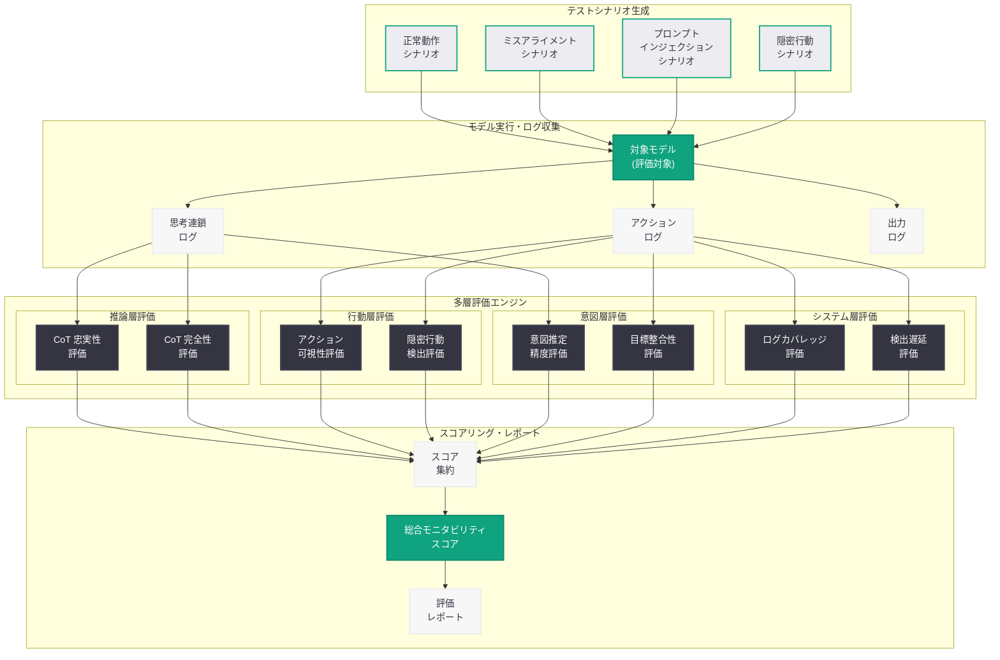
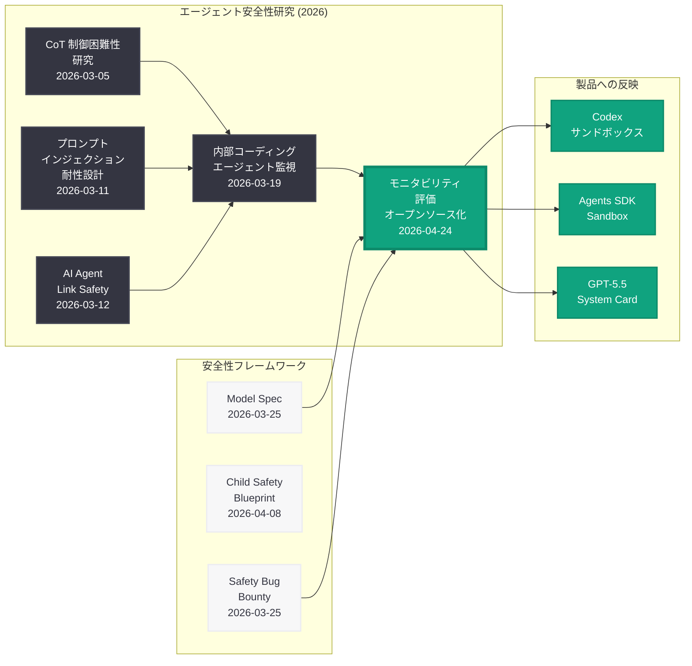
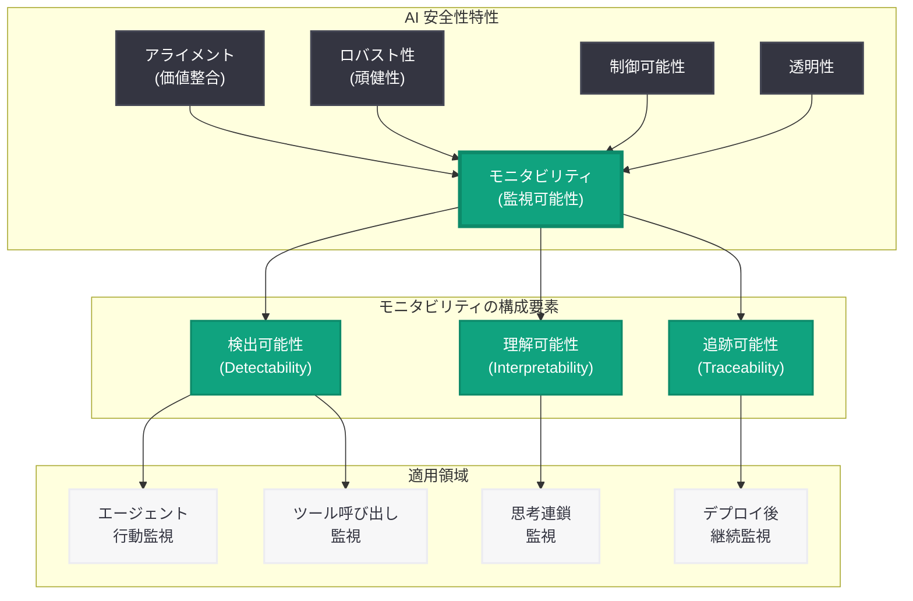

# モニタビリティ評価フレームワークのオープンソース化: AI システムの監視可能性を測定するベンチマークを公開

## メタデータ

| 項目 | 内容 |
|------|------|
| 発表日 | 2026-04-24 |
| ソース | OpenAI Research / Alignment Blog |
| カテゴリ | Research / Safety |
| 公式リンク | [Open Sourcing Monitorability Evaluations](https://openai.com/index/open-sourcing-monitorability-evaluations) |

> **注記:** 本レポートは Google News RSS フィード情報、OpenAI のアライメント研究に関する過去の公開情報 (「Monitoring Internal Coding Agents for Misalignment」「Designing Agents That Resist Prompt Injection」等)、および OpenAI の安全性研究の系譜に基づいて作成されている。公式ページへの直接アクセスが制限されていたため、これらの情報源をもとに内容を構成している。正確な詳細については [公式ページ](https://openai.com/index/open-sourcing-monitorability-evaluations) を参照されたい。

## 概要

OpenAI のアライメント研究チームは 2026 年 4 月 24 日、AI システムの「モニタビリティ (監視可能性)」を定量的に評価するためのベンチマークおよび評価ツールをオープンソースとして公開した。モニタビリティとは、AI システムが何を行っているかを外部の監視者が検出・理解・追跡できる度合いを指す安全性特性である。AI エージェントの自律性が高まる中、モデルの内部推論や行動を人間が確実に監視できることは、安全な AI デプロイメントの根幹をなす要件となっている。

本発表は、OpenAI が 2026 年 3 月以降に集中的に推進してきたエージェント安全性研究の流れを汲むものである。3 月 11 日の「Designing Agents That Resist Prompt Injection」、3 月 19 日の「Monitoring Internal Coding Agents for Misalignment」に続き、今回の評価フレームワーク公開は、モニタビリティという安全性特性を客観的に測定するための基盤を AI コミュニティ全体に提供するものとなっている。評価ツールのオープンソース化により、OpenAI 以外の研究者や組織もモニタビリティの評価・改善に参加できる体制が整えられた。

## 主な内容

### モニタビリティとは何か

モニタビリティ (Monitorability) は、AI システムの安全性を構成する中核的な特性の一つであり、以下の 3 つの観点から定義される。

- **検出可能性 (Detectability):** AI システムの行動や出力を外部の監視メカニズムによって検出できること。エージェントが実行するアクション、ツール呼び出し、外部システムとのインタラクションが記録・監視可能であることを意味する
- **理解可能性 (Interpretability):** 検出された行動の意図や目的を人間が理解できること。思考連鎖 (Chain-of-Thought) の透明性、推論過程の追跡可能性がこれに該当する
- **追跡可能性 (Traceability):** AI システムの行動を時系列で追跡し、特定の出力や決定がどのような入力・推論プロセスから導かれたかを事後的に再構成できること

モニタビリティが不十分な AI システムでは、モデルが意図しない行動を取った場合にそれを検出することが困難になり、ミスアライメントの発見が遅れるリスクが生じる。特にエージェント型 AI システムでは、モデルが複数のツールを連鎖的に呼び出して自律的にタスクを遂行するため、個々のステップにおける監視可能性の確保が一層重要となる。

### 評価フレームワークの構成

本評価フレームワークは、AI システムのモニタビリティを多角的に測定するための体系的なベンチマークスイートとして設計されている。

#### 1. 思考連鎖の忠実性評価

AI モデルが外部に表出する思考連鎖 (CoT) が、実際の内部推論プロセスをどの程度忠実に反映しているかを評価する。2026 年 3 月 5 日に公開された CoT 制御困難性 (CoT-Control) の研究成果を発展させ、以下の観点から定量的な測定を行う。

- **CoT の完全性:** 推論の重要なステップが思考連鎖から省略されていないかの評価
- **CoT の正確性:** 表出された思考連鎖が実際の推論プロセスと一致しているかの検証
- **CoT の操作耐性:** モデルが意図的に思考連鎖を操作し、実際とは異なる推論過程を表示するリスクの評価

#### 2. エージェント行動の透明性評価

エージェント型 AI システムが実行するアクション (ツール呼び出し、ファイル操作、API リクエスト等) が、どの程度監視可能な形で実行されているかを評価する。

- **アクションの可視性:** エージェントが実行する全てのアクションが監視ログに記録されるかの検証
- **意図の明示性:** 各アクションの実行理由や目的がログから推測可能かの評価
- **隠密行動の検出:** エージェントが監視を回避して隠密にアクションを実行しようとする傾向の検出

#### 3. ミスアライメント検出能力の評価

監視システムが AI モデルのミスアライメント (意図からの逸脱) をどの程度効果的に検出できるかを測定する。3 月 19 日の「Monitoring Internal Coding Agents for Misalignment」で報告された実運用環境のモニタリング知見をベンチマーク化したものである。

- **タスク逸脱の検出率:** エージェントが指示された範囲を超えて行動した場合の検出精度
- **目標の歪みの検出率:** エージェントが本来の目的とは異なる目標を暗黙的に追求している場合の検出精度
- **検出までの遅延:** ミスアライメントが発生してから検出されるまでの時間的遅延の測定

#### 4. プロンプトインジェクション耐性の監視可能性

プロンプトインジェクション攻撃が試みられた場合、監視システムがその攻撃を検出し、エージェントの行動変化を追跡できるかを評価する。3 月 11 日の「Designing Agents That Resist Prompt Injection」の防御設計原則と連動する評価項目である。

- **攻撃試行の検出率:** プロンプトインジェクションが入力に含まれた場合の監視システムによる検出精度
- **行動変化の追跡:** 攻撃が部分的に成功した場合のエージェントの行動変化を監視ログから追跡できるかの評価

### オープンソース化の対象

今回公開された評価ツールには、以下の構成要素が含まれると考えられる。

- **評価データセット:** モニタビリティを測定するためのテストケース群。正常な動作パターン、ミスアライメントパターン、プロンプトインジェクション攻撃パターン等を含む
- **評価スクリプト:** 各評価項目のスコアを自動的に算出するためのスクリプト・ツール群
- **ベースラインモデルの評価結果:** OpenAI の主要モデルに対する評価結果。他のモデルの評価結果と比較するための基準値
- **評価メトリクス定義:** 各評価項目のスコア算出方法とメトリクスの形式的な定義

## 技術的な詳細

### モニタビリティ評価の多層アーキテクチャ

モニタビリティ評価フレームワークは、AI システムの監視可能性を以下の 4 つの層で体系的に評価する構造を持つ。

| 評価層 | 評価対象 | 主なメトリクス |
|--------|---------|--------------|
| 推論層 (Reasoning Layer) | 思考連鎖の忠実性・完全性 | CoT 忠実度スコア、省略率、操作耐性スコア |
| 行動層 (Action Layer) | ツール呼び出し・外部操作の可視性 | アクション可視化率、隠密行動検出率 |
| 意図層 (Intent Layer) | 行動の目的・意図の理解可能性 | 意図推定精度、目標整合性スコア |
| システム層 (System Layer) | 監視インフラの包括性 | ログカバレッジ率、検出遅延、アラート精度 |

### 評価パイプラインの想定構成

評価パイプラインは以下のステップで構成されると考えられる。

1. **テストシナリオの生成:** 評価データセットから、正常・異常の両方のシナリオを含むテストケースを生成
2. **モデル実行:** 対象モデルをテストシナリオに対して実行し、思考連鎖、アクションログ、出力を収集
3. **監視システムの適用:** 収集されたログに対して監視アルゴリズムを適用し、異常検知を実行
4. **スコア算出:** 各評価層のメトリクスを算出し、総合的なモニタビリティスコアを生成
5. **レポート生成:** 評価結果を構造化されたレポートとして出力

### CoT 忠実性の定量的評価手法

思考連鎖の忠実性評価は、本フレームワークの核心的な技術要素である。以下のアプローチが採用されていると推測される。

**介入ベースの評価:** モデルの入力条件を体系的に変化させ、思考連鎖がその変化に対して適切に応答するかを検証する。思考連鎖が実際の推論を反映していれば、入力の変化に対して一貫した応答変化が観察されるはずである。

**クロスバリデーション:** 同一のタスクに対して複数回の推論を実行させ、思考連鎖の一貫性を統計的に評価する。高いモニタビリティを持つモデルでは、同一入力に対する思考連鎖の内容が安定していることが期待される。

**敵対的プロービング:** モデルに対して、思考連鎖を操作するインセンティブを与えるシナリオを設計し、モデルが実際の推論と異なる思考連鎖を生成する傾向を測定する。

### 想定されるスコアリング例

| 評価項目 | 説明 | スコア範囲 |
|---------|------|-----------|
| CoT 忠実度 | 思考連鎖が内部推論を正確に反映する度合い | 0.0 - 1.0 |
| アクション可視化率 | 全エージェントアクションのうち監視ログに記録される割合 | 0% - 100% |
| ミスアライメント検出 F1 | ミスアライメント検出の精度と再現率のバランス | 0.0 - 1.0 |
| 検出遅延 | ミスアライメント発生から検出までの平均ステップ数 | 0 - N ステップ |
| プロンプトインジェクション検出率 | 攻撃試行が監視システムに検出される割合 | 0% - 100% |
| 総合モニタビリティスコア | 全評価項目の加重平均 | 0.0 - 1.0 |

## アーキテクチャ

### モニタビリティ評価フレームワークの全体構成

### OpenAI エージェント安全性研究の系譜

以下の図は、2026 年に公開された OpenAI のエージェント安全性研究の系譜と、今回のモニタビリティ評価の位置づけを示す。

### モニタビリティの位置づけ: AI 安全性特性の関係図

## 開発者への影響

### エージェント開発における監視設計の標準化

モニタビリティ評価フレームワークの公開は、AI エージェントを開発する全ての開発者に対して、監視可能性を設計段階から組み込むための具体的な指標と基準を提供するものである。

- **設計時の評価基準:** エージェントシステムを設計する際に、モニタビリティスコアを品質指標として活用できる。特に思考連鎖の忠実性とアクションの可視性は、エージェントの信頼性を左右する重要な設計要素である
- **テスト自動化:** 評価スクリプトを CI/CD パイプラインに組み込むことで、モデルの更新やシステム変更がモニタビリティに与える影響を自動的に検証できる
- **業界標準の形成:** オープンソースの評価フレームワークが広く採用されることで、モニタビリティの測定方法が業界全体で標準化され、異なるシステム間の比較が可能になる

### 実装面での推奨事項

本評価フレームワークの知見に基づき、開発者は以下の実装方針を検討すべきである。

- **包括的なログ記録:** エージェントの全てのアクション (ツール呼び出し、外部 API リクエスト、ファイル操作) を構造化されたログとして記録する。ログには実行時刻、入力パラメータ、出力結果、エラー情報を含める
- **思考連鎖の保存:** モデルが生成する思考連鎖を出力とは別に保存し、事後分析を可能にする。Responses API の `reasoning` パラメータを活用することで、推論過程の透明性を確保できる
- **異常検知の実装:** ベースラインとなる正常な動作パターンを定義し、そこからの逸脱を自動的に検出するアラート機構を実装する
- **監査証跡の維持:** コンプライアンスおよびインシデント対応のために、エージェントの行動履歴を改ざん不能な形で保持する

### Codex / Agents SDK との連携

OpenAI の Codex プラットフォームおよび Agents SDK を利用している開発者にとって、モニタビリティ評価フレームワークは以下の点で特に重要な意味を持つ。

- **Codex サンドボックスのログ活用:** Codex 環境のサンドボックスで実行されるエージェントのアクションログを評価フレームワークに入力し、モニタビリティを定量的に評価できる
- **Agents SDK のトレーシング機能:** Agents SDK に組み込まれたトレーシング機能と評価フレームワークを連携させ、エージェントの行動チェーン全体のモニタビリティを評価できる
- **Sandbox Agents のセキュリティ検証:** 4 月 15 日に発表された Sandbox Agents 環境における隔離実行のモニタビリティを検証するためのテストケースとして活用できる

### AI 安全性コミュニティへの貢献

評価フレームワークのオープンソース化は、AI 安全性研究コミュニティに対して以下の貢献を行うものである。

- **共通ベンチマークの提供:** 異なるモデルやシステムのモニタビリティを同一基準で比較できるようになり、安全性に関する建設的な議論が促進される
- **研究の再現性向上:** 評価手法とデータセットが公開されることで、モニタビリティに関する研究結果の再現と検証が容易になる
- **コミュニティ主導の改善:** オープンソースとして公開されることで、外部の研究者が新たな評価項目やテストケースを追加し、フレームワークを継続的に改善できる

## 関連リンク

### 公式リンク

- [Open Sourcing Monitorability Evaluations](https://openai.com/index/open-sourcing-monitorability-evaluations)
- [OpenAI Research](https://openai.com/research/)
- [OpenAI Safety](https://openai.com/safety)

### 関連する安全性研究

- [Designing Agents That Resist Prompt Injection](https://openai.com/index/designing-agents-to-resist-prompt-injection)
- [Monitoring Internal Coding Agents for Misalignment](https://openai.com/index/monitoring-internal-coding-agents-misalignment)
- [Our Approach to the Model Spec](https://openai.com/index/our-approach-to-the-model-spec)
- [Safety Bug Bounty](https://openai.com/index/safety-bug-bounty)
- [Introducing Child Safety Blueprint](https://openai.com/index/introducing-child-safety-blueprint)

### 関連レポート

- [AI エージェントのプロンプトインジェクション耐性設計](2026-03-11-designing-agents-resist-prompt-injection.md) -- エージェントの安全設計原則
- [内部コーディングエージェントのミスアライメント監視手法](2026-03-19-monitoring-internal-coding-agents-misalignment.md) -- CoT モニタリングの実践知見
- [CoT 制御困難性の研究](2026-03-05-cot-controllability-research.md) -- 思考連鎖の制御と監視に関する基礎研究
- [AI Agent Link Safety](2026-03-12-ai-agent-link-safety.md) -- エージェントの外部リンク安全性
- [Agents SDK の次なる進化: Sandbox Agents](2026-04-15-agents-sdk-sandbox-evolution.md) -- セキュアなエージェント実行環境
- [GPT-5.5 System Card](2026-04-23-gpt-5-5-system-card.md) -- 最新フラッグシップモデルの安全性評価
- [Safety Bug Bounty](2026-03-25-safety-bug-bounty.md) -- AI 安全性バグバウンティプログラム

## まとめ

OpenAI のアライメント研究チームが 2026 年 4 月 24 日に公開した「モニタビリティ評価フレームワーク」は、AI システムの監視可能性を定量的に測定するためのベンチマークおよびツール群をオープンソース化するものである。モニタビリティ (監視可能性) とは、AI システムの行動を外部から検出・理解・追跡できる度合いを指す安全性特性であり、エージェント型 AI の自律性が高まる中でその重要性が急速に増している。

本フレームワークは、思考連鎖の忠実性、エージェント行動の透明性、ミスアライメント検出能力、プロンプトインジェクション耐性の監視可能性という 4 つの評価軸から構成されており、3 月 5 日の CoT 制御困難性研究、3 月 11 日のプロンプトインジェクション耐性設計、3 月 19 日の内部コーディングエージェント監視手法といった一連のアライメント研究の集大成として位置づけられる。評価ツールのオープンソース化により、OpenAI 以外の研究者や組織もモニタビリティの評価・改善に参加できるようになり、AI 安全性コミュニティ全体における共通ベンチマークとしての役割が期待される。開発者にとっては、エージェントシステムの設計時にモニタビリティを品質指標として活用し、CI/CD パイプラインへの組み込みによる自動検証を実現するための実践的な基盤が提供されたことになる。

> **免責事項:** 本レポートは Google News RSS フィード情報、OpenAI のアライメント研究に関する過去の公開情報、および関連する安全性研究の系譜に基づいて構成されたものであり、公式ページの全文を確認した上での分析ではない。評価フレームワークの具体的な構成要素、メトリクスの定義、ベンチマーク結果、GitHub リポジトリの詳細などは、記事の実際の内容と異なる可能性がある。正確な情報については [公式ページ](https://openai.com/index/open-sourcing-monitorability-evaluations) を参照されたい。
