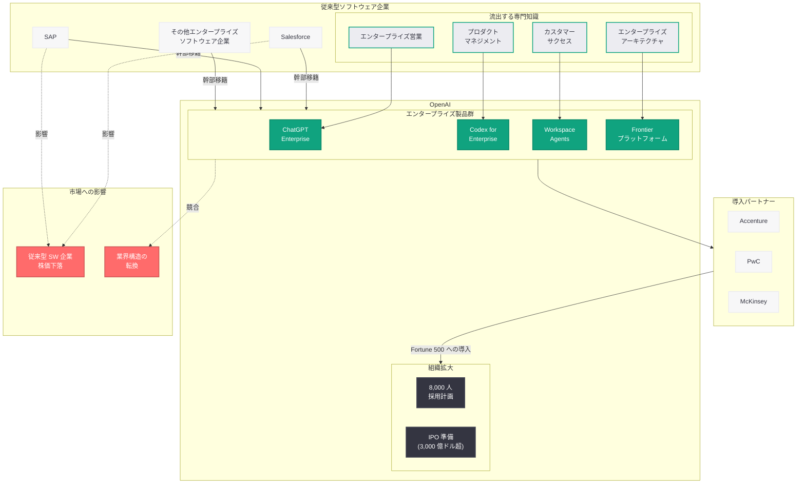

# AI 人材争奪戦の新局面: ソフトウェア業界の経営幹部が続々と OpenAI に移籍

## メタデータ

| 項目 | 内容 |
|------|------|
| 発表日 | 2026-04-25 |
| ソース | CNBC / Let's Data Science / 複数メディア |
| カテゴリ | 企業 / 人材 / エンタープライズ戦略 |
| 公式リンク | [CNBC: AI talent war: Software industry is a new target as top executives jump ship to OpenAI](https://www.cnbc.com/2026/04/25/ai-talent-war-software-industry-executives-jump-ship-openai.html)、[Let's Data Science: OpenAI Hires Enterprise Software Executives Amid Talent War](https://letsdatascience.com/openai-hires-enterprise-software-executives/) |

> **注記:** 本レポートは CNBC および Let's Data Science をはじめとする複数のメディア報道に基づいて作成されている。OpenAI の公式発表ではなく、外部報道に基づく分析であるため、正確な詳細については各社の公式発表を確認されたい。

## 概要

2026 年 4 月 25 日、CNBC は「AI talent war: Software industry is a new target as top executives jump ship to OpenAI」と題する記事で、AI 人材争奪戦が新たな段階に突入したことを報じた。これまで AI 人材の獲得競争は主に AI 企業間 (OpenAI、Anthropic、Google DeepMind、Meta AI) で展開されてきたが、OpenAI が Salesforce、SAP をはじめとする大手エンタープライズソフトウェア企業から経営幹部を積極的に引き抜いていることが明らかになった。

この動きは、OpenAI が単なる AI モデル開発企業からエンタープライズ AI プラットフォーム企業への転換を加速させていることを如実に示している。2026 年 3 月に報じられた従業員数 8,000 人への倍増計画、4 月の Codex エンタープライズ展開、Workspace Agents の導入、そして相次ぐ幹部の入れ替わりという一連の流れの中で、エンタープライズソフトウェア業界の経営幹部の獲得は OpenAI の戦略的意図を最も鮮明に映し出すものである。従来型ソフトウェア企業の株価が幹部流出の報道を受けて下落する一方、OpenAI は IPO に向けたエンタープライズ収益基盤の確立を急ピッチで進めている。

## 主な内容

### ソフトウェア業界が新たな標的に

従来の AI 人材争奪戦は、AI/ML の研究者やエンジニアが中心であった。Google Brain や DeepMind の研究者が OpenAI に移籍するケース、逆に OpenAI の共同創業者が Anthropic を設立するケースなど、AI 企業間での人材の流動が主な戦場であった。

しかし、2026 年に入り状況は大きく変化している。OpenAI が狙う人材は、もはや AI 研究者だけではない。エンタープライズソフトウェア業界で長年の経験を持つ経営幹部、すなわち大企業顧客への営業、プロダクトマネジメント、カスタマーサクセス、エンタープライズアーキテクチャに精通した人材が新たなターゲットとなっている。

**獲得が報じられた主要な幹部:**

- **元 Salesforce 幹部:** CRM 市場を支配する Salesforce のエンタープライズ営業・プロダクト戦略の知見を持つ幹部が OpenAI に移籍
- **元 SAP 幹部:** ERP 市場のグローバルリーダーである SAP から、エンタープライズシステム統合とグローバル展開の専門知識を持つ幹部が参画
- **JioStar CEO:** 2026 年 4 月 20 日に報じられた通り、4 億人以上のユーザー基盤を持つ JioStar の CEO が APAC 事業責任者として採用

### OpenAI が求めるエンタープライズ人材の背景

OpenAI がソフトウェア業界の幹部を積極的に採用する背景には、同社のエンタープライズ戦略の急速な展開がある。

**直近のエンタープライズ製品の拡充:**

| 日付 | 発表 | 内容 |
|------|------|------|
| 2026-04-16 | Codex スーパーアプリ化 | Codex を汎用 AI エージェントプラットフォームに拡張 |
| 2026-04-21 | Codex エンタープライズ展開 | Accenture、PwC、Capgemini、Cognizant との戦略的パートナーシップ |
| 2026-04-22 | Workspace Agents | ChatGPT に Codex ベースのクラウドエージェントを導入 |
| 2026-04-22 | Codex Remote Connections | エンタープライズ環境のリモート開発インフラとの統合 |

これらの製品を Fortune 500 企業に導入するためには、エンタープライズソフトウェアの販売・導入・運用に関する深い専門知識が必要である。AI 研究の卓越性だけでは大企業の IT 部門を説得できない。Salesforce や SAP の幹部は、まさにその知見を持つ人材である。

### エンタープライズソフトウェア企業への影響

ソフトウェア業界の幹部が OpenAI に流出していることは、従来型ソフトウェア企業に複数の影響を及ぼしている。

**株価への影響:** 主要なエンタープライズソフトウェア企業の株価が、幹部の流出報道を受けて下落した。市場はこの人材流出を、従来型ソフトウェア企業のエンタープライズ AI 対応能力の低下と、OpenAI の競争力強化の両面で評価している。

**事業戦略への影響:** エンタープライズソフトウェア企業は、自社の AI 戦略を牽引すべき幹部を失いつつある。Salesforce が Einstein AI、SAP が Joule AI として独自の AI 機能を開発している最中に、その戦略を知り尽くした幹部が OpenAI に移籍することは、競合情報の流出という観点からも深刻な問題となり得る。

**業界全体の構造変化:** この人材の流れは、AI がソフトウェア業界の補完的な技術から主役へと転換しつつあることを象徴している。エンタープライズソフトウェアの未来が AI プラットフォームに収束するとの見方が強まる中、優秀な人材が「AI ネイティブ」企業を選択する流れは今後も加速する可能性が高い。

### OpenAI の人材戦略の全体像

今回の報道は、OpenAI が 2026 年に入ってから展開している大規模な採用戦略の一部として位置づけられる。

**2026 年の主要な人材関連動向:**

| 時期 | 動向 | 意義 |
|------|------|------|
| 2026 年 3 月 | 従業員数 8,000 人への倍増計画発表 | エンタープライズ市場への本格参入を人員面で裏付け |
| 2026 年 4 月初旬 | 経営幹部 3 名の離脱 (Simo、Lightcap、Rouch) | 組織再編と戦略的リセット |
| 2026 年 4 月 17 日 | 幹部 3 名の同日退社 (Weil、Peebles、Narayanan) | コアビジネスへの集中を加速 |
| 2026 年 4 月 20 日 | JioStar CEO を APAC 事業責任者に採用 | グローバル展開人材の確保 |
| 2026 年 4 月 25 日 | ソフトウェア業界幹部の引き抜き報道 | エンタープライズ専門人材の大量獲得 |

この時系列から読み取れるのは、OpenAI が「出す人材」と「入れる人材」を戦略的に入れ替えているということである。実験的プロダクト (Sora、OpenAI for Science) のリーダーを放出し、エンタープライズの実務経験を持つ幹部を獲得するという明確なパターンが浮かび上がる。

### IPO との関連

OpenAI は評価額 3,000 億ドル超とされる IPO の準備を進めている。公開市場の投資家がエンタープライズ SaaS 企業に求めるのは、予測可能な経常収益 (ARR)、低い解約率、そして Fortune 500 企業との大型契約である。これらを実現するためには、エンタープライズソフトウェアの販売・導入・成功に精通した経営幹部の存在が不可欠である。

Salesforce や SAP の幹部が持つ「大企業の購買プロセスを理解し、数億ドル規模の契約を締結する能力」は、OpenAI が IPO 後の市場で投資家の期待に応えるために最も必要としているスキルセットと合致する。

## 技術的な詳細

### エンタープライズ製品ポートフォリオの拡大

ソフトウェア業界の幹部を必要とする OpenAI のエンタープライズ製品群は、急速に拡大している。

**ChatGPT Enterprise / Team:** 企業向けの ChatGPT であり、セキュリティ、管理コンソール、SSO (シングルサインオン)、データプライバシー保証を備える。Salesforce の CRM や SAP の ERP と直接統合されるユースケースが増加しており、これらのシステムに精通した人材の需要が高まっている。

**Codex for Enterprise:** コーディング支援を超えて、企業のソフトウェア開発ライフサイクル全体をカバーする AI エージェントプラットフォーム。Accenture、PwC などのコンサルティングパートナーを通じた導入チャネルが構築されている。

**Workspace Agents:** ChatGPT 内で動作する Codex ベースのクラウドエージェント。Slack、GitHub、Linear などの外部ツールとのインテグレーションにより、チーム業務の横断的な自動化を実現する。

**Frontier プラットフォーム:** エージェントベースの AI システムを企業のワークフローに組み込むための統合基盤。McKinsey との Frontier Alliance を通じた導入支援体制が構築されている。

### エンタープライズ統合の技術的要件

従来型ソフトウェア企業の幹部が OpenAI に求められる技術的背景には、以下のようなエンタープライズ固有の要件がある。

```python
from openai import OpenAI

client = OpenAI()

# エンタープライズ CRM データとの統合例
# Salesforce / SAP 経験者の知見が活かされる領域
response = client.responses.create(
    model="gpt-4o",
    instructions="""あなたはエンタープライズ CRM に統合された AI アシスタントです。
    顧客データを分析し、営業チームにアクションを提案してください。""",
    input="Q1 の顧客エンゲージメントデータを分析し、解約リスクの高い上位 10 社を特定してください。",
    tools=[
        {
            "type": "function",
            "name": "query_crm_data",
            "description": "CRM データベースから顧客データを取得する",
            "parameters": {
                "type": "object",
                "properties": {
                    "query_type": {"type": "string"},
                    "filters": {"type": "object"},
                    "date_range": {"type": "string"}
                }
            }
        }
    ]
)
print(response.output_text)
```

> **注:** 上記のコードサンプルは OpenAI API のエンタープライズ統合における想定される活用例を示すものであり、実際の実装は公式ドキュメントを参照されたい。

## アーキテクチャ

以下は、AI 人材争奪戦の構造と、ソフトウェア業界から OpenAI への人材の流れを示す図である。



## 開発者への影響

### エンタープライズ向け機能の加速

ソフトウェア業界の経営幹部が OpenAI に参画することで、エンタープライズ開発者にとって直接的なメリットが生まれる。

- **CRM/ERP 統合の強化:** Salesforce や SAP の知見を持つ幹部の参画により、OpenAI API と既存のエンタープライズシステム (Salesforce、SAP、ServiceNow など) との統合がより洗練されたものになることが期待される
- **エンタープライズグレードの機能拡充:** SSO、RBAC (ロールベースアクセス制御)、監査ログ、コンプライアンス機能など、大企業が求めるセキュリティ・ガバナンス機能の開発が加速する可能性がある
- **導入支援の充実:** エンタープライズソフトウェアの導入に精通した人材が増えることで、API ドキュメント、ベストプラクティスガイド、リファレンスアーキテクチャの質が向上することが見込まれる

### 従来型ソフトウェア企業の開発者への影響

- **AI 戦略の停滞リスク:** 自社の AI 戦略を牽引していた幹部が流出することで、Salesforce Einstein AI や SAP Joule AI などの社内 AI プロダクトの開発方針が不安定になる可能性がある
- **キャリア選択の変化:** エンタープライズソフトウェア企業の開発者にとって、AI ネイティブ企業への移籍がより現実的なキャリアパスとして認識される契機となる
- **スキルの再定義:** エンタープライズソフトウェアの専門知識と AI/ML スキルの組み合わせが、市場で最も価値の高いスキルセットとして位置づけられつつある

### プラットフォーム選択への示唆

- **OpenAI エコシステムの優位性強化:** エンタープライズ人材の流入により、OpenAI のエンタープライズ向けサービスの品質と包括性が向上する可能性がある。エンタープライズアプリケーションを構築する開発者にとって、OpenAI プラットフォームの魅力度が高まる
- **マルチクラウド/マルチ AI 戦略の重要性:** 特定のプラットフォームへの過度な依存を避けるため、複数の AI プロバイダーに対応できるアーキテクチャ設計がますます重要になる

## 関連リンク

- [CNBC: AI talent war: Software industry is a new target as top executives jump ship to OpenAI](https://www.cnbc.com/2026/04/25/ai-talent-war-software-industry-executives-jump-ship-openai.html)
- [Let's Data Science: OpenAI Hires Enterprise Software Executives Amid Talent War](https://letsdatascience.com/openai-hires-enterprise-software-executives/)
- [関連レポート: OpenAI、2026 年末までに従業員数を 8,000 人に倍増計画](2026-03-21-openai-workforce-doubling-8000.md)
- [関連レポート: OpenAI 幹部 3 名が同日退社](2026-04-17-openai-triple-executive-exit.md)
- [関連レポート: OpenAI、JioStar CEO を APAC 事業責任者に採用](2026-04-20-openai-hires-jiostar-ceo-apac.md)
- [関連レポート: Codex エンタープライズ展開の加速](2026-04-21-scaling-codex-enterprises.md)
- [関連レポート: ChatGPT に Workspace Agents を導入](2026-04-22-workspace-agents-chatgpt.md)
- [OpenAI News](https://openai.com/news)
- [OpenAI 公式ドキュメント](https://platform.openai.com/docs)

## まとめ

2026 年 4 月 25 日の CNBC 報道が明らかにした AI 人材争奪戦の新局面は、OpenAI の戦略的変貌を端的に物語っている。AI 研究者やエンジニアの獲得競争から、Salesforce や SAP といったエンタープライズソフトウェア企業の経営幹部の引き抜きへと戦場が拡大したことは、OpenAI が「AI モデル開発企業」から「エンタープライズ AI プラットフォーム企業」への転換を本気で進めていることの証左である。

この動きは孤立したものではなく、2026 年 3 月の 8,000 人採用計画、4 月の大規模な経営幹部の入れ替え、Codex エンタープライズ展開、Workspace Agents の導入、Accenture や PwC とのコンサルティングパートナーシップ、そして IPO 準備という一連の戦略的アクションの中に明確に位置づけられる。OpenAI は実験的プロダクトのリーダーを放出しながら、エンタープライズの実務経験を持つ幹部を戦略的に獲得するという、組織の質的転換を同時に進めている。

従来型ソフトウェア企業にとって、この人材流出は株価下落だけでなく、自社の AI 戦略の推進力低下という構造的なリスクをもたらす。一方で、AI 人材市場全体にとっては、エンタープライズの専門知識と AI スキルの融合がキャリアの新たな価値基準となりつつあることを示す重要なシグナルである。AI がソフトウェア業界の補完技術から主役へと転換する中、人材の流れはその構造変化を最も正直に映し出す指標と言えるだろう。
