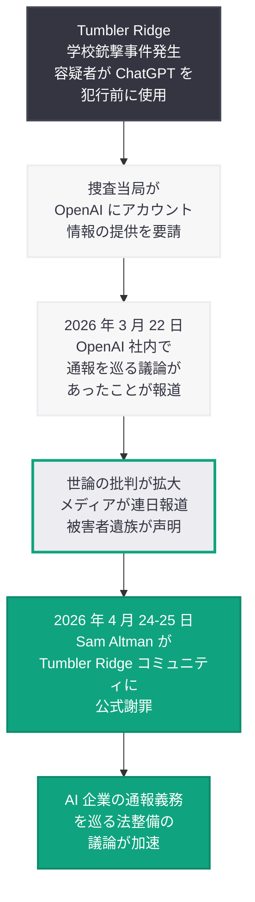
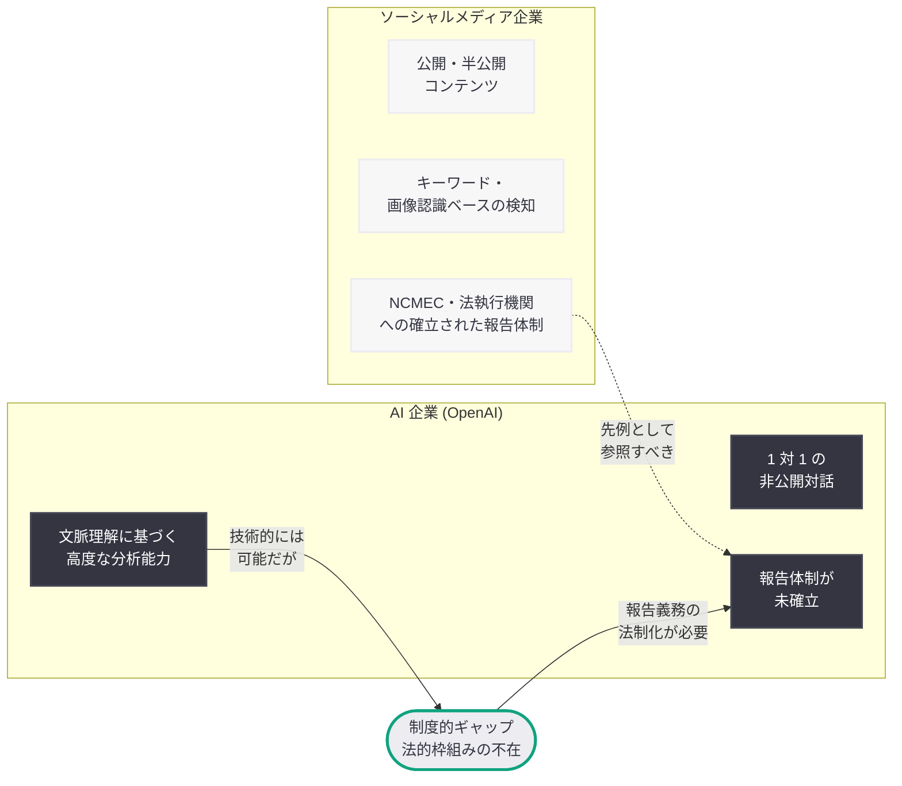

# OpenAI CEO Sam Altman がカナダ Tumbler Ridge 銃撃事件を巡り「深くお詫び」-- 容疑者の ChatGPT 利用を警察に通報せず

## メタデータ

| 項目 | 内容 |
|------|------|
| 発表日 | 2026-04-25 |
| ソース | Google News (BBC, CNN, The Guardian, TechCrunch, CBS News, WSJ, The Hill, Engadget, Al Jazeera, France 24, PCMag, Business Insider, Reuters) |
| カテゴリ | AI 安全性 / 倫理 / 企業責任 |
| 公式リンク | [Google News](https://news.google.com/search?q=Altman+apologizes+Tumbler+Ridge+OpenAI) |

## 概要

OpenAI の CEO である Sam Altman は 2026 年 4 月 24 日から 25 日にかけて、カナダ・ブリティッシュコロンビア州 Tumbler Ridge で発生した学校銃撃事件を巡り、公式に謝罪した。事件の容疑者が犯行前に ChatGPT を使用していたにもかかわらず、OpenAI がその情報を警察に通報しなかったことに対し、Altman は「深くお詫びする (deeply sorry)」と述べた。

この謝罪は、BBC、CNN、The Guardian、WSJ、CBS News をはじめとする世界中の主要メディアによって大きく報じられ、AI 企業がユーザーの潜在的な脅威を検知した際に法執行機関へ報告する責任を負うべきかという議論を再燃させた。2026 年 3 月 22 日に報じられた OpenAI 社内での通報を巡る議論の報道から約 1 か月、世論の圧力が高まる中での公式謝罪となった。

## 主な内容

### 事件の経緯

Tumbler Ridge はブリティッシュコロンビア州北東部に位置する小規模なコミュニティであり、この地域の学校で銃撃事件が発生した。事件後の捜査において、容疑者が犯行前に ChatGPT と対話していたことが判明した。捜査当局は OpenAI に対してアカウント情報の提供を要請し、OpenAI は容疑者が ChatGPT 上で懸念される内容のやり取りを行っていた事実を認めた。

しかし、OpenAI はこの情報を事前に法執行機関に共有していなかった。この事実が公になったことで、OpenAI に対する批判が急速に拡大し、被害者の遺族やコミュニティからの強い非難が寄せられた。

### Altman の公式謝罪

複数の報道によると、Sam Altman は以下の趣旨の謝罪を行った。

- **BBC:** 「OpenAI boss 'deeply sorry' for not telling police of Tumbler Ridge suspect's account」
- **CNN:** 「OpenAI's Sam Altman apologizes to Canadian community after failing to flag mass shooter's conversations with its AI chatbot」
- **WSJ:** 「OpenAI CEO Apologizes for Not Flagging Mass Shooting Suspect to Police」
- **CBS News:** 「OpenAI CEO Sam Altman 'deeply sorry' for failing to alert law enforcement to Canada school shooter's ChatGPT account」

Altman は Tumbler Ridge コミュニティに対して直接的に「深くお詫びする」と述べ、OpenAI が容疑者のアカウント情報を警察に通報しなかったことについて責任を認めた。この謝罪は、事件発覚後の数週間にわたるメディア報道と世論の圧力を受けてのものであり、TechCrunch が「OpenAI CEO apologizes to Tumbler Ridge community」と報じたように、特定のコミュニティに対する直接的な謝罪という形式を取った。

### 社内議論から公式謝罪までの経緯

2026 年 3 月 22 日、OpenAI が銃撃事件前に容疑者の ChatGPT 利用について警察への通報を巡り社内で議論していたことが報じられた。安全チームと法務チームの間で、ユーザーのプライバシー保護と公共安全の確保という相反する価値観を巡る議論が行われていたが、最終的に通報は行われなかった。

その後、約 1 か月にわたってメディアの追及が続き、被害者遺族の声が広く報道される中で、OpenAI は対応を迫られた。Altman の謝罪は、企業としての初めての公式な責任認定であり、AI 業界におけるこの種の謝罪としては前例のない規模のものとなった。

## 事件のタイムライン

## AI 企業の通報責任を巡る議論

### 現行の法的枠組みの限界

AI 企業がユーザーの潜在的な脅威を法執行機関に報告する義務について、現行法の枠組みは十分に整備されていない。医療従事者や教育者には特定の状況下での通報義務 (mandatory reporting) が課されているが、AI 企業に同様の義務を適用する法的根拠は多くの法域で未確立である。

| 業種 | 通報義務の有無 | 法的根拠 |
|------|--------------|---------|
| 医療従事者 | あり | 各国・各州の mandatory reporting 法 |
| 教育者 | あり | 児童虐待防止法等 |
| ソーシャルメディア企業 | 一部あり | NCMEC 報告義務 (児童搾取)、テロ関連コンテンツ規制 |
| AI 企業 | 明確な規定なし | 法的枠組みが未整備 |

### OpenAI のポリシーに対する批判

今回の事件を受けて、OpenAI のコンテンツモニタリングと報告に関するポリシーが厳しく精査されている。批判の主な論点は以下の通りである。

- **検知能力と報告体制の乖離:** OpenAI は高度な自然言語処理能力を有しており、潜在的に危険なコンテンツを検知する技術的能力を持つ。しかし、検知した情報を法執行機関に報告する明確な体制が構築されていなかった
- **プライバシー優先の判断:** OpenAI がユーザーのプライバシーを過度に重視した結果、公共安全が犠牲になったという批判がある。特に、人命に関わる具体的な脅威が検知された場合にプライバシーを優先する判断は適切であったのかが問われている
- **対応の遅さ:** 社内で議論が行われていたにもかかわらず、迅速な判断と行動が取られなかったことへの批判がある。緊急性の高い状況において、組織内の合意形成プロセスが機能不全を起こしていた可能性が指摘されている

### ソーシャルメディア企業の先例との比較

## 今後の影響と展望

### 規制強化の動き

今回の事件と Altman の謝罪を受けて、AI 企業に対する規制強化の動きが加速することが予想される。

- **カナダ国内:** カナダ連邦政府および BC 州政府が、AI 企業に対する通報義務を含む法案の策定を検討する可能性がある
- **米国:** 既に進行中の AI 規制議論に新たな論点が加わる。連邦レベルでの AI 安全法案に通報義務条項が組み込まれる可能性がある
- **EU:** AI Act の施行に向けた議論において、高リスク AI システムの運用者に対する通報義務の強化が検討される可能性がある
- **国際的な枠組み:** AI 企業の国境を越えた運用に対応するため、国際的な通報基準の策定が求められる

### OpenAI のポリシー改定

Altman の謝罪に伴い、OpenAI は以下のようなポリシー改定を行うことが期待されている。

1. **明確な通報基準の策定:** どのような状況で法執行機関に情報を提供するかの具体的な基準を策定する
2. **緊急対応チームの設置:** 潜在的な脅威を検知した際に迅速に判断を下せる専門チームを設置する
3. **法執行機関との連携強化:** 各国の法執行機関との定期的な連携体制を構築する
4. **透明性レポートの発行:** 脅威の検知と対応に関する定期的な報告書を公開する

### AI 業界全体への影響

この事件は、OpenAI だけでなく AI 業界全体に対して以下の影響をもたらす。

- **業界標準の策定:** AI 企業が脅威を検知した際の対応に関する業界共通のガイドラインが策定される可能性がある
- **ユーザーの信頼:** AI チャットボットに対するユーザーの信頼と利用行動に変化が生じる可能性がある。過度な監視への懸念と安全性への期待のバランスが問われる
- **技術開発への影響:** 脅威検知と報告のための技術開発が加速する一方で、プライバシー保護技術の強化も求められる
- **競合他社の対応:** Anthropic、Google、Meta などの競合他社も、自社の AI 製品における同様の問題に対する方針を明確化する必要に迫られる

## 関連リンク

- [BBC News - OpenAI boss 'deeply sorry'](https://www.bbc.com/news)
- [CNN - OpenAI's Sam Altman apologizes to Canadian community](https://www.cnn.com/)
- [The Guardian - Altman apologizes after OpenAI failed to alert police](https://www.theguardian.com/)
- [WSJ - OpenAI CEO Apologizes for Not Flagging Mass Shooting Suspect](https://www.wsj.com/)
- [TechCrunch - OpenAI CEO apologizes to Tumbler Ridge community](https://techcrunch.com/)
- [CBS News - OpenAI CEO Sam Altman 'deeply sorry'](https://www.cbsnews.com/)
- [OpenAI Safety](https://openai.com/safety)
- [OpenAI Usage Policies](https://openai.com/policies/usage-policies)
- [前回のレポート: OpenAI、カナダ銃撃事件前の警察への通報を巡り社内で議論](2026-03-22-openai-police-warning-debate-canada.md)

## まとめ

Sam Altman は 2026 年 4 月 24 日から 25 日にかけて、カナダ・Tumbler Ridge の学校銃撃事件を巡り、容疑者の ChatGPT 利用情報を警察に通報しなかったことについて「深くお詫びする」と公式に謝罪した。BBC、CNN、WSJ、The Guardian をはじめとする世界中の主要メディアが一斉に報じたこの謝罪は、3 月 22 日に OpenAI 社内での通報を巡る議論が明るみに出て以来、約 1 か月にわたり高まり続けた世論の圧力を受けてのものである。この事件は、AI 企業がユーザーとの対話を通じて潜在的な脅威を検知し得る立場にある以上、公共安全のために法執行機関と情報を共有する責任をどこまで負うべきかという根本的な問題を突きつけている。現行法の枠組みが AI 企業の通報義務を明確に規定していない中、カナダ、米国、EU をはじめとする各国・地域での規制議論が加速することは避けられない。OpenAI がこの謝罪を契機に具体的なポリシー改定と報告体制の構築を進めるかどうかが、今後の AI 業界全体の安全性ガバナンスの方向性を左右することになるだろう。
