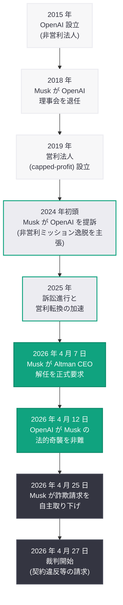
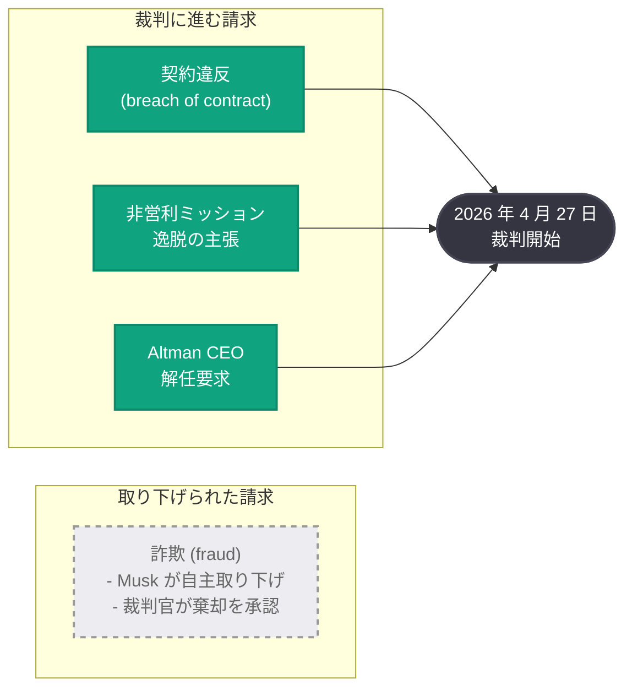

# Musk が裁判直前に OpenAI および Altman に対する詐欺請求を自主取り下げ

## メタデータ

| 項目 | 内容 |
|------|------|
| 発表日 | 2026-04-25 |
| ソース | Google News (Reuters, Fortune, Seeking Alpha, Benzinga, Cybernews) |
| カテゴリ | 企業 / 法務 |
| 公式リンク | [Google News](https://news.google.com/search?q=Musk+drops+fraud+claims+OpenAI) |

## 概要

Elon Musk は、2026 年 4 月 27 日 (月曜日) に予定されている裁判の開始を目前に控え、OpenAI および Sam Altman に対する詐欺 (fraud) 請求を自主的に取り下げた。米国の連邦裁判所判事は Musk の申請を承認し、詐欺請求を棄却した。ただし、OpenAI の非営利法人から営利法人への転換に関する契約違反 (breach of contract) 請求など、その他の訴訟請求は維持されており、裁判は予定通り進行する。

この動きは、Musk 側の戦略的な法的判断と見られている。2024 年初頭に提訴されて以来、訴訟は Altman CEO 解任要求、OpenAI による「法的奇襲」非難、反競争的行為の調査要請など、双方のエスカレーションが続いてきた。裁判直前の詐欺請求取り下げは、Musk 側が残る請求に訴訟リソースを集中させ、裁判での勝訴確率を高めようとする戦術的撤退と分析されている。

## 主な内容

### 詐欺請求の自主取り下げ

Reuters は「US judge dismisses Musk's fraud claims in OpenAI case at his request, plans to proceed to trial」と報じ、Musk が自らの申請により詐欺請求を棄却させたことを伝えた。Fortune も「Musk drops fraud claims against OpenAI, Altman ahead of trial」と報じており、複数のメディアがこの動きを確認している。

詐欺請求は、Musk が OpenAI と Altman が設立当初の非営利ミッションについて虚偽の表明を行い、Musk を欺いたと主張するものであった。しかし、詐欺の立証には高い法的ハードルが伴い、「詐欺の意図」や「具体的な損害」を証明する必要がある。裁判直前にこの請求を自主的に取り下げたことは、Musk 側がこの立証の困難さを認識した上での判断と考えられる。

### 残存する訴訟請求と裁判の継続

詐欺請求は棄却されたものの、以下の請求を含むその他の訴訟は維持されており、裁判は 2026 年 4 月 27 日に予定通り開始される。

- **契約違反 (breach of contract):** OpenAI が設立時の合意に反して非営利法人から営利法人へ転換したとする請求
- **非営利ミッションの逸脱:** OpenAI が「人類全体の利益のための AI 開発」という設立理念を放棄したとする主張
- **Altman CEO の解任要求:** 4 月 7 日に正式に提出された、Altman を OpenAI の CEO から解任するよう求める請求

Seeking Alpha は「Musk fraud claims against Altman, OpenAI dismissed」と報じつつも、残存する請求が裁判で争われることを強調している。

### 戦略的な法的判断の分析

今回の詐欺請求取り下げは、以下の戦略的考慮に基づくものと分析される。

- **立証負担の軽減:** 詐欺の立証は民事訴訟において最も厳格な基準が求められる。この請求を取り下げることで、Musk 側は比較的立証しやすい契約違反請求に訴訟リソースを集中させることが可能になる
- **裁判での印象管理:** 詐欺請求が裁判で棄却された場合、陪審員や裁判官に対する Musk 側の信頼性が損なわれるリスクがあった。自主的な取り下げにより、このリスクを回避できる
- **訴訟の焦点の明確化:** 残る契約違反請求に集中することで、裁判の争点を「OpenAI の営利転換の合法性」という核心的な問題に絞り込むことが可能になる
- **Financial Times が報じた「連敗」からの転換:** 4 月 12 日に Financial Times が報じた Musk の「法的連敗 (legal losing streak)」を踏まえ、弱い請求を戦略的に切り捨てることで残る請求の説得力を高める狙いがあると見られる

## 訴訟の経緯

### タイムライン

### 請求の状況 (裁判開始時点)

## 業界への影響

今回の詐欺請求取り下げと裁判の継続は、OpenAI および AI 業界全体に対して以下の影響をもたらす可能性がある。

- **裁判の焦点の変化:** 詐欺請求が除外されたことで、裁判は OpenAI の非営利から営利への転換の合法性という根本的な問題に集中する。この判決は、AI 業界における非営利組織の営利転換に関する重要な先例となりうる
- **OpenAI の IPO への影響:** 裁判が進行中であっても、詐欺請求の取り下げは OpenAI にとってある程度のリスク軽減を意味する。ただし、契約違反請求が認められた場合の影響は依然として甚大である
- **Musk の訴訟戦略の転換:** 詐欺請求の取り下げは、Musk 側が攻撃範囲を絞り込み、より現実的な法的戦略に転換したことを示している。これにより、残る請求に対する訴訟の説得力が高まる可能性がある
- **Microsoft およびパートナーへの波及:** OpenAI の企業構造に関する判決は、Microsoft をはじめとする OpenAI のパートナー企業やその投資価値にも影響を及ぼしうる
- **開発者エコシステムへの間接的影響:** 裁判の結果次第では、OpenAI のガバナンス構造、サービス提供条件、API 価格体系に変更が生じる可能性があり、OpenAI エコシステムに依存する開発者は動向を注視する必要がある

## 関連リンク

- [Reuters: US judge dismisses Musk's fraud claims in OpenAI case](https://www.reuters.com/)
- [Fortune: Musk drops fraud claims against OpenAI, Altman ahead of trial](https://fortune.com/)
- [Seeking Alpha: Musk fraud claims against Altman, OpenAI dismissed](https://seekingalpha.com/)
- [Google News - OpenAI Musk](https://news.google.com/search?q=OpenAI+Musk)
- [前回のレポート: OpenAI、Musk の「法的奇襲」を非難](2026-04-12-musk-legal-ambush-openai-trial.md)
- [関連レポート: Musk が OpenAI 訴訟で Altman CEO 解任を要求](2026-04-07-musk-seeks-altman-ouster.md)

## まとめ

Elon Musk は 2026 年 4 月 27 日の裁判開始を 2 日後に控えた 4 月 25 日、OpenAI および Sam Altman に対する詐欺請求を自主的に取り下げた。米連邦裁判所判事は Musk の申請を承認し棄却を決定したが、契約違反請求をはじめとするその他の訴訟請求は維持されており、裁判は予定通り月曜日に開始される。この動きは、立証が困難な詐欺請求を切り捨て、営利転換に関する契約違反請求に訴訟リソースを集中させる Musk 側の戦略的判断と分析される。2024 年初頭の提訴から約 2 年、Altman CEO 解任要求、法的奇襲の応酬を経て、AI 業界史上最大級のこの訴訟はいよいよ裁判の段階を迎える。判決の行方は、OpenAI の企業構造と IPO 計画のみならず、AI 業界全体のガバナンスモデルに広範な影響を及ぼす可能性がある。
