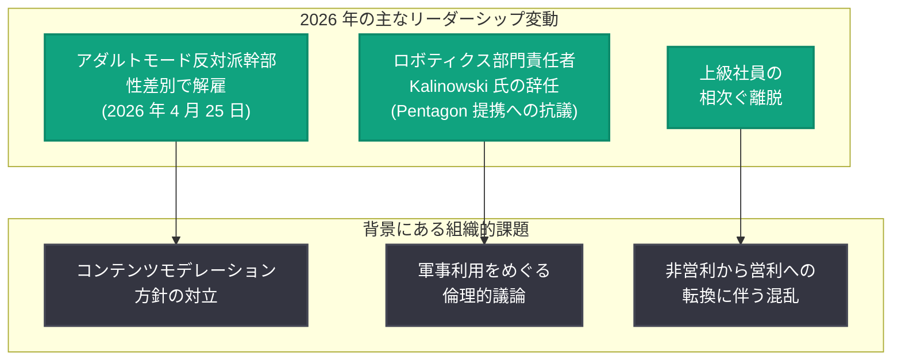

# OpenAI 幹部が性差別で解雇: 「アダルトモード」反対派の退場

## メタデータ

| 項目 | 内容 |
|------|------|
| 発表日 | 2026-04-25 |
| ソース | Google News (MSN 他) |
| カテゴリ | 企業 / 人事 |
| 公式リンク | [Google News](https://news.google.com/search?q=OpenAI+executive+fired+sexual+discrimination) |

## 概要

2026 年 4 月 25 日、OpenAI の幹部が性差別 (sexual discrimination) を理由に解雇されたことが報じられた。この幹部は、ChatGPT の「アダルトモード」(Adult Mode) 機能の導入に社内で強く反対していた人物として知られていた。性差別の疑惑はアダルトモードに関するポリシー議論とは別の問題であるが、コンテンツモデレーション方針をめぐる社内の対立が続く中での解雇は、OpenAI の組織運営に新たな波紋を投げかけている。

## 主な内容

### 解雇の経緯

MSN をはじめとする複数のメディアによると、OpenAI は性差別の申し立てを受けた社内調査の結果、当該幹部を解雇した。報道時点で幹部の具体的な氏名は公開されていないが、この人物が ChatGPT のアダルトモード機能に対して社内で一貫して反対の立場を取っていたことは広く知られていた。

性差別の申し立ての具体的な内容については現時点で詳細が明らかにされていないものの、職場における差別行為に関する複数の報告が社内調査のきっかけとなったとされている。

### アダルトモードとの関連性

この幹部はアダルトモードの導入に反対していた人物であるが、今回の解雇理由はあくまで性差別の申し立てに基づくものであり、ポリシー上の意見対立が直接的な解雇理由ではないとされている。ただし、この 2 つの事象が同一人物に関わることは、OpenAI 内部の複雑な力学を浮き彫りにしている。

ChatGPT のアダルトモードについては、以下の経緯がある。

1. **2025 年 10 月:** CEO Sam Altman がアダルトモードの構想を発表。成人向けコンテンツの生成に対応する機能として紹介された
2. **2025 年 12 月:** 当初のリリース目標時期を達成できず、最初の延期
3. **2026 年 3 月:** 2 度目の延期が確認。年齢確認システムの技術的課題や社内の優先事項の変更が理由として挙げられた
4. **2026 年 4 月 25 日:** アダルトモード反対派の幹部が性差別で解雇

### OpenAI におけるリーダーシップの変動

今回の解雇は、2026 年に入ってから続く OpenAI のリーダーシップ変動の一環でもある。

こうしたリーダーシップの変動は、OpenAI が急速な成長と事業拡大を進める中で、組織内部の方向性の統一が依然として課題であることを示している。

### コンテンツモデレーション方針をめぐる議論

OpenAI 社内では、コンテンツモデレーション方針をめぐる議論が継続している。アダルトモードの導入は、その中でも最も議論を呼ぶテーマの一つである。

- **導入推進派の主張:** 「大人を大人として扱う」という原則に基づき、成人ユーザーに対してより自由なコンテンツ生成を可能にすべきであるとの立場。Sam Altman 自身がこの方針を公言している
- **導入反対派の主張:** 安全性やブランドイメージへの影響、年齢確認の技術的困難さ、社会的な批判を受けるリスクを懸念する立場。今回解雇された幹部はこの立場の代表的な存在であった
- **中立的な立場:** 機能自体には反対しないが、十分な安全策が確立されるまでリリースを遅らせるべきであるとする立場

今回の解雇により、社内の反対派が一つの象徴的な存在を失ったことは事実であるが、解雇理由が性差別であることから、これをアダルトモード推進派の「勝利」と解釈するのは適切ではない。

## 業界への影響

- **OpenAI の組織ガバナンスへの注目:** リーダーシップの相次ぐ変動は、投資家やパートナー企業から見た OpenAI の組織安定性に対する懸念を高める可能性がある
- **コンテンツモデレーション議論への波及:** AI 企業が成人向けコンテンツをどこまで許容すべきかという議論は業界全体に広がっており、OpenAI の内部対立はこの議論を加速させる可能性がある
- **企業文化と倫理:** AI 企業における職場環境の健全性、特にダイバーシティやインクルージョンに関する姿勢が改めて問われることになる
- **アダルトモードの今後:** 反対派の主要人物が退場したことで、アダルトモードの開発が加速するかどうかは注目される。ただし、技術的課題や社会的議論が解消されたわけではない

## 開発者への影響

- **API への直接的な影響は限定的:** 今回の人事異動が API やプラットフォームの機能に直接影響を及ぼす可能性は低い
- **コンテンツポリシーの方向性:** アダルトモードの導入判断は、将来的に API のコンテンツポリシーにも波及する可能性があるため、動向を注視する必要がある
- **組織の安定性:** OpenAI のリーダーシップ変動が製品ロードマップやサポート体制に間接的な影響を与える可能性がある

## 関連リンク

- [Google News - OpenAI executive fired](https://news.google.com/search?q=OpenAI+executive+fired+sexual+discrimination)
- [関連レポート: ChatGPT Adult Mode が再び延期](2026-03-09-chatgpt-adult-mode-delayed.md)
- [OpenAI News](https://openai.com/news)

## まとめ

OpenAI の幹部が性差別を理由に解雇された。この幹部は ChatGPT の「アダルトモード」機能に社内で一貫して反対していた人物として知られていた。解雇理由はポリシー上の意見対立ではなく性差別の申し立てに基づくものであるが、コンテンツモデレーション方針をめぐる社内対立が続く中での出来事であり、OpenAI の組織運営に新たな課題を突きつけている。2026 年に入ってからのリーダーシップ変動の流れの中で、今回の解雇は OpenAI が急速な事業拡大と組織の安定性の両立に苦心している現状を改めて浮き彫りにした。アダルトモードの今後の展開、そして OpenAI の職場環境の改善に向けた取り組みが注目される。
