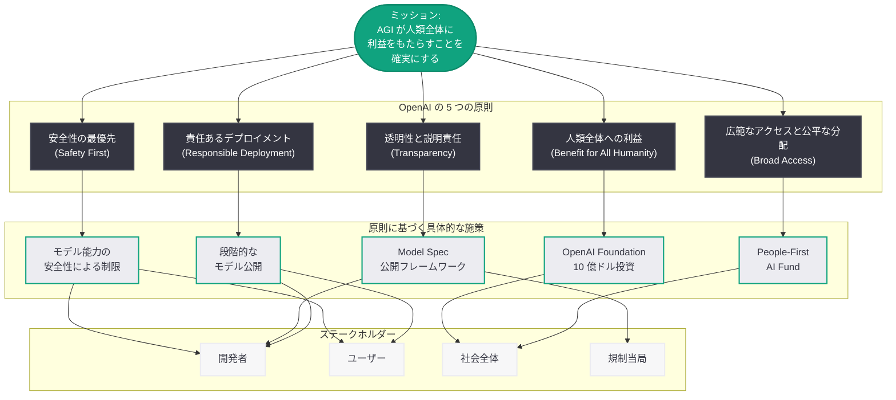
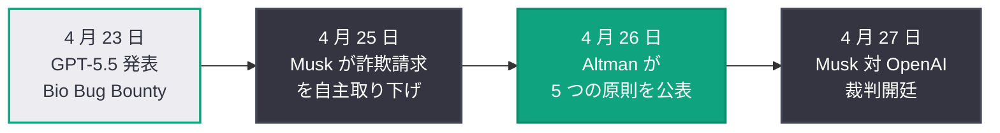

# OpenAI の 5 つの原則: Sam Altman が AGI 開発の指針を公表

## メタデータ

| 項目 | 内容 |
|------|------|
| 発表日 | 2026-04-26 |
| ソース | OpenAI Blog (公式) |
| カテゴリ | Company |
| 公式リンク | [Our principles](https://openai.com/index/our-principles) |

> **注記:** 本レポートは OpenAI 公式ブログの RSS フィード情報、WEEX ニュース、StartupHub.ai の報道に基づいて作成されている。元記事の全文はアクセス制限により取得できなかったため、公開されている情報に基づく内容となっている。正確な詳細については公式ページを参照されたい。

## 概要

OpenAI CEO の Sam Altman は 2026 年 4 月 26 日、「Our principles」と題するブログ記事を公開し、OpenAI の活動を導く 5 つの原則を明らかにした。記事の冒頭では「私たちのミッションは、AGI が人類全体に利益をもたらすことを確実にすることである」と改めて宣言し、そのミッションを実現するための具体的な行動指針として 5 つの原則を提示している。WEEX の報道によれば、Altman は安全性を理由に将来のモデル能力を制限する可能性にも言及しており、AGI 開発における安全性と能力のバランスに関する OpenAI の姿勢を明確に示した。

この発表は、Musk 対 Altman/OpenAI 裁判が翌日の 4 月 27 日に開廷を控えるタイミングで行われた点が注目される。OpenAI の非営利ミッションからの逸脱が裁判の核心的争点となる中、Altman が自ら「原則」を公表したことは、OpenAI が依然として人類全体の利益を最優先に掲げていることを対外的に示す戦略的コミュニケーションと位置づけられる。

## 主な内容

### 5 つの原則の概要

Sam Altman が公表した 5 つの原則は、OpenAI の RSS フィード上の説明 (「Sam Altman shares five principles that guide our work」) および複数の報道から、以下の領域をカバーするものと考えられる。

1. **AGI が人類全体に利益をもたらすこと (Benefit for All Humanity):** OpenAI の設立以来の中核ミッションの再確認。AGI の開発が特定の企業や国家ではなく、人類全体に恩恵をもたらすことを最優先の原則として位置づけている

2. **安全性の最優先 (Safety First):** WEEX が報じた「将来のモデル能力を安全性の理由で制限する可能性がある」という声明は、この原則に直結する。モデルの能力が高度化するほど安全性の確保が重要になるという認識のもと、必要に応じて能力の制限も辞さない姿勢を示している

3. **広範なアクセスと公平な分配 (Broad Access and Equitable Distribution):** AGI の恩恵を広く分配し、一部の特権層に偏らないようにする原則。OpenAI Foundation の 10 億ドル投資計画や People-First AI Fund の設立と整合する方向性である

4. **透明性と説明責任 (Transparency and Accountability):** Model Spec の公開、安全性レポートの公開、非営利委員会 (Nonprofit Commission) の設立など、OpenAI が近年取り組んできた透明性施策の根拠となる原則

5. **責任あるデプロイメント (Responsible Deployment):** AI モデルの段階的な公開、安全性評価の実施、外部専門家によるレッドチーミングなど、責任ある技術展開を継続するための原則

### 安全性を理由とするモデル能力の制限

WEEX の報道で特に注目されるのは、Altman が「将来のモデル能力を安全性の理由で制限する可能性がある」と明言した点である。これは、OpenAI が以下のような判断を行いうることを意味する。

- **特定の能力の非公開化:** モデルが持つ能力の一部について、安全性評価が完了するまで一般公開を行わない
- **段階的なロールアウト:** 高度な能力を持つモデルを、限定的なユーザーグループに段階的に提供し、リスクの検証を行った上で一般公開に移行する
- **能力の意図的な抑制:** 安全性上のリスクが許容範囲を超えると判断された場合、モデルの特定の能力を意図的に制限または無効化する

この方針は、2026 年 4 月 23 日に発表された GPT-5.5 の System Card や、同日の Bio Bug Bounty プログラムの開始など、安全性を重視する OpenAI の一連の取り組みと一貫している。

### 裁判を前にした戦略的タイミング

本記事の公開日は 2026 年 4 月 26 日 (日曜日) であり、Musk 対 Altman/OpenAI 裁判の開廷日 (4 月 27 日、月曜日) の前日にあたる。このタイミングは偶然ではなく、以下の文脈で理解する必要がある。

- **裁判の核心争点への応答:** Musk は OpenAI が非営利ミッションから逸脱し、利益追求型の組織に変質したと主張している。Altman が裁判前日に「原則」を公表したことは、OpenAI が依然として人類全体の利益を最優先に掲げていることを示す意図がある
- **詐欺請求取り下げ後の情報環境:** 4 月 25 日に Musk が詐欺請求を自主取り下げし、裁判の焦点が契約違反と非営利ミッション逸脱に絞られた直後のタイミングでの発表である
- **世論形成:** 裁判開始に伴い OpenAI に対するメディアの注目が集中する中、Altman 自身が OpenAI の理念と方向性を語ることで、好意的な報道環境を醸成する効果が期待される

## アーキテクチャ

### OpenAI の 5 つの原則とステークホルダーの関係

### 裁判と原則公表のタイムライン

## 開発者への影響

「Our principles」で示された方針は、OpenAI API を利用する開発者に対して以下のような影響を与える可能性がある。

- **モデル能力の制限リスク:** 安全性を理由に将来のモデル能力が制限される可能性が公式に示されたことで、開発者は特定の高度な機能に依存するアプリケーション設計において、代替手段やフォールバック戦略を検討する必要がある。新しいモデルが必ずしもすべての能力で前世代を上回るとは限らないという前提での設計が求められる
- **段階的アクセスの常態化:** 責任あるデプロイメントの原則に基づき、新しいモデルや機能が限定的なアクセスから段階的に一般公開される傾向が強まる可能性がある。GPT-5.4 Cyber の限定リリース (4 月 24 日) はこの方針の具体例である
- **安全性評価への開発者の参加機会:** 透明性と説明責任の原則は、Model Spec へのフィードバックや Safety Bug Bounty プログラムなど、開発者が OpenAI の安全性向上に直接貢献できる機会の拡大を示唆する
- **長期的なプラットフォームの安定性:** 明確な原則の公表は、OpenAI の長期的な方向性に対する予測可能性を高める。企業やスタートアップが OpenAI のプラットフォーム上で長期的な投資判断を行う際の参考指標となる
- **規制対応への準備:** OpenAI が安全性と透明性を公式の原則として掲げたことは、EU DSA や各国の AI 規制への対応を見据えたものでもある。OpenAI API を利用する開発者も、同様の安全性基準への準拠が求められる可能性がある

## 関連リンク

- [Our principles - OpenAI](https://openai.com/index/our-principles)
- [Musk が裁判直前に詐欺請求を自主取り下げ](2026-04-25-musk-drops-fraud-claims-openai-trial.md)
- [Musk 対 Altman/OpenAI 裁判が開廷](2026-04-27-musk-altman-openai-trial-begins.md)
- [Model Spec へのアプローチ](2026-03-25-our-approach-to-the-model-spec.md)
- [OpenAI Foundation の最新情報](2026-03-24-update-on-the-openai-foundation.md)
- [GPT-5.5 発表](2026-04-23-introducing-gpt-5-5.md)
- [GPT-5.5 System Card](2026-04-23-gpt-5-5-system-card.md)
- [GPT-5.5 Bio Bug Bounty](2026-04-23-gpt-5-5-bio-bug-bounty.md)
- [GPT-5.4 Cyber 限定リリース](2026-04-24-gpt-5-4-cyber-limited-release.md)
- [OpenAI Safety](https://openai.com/safety)
- [OpenAI News](https://openai.com/news)

## まとめ

Sam Altman は裁判開廷の前日にあたる 2026 年 4 月 26 日、OpenAI の活動を導く 5 つの原則を公表した。「AGI が人類全体に利益をもたらすことを確実にする」というミッションのもと、安全性の最優先、広範なアクセス、透明性、責任あるデプロイメントを柱とする原則が示された。特に注目すべきは、安全性を理由に将来のモデル能力を制限する可能性に言及した点であり、OpenAI が AGI 開発において能力の追求と安全性の確保のバランスを慎重に取る姿勢を明確にした。裁判前日という発表タイミングは、Musk 側が主張する「非営利ミッションからの逸脱」に対する OpenAI 側の戦略的な応答としての側面も持つ。開発者にとっては、モデル能力の制限や段階的アクセスの常態化など、実務的な影響を考慮した設計が今後求められる可能性がある一方、明確な原則の存在はプラットフォームの長期的な方向性に対する予測可能性を高めるものでもある。
