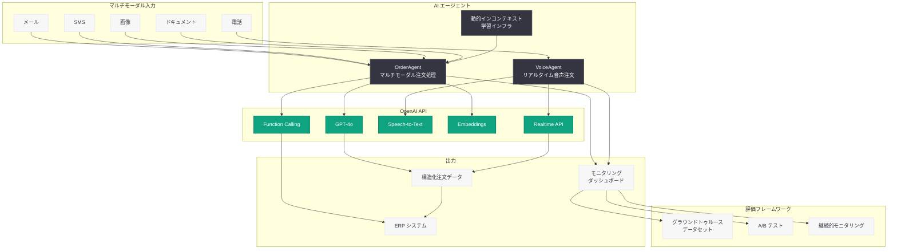

# Choco が AI エージェントで食品流通を自動化

## メタデータ

| 項目 | 内容 |
|------|------|
| 発表日 | 2026-04-27 |
| ソース | OpenAI Customer Story |
| カテゴリ | 導入事例 / AI エージェント / 食品流通 |
| 公式リンク | [openai.com/index/choco](https://openai.com/index/choco/) |

## 概要

Choco は、OpenAI API を活用して食品・飲料流通を近代化する AI プラットフォームである。米国、英国、欧州、GCC 地域にわたる 21,000 社以上のディストリビューターと 100,000 社以上のバイヤーにサービスを提供しており、年間 880 万件以上の注文を処理している。AI エージェントの導入により、手動での注文入力を 50% 削減し、営業チームの生産性を人員追加なしで 2 倍に向上させた。

Choco の事例は、食品サプライチェーンという伝統的な産業において、マルチモーダル AI エージェントがいかに業務プロセスを変革できるかを示す先進的な導入事例である。特に、顧客固有の暗黙的なコンテキスト (SKU マッピング、単位の好み、配送パターン) を動的に学習する仕組みが、実用的な AI 活用の鍵となっている。

## 主な内容

### OrderAgent: マルチモーダル注文処理

OrderAgent は Choco の中核となる AI エージェントであり、メール、SMS、画像、ドキュメントなどのマルチモーダル入力を処理し、ERP に即座に取り込める構造化された注文データに変換する。

主な特徴は以下の通り。

- **マルチモーダル入力対応:** テキスト、画像、音声など多様な形式の注文を単一のエコシステムで処理
- **動的インコンテキスト学習:** 顧客固有の SKU マッピング、単位の好み、配送パターンを学習し、注文解釈の精度を向上
- **ERP 連携:** 処理された注文を構造化データとして ERP システムに直接出力
- **設定可能な自動化閾値:** エラー率 1-5% 以下の範囲で、自動化レベルを調整可能

VP Engineering の Narbeh Mirzaei 氏は、「本当の課題は暗黙的なコンテキストだった。顧客固有の SKU マッピング、単位の好み、配送パターンといった情報をどう処理するかが鍵だった」と述べている。

### VoiceAgent: リアルタイム音声注文

VoiceAgent は OpenAI の Realtime API を活用した音声注文システムであり、営業時間外でも電話による注文受付を可能にする。

- **サブ秒のレイテンシ:** OpenAI Realtime API による低遅延の音声処理
- **24 時間 365 日対応:** 営業時間外の注文受付を自動化し、常時稼働を実現
- **自然な対話:** 顧客が通常の電話注文と同じ感覚で AI エージェントと対話可能

### 導入成果

Choco の AI エージェント導入による主要な成果は以下の通り。

| 指標 | 結果 |
|------|------|
| 年間注文処理数 | 880 万件以上 |
| AI トークン処理数 | 2,000 億以上 |
| 手動注文入力の削減 | 50% |
| 営業チームの生産性向上 | 2 倍 (人員追加なし) |
| エラー率 | 1-5% 以下 |
| 注文受付体制 | 24 時間 365 日 |

## 技術的な詳細

### 使用技術

Choco は OpenAI の以下の技術を活用している。

- **OpenAI SDK / API:** 中核となる AI 処理基盤
- **Speech-to-Text:** VoiceAgent における音声認識
- **Embeddings:** 顧客固有のコンテキスト学習と類似注文の検索
- **Function Calling:** 構造化データの出力と ERP システムとの連携
- **Realtime API:** VoiceAgent のサブ秒レイテンシ音声処理

### 動的インコンテキスト学習インフラ

Choco のエンジニアリングにおける最大の技術的課題は、動的インコンテキスト学習インフラの構築であった。Mirzaei 氏は「本当のエンジニアリング上の課題は、動的インコンテキスト学習インフラの構築だった」と語っている。

このインフラにより、各顧客の注文パターンや用語の使い方を動的に学習し、注文解釈の精度を継続的に向上させている。

### 評価フレームワーク

Choco は厳格な評価フレームワークを構築し、AI エージェントの品質を担保している。

- **グラウンドトゥルースデータセット:** 正解データに基づく精度検証
- **継続的モニタリング:** 本番環境でのパフォーマンスを常時監視
- **A/B テスト:** 新しいモデルやプロンプトの効果を定量的に検証

### コードサンプル

```python
from openai import OpenAI

client = OpenAI()

# OrderAgent: マルチモーダル注文処理の概念例
response = client.chat.completions.create(
    model="gpt-4o",
    messages=[
        {
            "role": "system",
            "content": (
                "You are an order processing agent for food distribution. "
                "Parse incoming orders from various formats (email, SMS, images) "
                "and output structured ERP-ready order data. "
                "Use customer-specific SKU mappings and unit preferences."
            )
        },
        {
            "role": "user",
            "content": [
                {"type": "text", "text": "Process this order from customer #1234:"},
                {
                    "type": "image_url",
                    "image_url": {"url": "https://example.com/order-image.jpg"}
                }
            ]
        }
    ],
    tools=[
        {
            "type": "function",
            "function": {
                "name": "create_erp_order",
                "description": "Create a structured order in the ERP system",
                "parameters": {
                    "type": "object",
                    "properties": {
                        "customer_id": {"type": "string"},
                        "items": {
                            "type": "array",
                            "items": {
                                "type": "object",
                                "properties": {
                                    "sku": {"type": "string"},
                                    "quantity": {"type": "number"},
                                    "unit": {"type": "string"}
                                }
                            }
                        },
                        "delivery_date": {"type": "string"}
                    },
                    "required": ["customer_id", "items"]
                }
            }
        }
    ]
)
```

## アーキテクチャ



## 開発者への影響

Choco の事例は、食品流通に限らず、複雑な業務プロセスを AI エージェントで自動化する際の実践的な指針を提供している。開発者が注目すべきポイントは以下の通り。

- **動的インコンテキスト学習の設計:** 顧客固有のコンテキスト (SKU マッピング、単位の好みなど) を動的に学習するインフラを構築することで、汎用モデルを業界特化型のソリューションに変換できる
- **マルチモーダル入力の統合:** OpenAI のテキスト、ビジョン、音声の各機能を単一のエコシステムで活用することで、多様な入力チャネルに対応する注文処理が実現可能
- **評価ファーストのアプローチ:** 開発初日から 10-20 件のグラウンドトゥルースデータを用意し、評価フレームワークを構築することが推奨される
- **AI ネイティブなオブザーバビリティ:** モデルの入力、出力、推論トレースを可視化する監視基盤への投資が、本番運用の品質担保に不可欠
- **確率的モデルへの期待値設定:** LLM は確率的であり決定論的ではないことを早期にステークホルダーに伝え、設定可能な自動化閾値で柔軟に運用する設計が重要
- **Realtime API の活用:** サブ秒のレイテンシを実現する Realtime API により、電話注文のような即応性が求められるユースケースにも AI エージェントを適用可能

## 関連リンク

- [Choco 導入事例 (OpenAI)](https://openai.com/index/choco/)
- [OpenAI API ドキュメント](https://platform.openai.com/docs)
- [OpenAI Realtime API](https://platform.openai.com/docs/guides/realtime)
- [OpenAI Function Calling](https://platform.openai.com/docs/guides/function-calling)
- [OpenAI Embeddings](https://platform.openai.com/docs/guides/embeddings)
- [OpenAI Speech-to-Text](https://platform.openai.com/docs/guides/speech-to-text)

## まとめ

Choco は OpenAI API を活用した AI エージェント (OrderAgent、VoiceAgent) により、食品・飲料流通のサプライチェーンを大規模に変革した。年間 880 万件以上の注文処理、手動作業の 50% 削減、営業生産性の 2 倍向上という成果は、AI エージェントが伝統的な産業においても大きなインパクトを生み出せることを実証している。特に、動的インコンテキスト学習インフラの構築、評価ファーストの開発アプローチ、AI ネイティブなオブザーバビリティへの投資といったエンジニアリング上のベストプラクティスは、同様の業務自動化プロジェクトに取り組む開発者にとって貴重な参考事例となるだろう。今後、Choco は AI 機能の拡張を進め、非エンジニアが「エージェントオーケストレーター」として活躍できる環境を目指している。
