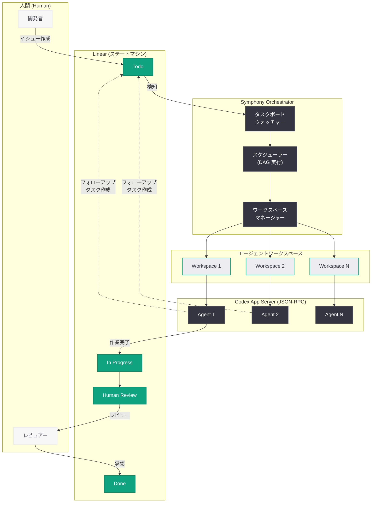
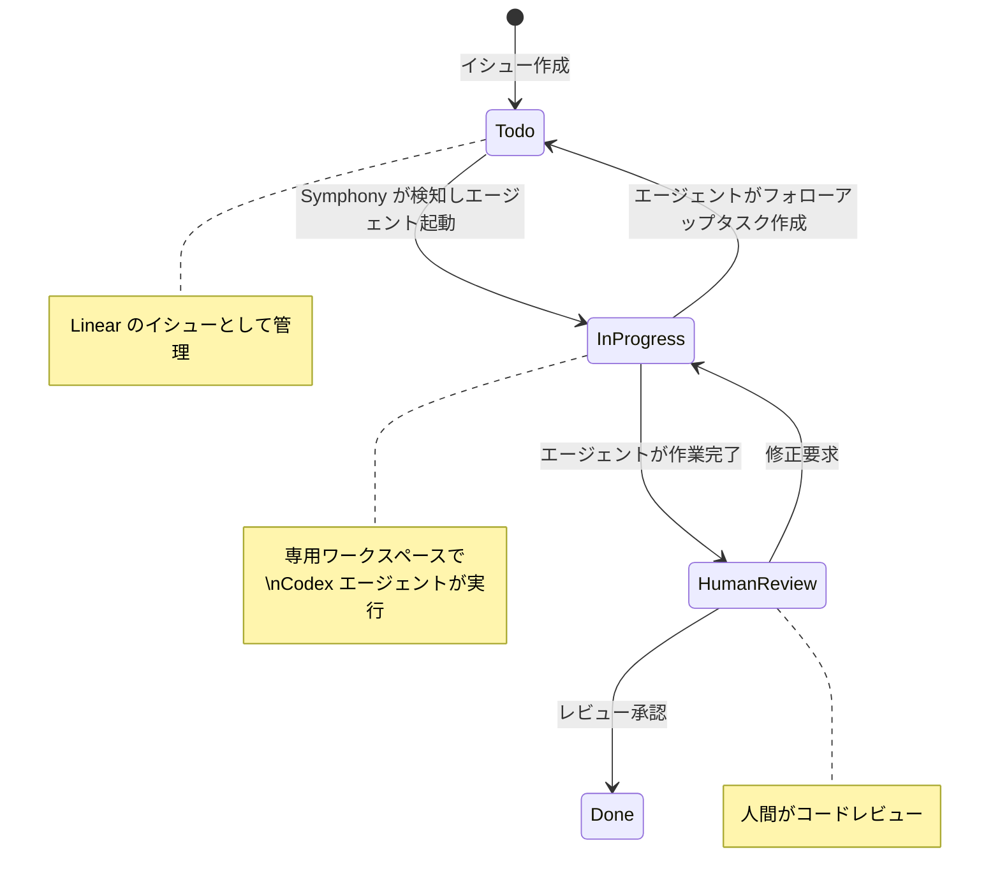

# Symphony: Codex エージェントを大規模にオーケストレーションするオープンソース仕様

## メタデータ

| 項目 | 内容 |
|------|------|
| 発表日 | 2026-04-27 |
| ソース | OpenAI Engineering |
| カテゴリ | エンジニアリング / Codex / オープンソース |
| 公式リンク | [Open-source spec for Codex orchestration: Symphony](https://openai.com/index/open-source-codex-orchestration-symphony/) |

## 概要

OpenAI は、Codex エージェントを大規模にオーケストレーションするためのオープンソース仕様「Symphony」を公開した。Symphony は SPEC.md という書かれた仕様書 (written spec) として機能し、イシュートラッカー (Linear) をエージェントオーケストレーターへと変換する。OpenAI の一部チームでは導入後 3 週間でマージされた PR 数が 500% 増加し、GitHub では 15,000 以上のスターを獲得している。リファレンス実装は Elixir で記述され、Codex 自身が TypeScript、Go、Rust、Java、Python の各実装を生成した。

## 主な内容

### 背景 -- コンテキストスイッチのボトルネック

OpenAI のチームは、Codex を用いて人間の手書きコードを一切含まないリポジトリを構築した経験を持つ。この取り組みは「harness engineering」ブログ記事で紹介されている。しかし、次に直面したボトルネックはコンテキストスイッチ (作業の切り替えコスト) であった。複数のエージェントに並行して作業を割り振り、その進捗を追跡し、依存関係を管理する――こうしたオーケストレーション課題を解決するために Symphony が生まれた。

### Symphony とは何か

Symphony は単なるソフトウェアツールではなく、**書かれた仕様 (written spec)** である。SPEC.md というドキュメントがスーパーバイザーの役割を果たし、エージェントによる作業のオーケストレーションを定義する。その核となるアイデアは以下のとおりである。

- **イシュートラッカーをオーケストレーターに変換:** Linear の各オープンイシューが専用のエージェントワークスペースにマッピングされる
- **継続的な監視:** Symphony はタスクボードを常時監視し、すべてのアクティブタスクにエージェントが稼働していることを保証する
- **セッションや PR からの分離:** 作業をセッションや個別の PR から切り離すことで、エージェントの中断・再開が容易になる

### 動作の仕組み -- Linear をステートマシンとして活用

Symphony の中核は、Linear をステートマシンとして活用する設計にある。

```
Todo → In Progress → Human Review → Done
```

各状態遷移は以下のように機能する。

1. **Todo:** 新しいタスクがイシュートラッカーに登録される
2. **In Progress:** Symphony がタスクを検知し、専用ワークスペースを作成してエージェントを起動する
3. **Human Review:** エージェントが作業を完了し、人間のレビューを待つ状態に遷移する
4. **Done:** レビュー承認後、タスクが完了となる

この設計により、エージェントは依存関係を持つタスクツリー (DAG 実行) を通じて複雑な機能を実装できる。さらに、エージェント自身がフォローアップタスクを作成する能力を持つため、作業の分解と並列化が自律的に行われる。

### SPEC.md の構成要素

SPEC.md には以下の主要コンポーネントが定義されている。

- **オーケストレーターのステートマシン:** タスクの状態遷移ルールと制約
- **ワークスペース管理:** エージェントごとの隔離された作業環境の作成と管理
- **エージェントランナープロトコル:** Codex App Server モード (JSON-RPC API) を使用したエージェントの起動と通信
- **イシュートラッカー統合:** Linear との双方向統合プロトコル
- **プロンプト構築:** エージェントへのコンテキスト提供と指示の構造化
- **ロギングとオブザーバビリティ:** エージェントの動作追跡と監視

また、WORKFLOW.md が開発ワークフロー全体を定義し、エージェントが従うべき手順を規定している。

### 核となる設計原則

Symphony の設計は以下の原則に基づいている。

| 原則 | 説明 |
|------|------|
| **Humans steer. Agents execute.** | 人間が方向性を定め、エージェントが実行する |
| **Progressive disclosure** | コンテキスト管理において段階的に情報を開示する |
| **目標の付与、遷移の強制ではない** | エージェントに目標 (objectives) を与え、厳密な状態遷移は強制しない |
| **AGENTS.md は目次** | AGENTS.md はエンサイクロペディアではなく目次として設計する |
| **Golden principles** | 自動クリーンアップのための原則 (ガベージコレクションに相当) |
| **手書きコードゼロ** | 人間が手動でコードを書くことを前提としない設計思想 |

## 技術的な詳細

### Codex App Server モード

Symphony は Codex App Server モードを通じてエージェントと通信する。これは JSON-RPC API として実装されており、以下の操作をプログラマティックに実行できる。

- エージェントの起動と停止
- タスクの割り当てとコンテキストの注入
- 動的なツール呼び出し (dynamic tool calls)
- エージェントの状態監視

### タスクツリーと DAG 実行

複雑な機能の実装では、タスクが依存関係を持つツリー構造 (有向非巡回グラフ: DAG) として管理される。

```
Feature A
├── Task 1 (依存なし)
├── Task 2 (依存なし)
├── Task 3 (Task 1, Task 2 に依存)
│   └── Task 3.1 (Task 3 のフォローアップ、エージェントが自動生成)
└── Task 4 (Task 3 に依存)
```

エージェントは依存関係のないタスクを並列実行し、依存関係が解消されたタスクから順次着手する。フォローアップタスクはエージェント自身が作成できるため、作業の粒度は動的に調整される。

### リファレンス実装と多言語対応

| 言語 | 実装者 | 備考 |
|------|--------|------|
| Elixir | OpenAI チーム | リファレンス実装 |
| TypeScript | Codex | Codex が生成 |
| Go | Codex | Codex が生成 |
| Rust | Codex | Codex が生成 |
| Java | Codex | Codex が生成 |
| Python | Codex | Codex が生成 |

Elixir がリファレンス実装として選択された背景には、並行処理やプロセスの監視ツリーといった Elixir/OTP の特性がオーケストレーターの要件と合致していることがある。残りの 5 言語の実装は Codex 自身が Symphony の仕様に基づいて生成しており、Symphony の「手書きコードゼロ」の思想を体現している。

## アーキテクチャ



### ステートマシンのフロー



## 開発者への影響

### 生産性の大幅な向上

OpenAI の一部チームでは、Symphony 導入後の最初の 3 週間でマージされた PR 数が **500% 増加**した。この成果は、エージェントオーケストレーションが開発生産性に与えるインパクトの大きさを示している。

### エージェントオーケストレーションの標準化

Symphony が SPEC.md というオープンな仕様として公開されたことで、以下の影響が期待される。

- **相互運用性の向上:** 異なるエージェントフレームワーク間での標準的なオーケストレーションプロトコルの確立
- **エコシステムの拡大:** 6 言語での実装が既に存在し、開発者は自身の技術スタックに合わせた導入が可能
- **ベストプラクティスの共有:** 「Humans steer. Agents execute.」や progressive disclosure といった設計原則が業界全体で活用可能に

### イシュートラッカーの新たな役割

Symphony の設計は、Linear のようなイシュートラッカーを単なるタスク管理ツールから**エージェントオーケストレーターへと昇格**させる。この発想は、既存の開発ワークフローを根本的に変革する可能性を秘めている。開発者は従来のワークフローを大きく変更することなく、イシューの作成とレビューを通じてエージェントに作業を委任できる。

### AGENTS.md の設計指針

Symphony は AGENTS.md を「エンサイクロペディアではなく目次」として設計することを推奨している。これは、エージェントに過剰なコンテキストを与えるのではなく、必要な情報への参照パスを提供するという progressive disclosure の原則に基づく。開発者がエージェント向けのドキュメントを作成する際の重要な指針となる。

### 「手書きコードゼロ」の実証

Elixir のリファレンス実装を除く 5 言語の実装が Codex 自身によって生成されたことは、エージェントが仕様書に基づいて実用的なソフトウェアを自律的に実装できることの実証である。この成果は、ソフトウェア開発のあり方を根本的に問い直すものであり、開発者の役割が「コードの記述者」から「仕様の定義者とレビュアー」へ移行する未来を示唆している。

## 関連リンク

- [Symphony 公式記事: Open-source spec for Codex orchestration](https://openai.com/index/open-source-codex-orchestration-symphony/)
- [OpenAI Engineering Blog](https://openai.com/blog/)
- [Codex](https://openai.com/codex/)
- [Linear (イシュートラッカー)](https://linear.app/)
- [関連レポート: Harness Engineering](https://openai.com/index/harness-engineering/)

## まとめ

OpenAI がオープンソースで公開した Symphony は、Codex エージェントの大規模オーケストレーションを実現するための仕様書 (SPEC.md) である。Linear をステートマシンとして活用し、Todo から Done までの状態遷移を通じてエージェントの自律的な作業を管理する。タスクの DAG 実行やエージェントによるフォローアップタスクの自動生成といった機能により、複雑な機能開発を並列化できる。一部チームでは導入 3 週間で PR 数が 500% 増加し、GitHub では 15,000 以上のスターを獲得した。リファレンス実装は Elixir で記述され、TypeScript、Go、Rust、Java、Python の各実装は Codex 自身が生成した。「Humans steer. Agents execute.」という原則に基づく Symphony は、開発者の役割をコードの記述からタスクの定義とレビューへと移行させる、ソフトウェア開発の新たなパラダイムを提示している。
