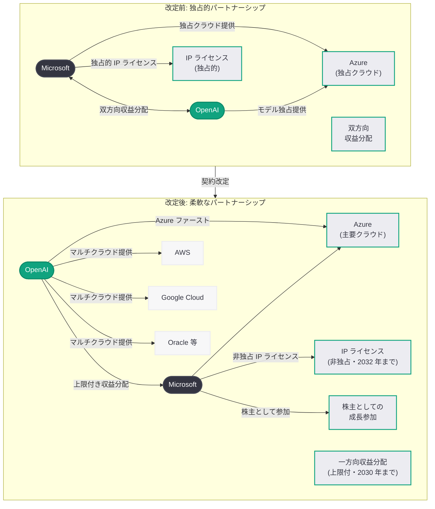
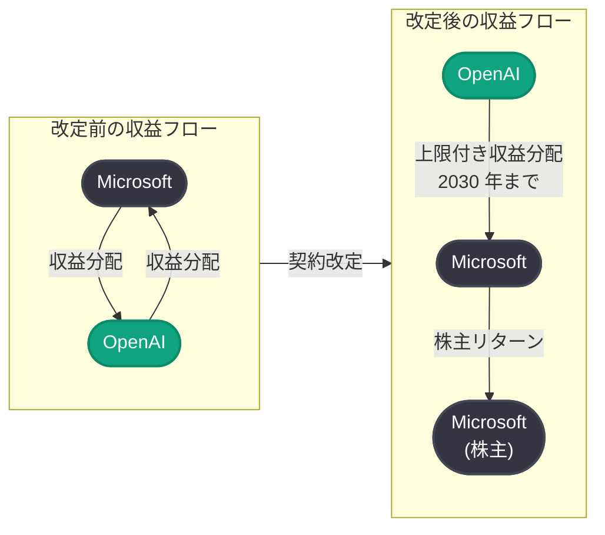

# Microsoft-OpenAI パートナーシップの次の段階: 契約改定で柔軟性・確実性・マルチクラウド展開を実現

## メタデータ

| 項目 | 内容 |
|------|------|
| 発表日 | 2026-04-27 |
| ソース | OpenAI Company、NYT、Reuters、CNBC、TechCrunch、The Information |
| カテゴリ | 企業 / パートナーシップ |
| 公式リンク | [openai.com/index/next-phase-of-microsoft-partnership](https://openai.com/index/next-phase-of-microsoft-partnership/) |

## 概要

OpenAI は 2026 年 4 月 27 日、Microsoft との契約を改定し、両社のパートナーシップを「柔軟性 (flexibility)、確実性 (certainty)、AI の恩恵を広く届けること」を基盤とした新たな枠組みへと移行することを発表した。今回の改定により、OpenAI は全製品をあらゆるクラウドプロバイダー上で顧客に提供できるようになり、Microsoft の IP ライセンスは非独占的に変更される。また、Microsoft から OpenAI への収益分配は廃止され、OpenAI から Microsoft への収益分配は 2030 年まで上限付きで継続する。

この契約改定は、3 月 23 日に報じられた [OpenAI の IPO 投資家向け文書における Microsoft 依存リスクの明記](2026-03-23-openai-microsoft-ipo-risk-disclosure.md)、3 月 21 日に報じられた [Amazon とのカスタムモデル協議](2026-03-21-amazon-openai-custom-models.md)、そして 4 月 4 日に報じられた [Microsoft の自社 AI モデル開発と戦略的自立](2026-04-04-microsoft-in-house-ai-openai-partnership-shift.md) の一連の動きを総括する形で、両社の関係性を「相互依存型」から「戦略的パートナーシップ型」へと公式に再定義するものである。NYT は「Microsoft and OpenAI Loosen Their Partnership」、Reuters は「Microsoft, OpenAI change terms of deal so startup can court Amazon and others」と報じ、The Information は「Microsoft Comes Out of OpenAI Deal a Winner」と評価している。

## 主な内容

### 5 つの主要変更点

OpenAI が発表した契約改定の骨子は、以下の 5 点に集約される。

#### 1. クラウドパートナーシップの再定義

Microsoft は OpenAI の「主要クラウドパートナー (primary cloud partner)」としての地位を維持し、OpenAI の製品は引き続き Azure 上で最初にリリースされる。ただし、Microsoft が必要な機能をサポートできない場合、もしくはサポートしないことを選択した場合は、この限りではない。重要な変更として、OpenAI はすべての製品をあらゆるクラウドプロバイダー上で顧客に提供できるようになった。

- **Azure ファースト:** OpenAI 製品は引き続き Azure 上で優先的にリリースされる
- **マルチクラウド提供:** OpenAI は AWS、Google Cloud、Oracle Cloud など他のクラウドプロバイダーを通じた製品提供が可能になる
- **柔軟な例外規定:** Microsoft が対応できない/対応しないケースでは、Azure ファーストの制約が適用されない

#### 2. IP ライセンスの非独占化

Microsoft は 2032 年まで OpenAI の IP (モデルおよび製品) に対するライセンスを維持する。ただし、このライセンスは非独占的 (non-exclusive) に変更された。

- **ライセンス期間:** 2032 年まで継続
- **非独占化:** 他のクラウドプロバイダーやパートナー企業も OpenAI の IP にアクセスする道が開かれた
- **製品とモデルの両方:** ライセンスの対象には OpenAI のモデルだけでなく製品も含まれる

#### 3. Microsoft から OpenAI への収益分配の廃止

Microsoft は OpenAI に対して収益分配を行わなくなる。これにより、Azure OpenAI Service 等を通じた Microsoft の AI ビジネスの利益構造が改善される。

#### 4. OpenAI から Microsoft への収益分配: 上限付きで 2030 年まで継続

OpenAI から Microsoft への収益分配は、OpenAI の技術的進歩とは独立して、従来と同じパーセンテージで 2030 年まで継続する。ただし、支払い総額には上限 (cap) が設定された。

- **継続期間:** 2030 年まで
- **分配率:** 従来と同じパーセンテージ
- **総額上限:** 支払い総額に上限が設けられ、OpenAI の財務負担が制限される
- **技術進歩と独立:** AGI 達成等の技術的マイルストーンに関わらず収益分配が継続

#### 5. Microsoft の株主としての参加継続

Microsoft は引き続き OpenAI の主要株主として、OpenAI の成長に直接的に参加する。持分を通じた利益享受は、収益分配に代わる長期的なリターンの源泉となる。

### パートナーシップ構造の Before/After

### 各メディアの評価

今回の契約改定は、主要メディアによって多角的に報じられており、その評価は一様ではない。

- **NYT: "Microsoft and OpenAI Loosen Their Partnership"** -- 両社の関係性が緩和されたという事実に焦点を当てた報道。独占的な縛りが解消され、両社がそれぞれの戦略的自由度を獲得した点を強調
- **Reuters: "Microsoft, OpenAI change terms of deal so startup can court Amazon and others"** -- OpenAI が Amazon をはじめとする他社との提携を追求できるようになったことに注目。エンタープライズ市場での競争力強化の観点からの報道
- **CNBC: "OpenAI shakes up partnership with Microsoft, capping revenue share payments"** -- 収益分配の上限設定という財務面の変更に焦点。OpenAI の IPO に向けた財務体質の改善という文脈での分析
- **TechCrunch: "OpenAI ends Microsoft legal peril over its $50B Amazon deal"** -- Amazon との $500 億規模の取引を巡る Microsoft の法的リスクが解消されたことを報道。3 月 21 日に報じられた Amazon との協議が今回の契約改定によって正式に道が開かれたことを示唆
- **The Information: "Microsoft Comes Out of OpenAI Deal a Winner"** -- Microsoft が今回の取引で勝者であるとの評価。収益分配の廃止、株主としての成長参加の継続、自社 AI モデル開発の自由度確保という観点からの分析

## 技術的な詳細

### マルチクラウド提供の技術的含意

OpenAI がマルチクラウドで製品を提供できるようになったことは、技術アーキテクチャの観点で重要な意味を持つ。

- **API エンドポイントの多様化:** OpenAI の API が Azure 以外のクラウドプラットフォーム上でもネイティブに利用可能になる見込みである。これにより、レイテンシ最適化やデータレジデンシー要件への対応が容易になる
- **推論インフラの分散:** モデルの推論ワークロードが複数のクラウドプロバイダーに分散されることで、単一障害点のリスクが低減される
- **カスタムモデルの展開:** 3 月 21 日に報じられた Amazon とのカスタムモデル協議が今回の契約改定により本格的に進展する基盤が整った。AWS Bedrock 上での OpenAI モデル提供が現実味を帯びてきた

### IP ライセンスの非独占化が意味するもの

Microsoft の IP ライセンスが非独占化されたことで、以下の変化が生じる。

- **他社プラットフォームでの OpenAI モデル利用:** AWS、Google Cloud、Oracle Cloud 等のプロバイダーが OpenAI のモデルを自社プラットフォーム上で提供する法的な障壁が解消された
- **Microsoft のライセンス継続:** 2032 年まで Microsoft は OpenAI の IP へのアクセスを維持するため、Azure OpenAI Service や Copilot 製品群への技術的な影響は限定的である
- **競争環境の変化:** クラウド AI サービス市場における差別化要因が「OpenAI モデルへの独占アクセス」から「サービス品質・価格・統合性」へと移行する

### 収益構造の変化

## 開発者への影響

### マルチクラウドでの OpenAI API アクセス

今回の契約改定により、開発者は今後 Azure 以外のクラウドプロバイダー上でも OpenAI の API にアクセスできるようになる見込みである。

- **クラウド選択の自由度向上:** AWS や Google Cloud を主要インフラとして利用している開発者が、プラットフォームを切り替えることなく OpenAI のモデルを利用できるようになる可能性がある
- **レイテンシ最適化:** 地理的に最適なリージョンを持つクラウドプロバイダーを選択することで、API コールのレイテンシを低減できる
- **データレジデンシー:** 法的なデータ保管要件を満たすために、特定のリージョンや国のクラウドプロバイダーを選択する柔軟性が生まれる

### API 統合への影響

- **Azure OpenAI Service の継続:** Microsoft の IP ライセンスは 2032 年まで継続するため、Azure OpenAI Service を利用している開発者への直接的な影響は限定的である
- **新たな API エンドポイント:** AWS Bedrock、Google Cloud Vertex AI 等を通じた OpenAI モデルへのアクセスが今後提供される可能性がある
- **SDK の対応:** OpenAI の公式 SDK が各クラウドプロバイダーのネイティブ統合を順次サポートすることが期待される

### 注意すべき点

- **Azure ファースト原則:** OpenAI の新製品は引き続き Azure 上で最初にリリースされるため、最新機能への最速アクセスを求める場合は Azure の利用が引き続き有利である
- **各プロバイダー間の機能差:** マルチクラウド展開の初期段階では、プロバイダーごとに利用可能なモデルや機能に差異が生じる可能性がある
- **価格体系:** クラウドプロバイダーごとに異なる価格体系が適用される可能性があり、コスト最適化のための比較検討が必要になる
- **移行計画の検討:** 現在 Azure OpenAI Service を利用中の開発者は、急いで移行する必要はないが、マルチクラウド戦略の一環として選択肢の拡大を検討する価値がある

## 関連リンク

- [OpenAI: The next phase of the Microsoft OpenAI partnership](https://openai.com/index/next-phase-of-microsoft-partnership/)
- [NYT: Microsoft and OpenAI Loosen Their Partnership](https://www.nytimes.com/)
- [Reuters: Microsoft, OpenAI change terms of deal so startup can court Amazon and others](https://www.reuters.com/)
- [CNBC: OpenAI shakes up partnership with Microsoft, capping revenue share payments](https://www.cnbc.com/)
- [TechCrunch: OpenAI ends Microsoft legal peril over its $50B Amazon deal](https://techcrunch.com/)
- [The Information: Microsoft Comes Out of OpenAI Deal a Winner](https://www.theinformation.com/)
- [関連レポート: OpenAI、IPO 投資家向け文書で Microsoft 依存リスクを明記](2026-03-23-openai-microsoft-ipo-risk-disclosure.md)
- [関連レポート: Amazon、OpenAI とカスタムモデル提供に向けた協議を開始](2026-03-21-amazon-openai-custom-models.md)
- [関連レポート: Microsoft、自社 AI モデル 3 種を発表し OpenAI パートナーシップの構造的転換が加速](2026-04-04-microsoft-in-house-ai-openai-partnership-shift.md)
- [関連レポート: OpenAI、1,220 億ドルの資金調達を発表](2026-03-31-accelerating-the-next-phase-ai.md)

## まとめ

2026 年 4 月 27 日に発表された Microsoft-OpenAI パートナーシップの契約改定は、2019 年以来の両社の関係性を根本的に再定義するものである。OpenAI は全製品をマルチクラウドで提供する自由を獲得し、Microsoft の IP ライセンスは非独占化され、収益分配構造は一方向かつ上限付きに簡素化された。この改定は、3 月に報じられた OpenAI の IPO に向けた Microsoft 依存リスクの明記、Amazon との協議開始、そして Microsoft の自社 AI モデル開発という一連の戦略的動きを集大成する形で、両社が「独占的な相互依存」から「柔軟な戦略的パートナーシップ」へと公式に移行したことを示している。Microsoft にとっては、収益分配の受取廃止というコストの一方で、株主としての成長参加の継続と自社 AI 戦略の自由度拡大を獲得した取引であり、The Information が「Winner」と評した論拠もここにある。OpenAI にとっては、Amazon をはじめとする他社との提携を追求する道が法的に開かれ、IPO に向けた財務体質の改善と事業戦略の自律性が大幅に強化された。開発者にとっては、今後マルチクラウドでの OpenAI API アクセスが実現することで、クラウド選択の自由度と技術統合の柔軟性が大きく向上する見込みである。
