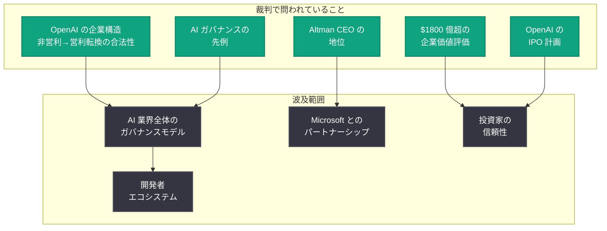
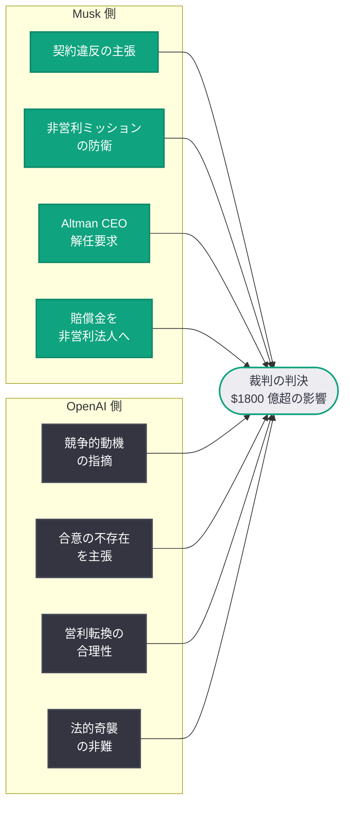
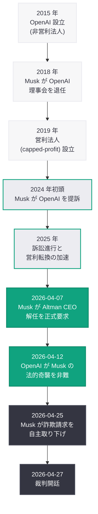

# Musk 対 Altman/OpenAI 裁判が開廷 -- AI 業界史上最大の $1800 億訴訟が本格始動

## メタデータ

| 項目 | 内容 |
|------|------|
| 発表日 | 2026-04-27 |
| ソース | WSJ, The Guardian, France 24, Yahoo Finance, Benzinga, BeInCrypto, NBC News, The Information, Fox News, Morning Brew |
| カテゴリ | 企業 / 法務 |
| 公式リンク | [WSJ](https://www.wsj.com/), [The Guardian](https://www.theguardian.com/), [NBC News](https://www.nbcnews.com/) |

## 概要

2026 年 4 月 27 日 (月曜日)、Elon Musk が OpenAI および Sam Altman を相手取った訴訟の裁判がついに開廷した。2024 年初頭の提訴から約 2 年、Altman CEO 解任要求、「法的奇襲」の応酬、詐欺請求の自主取り下げを経て、AI 業界史上最大級の法廷闘争が本格的に始動した。WSJ は「Elon Musk Is an Underdog in His $180 Billion Fight Against OpenAI」と報じ、Musk が OpenAI の $1800 億超の企業価値に匹敵する規模の訴訟において劣勢に立たされていることを指摘した。

裁判で争われる主な請求は、契約違反 (OpenAI の非営利から営利への転換)、非営利ミッションからの逸脱、そして Altman CEO の解任要求の 3 点である。4 月 25 日に Musk が詐欺請求を自主的に取り下げたことで、裁判の焦点は OpenAI の企業構造転換の合法性という核心的問題に絞られた。The Guardian は「Musk and Altman's bitter feud over OpenAI to be laid bare in court」と報じ、両者の間で交わされたプライベートメッセージや Greg Brockman の日記を含む内部資料が法廷で公開されることで、OpenAI 設立初期の知られざる経緯が明らかになると伝えている。

## 主な内容

### 裁判開廷の概要

2026 年 4 月 27 日、米国連邦裁判所において Musk 対 OpenAI/Altman の裁判が正式に開廷した。Fox News は 4 月 25 日の時点で「Musk v. Altman OpenAI trial begins Monday」と報じ、Morning Brew も「Elon Musk's lawsuit against Sam Altman and OpenAI heads to trial」と裁判の開始を速報していた。

France 24 は「Elon Musk's lawsuit against OpenAI heads to trial over nonprofit claims」と題し、裁判の核心が OpenAI の非営利ミッションに関する請求にあることを強調した。Yahoo Finance は「Elon Musk's years-long legal battle with OpenAI and Sam Altman will finally head to trial on Monday」と報じ、数年にわたる法廷闘争がついに裁判段階に到達したことの歴史的意義を伝えた。

### 裁判で争われる 3 つの請求

4 月 25 日に Musk が詐欺請求を自主取り下げした結果、裁判に進む請求は以下の 3 点に絞られた。

1. **契約違反 (breach of contract):** OpenAI が設立時の合意に反し、非営利法人から営利法人 (capped-profit) へ転換したことが契約違反にあたるとする請求。Musk 側は、OpenAI 設立時に Musk、Altman、その他の共同設立者間で「AI を人類全体の利益のために開発する」という非営利ミッションに基づく合意が存在し、営利転換はこの合意に対する根本的な違反であると主張している

2. **非営利ミッションからの逸脱:** OpenAI が「人類全体のための AI (AI for all humanity)」という設立理念を放棄し、利益追求型の組織へと変質したとする主張。Microsoft との数十億ドル規模の提携や、API の商業化、IPO の準備などが、設立時のミッションとは相容れないと Musk 側は論じている

3. **Altman CEO 解任要求:** 4 月 7 日に正式に提出された、Sam Altman を OpenAI の CEO から解任するよう裁判所に求める請求。Musk は、Altman のリーダーシップの下で OpenAI が営利追求に傾倒したことの責任を問うている

### $1800 億超の賭け -- 何が問われているのか

WSJ は Musk を「underdog (劣勢)」と表現しつつも、裁判の賭け金が $1800 億 (OpenAI の最新の企業価値評価) に及ぶことを報じた。NBC News は「What's at stake in the Elon Musk-Sam Altman trial」と題する解説記事で、この裁判で問われている事項の広範さを分析した。

裁判の結果次第では以下のような広範な影響が想定される。

- **OpenAI の企業構造:** 契約違反が認められた場合、OpenAI は営利転換を撤回するか、大幅な構造変更を迫られる可能性がある
- **IPO 計画への影響:** OpenAI が準備中の IPO は、裁判結果によって大幅な遅延や条件変更を余儀なくされる可能性がある
- **AI ガバナンスの先例:** 非営利法人として設立された AI 組織が営利法人へ転換することの合法性に関する判例が確立される
- **経営陣の変動:** Altman CEO の解任が認められた場合、OpenAI の経営体制と戦略的方向性に根本的な変更が生じる

### 予測市場の動向 -- Musk の勝訴確率 45%

Benzinga は「Elon Musk vs. OpenAI: Kalshi Traders Push Odds to 45% as Trial Date Approaches」と報じ、予測市場 Kalshi において Musk の勝訴確率が 45% に上昇したことを伝えた。この数値は、裁判直前に Musk が詐欺請求を取り下げたにもかかわらず、市場参加者が Musk の残存請求に一定の勝算を見ていることを示している。

WSJ が Musk を「underdog」と評したことと合わせると、法的分析の観点では Musk が不利とされる一方、予測市場は裁判の不確実性と Musk 側の主張の一定の説得力を反映している。45% という数値は、いずれの側にも明確な優位性がないことを示す拮抗した数字であり、裁判の結果が予測困難であることを物語っている。

### 法廷で明かされる「初期の秘密」

BeInCrypto は「The Elon Musk and OpenAI Trial Can Expose Early Secrets」と報じ、裁判を通じて OpenAI 設立初期の内部情報が公開される可能性を指摘した。The Guardian も、Musk と Altman の間の「bitter feud (激しい確執)」が法廷で「laid bare (赤裸々に)」されると報じている。

裁判で公開が予想される主な資料は以下のとおりである。

- **Musk と Altman のプライベートメッセージ:** OpenAI 設立から Musk の退任に至るまでの間に両者が交わした個人的なやりとり。設立時の合意内容や、営利転換に関する議論の経緯が明らかになる可能性がある
- **Greg Brockman の日記:** OpenAI 共同設立者の Brockman が残した日記が証拠として提出されており、OpenAI の意思決定プロセスや内部の議論が記録されていると見られる
- **設立時の内部文書:** OpenAI の非営利ミッションに関する設立当初の合意書、議事録、メール等の内部資料が法廷で精査される
- **営利転換に関する意思決定の経緯:** 2019 年の capped-profit 構造の導入およびその後の営利転換に至る経営判断の過程が明らかになる

これらの資料の公開は、OpenAI の設立からの変遷を理解する上で歴史的な価値を持つとともに、裁判の判決に直接的な影響を与える可能性がある。

### 双方の主張

#### Musk 側の主張

Musk 側は以下の論点を中心に訴訟を展開している。

- OpenAI は Musk を含む共同設立者間の合意に反し、非営利法人としての根本的な性質を放棄した
- 営利転換は「人類全体の利益のための AI 開発」という設立理念に対する裏切りである
- Altman のリーダーシップの下で OpenAI は利益追求型の組織へと変質しており、CEO の交代が必要である
- Musk は個人的利益ではなく、OpenAI の非営利ミッションの保護を目的としている (賠償金の非営利法人への帰属を要求)

#### OpenAI 側の主張

OpenAI 側は以下の反論を展開していると見られる。

- Musk は xAI の創業者兼 CEO として OpenAI の直接的な競合企業を率いており、訴訟の動機は競争的なものである
- Musk は 2018 年に OpenAI の理事会を自主的に退任しており、その後の組織変更に対する法的拘束力のある合意は存在しない
- 営利転換 (capped-profit 構造) は OpenAI のミッション達成に必要な資金調達を可能にするための合理的な措置である
- Musk の訴訟戦術は「法的奇襲」や「カオスの注入」であり、裁判の公正な進行を妨害するものである

### 裁判に至るまでの経緯

## 業界への影響

### AI 業界全体への影響

この裁判は、個別の企業間紛争を超えて、AI 業界全体のガバナンスモデルに先例を示す可能性がある。非営利法人として設立された AI 組織が営利法人へ転換することの合法性が法的に判断されることで、同様の構造を持つ他の AI 研究機関にも影響が及ぶ。The Information は「Musk-OpenAI and Big Tech Earnings on Deck This Week」と報じ、本裁判が Big Tech の四半期決算と並ぶ今週最大の注目イベントであることを伝えた。

### OpenAI の IPO 計画への影響

裁判の進行中であっても、OpenAI は IPO の準備を進めていると見られる。しかし、契約違反が認められた場合、企業構造の大幅な変更が必要となり、IPO のスケジュールや条件に重大な影響を及ぼす可能性がある。$1800 億超の企業価値評価は、裁判結果によって大幅に変動しうる。

### Microsoft およびパートナー企業への波及

OpenAI の最大の投資家兼パートナーである Microsoft は、裁判結果による直接的な影響を受ける立場にある。Azure OpenAI Service を通じた AI モデルの提供や Copilot 製品群への統合など、Microsoft のビジネスモデルは OpenAI との提携に深く依存しており、OpenAI の企業構造に変更が生じた場合の波及効果は甚大である。

### 開発者エコシステムへの影響

OpenAI の API やプラットフォームに依存する開発者にとって、裁判の結果は間接的だが重要な意味を持つ。

- **サービス継続性:** 裁判結果によっては OpenAI のサービス提供体制に変更が生じる可能性がある
- **API 価格体系:** 企業構造の変更が財務状況に影響した場合、API 価格や利用条件が変動するリスクがある
- **ガバナンス変更:** Altman CEO が解任された場合、OpenAI の戦略的方向性や製品ロードマップに変更が生じる可能性がある
- **マルチプロバイダー戦略の重要性:** 裁判リスクを踏まえ、Anthropic、Google、Mistral など複数の AI プロバイダーを活用する分散戦略の必要性が改めて浮き彫りとなっている

## 関連リンク

- [WSJ: Elon Musk Is an Underdog in His $180 Billion Fight Against OpenAI](https://www.wsj.com/)
- [The Guardian: Musk and Altman's bitter feud over OpenAI to be laid bare in court](https://www.theguardian.com/)
- [France 24: Elon Musk's lawsuit against OpenAI heads to trial over nonprofit claims](https://www.france24.com/)
- [Yahoo Finance: Musk's legal battle with OpenAI heads to trial](https://finance.yahoo.com/)
- [Benzinga: Kalshi Traders Push Odds to 45% as Trial Date Approaches](https://www.benzinga.com/)
- [BeInCrypto: The Elon Musk and OpenAI Trial Can Expose Early Secrets](https://beincrypto.com/)
- [NBC News: What's at stake in the Elon Musk-Sam Altman trial](https://www.nbcnews.com/)
- [前回のレポート: Musk が詐欺請求を自主取り下げ](2026-04-25-musk-drops-fraud-claims-openai-trial.md)
- [関連レポート: OpenAI、Musk の「法的奇襲」を非難](2026-04-12-musk-legal-ambush-openai-trial.md)
- [関連レポート: Musk が Altman CEO 解任を要求](2026-04-07-musk-seeks-altman-ouster.md)

## まとめ

2026 年 4 月 27 日、Elon Musk が OpenAI および Sam Altman を相手取った裁判がついに開廷した。2024 年初頭の提訴から約 2 年にわたる法廷闘争を経て、AI 業界史上最大級のこの訴訟は裁判段階に到達した。4 月 25 日に詐欺請求を自主取り下げした Musk は、契約違反、非営利ミッションからの逸脱、Altman CEO 解任要求の 3 つの請求に訴訟リソースを集中させている。WSJ は Musk を「劣勢 (underdog)」と評する一方、Kalshi 予測市場では Musk の勝訴確率が 45% と拮抗した数字を示しており、裁判結果の予測は困難な状況にある。裁判では Musk と Altman のプライベートメッセージや Brockman の日記を含む内部資料が公開される見込みであり、OpenAI 設立初期の知られざる経緯が明らかになると期待されている。$1800 億超の企業価値が争われるこの裁判の判決は、OpenAI の企業構造と IPO 計画のみならず、AI 業界全体のガバナンスモデル、Microsoft との提携関係、そして開発者エコシステムに広範な影響を及ぼす可能性がある。
