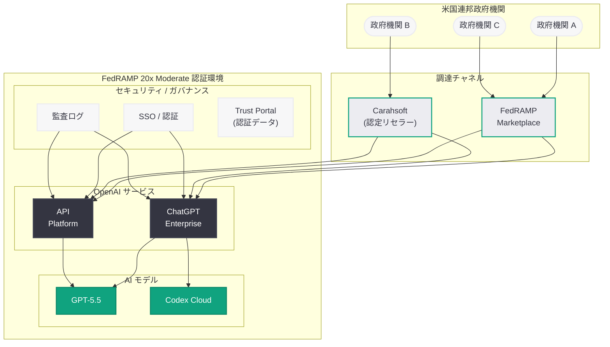

# OpenAI が FedRAMP Moderate 認証を取得 -- 米国連邦政府機関へのフロンティア AI 提供が本格始動

## メタデータ

| 項目 | 内容 |
|------|------|
| 発表日 | 2026-04-27 |
| ソース | OpenAI Global Affairs |
| カテゴリ | セキュリティ / 政府向けサービス |
| 公式リンク | [OpenAI available at FedRAMP Moderate](https://openai.com/index/openai-available-at-fedramp-moderate/) |

## 概要

OpenAI は、ChatGPT Enterprise および API Platform において FedRAMP 20x Moderate 認証を取得したことを発表した。これにより、米国連邦政府機関がセキュリティ、プライバシー、ガバナンスの要件を満たした環境でフロンティア AI にアクセスできるようになる。FedRAMP 20x は GSA (General Services Administration) が 2025 年 3 月に発表した新しい迅速認証パスであり、OpenAI は同フレームワークを通じて Moderate レベルの認証を達成した最初期の AI プロバイダーの 1 つとなった。

## 主な内容

### FedRAMP 20x Moderate 認証の概要

FedRAMP (Federal Risk and Authorization Management Program) は、米国連邦政府機関がクラウドサービスを安全に利用するための標準化されたセキュリティ評価・認証フレームワークである。Moderate レベルは、連邦情報システムの大部分 (約 80%) が該当するセキュリティカテゴリであり、機密性・完全性・可用性のいずれかが損なわれた場合に「深刻な悪影響 (serious adverse effect)」が生じるシステムに適用される。

2025 年 3 月に GSA が発表した FedRAMP 20x は、従来の FedRAMP 認証プロセスを大幅に簡素化・迅速化する新しい認証パスである。従来のプロセスでは認証取得まで数年を要することもあったが、20x フレームワークはクラウドサービスプロバイダーが迅速に連邦市場へ参入できるよう設計されている。

### 認証対象のサービス

OpenAI が FedRAMP 20x Moderate 認証を取得したサービスは以下の 2 つである。

- **ChatGPT Enterprise:** 企業向けの ChatGPT であり、セキュリティ強化、管理機能、SSO、監査ログなどの機能を備える。連邦政府機関はこの環境を通じて AI チャットインターフェースにアクセスできる
- **API Platform:** OpenAI の API を通じて、連邦政府機関が独自のアプリケーションやワークフローに AI モデルを統合できる

### 利用可能な AI モデルとサービス

FedRAMP 環境では、以下のモデルおよびサービスにアクセスが可能となる。

- **GPT-5.5:** OpenAI の最新フロンティアモデルが FedRAMP 認証環境で利用可能
- **Codex Cloud:** OpenAI のクラウドベースのコーディング支援環境が、FedRAMP 認証済み ChatGPT Enterprise ワークスペースを通じてアクセス可能

### 調達と利用方法

連邦政府機関が OpenAI のサービスにアクセスするための経路は以下のとおり整備されている。

- **FedRAMP Marketplace:** OpenAI のサービスは FedRAMP Marketplace に掲載されており、政府機関は認証済みサービスとして確認・検索が可能
- **Carahsoft:** OpenAI の認定公共部門リセラーとして Carahsoft が指定されており、政府調達プロセスに対応した販売チャネルが確保されている
- **OpenAI Trust Portal:** 再利用可能な FedRAMP 認証データが OpenAI Trust Portal で公開されており、各政府機関が自組織のセキュリティ評価に活用できる
- **連絡先:** fedramp@openai.com

## 技術的な詳細

### FedRAMP Moderate のセキュリティ要件

FedRAMP Moderate は NIST SP 800-53 に基づくセキュリティコントロールセットを要求する。主要な要件分野は以下のとおりである。

- **アクセス制御 (Access Control):** 多要素認証、最小権限の原則、セッション管理
- **監査と説明責任 (Audit and Accountability):** 包括的な監査ログの記録・保持・レビュー
- **構成管理 (Configuration Management):** システム構成のベースライン管理と変更管理
- **インシデント対応 (Incident Response):** セキュリティインシデントの検出・報告・対応手順
- **リスクアセスメント (Risk Assessment):** 定期的なリスク評価と脆弱性管理
- **システム通信保護 (System and Communications Protection):** データの暗号化と通信の保護

### FedRAMP 20x の特徴

従来の FedRAMP 認証プロセスと比較した FedRAMP 20x の主な特徴は以下のとおりである。

| 項目 | 従来の FedRAMP | FedRAMP 20x |
|------|---------------|-------------|
| 認証期間 | 数年を要する場合あり | 大幅に短縮 |
| プロセス | 3PAO による詳細評価 | 迅速化された評価パス |
| 目的 | 従来型クラウドサービス | 最新の SaaS/AI サービスへの対応 |
| 発表時期 | 2011 年 | 2025 年 3 月 (GSA) |

## 開発者への影響

### 連邦政府向け AI アプリケーション開発の加速

OpenAI の FedRAMP Moderate 認証取得は、連邦政府向け AI ソリューションを開発する開発者やシステムインテグレーターにとって重要な意味を持つ。

- **API Platform の FedRAMP 認証:** 開発者は FedRAMP 認証済みの API を通じて、連邦政府機関向けのカスタム AI アプリケーションを構築できるようになった。これまでは独自に認証プロセスを経る必要があったが、OpenAI のプラットフォームレベルでの認証により、開発の参入障壁が大幅に低下する
- **GPT-5.5 の利用可能性:** 最新のフロンティアモデルが FedRAMP 環境で利用可能となったことで、連邦政府向けアプリケーションでも最先端の AI 性能を活用できる
- **Codex Cloud の統合:** コーディング支援ツールが FedRAMP 環境内で利用可能となることで、政府機関内のソフトウェア開発ワークフローにも AI を統合できる

### 公共部門 AI 市場の拡大

FedRAMP 認証は、政府機関がクラウドサービスを採用する際の最大の障壁の 1 つである。OpenAI がこの認証を取得したことで、以下のような市場拡大が期待される。

- 連邦政府機関による AI 導入の加速
- Carahsoft を通じた政府調達プロセスの円滑化
- 州政府・地方政府への波及効果 (FedRAMP 認証を採用基準として参照する傾向)
- 防衛・情報機関以外の民生部門での AI 活用拡大

### 注意事項

連邦政府向け AI 開発に携わる開発者は、以下の点に留意する必要がある。

- FedRAMP 環境で利用可能なモデルやサービスの範囲は、商用環境と異なる場合がある
- データの取り扱いに関して、連邦政府のデータ分類要件 (CUI: Controlled Unclassified Information 等) に準拠する必要がある
- Trust Portal で公開されている認証データを自組織のセキュリティ評価プロセスに活用すべきである

## 関連リンク

- [OpenAI available at FedRAMP Moderate (公式発表)](https://openai.com/index/openai-available-at-fedramp-moderate/)
- [FedRAMP Marketplace](https://marketplace.fedramp.gov/)
- [FedRAMP 20x 概要 (GSA)](https://www.fedramp.gov/)
- [OpenAI Trust Portal](https://trust.openai.com/)
- [Carahsoft - OpenAI](https://www.carahsoft.com/)
- 連絡先: fedramp@openai.com

## まとめ

OpenAI は ChatGPT Enterprise および API Platform において FedRAMP 20x Moderate 認証を取得し、米国連邦政府機関がセキュリティ・プライバシー・ガバナンスの要件を満たした環境でフロンティア AI を利用できるようになった。GSA が 2025 年 3 月に発表した FedRAMP 20x の迅速認証パスを活用した今回の認証により、政府機関は GPT-5.5 や Codex Cloud を含む最新の AI モデルおよびツールにアクセスできる。FedRAMP Marketplace への掲載と Carahsoft を通じた調達チャネルの整備により、政府機関の AI 導入プロセスは大幅に円滑化される。開発者にとっては、FedRAMP 認証済みの API Platform を通じて連邦政府向け AI アプリケーションの開発が容易になり、公共部門における AI 活用の加速が期待される。
