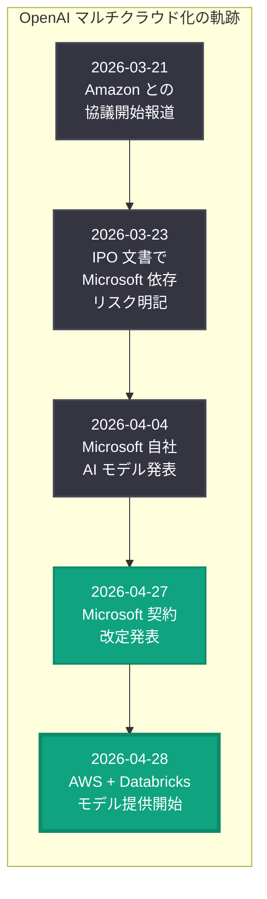
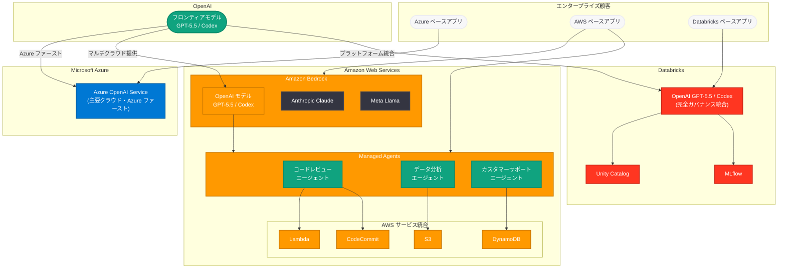
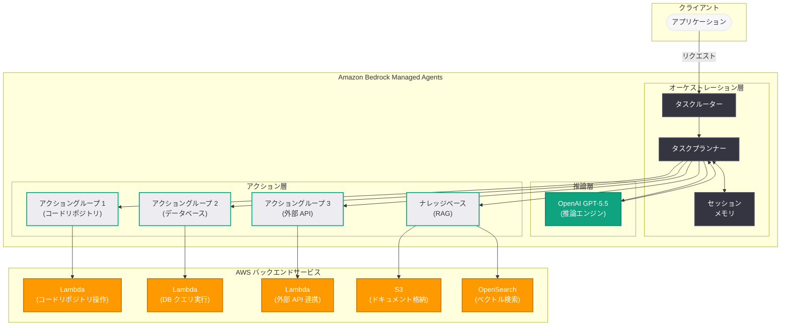
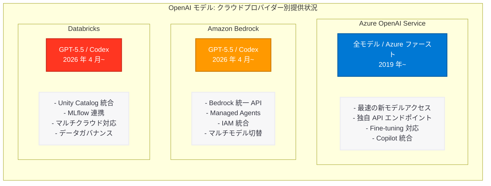
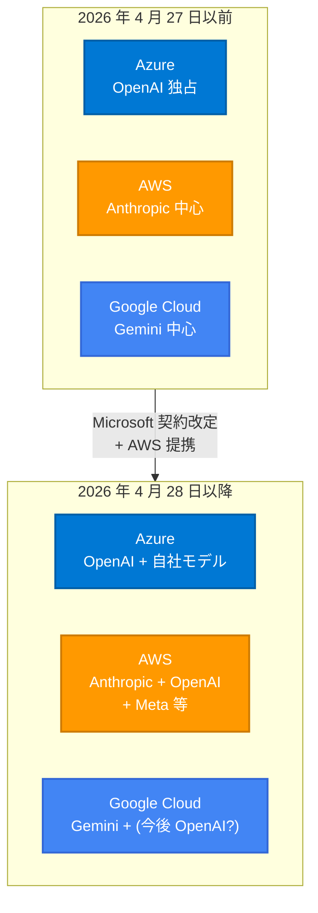
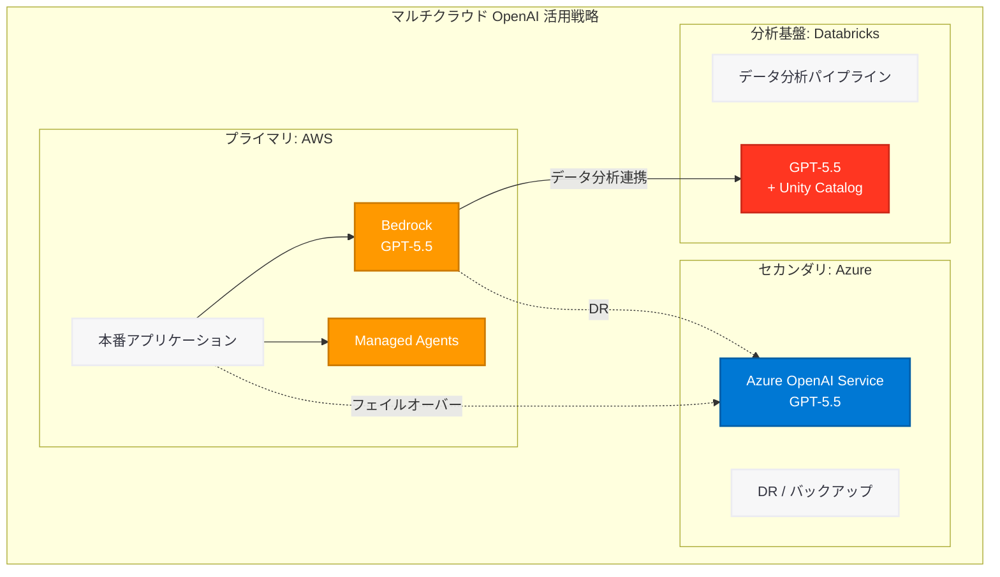

# OpenAI モデル、Codex、Managed Agents が AWS に到来: マルチクラウド時代の幕開け

## メタデータ

| 項目 | 内容 |
|------|------|
| 発表日 | 2026-04-28 |
| ソース | OpenAI News、AWS、CNBC、Databricks |
| カテゴリ | パートナーシップ / クラウド |
| 公式リンク | [openai.com/index/openai-models-codex-and-managed-agents-come-to-aws](https://openai.com/index/openai-models-codex-and-managed-agents-come-to-aws/) |

## 概要

OpenAI は 2026 年 4 月 28 日、Amazon Web Services (AWS) とのパートナーシップ拡大を正式に発表した。これにより、GPT-5.5 や Codex を含む OpenAI のフロンティアモデル群が Amazon Bedrock 上で利用可能となり、さらに OpenAI を活用した Amazon Bedrock Managed Agents が限定プレビューとして提供開始された。CNBC は「OpenAI brings its models to Amazon's cloud after ending exclusivity with Microsoft」と報じ、AWS 側は「AWS and OpenAI announce expanded partnership to bring frontier intelligence to the infrastructure you already trust」と発表している。

本発表は、前日の 2026 年 4 月 27 日に発表された [Microsoft-OpenAI パートナーシップ契約改定](2026-04-27-microsoft-openai-partnership-amendment.md) の直接的な帰結である。Microsoft との独占的なクラウド提供関係が解消されたことで、OpenAI は Azure 以外のクラウドプロバイダーへのモデル提供を即座に実行に移した形となる。また、同日には Databricks 上でも GPT-5.5 と Codex が完全ガバナンス統合として利用可能になったことが発表されており、OpenAI のマルチクラウド・マルチプラットフォーム戦略が一斉に動き出したことを示している。

3 月 21 日に報じられた [Amazon との協議開始](2026-03-21-amazon-openai-custom-models.md) から約 5 週間、Microsoft との契約改定からわずか 1 日という極めて迅速なタイミングでの発表は、両社の間で長期にわたり技術的・法的な準備が進められていたことを物語っている。

## 主な内容

### Amazon Bedrock 上での OpenAI モデル提供

OpenAI のフロンティアモデルが Amazon Bedrock の統一 API を通じて利用可能になった。これにより、AWS をプライマリクラウドとして利用しているエンタープライズ企業は、既存のインフラを変更することなく OpenAI の最先端モデルにアクセスできるようになる。

#### 提供モデル

Amazon Bedrock で提供される主要モデルは以下の通りである。

| モデル | 特徴 | 主な用途 |
|--------|------|----------|
| GPT-5.5 | OpenAI 史上最も知的なフラッグシップモデル | コーディング、リサーチ、データ分析 |
| Codex | クラウドベースのコーディングエージェント | 自律的なソフトウェア開発タスク |

GPT-5.5 は、2026 年 4 月 23 日に発表された OpenAI の最新フラッグシップモデルであり、マルチツール統合推論に優れた能力を持つ。Codex はクラウドベースのコーディングエージェントとして、リポジトリ全体を把握した上でのコード生成、リファクタリング、テスト作成を自律的に実行する能力を備えている。

#### Bedrock 統合の特長

Amazon Bedrock を通じた OpenAI モデルの提供は、以下の特長を備えている。

- **統一 API インターフェース:** Bedrock の標準 API を通じて OpenAI モデルを呼び出せるため、Anthropic Claude や Meta Llama などの既存モデルと同一のインターフェースで利用可能
- **IAM ベースのアクセス制御:** AWS Identity and Access Management (IAM) によるきめ細かなアクセス権限管理が適用される
- **VPC エンドポイント対応:** プライベートネットワーク内でのモデル呼び出しが可能であり、データがパブリックインターネットを経由しない構成を実現
- **AWS リージョン対応:** AWS のリージョンインフラストラクチャを活用し、データレジデンシー要件への対応が可能
- **CloudTrail 監査ログ:** モデルの呼び出しが CloudTrail に記録され、エンタープライズのコンプライアンス要件を満たす

### Amazon Bedrock Managed Agents

今回の発表で最も注目すべき新機能の一つが、OpenAI を活用した Amazon Bedrock Managed Agents である。限定プレビューとして提供が開始された。

#### Managed Agents の概要

Managed Agents は、OpenAI のモデルを活用した AI エージェントを AWS のマネージドサービスとして構築・運用できるプラットフォームである。開発者はエージェントのロジックとツール定義に集中し、インフラストラクチャの管理やスケーリングは AWS が自動的に処理する。

- **フルマネージド型:** エージェントのホスティング、スケーリング、モニタリングを AWS が管理
- **OpenAI モデル統合:** GPT-5.5 を含む OpenAI のフロンティアモデルをエージェントの推論エンジンとして活用
- **ツール統合:** AWS Lambda、S3、DynamoDB などの AWS サービスをエージェントのツールとして統合可能
- **状態管理:** エージェントのセッション状態を自動的に管理し、マルチターンの対話やタスクの継続実行を実現
- **オブザーバビリティ:** CloudWatch によるエージェントのパフォーマンス監視、ログ収集、アラート設定が可能

#### Managed Agents のユースケース

Managed Agents は、以下のようなエンタープライズユースケースに対応する。

**自律的なコード開発:**
Codex を活用した Managed Agents により、ソフトウェア開発タスクを AWS 環境内で自律的に実行できる。CodeCommit や CodePipeline との統合により、コード生成からプルリクエスト作成、CI/CD パイプラインの実行までをエージェントが一貫して処理する。

**インテリジェントなデータ処理:**
S3 上のデータに対して GPT-5.5 を活用した分析エージェントを構築し、非構造化データの解析、レポート生成、インサイト抽出を自動化する。

**カスタマーサポートの自動化:**
顧客からの問い合わせに対してエージェントが自律的に応答し、ナレッジベースの検索、チケット管理、エスカレーション判断を実行する。DynamoDB による顧客コンテキストの永続化と、SQS/SNS による通知統合が可能。

**コンプライアンスと監査:**
ドキュメントの自動レビュー、規制変更の影響分析、コンプライアンスレポートの自動生成などを、GPT-5.5 の高度な推論能力を活用して実行する。

### Codex の AWS 展開

OpenAI のクラウドベースコーディングエージェントである Codex が AWS インフラストラクチャ上で利用可能になった点は、特に開発者にとって重要な進展である。

- **AWS ネイティブ統合:** Codex が AWS のコンピューティングリソース上で直接実行されるため、AWS 環境内のコードリポジトリやデプロイメントパイプラインとのシームレスな統合が実現
- **セキュリティ境界の維持:** コードがAWS アカウント内で処理されるため、ソースコードの外部送出に関するセキュリティ懸念が軽減される
- **低レイテンシ:** AWS リージョン内での実行により、コーディングタスクの応答速度が向上
- **既存ツールとの連携:** CodeCommit、CodeBuild、CodePipeline、CodeDeploy などの AWS 開発者ツールとの統合が可能

### Databricks との同時提供

同日、OpenAI は Databricks 上でも GPT-5.5 と Codex を完全ガバナンス統合として提供開始したことを発表した。

- **Databricks Unity Catalog 統合:** データガバナンスとアクセス制御を Databricks のガバナンスフレームワークで一元管理
- **MLflow 連携:** モデルの実験追跡、バージョン管理、デプロイメントを MLflow で管理
- **Delta Lake 上のデータ活用:** Delta Lake に格納されたデータを直接 GPT-5.5 で分析可能
- **マルチクラウド対応:** Databricks 自体が AWS、Azure、Google Cloud 上で動作するため、OpenAI モデルの利用環境がさらに拡大

この Databricks との同時発表は、OpenAI がクラウドプロバイダーだけでなくデータプラットフォームとの統合も積極的に推進していることを示している。

### Microsoft 独占終了の文脈

今回の発表は、以下の一連の動きの集大成である。



- **2026 年 3 月 21 日:** Amazon が OpenAI とカスタムモデル提供に向けた協議を開始したことが報じられた。この時点では Microsoft との独占契約が障壁となっていた
- **2026 年 3 月 23 日:** OpenAI の IPO 投資家向け文書で Microsoft への依存リスクが明記され、パートナーシップ多角化の意図が明確に
- **2026 年 4 月 4 日:** Microsoft が自社 AI モデル 3 種を発表し、OpenAI への技術的依存からの自立を加速。両社の「相互自立化」が進行
- **2026 年 4 月 27 日:** Microsoft-OpenAI パートナーシップ契約が改定され、マルチクラウド提供の法的障壁が正式に解消
- **2026 年 4 月 28 日:** AWS および Databricks での OpenAI モデル提供が即座に開始 (本発表)

## 技術的な詳細

### Amazon Bedrock を通じた OpenAI モデルの呼び出し

Amazon Bedrock では、AWS SDK (boto3) を使用して統一的な API インターフェースから OpenAI モデルを呼び出すことができる。以下に主要な利用パターンを示す。

### コードサンプル: 基本的なモデル呼び出し (boto3)

```python
import boto3
import json

# Amazon Bedrock ランタイムクライアントの作成
bedrock_runtime = boto3.client(
    "bedrock-runtime",
    region_name="us-east-1"
)

# OpenAI GPT-5.5 の呼び出し
response = bedrock_runtime.invoke_model(
    modelId="openai.gpt-5-5",
    contentType="application/json",
    accept="application/json",
    body=json.dumps({
        "messages": [
            {
                "role": "system",
                "content": "You are a helpful assistant specialized in cloud architecture."
            },
            {
                "role": "user",
                "content": "Design a serverless event-driven architecture for an e-commerce platform on AWS."
            }
        ],
        "max_tokens": 4096,
        "temperature": 0.7,
        "top_p": 0.9
    })
)

# レスポンスの解析
result = json.loads(response["body"].read())
print(result["choices"][0]["message"]["content"])
```

### コードサンプル: ストリーミングレスポンス

大規模なレスポンスをリアルタイムに処理する場合、ストリーミング API を使用する。

```python
import boto3
import json

bedrock_runtime = boto3.client(
    "bedrock-runtime",
    region_name="us-east-1"
)

# ストリーミングによる呼び出し
response = bedrock_runtime.invoke_model_with_response_stream(
    modelId="openai.gpt-5-5",
    contentType="application/json",
    body=json.dumps({
        "messages": [
            {
                "role": "user",
                "content": (
                    "Analyze the following microservices architecture and suggest "
                    "improvements for resilience and observability:\n\n"
                    "- API Gateway -> Auth Service -> User Service\n"
                    "- API Gateway -> Order Service -> Payment Service\n"
                    "- Order Service -> Inventory Service\n"
                    "- All services use synchronous HTTP calls"
                )
            }
        ],
        "max_tokens": 4096,
        "stream": True
    })
)

# ストリーミングレスポンスの処理
stream = response.get("body")
if stream:
    for event in stream:
        chunk = event.get("chunk")
        if chunk:
            data = json.loads(chunk.get("bytes").decode())
            if "choices" in data:
                delta = data["choices"][0].get("delta", {})
                content = delta.get("content", "")
                if content:
                    print(content, end="", flush=True)
print()
```

### コードサンプル: Converse API を使用した統一的なモデル呼び出し

Amazon Bedrock の Converse API を使用すると、モデルプロバイダーに依存しない統一的なインターフェースでモデルを呼び出すことができる。OpenAI モデルと Anthropic Claude を同一の API で切り替えて使用する場合に特に有用である。

```python
import boto3

bedrock_runtime = boto3.client(
    "bedrock-runtime",
    region_name="us-east-1"
)

# Converse API による統一的な呼び出し
# OpenAI GPT-5.5 でも Anthropic Claude でも同じインターフェースで利用可能
def call_model(model_id: str, user_message: str) -> str:
    """モデルプロバイダーに依存しない統一的なモデル呼び出し"""
    response = bedrock_runtime.converse(
        modelId=model_id,
        messages=[
            {
                "role": "user",
                "content": [
                    {
                        "text": user_message
                    }
                ]
            }
        ],
        inferenceConfig={
            "maxTokens": 4096,
            "temperature": 0.7,
            "topP": 0.9
        }
    )
    return response["output"]["message"]["content"][0]["text"]


# OpenAI GPT-5.5 の呼び出し
openai_response = call_model(
    model_id="openai.gpt-5-5",
    user_message="Explain the CAP theorem with practical examples."
)
print("GPT-5.5:", openai_response)

# 比較: Anthropic Claude の呼び出し (同じ関数で対応)
claude_response = call_model(
    model_id="anthropic.claude-sonnet-4-20250514-v1:0",
    user_message="Explain the CAP theorem with practical examples."
)
print("Claude:", claude_response)
```

### コードサンプル: Managed Agents の構築

Amazon Bedrock Managed Agents を使用して、OpenAI GPT-5.5 を推論エンジンとする AI エージェントを構築する例を示す。

```python
import boto3
import json

# Bedrock Agent クライアント
bedrock_agent = boto3.client(
    "bedrock-agent",
    region_name="us-east-1"
)

# Managed Agent の作成
agent_response = bedrock_agent.create_agent(
    agentName="code-review-agent",
    description="Automated code review agent powered by OpenAI GPT-5.5",
    foundationModel="openai.gpt-5-5",
    instruction=(
        "You are a senior software engineer performing code reviews. "
        "Analyze code for security vulnerabilities, performance issues, "
        "and adherence to best practices. Provide actionable feedback "
        "with specific line references and suggested improvements."
    ),
    idleSessionTTLInSeconds=1800
)

agent_id = agent_response["agent"]["agentId"]
print(f"Agent created: {agent_id}")
```

### コードサンプル: エージェントにアクショングループを追加

Managed Agents にツール (アクショングループ) を追加して、外部サービスとの統合を実現する。

```python
import boto3
import json

bedrock_agent = boto3.client(
    "bedrock-agent",
    region_name="us-east-1"
)

# Lambda 関数と連携するアクショングループの定義
# OpenAPI スキーマでエージェントのツールを定義
api_schema = {
    "openapi": "3.0.0",
    "info": {
        "title": "Code Repository API",
        "version": "1.0.0"
    },
    "paths": {
        "/repositories/{repoName}/pull-requests": {
            "get": {
                "operationId": "listPullRequests",
                "summary": "List open pull requests for a repository",
                "parameters": [
                    {
                        "name": "repoName",
                        "in": "path",
                        "required": True,
                        "schema": {"type": "string"}
                    }
                ]
            }
        },
        "/repositories/{repoName}/pull-requests/{prId}/diff": {
            "get": {
                "operationId": "getPullRequestDiff",
                "summary": "Get the diff of a specific pull request",
                "parameters": [
                    {
                        "name": "repoName",
                        "in": "path",
                        "required": True,
                        "schema": {"type": "string"}
                    },
                    {
                        "name": "prId",
                        "in": "path",
                        "required": True,
                        "schema": {"type": "string"}
                    }
                ]
            }
        },
        "/repositories/{repoName}/pull-requests/{prId}/comments": {
            "post": {
                "operationId": "addReviewComment",
                "summary": "Add a review comment to a pull request",
                "parameters": [
                    {
                        "name": "repoName",
                        "in": "path",
                        "required": True,
                        "schema": {"type": "string"}
                    },
                    {
                        "name": "prId",
                        "in": "path",
                        "required": True,
                        "schema": {"type": "string"}
                    }
                ],
                "requestBody": {
                    "content": {
                        "application/json": {
                            "schema": {
                                "type": "object",
                                "properties": {
                                    "filePath": {"type": "string"},
                                    "lineNumber": {"type": "integer"},
                                    "comment": {"type": "string"},
                                    "severity": {
                                        "type": "string",
                                        "enum": ["info", "warning", "critical"]
                                    }
                                },
                                "required": ["filePath", "comment", "severity"]
                            }
                        }
                    }
                }
            }
        }
    }
}

# アクショングループの作成
bedrock_agent.create_agent_action_group(
    agentId="AGENT_ID",
    agentVersion="DRAFT",
    actionGroupName="code-repository-actions",
    description="Actions for interacting with code repositories",
    actionGroupExecutor={
        "lambda": "arn:aws:lambda:us-east-1:123456789012:function:code-repo-handler"
    },
    apiSchema={
        "payload": json.dumps(api_schema)
    }
)
```

### コードサンプル: エージェントの実行

構築した Managed Agent を呼び出してタスクを実行する例を示す。

```python
import boto3
import json
import uuid

bedrock_agent_runtime = boto3.client(
    "bedrock-agent-runtime",
    region_name="us-east-1"
)

# エージェントセッションの開始とタスク実行
session_id = str(uuid.uuid4())

response = bedrock_agent_runtime.invoke_agent(
    agentId="AGENT_ID",
    agentAliasId="ALIAS_ID",
    sessionId=session_id,
    inputText=(
        "Review all open pull requests in the 'payment-service' repository. "
        "Focus on security vulnerabilities in authentication and payment "
        "processing code. Add review comments for any issues found."
    )
)

# エージェントの応答を処理
completion = ""
for event in response["completion"]:
    if "chunk" in event:
        chunk_data = event["chunk"]
        if "bytes" in chunk_data:
            completion += chunk_data["bytes"].decode()

print("Agent response:", completion)
```

### コードサンプル: OpenAI SDK からの Bedrock 利用 (互換レイヤー)

OpenAI の公式 Python SDK を使用して Amazon Bedrock 上の OpenAI モデルにアクセスする互換レイヤーの例を示す。既存の OpenAI API コードを最小限の変更で Bedrock に移行する場合に有用である。

```python
from openai import OpenAI

# Amazon Bedrock の OpenAI 互換エンドポイントを使用
# AWS Signature V4 認証が必要
client = OpenAI(
    base_url="https://bedrock-runtime.us-east-1.amazonaws.com/openai/v1",
    # AWS 認証は別途設定が必要 (IAM ロールまたはアクセスキー)
)

# 既存の OpenAI API コードがそのまま動作
response = client.chat.completions.create(
    model="openai.gpt-5-5",
    messages=[
        {
            "role": "system",
            "content": "You are an AWS solutions architect."
        },
        {
            "role": "user",
            "content": "Design a multi-region disaster recovery strategy for a financial application."
        }
    ],
    max_tokens=4096
)

print(response.choices[0].message.content)
```

### コードサンプル: Terraform によるインフラストラクチャ定義

Managed Agents を Infrastructure as Code で管理するための Terraform 定義例を示す。

```hcl
# Amazon Bedrock Managed Agent の Terraform 定義
resource "aws_bedrockagent_agent" "code_review" {
  agent_name              = "openai-code-review-agent"
  agent_resource_role_arn = aws_iam_role.bedrock_agent.arn
  description             = "Code review agent powered by OpenAI GPT-5.5"
  foundation_model        = "openai.gpt-5-5"
  idle_session_ttl_in_seconds = 1800

  instruction = <<-EOT
    You are a senior software engineer performing automated code reviews.
    Analyze code changes for:
    1. Security vulnerabilities (SQL injection, XSS, CSRF, etc.)
    2. Performance bottlenecks
    3. Code quality and maintainability
    4. Test coverage gaps
    Provide specific, actionable feedback with severity levels.
  EOT
}

resource "aws_bedrockagent_agent_action_group" "repo_actions" {
  agent_id          = aws_bedrockagent_agent.code_review.id
  agent_version     = "DRAFT"
  action_group_name = "code-repository-actions"
  description       = "Actions for code repository interaction"

  action_group_executor {
    lambda = aws_lambda_function.code_repo_handler.arn
  }

  api_schema {
    s3 {
      s3_bucket_name = aws_s3_bucket.schemas.id
      s3_object_key  = "openapi/code-repo-api.json"
    }
  }
}

# エージェント用 IAM ロール
resource "aws_iam_role" "bedrock_agent" {
  name = "bedrock-openai-agent-role"

  assume_role_policy = jsonencode({
    Version = "2012-10-17"
    Statement = [
      {
        Action = "sts:AssumeRole"
        Effect = "Allow"
        Principal = {
          Service = "bedrock.amazonaws.com"
        }
      }
    ]
  })
}

resource "aws_iam_role_policy" "bedrock_agent_policy" {
  name = "bedrock-openai-agent-policy"
  role = aws_iam_role.bedrock_agent.id

  policy = jsonencode({
    Version = "2012-10-17"
    Statement = [
      {
        Effect = "Allow"
        Action = [
          "bedrock:InvokeModel",
          "bedrock:InvokeModelWithResponseStream"
        ]
        Resource = "arn:aws:bedrock:us-east-1::foundation-model/openai.gpt-5-5"
      },
      {
        Effect = "Allow"
        Action = "lambda:InvokeFunction"
        Resource = aws_lambda_function.code_repo_handler.arn
      }
    ]
  })
}
```

### コードサンプル: Lambda 関数によるエージェントアクションハンドラー

Managed Agent のアクショングループと連携する Lambda 関数の実装例を示す。

```python
import json
import boto3


def lambda_handler(event, context):
    """
    Bedrock Managed Agent のアクショングループハンドラー。
    エージェントからのツール呼び出しを処理する。
    """
    api_path = event.get("apiPath")
    http_method = event.get("httpMethod")
    parameters = event.get("parameters", [])
    request_body = event.get("requestBody", {})

    # パラメータの抽出
    params = {p["name"]: p["value"] for p in parameters}

    if api_path == "/repositories/{repoName}/pull-requests" and http_method == "GET":
        return handle_list_pull_requests(params["repoName"])

    elif api_path == "/repositories/{repoName}/pull-requests/{prId}/diff" and http_method == "GET":
        return handle_get_diff(params["repoName"], params["prId"])

    elif api_path == "/repositories/{repoName}/pull-requests/{prId}/comments" and http_method == "POST":
        body = json.loads(request_body.get("content", {}).get("application/json", "{}"))
        return handle_add_comment(
            params["repoName"],
            params["prId"],
            body
        )

    return {
        "statusCode": 404,
        "body": json.dumps({"error": "Unknown action"})
    }


def handle_list_pull_requests(repo_name: str) -> dict:
    """プルリクエストの一覧を取得"""
    codecommit = boto3.client("codecommit")

    response = codecommit.list_pull_requests(
        repositoryName=repo_name,
        pullRequestStatus="OPEN"
    )

    pull_requests = []
    for pr_id in response["pullRequestIds"]:
        pr = codecommit.get_pull_request(pullRequestId=pr_id)
        pull_requests.append({
            "id": pr_id,
            "title": pr["pullRequest"]["title"],
            "author": pr["pullRequest"]["authorArn"],
            "description": pr["pullRequest"].get("description", "")
        })

    return {
        "statusCode": 200,
        "body": json.dumps({"pullRequests": pull_requests})
    }


def handle_get_diff(repo_name: str, pr_id: str) -> dict:
    """プルリクエストの差分を取得"""
    codecommit = boto3.client("codecommit")

    pr = codecommit.get_pull_request(pullRequestId=pr_id)
    targets = pr["pullRequest"]["pullRequestTargets"][0]

    diff_response = codecommit.get_differences(
        repositoryName=repo_name,
        beforeCommitSpecifier=targets["mergeBase"],
        afterCommitSpecifier=targets["sourceCommit"]
    )

    diffs = []
    for diff in diff_response["differences"]:
        if diff.get("afterBlob"):
            blob = codecommit.get_blob(
                repositoryName=repo_name,
                blobId=diff["afterBlob"]["blobId"]
            )
            diffs.append({
                "path": diff["afterBlob"]["path"],
                "content": blob["content"].decode("utf-8", errors="replace")
            })

    return {
        "statusCode": 200,
        "body": json.dumps({"diffs": diffs})
    }


def handle_add_comment(repo_name: str, pr_id: str, body: dict) -> dict:
    """プルリクエストにレビューコメントを追加"""
    codecommit = boto3.client("codecommit")

    pr = codecommit.get_pull_request(pullRequestId=pr_id)
    targets = pr["pullRequest"]["pullRequestTargets"][0]

    severity_prefix = {
        "critical": "[CRITICAL]",
        "warning": "[WARNING]",
        "info": "[INFO]"
    }

    prefix = severity_prefix.get(body.get("severity", "info"), "[INFO]")
    comment_text = f"{prefix} {body['comment']}"

    if body.get("filePath") and body.get("lineNumber"):
        comment_text = f"{prefix} ({body['filePath']}:L{body['lineNumber']}) {body['comment']}"

    codecommit.post_comment_for_pull_request(
        pullRequestId=pr_id,
        repositoryName=repo_name,
        beforeCommitId=targets["mergeBase"],
        afterCommitId=targets["sourceCommit"],
        content=comment_text
    )

    return {
        "statusCode": 200,
        "body": json.dumps({"message": "Comment added successfully"})
    }
```

### コードサンプル: マルチモデルルーティング

Amazon Bedrock 上で OpenAI モデルと他のモデルプロバイダーを用途に応じて切り替えるルーティングの実装例を示す。

```python
import boto3
from dataclasses import dataclass
from enum import Enum
from typing import Optional


class TaskType(Enum):
    CODING = "coding"
    RESEARCH = "research"
    DATA_ANALYSIS = "data_analysis"
    CONVERSATION = "conversation"
    SUMMARIZATION = "summarization"


@dataclass
class ModelConfig:
    model_id: str
    max_tokens: int
    temperature: float
    provider: str


# タスクタイプに応じたモデルルーティングテーブル
MODEL_ROUTING: dict[TaskType, ModelConfig] = {
    # コーディングタスク: GPT-5.5 の高度なコード生成能力を活用
    TaskType.CODING: ModelConfig(
        model_id="openai.gpt-5-5",
        max_tokens=8192,
        temperature=0.2,
        provider="openai"
    ),
    # リサーチタスク: GPT-5.5 のマルチツール統合推論を活用
    TaskType.RESEARCH: ModelConfig(
        model_id="openai.gpt-5-5",
        max_tokens=4096,
        temperature=0.7,
        provider="openai"
    ),
    # データ分析: GPT-5.5 の統合分析エンジンを活用
    TaskType.DATA_ANALYSIS: ModelConfig(
        model_id="openai.gpt-5-5",
        max_tokens=4096,
        temperature=0.3,
        provider="openai"
    ),
    # 日常会話: コスト最適化のため軽量モデルを使用
    TaskType.CONVERSATION: ModelConfig(
        model_id="anthropic.claude-haiku-4-5-20251001-v1:0",
        max_tokens=2048,
        temperature=0.8,
        provider="anthropic"
    ),
    # 要約タスク: バランス重視のモデルを選択
    TaskType.SUMMARIZATION: ModelConfig(
        model_id="anthropic.claude-sonnet-4-20250514-v1:0",
        max_tokens=4096,
        temperature=0.5,
        provider="anthropic"
    ),
}


class MultiModelRouter:
    """Amazon Bedrock 上でマルチモデルルーティングを実現するクラス"""

    def __init__(self, region_name: str = "us-east-1"):
        self.bedrock_runtime = boto3.client(
            "bedrock-runtime",
            region_name=region_name
        )

    def route_and_invoke(
        self,
        task_type: TaskType,
        user_message: str,
        system_prompt: Optional[str] = None
    ) -> str:
        """タスクタイプに応じてモデルを選択し、呼び出しを実行"""
        config = MODEL_ROUTING[task_type]

        messages = []
        if system_prompt:
            messages.append({
                "role": "user",
                "content": [{"text": f"[System Context] {system_prompt}"}]
            })
            messages.append({
                "role": "assistant",
                "content": [{"text": "Understood. I will follow these instructions."}]
            })

        messages.append({
            "role": "user",
            "content": [{"text": user_message}]
        })

        response = self.bedrock_runtime.converse(
            modelId=config.model_id,
            messages=messages,
            inferenceConfig={
                "maxTokens": config.max_tokens,
                "temperature": config.temperature
            }
        )

        return response["output"]["message"]["content"][0]["text"]


# 使用例
router = MultiModelRouter()

# コーディングタスク -> GPT-5.5 にルーティング
code_result = router.route_and_invoke(
    task_type=TaskType.CODING,
    user_message="Implement a rate limiter using the token bucket algorithm in Python.",
    system_prompt="You are an expert Python developer. Write production-quality code."
)
print("Code result:", code_result[:200])

# 日常会話 -> Claude Haiku にルーティング (コスト最適化)
chat_result = router.route_and_invoke(
    task_type=TaskType.CONVERSATION,
    user_message="What is the weather like today?",
)
print("Chat result:", chat_result[:200])
```

## アーキテクチャ

### マルチクラウド OpenAI モデル提供アーキテクチャ



### Managed Agents アーキテクチャ



### クラウドプロバイダー別 OpenAI モデル提供比較



### AI クラウド市場の勢力図変化



## 開発者への影響

### AWS 開発者にとっての変化

今回の発表は、AWS をプライマリクラウドとして利用している開発者にとって、最も大きなインパクトをもたらす。

#### モデル選択肢の劇的な拡大

これまで AWS 上で利用可能な最先端モデルは Anthropic Claude と Meta Llama が中心であった。OpenAI モデルの追加により、AWS 開発者は以下の主要モデルすべてにアクセスできるようになった。

| プロバイダー | モデル | 強み |
|-------------|--------|------|
| OpenAI | GPT-5.5 | マルチツール統合推論、コーディング |
| OpenAI | Codex | 自律的なコーディングエージェント |
| Anthropic | Claude 4 シリーズ | 安全性、長文処理 |
| Meta | Llama 4 シリーズ | オープンソース、カスタマイズ性 |

#### 既存 AWS インフラとのシームレスな統合

- **IAM 認証の統一:** OpenAI モデルへのアクセスも AWS の標準的な IAM ポリシーで管理できるため、既存のセキュリティ体制を変更する必要がない
- **CloudWatch 監視:** モデルの利用状況やパフォーマンスを CloudWatch で一元的に監視可能
- **CloudTrail 監査:** API 呼び出しの監査ログが自動的に記録され、コンプライアンス要件を満たす
- **課金の統合:** OpenAI モデルの利用料金が AWS の請求に統合され、コスト管理が一元化される

#### Azure 併用の解消

従来、AWS をメインクラウドとしながら OpenAI モデルを利用するには、Azure OpenAI Service を別途契約・管理する必要があった。この「マルチクラウド強制」が解消されたことで、以下のメリットが生まれる。

- **運用コストの削減:** Azure サブスクリプションの管理、ネットワーク設定、セキュリティ設定の重複が不要に
- **アーキテクチャの簡素化:** クラウド間のデータ転送やネットワーク接続の複雑さが解消
- **レイテンシの改善:** AWS リージョン内でモデルを呼び出せるため、クラウド間通信のレイテンシが不要に

### Azure 開発者にとっての影響

Azure OpenAI Service を利用中の開発者への直接的な影響は限定的である。

- **Azure ファーストは継続:** 契約改定により Azure は引き続き「主要クラウドパートナー」であり、新モデルは Azure で最初にリリースされる
- **API 互換性の維持:** Azure OpenAI Service の API は変更されず、既存のコードはそのまま動作する
- **IP ライセンスの継続:** Microsoft の IP ライセンスは 2032 年まで継続するため、技術的な不安要素は少ない

ただし、長期的には以下の検討が必要になる可能性がある。

- **マルチクラウド戦略の再評価:** 災害復旧やコスト最適化の観点から、AWS Bedrock を代替/補完として利用する選択肢が生まれた
- **価格競争の恩恵:** クラウドプロバイダー間での OpenAI モデル提供の競争により、利用料金の低下が期待される
- **機能差の監視:** プロバイダー間で利用可能な機能やモデルバージョンに差異が生じる可能性があるため、継続的な監視が必要

### Managed Agents がもたらすエージェント開発の変革

Managed Agents の登場は、AI エージェント開発のパラダイムを変える可能性がある。

#### 従来のエージェント開発との比較

| 観点 | 従来のアプローチ | Managed Agents |
|------|-----------------|----------------|
| インフラ管理 | EC2/ECS/Lambda で自前構築 | フルマネージド |
| 状態管理 | Redis/DynamoDB を別途設計 | 自動管理 |
| スケーリング | オートスケーリング設定が必要 | 自動 |
| ツール統合 | カスタム実装 | アクショングループで宣言的に定義 |
| オブザーバビリティ | X-Ray/CloudWatch を別途設定 | 組み込み |
| セキュリティ | IAM ポリシーを個別設計 | 標準化されたセキュリティモデル |

#### エージェント開発のベストプラクティス

Managed Agents を活用する際の推奨事項を以下に示す。

**1. アクショングループの設計:**
- 単一責任の原則に従い、各アクショングループは一つの責務に集中させる
- OpenAPI スキーマを丁寧に設計し、エージェントがツールの目的と使用方法を正確に理解できるようにする
- エラーハンドリングを Lambda 関数内で適切に実装し、エージェントが失敗を理解して代替手段を選択できるようにする

**2. プロンプトエンジニアリング:**
- エージェントの instruction は具体的かつ構造化して記述する
- タスクの優先順位、制約条件、禁止事項を明確に定義する
- 出力フォーマットの指定により、後続処理との連携を容易にする

**3. セキュリティ:**
- 最小権限の原則に基づき、エージェントの IAM ロールに必要最小限の権限のみを付与する
- ガードレールを設定し、エージェントが不適切なアクションを実行しないよう制御する
- ナレッジベースにアクセスする場合、データのアクセス制御を厳格に設定する

**4. コスト最適化:**
- エージェントのセッションタイムアウトを適切に設定し、不要なリソース消費を防ぐ
- タスクの複雑さに応じてモデルを使い分ける (単純なタスクには軽量モデルを活用)
- CloudWatch メトリクスを監視し、エージェントの利用パターンに基づいてコストを最適化する

### マルチクラウド戦略の実践

今回の発表により、開発者は OpenAI モデルに関してマルチクラウド戦略を現実的に検討できるようになった。

#### マルチクラウド構成の例



#### 移行ガイドライン

Azure OpenAI Service から Amazon Bedrock への移行、または併用を検討する開発者向けのガイドラインを以下に示す。

**1. API の差異を理解する:**
- Azure OpenAI Service は OpenAI API 互換のエンドポイントを提供するのに対し、Amazon Bedrock は Bedrock 独自の API (InvokeModel / Converse) を使用する
- Bedrock の Converse API を使用することで、モデルプロバイダーに依存しない統一的なコードを記述できる
- OpenAI SDK の互換レイヤーが Bedrock 向けに提供される可能性がある

**2. 認証方式の違いに対応する:**
- Azure: Azure Active Directory (Entra ID) トークンまたは API キー
- AWS: IAM ロール、アクセスキー、または AWS SSO

**3. 段階的な移行を実施する:**
- まず非本番環境で Bedrock 上の OpenAI モデルの動作を検証する
- レスポンス品質、レイテンシ、スループットを Azure 環境と比較する
- 問題がないことを確認した上で、本番環境への適用を段階的に進める

**4. 抽象化レイヤーの導入を検討する:**
- クラウドプロバイダーに依存しない AI モデル呼び出しの抽象化レイヤーを実装することで、プロバイダー間の切り替えを容易にする
- LiteLLM などのオープンソースライブラリの活用も選択肢の一つ

### 注意すべき点

- **限定プレビュー:** Managed Agents は現時点では限定プレビューであり、一般提供 (GA) までに機能や仕様が変更される可能性がある
- **リージョン制限:** 初期段階では利用可能な AWS リージョンが限定される可能性があるため、データレジデンシー要件との整合性を確認する必要がある
- **モデルバージョンの差異:** Azure と Bedrock で提供される OpenAI モデルのバージョンに時間差が生じる可能性がある (Azure ファースト原則)
- **価格体系の確認:** AWS と Azure で OpenAI モデルの利用料金が異なる可能性があるため、コスト比較を行う必要がある
- **SLA の確認:** Bedrock 上の OpenAI モデルに適用される SLA が Azure OpenAI Service とは異なる可能性がある

## 関連リンク

- [OpenAI: OpenAI models, Codex, and Managed Agents come to AWS](https://openai.com/index/openai-models-codex-and-managed-agents-come-to-aws/)
- [CNBC: OpenAI brings its models to Amazon's cloud after ending exclusivity with Microsoft](https://www.cnbc.com/)
- [Amazon Bedrock 公式ドキュメント](https://docs.aws.amazon.com/bedrock/)
- [OpenAI API リファレンス](https://platform.openai.com/docs/api-reference)
- [Databricks MLflow](https://mlflow.org/)

### 関連レポート

- [Microsoft-OpenAI パートナーシップ契約改定](2026-04-27-microsoft-openai-partnership-amendment.md) -- 本発表の直接的な前提となった契約改定
- [Amazon、OpenAI とカスタムモデル提供に向けた協議を開始](2026-03-21-amazon-openai-custom-models.md) -- 3 月に報じられた協議の開始
- [OpenAI、IPO 投資家向け文書で Microsoft 依存リスクを明記](2026-03-23-openai-microsoft-ipo-risk-disclosure.md) -- マルチクラウド化の背景
- [Microsoft、自社 AI モデル 3 種を発表](2026-04-04-microsoft-in-house-ai-openai-partnership-shift.md) -- Microsoft 側の自立化の動き
- [GPT-5.5 の発表](2026-04-23-introducing-gpt-5-5.md) -- Bedrock で提供される最新フラッグシップモデル
- [Codex Orchestration Symphony](2026-04-27-codex-orchestration-symphony.md) -- Codex の最新のオーケストレーション機能
- [エンタープライズ AI の次なるフェーズ](2026-04-08-next-phase-of-enterprise-ai.md) -- OpenAI のエンタープライズ戦略
- [Cloudflare Agent Cloud と OpenAI](2026-04-13-cloudflare-agent-cloud-openai.md) -- エージェントプラットフォームの先行事例

## まとめ

2026 年 4 月 28 日に発表された OpenAI と AWS のパートナーシップ拡大は、AI クラウド市場の構造を根本的に変える歴史的な転換点である。GPT-5.5 と Codex を含む OpenAI のフロンティアモデルが Amazon Bedrock 上で利用可能になり、さらに OpenAI を活用した Managed Agents が限定プレビューとして提供開始された。同日の Databricks との統合発表と合わせ、OpenAI のマルチクラウド・マルチプラットフォーム戦略が一斉に始動した。

この発表の意義は三つの観点から理解できる。第一に、前日の Microsoft-OpenAI 契約改定により解消された独占的なクラウド提供関係が、わずか 1 日で具体的なパートナーシップとして実体化したことである。3 月 21 日に報じられた Amazon との協議開始から約 5 週間、水面下で技術的・法的な準備が着実に進められていたことが明らかになった。第二に、Managed Agents という新たなサービス形態により、OpenAI モデルが単なる API として提供されるだけでなく、AWS のマネージドサービスエコシステムに深く統合される道が開かれたことである。これは OpenAI のエージェント戦略と AWS のマネージドサービス哲学が融合した新たなパラダイムと言える。第三に、Databricks との同時発表により、OpenAI のマルチプラットフォーム戦略がクラウドプロバイダーの枠を超えてデータプラットフォームにまで及んでいることが示された。

開発者にとって、最大の恩恵は選択の自由が大幅に拡大したことである。AWS をプライマリクラウドとする開発者は Azure との併用なしに OpenAI モデルを活用できるようになり、既存の AWS インフラ、セキュリティ体制、課金体系の中でシームレスに統合できる。Managed Agents はエージェント開発のインフラ負担を大幅に軽減し、ビジネスロジックに集中できる環境を提供する。マルチクラウド構成による災害復旧やコスト最適化の選択肢も現実的なものとなった。AI クラウド市場は「モデルの独占」から「サービス品質・統合性・価格」による競争の時代に入り、その恩恵は最終的に開発者とエンドユーザーに還元されることになる。
