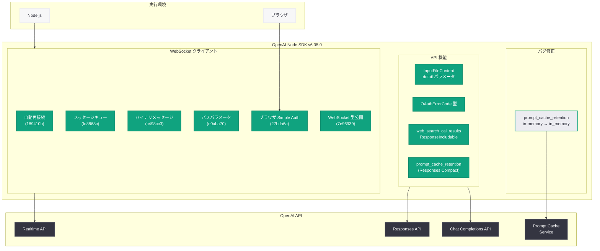
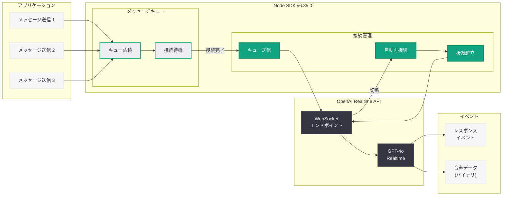
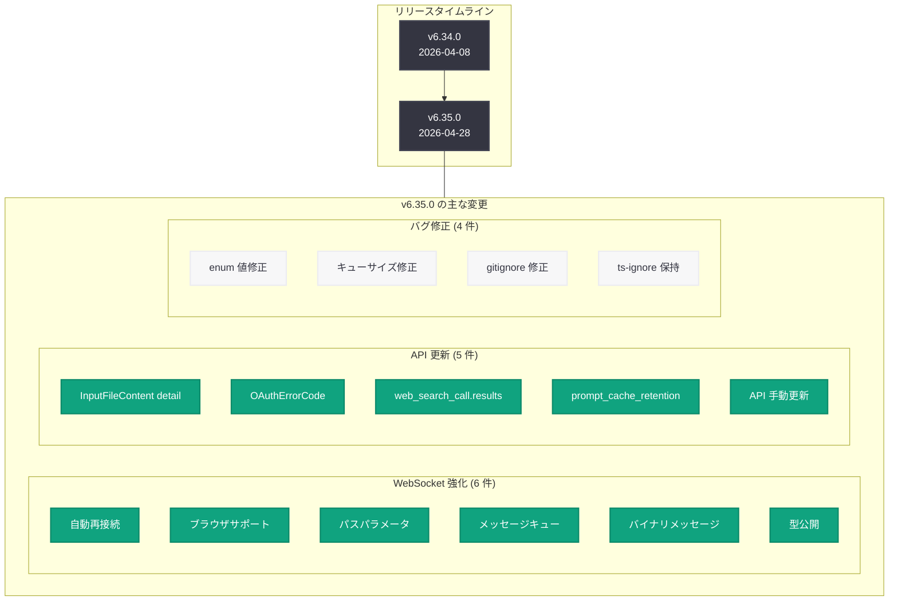

# OpenAI Node SDK v6.35.0 リリース: WebSocket 大幅強化と API 更新

## メタデータ

| 項目 | 内容 |
|------|------|
| 発表日 | 2026-04-28 |
| ソース | OpenAI API Changelog (GitHub Releases) |
| カテゴリ | SDK 更新 / API 変更 |
| 公式リンク | [Node SDK v6.35.0](https://github.com/openai/openai-node/releases/tag/v6.35.0) |

## 概要

OpenAI は 2026 年 4 月 28 日、Node.js/TypeScript 向け公式 SDK の v6.35.0 をリリースした。今回のリリースの最大の特徴は WebSocket 機能の大幅な強化であり、自動再接続、ブラウザでの Simple Auth を用いた WebSocket サポート、パスパラメータ対応、メッセージキューイング、バイナリメッセージサポートなど、Realtime API の利用体験を根本的に向上させる複数の改善が含まれている。

加えて、API 更新として `InputFileContent` への `detail` パラメータ追加、`OAuthErrorCode` 型の新規追加、`web_search_call.results` の `ResponseIncludable` への追加、`prompt_cache_retention` パラメータの Responses Compact への追加が行われた。同日リリースの Python SDK v2.33.0 と共通する変更として、`prompt_cache_retention` の enum 値修正 (`in-memory` から `in_memory`) と `release-doctor` CI ワークフローの削除も含まれている。前バージョン v6.34.0 (2026 年 4 月 8 日リリース) から 20 日間隔でのリリースとなる。

## 主な内容

### WebSocket の大幅強化

v6.35.0 の最も注目すべき変更は、WebSocket クライアントに対する包括的な機能強化である。Realtime API をはじめとするストリーミング通信を利用する開発者にとって、実用性と安定性が大幅に向上した。

#### 自動再接続サポート

コミット `189410b` により、WebSocket 接続が予期せず切断された場合に自動的に再接続を試みる機能が追加された。ネットワーク不安定な環境やモバイルデバイスでの利用において、手動の再接続ロジックを実装する必要がなくなる。

#### ブラウザでの WebSocket サポート (Simple Auth)

コミット `27bda6a` により、ブラウザ環境で Simple Auth を使用した WebSocket 接続が可能になった。これにより、フロントエンドアプリケーションから直接 Realtime API に接続するユースケースが簡素化される。

#### パスパラメータのサポート

コミット `e0aba70` により、WebSocket クライアントでパスパラメータを使用できるようになった。動的なエンドポイント構築が容易になり、API の柔軟な利用が可能になる。

#### メッセージキューイング

コミット `fd8868c` により、接続待機中にメッセージをキューに蓄積し、接続完了後に送信する機能が追加された。接続確立前にメッセージを送信しようとした場合のエラーハンドリングが不要になる。

#### バイナリメッセージサポート

コミット `c498cc3` により、WebSocket を通じたバイナリメッセージの送受信がサポートされた。音声データなどのバイナリコンテンツを扱う Realtime API との通信において重要な機能である。

#### WebSocket 型の公開

コミット `7e96939` により、内部で使用される WebSocket の型が TypeScript として公開された。カスタムの WebSocket ラッパーや拡張を実装する開発者にとって、型安全性が向上する。

### API 更新

#### InputFileContent への detail パラメータ追加

コミット `910ec5d` により、`InputFileContent` 型に `detail` パラメータが追加された。Vision API でファイルをアップロードする際に、画像の解析詳細度 (`low`、`high`、`auto`) を指定できるようになり、コストとパフォーマンスのバランスを制御できる。

#### OAuthErrorCode 型の追加

コミット `f84bd1f` により、OAuth 関連のエラーコードを表す `OAuthErrorCode` 型が新規追加された。OAuth フローを実装する開発者にとって、エラーハンドリングの型安全性が向上する。

#### web_search_call.results の ResponseIncludable への追加

コミット `72449a1` により、Responses API の `include` パラメータで `web_search_call.results` を指定できるようになった。Web 検索ツールの結果をレスポンスに含めることで、検索結果の詳細情報にアクセスしやすくなる。

#### prompt_cache_retention パラメータの追加

コミット `c486d1f` により、Responses API の Compact 機能に `prompt_cache_retention` パラメータが追加された。プロンプトキャッシュの保持方法を明示的に制御できるようになる。

### prompt_cache_retention バグ修正

コミット `5a81e1a` により、`prompt_cache_retention` の enum 値が Chat Completions API と Responses API の両方で修正された。

- **修正前:** `in-memory` (ハイフン区切り)
- **修正後:** `in_memory` (アンダースコア区切り)

この修正は Python SDK v2.33.0 と共通しており、OpenAI API のスネークケース命名規則に合致させる重要なバグ修正である。

### CI / メンテナンス変更

#### release-doctor ワークフローの削除

コミット `e5ab4d1` により、`release-doctor` CI ワークフローが削除された。Python SDK でも同様の変更が行われており、リリースプロセスの自動化と簡素化が進んだことによるものと考えられる。

#### コードフォーマットの適用

Prettier および ESLint によるコードフォーマットが適用され (`80fa23d`、`f606e8b`)、コードベースの一貫性が向上した。

#### gitignore の更新

コミット `cf860f6` により、自動生成される `oidc` ディレクトリが `.gitignore` に追加された。

## 技術的な詳細

### コードサンプル

#### SDK のアップグレード

```bash
# npm を使用したアップグレード
npm install openai@latest

# バージョン指定でのインストール
npm install openai@6.35.0

# yarn を使用している場合
yarn upgrade openai@^6.35.0

# pnpm を使用している場合
pnpm update openai

# package.json を使用している場合
# "openai": "^6.35.0" に更新
```

#### バージョン確認

```typescript
import OpenAI from "openai";

console.log(OpenAI.VERSION);
// 出力: 6.35.0
```

### WebSocket の使用例

#### 自動再接続付き WebSocket 接続

```typescript
import OpenAI from "openai";

const client = new OpenAI();

// Realtime API への WebSocket 接続 (自動再接続付き)
const ws = await client.realtime.connect({
  model: "gpt-4o-realtime-preview",
  // v6.35.0 新機能: 自動再接続の有効化
  reconnect: true,
});

// メッセージキューイング: 接続完了前でもメッセージを送信可能
// v6.35.0 新機能: 接続待機中のメッセージはキューに蓄積される
ws.send({
  type: "session.update",
  session: {
    modalities: ["text", "audio"],
    instructions: "You are a helpful assistant.",
  },
});

ws.on("message", (event) => {
  console.log("Received:", event);
});

ws.on("close", () => {
  // v6.35.0: 自動再接続が有効な場合、ここで手動再接続は不要
  console.log("Connection closed - reconnecting automatically");
});
```

#### ブラウザでの WebSocket 使用 (Simple Auth)

```typescript
import OpenAI from "openai";

// v6.35.0 新機能: ブラウザ環境で Simple Auth を使用した WebSocket 接続
const client = new OpenAI({
  apiKey: "your-api-key", // ブラウザでの使用には注意が必要
  dangerouslyAllowBrowser: true,
});

const ws = await client.realtime.connect({
  model: "gpt-4o-realtime-preview",
});

// バイナリメッセージの送信 (v6.35.0 新機能)
const audioData = new Uint8Array(/* 音声データ */);
ws.sendBinary(audioData);
```

#### パスパラメータを使用した WebSocket 接続

```typescript
import OpenAI from "openai";

const client = new OpenAI();

// v6.35.0 新機能: パスパラメータのサポート
const ws = await client.realtime.connect({
  model: "gpt-4o-realtime-preview",
  // パスパラメータを動的に構築可能
  pathParams: {
    sessionId: "sess_abc123",
  },
});
```

### prompt_cache_retention の修正前後

```typescript
import OpenAI from "openai";

const client = new OpenAI();

// ============================================
// v6.34.0 以前のコード (修正が必要)
// ============================================

// 旧: prompt_cache_retention: "in-memory"  // NG: ハイフン区切り

// ============================================
// v6.35.0 以降の正しいコード
// ============================================

// Chat Completions API での使用
const chatResponse = await client.chat.completions.create({
  model: "gpt-4o",
  messages: [
    {
      role: "system",
      content:
        "You are a helpful assistant specialized in TypeScript programming.",
    },
    { role: "user", content: "Explain generics in TypeScript." },
  ],
  // v6.35.0 で修正: "in-memory" → "in_memory"
  prompt_cache_retention: "in_memory",
});

console.log(chatResponse.choices[0].message.content);

// Responses API での使用
const response = await client.responses.create({
  model: "gpt-4o",
  instructions: "You are an expert code reviewer.",
  input: [
    {
      role: "user",
      content: "Review this TypeScript code for potential issues.",
    },
  ],
});

console.log(response.output_text);

// キャッシュ利用状況の確認
if (response.usage) {
  console.log(`Input tokens: ${response.usage.input_tokens}`);
  console.log(`Output tokens: ${response.usage.output_tokens}`);
  if (response.usage.input_tokens_details) {
    console.log(
      `Cached tokens: ${response.usage.input_tokens_details.cached_tokens}`
    );
  }
}
```

### InputFileContent の detail パラメータ

```typescript
import OpenAI from "openai";

const client = new OpenAI();

// v6.35.0 新機能: InputFileContent に detail パラメータを指定可能
const response = await client.responses.create({
  model: "gpt-4o",
  input: [
    {
      role: "user",
      content: [
        {
          type: "input_image",
          image_url: "https://example.com/image.png",
          // v6.35.0 新機能: 画像解析の詳細度を指定
          detail: "high", // "low" | "high" | "auto"
        },
        {
          type: "input_text",
          text: "What is in this image?",
        },
      ],
    },
  ],
});

console.log(response.output_text);
```

### web_search_call.results の利用

```typescript
import OpenAI from "openai";

const client = new OpenAI();

// v6.35.0 新機能: web_search_call.results を include に指定可能
const response = await client.responses.create({
  model: "gpt-4o",
  tools: [{ type: "web_search" }],
  input: [
    {
      role: "user",
      content: "What are the latest developments in AI?",
    },
  ],
  // Web 検索結果の詳細をレスポンスに含める
  include: ["web_search_call.results"],
});

// 検索結果の詳細にアクセス可能
for (const item of response.output) {
  if (item.type === "web_search_call") {
    console.log("Search results:", item.results);
  }
}
```

### 変更一覧

| 種別 | 変更内容 | コミット |
|------|---------|---------|
| 機能追加 | WebSocket 自動再接続サポート | `189410b` |
| 機能追加 | ブラウザでの WebSocket サポート (Simple Auth) | `27bda6a` |
| 機能追加 | WebSocket パスパラメータサポート | `e0aba70` |
| 機能追加 | WebSocket メッセージキューイング | `fd8868c` |
| 機能追加 | バイナリメッセージサポート | `c498cc3` |
| 機能追加 | WebSocket 型の TypeScript 公開 | `7e96939` |
| 機能追加 | InputFileContent に detail パラメータ追加 | `910ec5d` |
| 機能追加 | OAuthErrorCode 型の追加 | `f84bd1f` |
| 機能追加 | web_search_call.results を ResponseIncludable に追加 | `72449a1` |
| 機能追加 | prompt_cache_retention パラメータ追加 (Responses Compact) | `c486d1f` |
| 機能追加 | API 手動更新 | `b742f1f` |
| バグ修正 | prompt_cache_retention enum 値修正 (`in-memory` → `in_memory`) | `5a81e1a` |
| バグ修正 | WebSocket キューサイズを超える単一メッセージの許可 | `ad19ab2` |
| バグ修正 | gitignore に生成 `oidc` ディレクトリを追加 | `cf860f6` |
| バグ修正 | ts-ignore コメントの保持 | `1cde375` |
| CI 整理 | release-doctor ワークフロー削除 | `e5ab4d1` |
| メンテナンス | Prettier / ESLint フォーマット適用 | `80fa23d`、`f606e8b` |

## アーキテクチャ

以下の図は、v6.35.0 で強化された Node SDK の WebSocket アーキテクチャと主要コンポーネントの関係を示している。



以下の図は、WebSocket の自動再接続とメッセージキューイングのフローを示している。



以下の図は、v6.34.0 から v6.35.0 へのリリース間の変更の全体像を示している。



## 開発者への影響

### Realtime API を利用する開発者

- **自動再接続の恩恵:** ネットワーク不安定な環境での接続維持が容易になり、手動の再接続ロジックを削除または簡素化できる
- **メッセージキューイング:** 接続確立のタイミングを気にせずメッセージを送信できるようになり、初期化処理が大幅に簡素化される
- **バイナリメッセージ:** 音声データの送受信が WebSocket 経由で直接可能になり、Base64 エンコードのオーバーヘッドを回避できる

### ブラウザアプリケーション開発者

- **フロントエンド統合:** Simple Auth を使用してブラウザから直接 Realtime API に接続できるようになり、バックエンドプロキシの必要性が減少する
- **セキュリティ上の注意:** ブラウザでの API キー使用にはリスクが伴うため、本番環境では適切な認証フローを実装すること

### prompt_cache_retention を使用している開発者

- **即座の対応が必要:** `prompt_cache_retention: "in-memory"` を使用しているコードは、`"in_memory"` に変更する必要がある
- **TypeScript の型チェック:** SDK をアップグレードすれば TypeScript コンパイラが旧値に対してエラーを報告するため、修正漏れを防止できる

### Vision API / ファイルアップロードを使用する開発者

- **detail パラメータ:** `InputFileContent` に `detail` を指定することで、画像解析のコストとパフォーマンスを細かく制御できるようになった
- **コスト最適化:** `detail: "low"` を指定することで、高解像度が不要なユースケースでのトークン消費を抑制できる

### Web 検索ツールを利用する開発者

- **検索結果の取得:** `include: ["web_search_call.results"]` を指定することで、Web 検索の結果詳細にプログラムからアクセスできるようになった
- **RAG パイプラインとの統合:** 検索結果を独自のパイプラインで再利用するユースケースに対応

### TypeScript 開発者

- **WebSocket 型の活用:** 公開された WebSocket 型により、カスタムラッパーやミドルウェアの型安全な実装が可能になった
- **OAuthErrorCode 型:** OAuth フローのエラーハンドリングにおいて、型安全な分岐処理が可能になった

### アップグレード手順

1. **依存関係の更新:** `npm install openai@latest` を実行して v6.35.0 にアップグレードする
2. **コード内検索:** プロジェクト内で `"in-memory"` を検索し、`prompt_cache_retention` に関連する箇所を `"in_memory"` に修正する
3. **TypeScript コンパイル:** `tsc --noEmit` を実行して型エラーがないことを確認する
4. **テストの実行:** 既存のテストスイートを実行して回帰がないことを確認する
5. **WebSocket の動作確認:** 自動再接続やメッセージキューイングの挙動を確認する

```bash
# プロジェクト内での影響箇所の検索
grep -rn "in-memory" --include="*.ts" --include="*.js" .
grep -rn "prompt_cache_retention" --include="*.ts" --include="*.js" .

# TypeScript の型チェック
npx tsc --noEmit

# テストの実行
npm test
```

### Python SDK との対応関係

| 変更内容 | Node SDK v6.35.0 | Python SDK v2.33.0 |
|---------|------------------|-------------------|
| prompt_cache_retention enum 修正 | `5a81e1a` | `f9d2d13` |
| API 更新 (Responses / Chat Completions) | `b742f1f` | `18f834a` |
| release-doctor ワークフロー削除 | `e5ab4d1` | `00b2091` |
| WebSocket 強化 | 6 件の新機能 | v2.32.0 で対応済み |
| InputFileContent detail | `910ec5d` | v2.32.0 で対応済み |
| OAuthErrorCode 型 | `f84bd1f` | v2.32.0 で対応済み |

### v6.34.0 との差分まとめ

| 観点 | v6.34.0 | v6.35.0 |
|------|---------|---------|
| リリース日 | 2026-04-08 | 2026-04-28 |
| リリース間隔 | - | 20 日 |
| 主な焦点 | - | WebSocket 強化 + API 更新 |
| 新規機能数 | - | 11 |
| バグ修正数 | - | 4 |
| 破壊的変更 | - | enum 値の修正 (実質バグ修正) |

## よくある質問 (FAQ)

### Q: v6.34.0 から v6.35.0 へのアップグレードは破壊的な変更を含むか

A: `prompt_cache_retention` の enum 値が `"in-memory"` から `"in_memory"` に変更されているため、旧値を文字列リテラルで使用しているコードは修正が必要である。ただし、これは API 側の正しい仕様に SDK を合わせるバグ修正であり、意図的な破壊的変更ではない。`prompt_cache_retention` パラメータを使用していない場合は、互換性の問題なくアップグレードできる。

### Q: WebSocket の自動再接続はデフォルトで有効か

A: リリースノートの記述からは、自動再接続がデフォルトで有効かどうかは明示されていない。一般的には明示的にオプトインする設計が多いため、接続オプションで再接続を有効化する設定が必要と推測される。詳細は SDK のドキュメントおよびソースコードを確認すること。

### Q: ブラウザでの WebSocket 使用にセキュリティ上の懸念はないか

A: ブラウザでの Simple Auth を使用した WebSocket 接続は、API キーがクライアント側に露出するリスクがある。OpenAI は `dangerouslyAllowBrowser` フラグによりこのリスクを明示しているが、本番環境ではバックエンドプロキシ経由での接続や、一時的なトークンを使用する認証フローの実装を推奨する。

### Q: Python SDK v2.33.0 と同日リリースだが、変更内容は同一か

A: 共通する変更 (`prompt_cache_retention` の修正、API 更新、`release-doctor` の削除) がある一方で、Node SDK 固有の変更も多い。特に WebSocket の大幅強化 (自動再接続、ブラウザサポート、パスパラメータ、メッセージキュー、バイナリメッセージ) は Node SDK v6.35.0 に固有である。Python SDK では v2.32.0 で類似の WebSocket 機能が先行して追加されていた。

### Q: メッセージキューイング機能でキューサイズに制限はあるか

A: バグ修正 `ad19ab2` で「キューサイズを超える単一メッセージの許可」が行われていることから、デフォルトのキューサイズ制限が存在する。単一のメッセージがキューサイズ上限を超える場合でも正しく処理されるよう修正された。具体的なサイズ制限についてはソースコードを確認すること。

## 関連リンク

- [Node SDK v6.35.0 リリースノート](https://github.com/openai/openai-node/releases/tag/v6.35.0)
- [Node SDK v6.34.0 リリースノート](https://github.com/openai/openai-node/releases/tag/v6.34.0)
- [v6.34.0...v6.35.0 の完全な差分](https://github.com/openai/openai-node/compare/v6.34.0...v6.35.0)
- [Python SDK v2.33.0 リリースノート](https://github.com/openai/openai-python/releases/tag/v2.33.0)
- [OpenAI Prompt Caching ガイド](https://platform.openai.com/docs/guides/prompt-caching)
- [OpenAI Realtime API ドキュメント](https://platform.openai.com/docs/guides/realtime)
- [OpenAI API Changelog](https://platform.openai.com/docs/changelog)
- [Responses API リファレンス](https://platform.openai.com/docs/api-reference/responses)
- [Chat Completions API リファレンス](https://platform.openai.com/docs/api-reference/chat)
- [openai-node GitHub リポジトリ](https://github.com/openai/openai-node)

## まとめ

Node SDK v6.35.0 は、WebSocket 機能の包括的な強化と API 更新を中心とした大型リリースである。11 件の新規機能と 4 件のバグ修正が含まれ、前バージョン v6.34.0 から 20 日間隔でのリリースとなった。

最大の注目点は WebSocket クライアントの大幅強化であり、自動再接続、ブラウザでの Simple Auth 対応、パスパラメータサポート、メッセージキューイング、バイナリメッセージサポート、型の公開という 6 つの改善が一度に導入された。これにより、Realtime API を利用するアプリケーションの開発体験と運用安定性が大幅に向上する。

API 更新としては、`InputFileContent` への `detail` パラメータ追加による Vision API のコスト制御、`OAuthErrorCode` 型による OAuth エラーハンドリングの型安全性向上、`web_search_call.results` の `ResponseIncludable` 追加による Web 検索結果へのアクセス改善、`prompt_cache_retention` の Responses Compact への追加が行われた。

同日リリースの Python SDK v2.33.0 と共通する `prompt_cache_retention` の enum 値修正 (`in-memory` → `in_memory`) は、OpenAI API のスネークケース命名規則との一貫性を回復する重要なバグ修正である。この修正の影響を受ける開発者は、SDK のアップグレードに加えてアプリケーションコード内の文字列リテラルも修正する必要がある。

Python SDK v2.32.0 で先行導入されていた WebSocket 関連機能が、Node SDK v6.35.0 で追いついた形となり、両 SDK 間の機能パリティが改善された。OpenAI の Node SDK は約 2-3 週間のリリースサイクルで API の変更に迅速に追従し続けており、TypeScript/JavaScript エコシステムにおける OpenAI API 利用の信頼性と開発者体験の向上に貢献している。
