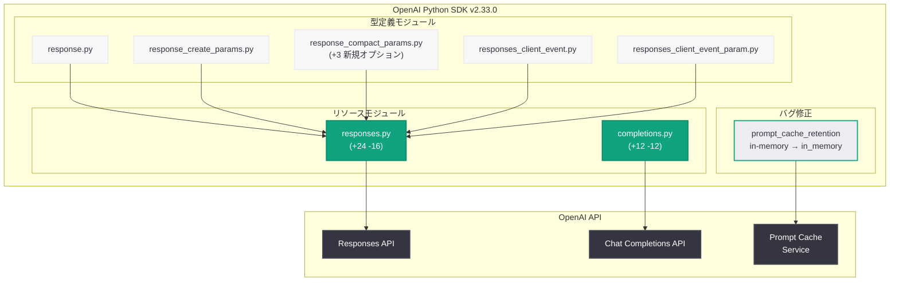
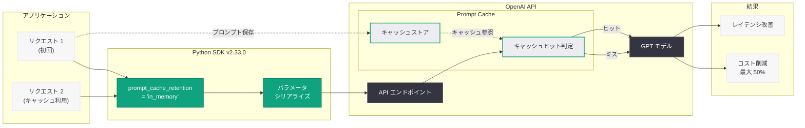
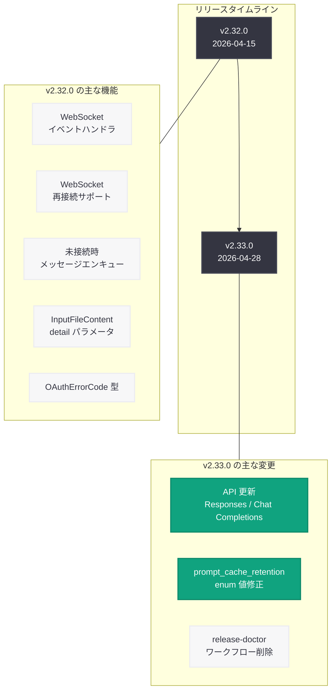

# OpenAI Python SDK v2.33.0 リリース: API 更新と prompt_cache_retention 修正

## メタデータ

| 項目 | 内容 |
|------|------|
| 発表日 | 2026-04-28 |
| ソース | OpenAI API Changelog (GitHub Releases) |
| カテゴリ | SDK 更新 / API 変更 |
| 公式リンク | [Python SDK v2.33.0](https://github.com/openai/openai-python/releases/tag/v2.33.0) |

## 概要

OpenAI は 2026 年 4 月 28 日、Python SDK v2.33.0 をリリースした。今回のリリースでは、Responses API および Chat Completions API に対する API 更新が実施され、複数のリソースファイルと型定義が修正された。中でも注目すべき変更は、`prompt_cache_retention` パラメータの enum 値が `in-memory` から `in_memory` に修正されたバグフィックスである。これは API の命名規則の一貫性を保つための重要な修正であり、プロンプトキャッシュ機能を利用する開発者に直接的な影響がある。

加えて、CI ワークフローの整理として `release-doctor` ワークフローが削除され、リリースプロセスの簡素化が図られた。全体で 17 ファイル、6 コミットにわたる変更が含まれている。

前バージョン v2.32.0 (2026 年 4 月 15 日リリース) では WebSocket のイベントハンドラ、再接続サポート、未接続時のメッセージエンキューなどの大型機能が追加されたのに対し、v2.33.0 は API スキーマの追従と重要なバグ修正に焦点を当てた保守的なリリースとなっている。

## 主な内容

### API 更新

v2.33.0 の主要な変更は、Responses API と Chat Completions API に対する API 更新である。コミット `18f834a` により、以下の 7 ファイルが修正された。

#### Responses API の変更

Responses API のコアリソースファイル `src/openai/resources/responses/responses.py` に対して、24 行の追加と 16 行の削除を伴う修正が行われた。この変更は、API 側のスキーマ更新に SDK の実装を追従させるものである。具体的には、Responses API のリクエスト構築やレスポンス処理に関するロジックが更新され、新しい API パラメータや型定義への対応が含まれている。

型定義ファイルにも複数の修正が加えられた。

- **`response_compact_params.py`:** 3 行が追加され、レスポンスのコンパクト化パラメータに新しいオプションが追加された。これにより、Responses API のストリーミング応答においてコンパクト化の制御がより細かく行えるようになった
- **`response.py`:** レスポンス型の定義が 1 行修正され、API スキーマの変更に追従した
- **`response_create_params.py`:** レスポンス作成パラメータの型定義が 1 行修正された
- **`responses_client_event.py`:** クライアントイベント型が 1 行修正された
- **`responses_client_event_param.py`:** クライアントイベントパラメータ型が 1 行修正された

#### Chat Completions API の変更

`src/openai/resources/chat/completions/completions.py` に対して 12 行の追加と 12 行の削除が行われた。追加と削除が同数であることから、既存のロジックの修正やリファクタリングが中心であり、新規パラメータの追加ではなく、API スキーマの変更に合わせた既存コードの調整であると推測される。

### prompt_cache_retention の修正

v2.33.0 で修正された最も重要なバグは、`prompt_cache_retention` パラメータの enum 値の不整合である (Issue [#1822](https://github.com/openai/openai-python/issues/1822)、コミット `f9d2d13`)。

#### 問題の背景

OpenAI の Prompt Caching 機能は、API リクエスト間でプロンプトの一部をキャッシュすることで、レイテンシの削減とコストの最適化を実現する機能である。`prompt_cache_retention` パラメータは、キャッシュの保持方法を指定するために使用される。

SDK の実装では、このパラメータの有効な値として `in-memory` (ハイフン区切り) が定義されていた。しかし、OpenAI API の実際のスキーマでは `in_memory` (アンダースコア区切り) が正しい値として定義されている。この不一致により、SDK を通じて `prompt_cache_retention` を設定しようとした開発者は、API からバリデーションエラーを受け取る可能性があった。

#### 修正内容

enum 値が `in-memory` から `in_memory` に修正された。これは OpenAI API 全体で採用されているスネークケース (snake_case) の命名規則に合致する修正である。

```python
# v2.32.0 以前 (誤った値)
from openai.types import PromptCacheRetention

# enum 値がハイフン区切りで定義されていた
# PromptCacheRetention = Literal["in-memory"]

# v2.33.0 以降 (修正後の値)
from openai.types import PromptCacheRetention

# enum 値がアンダースコア区切りに修正された
# PromptCacheRetention = Literal["in_memory"]
```

#### 影響を受ける開発者

以下のいずれかに該当する場合、この修正の影響を受ける可能性がある。

1. **`prompt_cache_retention` パラメータを文字列リテラルで指定している場合:** 値を `"in-memory"` から `"in_memory"` に変更する必要がある
2. **SDK の enum 型を使用している場合:** SDK をアップグレードすれば自動的に修正される
3. **型チェッカーを使用している場合:** mypy や pyright が旧値に対してエラーを報告するようになる

### CI ワークフローの整理

コミット `00b2091` により、リリースプロセスに関連する 2 つのファイルが削除された。

- **`.github/workflows/release-doctor.yml`:** リリース環境の健全性をチェックするワークフロー定義ファイル
- **`bin/check-release-environment`:** リリース環境の検証スクリプト

`release-doctor` ワークフローは、リリース前に環境設定 (API キー、パッケージレジストリの認証情報、必要なツールのインストール状況など) を検証するためのものであった。このワークフローの削除は、リリースプロセスの自動化や簡素化が進んだことにより、個別の環境検証ステップが不要になったためと考えられる。

SDK 利用者に対する直接的な影響はない。

## 技術的な詳細

### コードサンプル

#### SDK のアップグレード

```bash
# pip を使用したアップグレード
pip install --upgrade openai

# バージョン指定でのインストール
pip install openai==2.33.0

# requirements.txt を使用している場合
# requirements.txt の該当行を更新:
# openai>=2.33.0,<3.0.0

# Poetry を使用している場合
poetry update openai

# uv を使用している場合
uv pip install --upgrade openai
```

#### バージョン確認

```python
import openai

print(openai.__version__)
# 出力: 2.33.0
```

#### prompt_cache_retention の正しい使用方法 (v2.33.0 以降)

```python
from openai import OpenAI

client = OpenAI()

# Prompt Caching を使用した Chat Completions API 呼び出し
# v2.33.0 で修正された正しい enum 値を使用
response = client.chat.completions.create(
    model="gpt-4o",
    messages=[
        {
            "role": "system",
            "content": "You are a helpful assistant specialized in Python programming. "
                       "You provide detailed explanations with code examples."
        },
        {
            "role": "user",
            "content": "Explain Python decorators with examples."
        }
    ],
    # v2.33.0 で修正: "in-memory" → "in_memory"
    prompt_cache_retention="in_memory"
)

print(response.choices[0].message.content)

# レスポンスの usage 情報でキャッシュの利用状況を確認
if response.usage:
    print(f"Total tokens: {response.usage.total_tokens}")
    if hasattr(response.usage, "prompt_tokens_details"):
        details = response.usage.prompt_tokens_details
        if details and hasattr(details, "cached_tokens"):
            print(f"Cached tokens: {details.cached_tokens}")
```

#### Responses API でのプロンプトキャッシュ活用

```python
from openai import OpenAI

client = OpenAI()

# Responses API を使用した場合のプロンプトキャッシュ
# 長いシステムプロンプトをキャッシュすることでコストを削減
system_prompt = """
You are an expert code reviewer. Analyze the following code for:
1. Security vulnerabilities
2. Performance issues
3. Code style and best practices
4. Potential bugs and edge cases

Provide detailed feedback with line-by-line annotations.
Always suggest concrete improvements with code examples.
"""

response = client.responses.create(
    model="gpt-4o",
    instructions=system_prompt,
    input=[
        {
            "role": "user",
            "content": "Review this Python function:\n\n"
                       "def process_data(data):\n"
                       "    result = eval(data['expression'])\n"
                       "    return {'status': 'ok', 'result': result}"
        }
    ]
)

print(response.output_text)

# usage 情報の確認
if response.usage:
    print(f"\nInput tokens: {response.usage.input_tokens}")
    print(f"Output tokens: {response.usage.output_tokens}")
    if hasattr(response.usage, "input_tokens_details"):
        details = response.usage.input_tokens_details
        if details and hasattr(details, "cached_tokens"):
            print(f"Cached tokens: {details.cached_tokens}")
```

#### Responses API のコンパクトパラメータ

```python
from openai import OpenAI

client = OpenAI()

# Responses API でのストリーミングとコンパクトパラメータの使用
# v2.33.0 で response_compact_params が拡張された
with client.responses.create(
    model="gpt-4o",
    input=[
        {
            "role": "user",
            "content": "Write a comprehensive guide to async programming in Python."
        }
    ],
    stream=True,
) as stream:
    for event in stream:
        if hasattr(event, "delta"):
            print(event.delta, end="", flush=True)
    print()  # 改行
```

#### v2.32.0 からの移行: prompt_cache_retention の修正

```python
# ============================================
# v2.32.0 以前のコード (修正が必要)
# ============================================

# パターン 1: 文字列リテラルでの指定 (要修正)
# 旧: prompt_cache_retention="in-memory"
# 新: prompt_cache_retention="in_memory"

# パターン 2: 変数経由での指定 (要修正)
# 旧: cache_mode = "in-memory"
# 新: cache_mode = "in_memory"

# ============================================
# v2.33.0 以降の正しいコード
# ============================================

from openai import OpenAI

client = OpenAI()

# 正しい enum 値を使用
response = client.chat.completions.create(
    model="gpt-4o",
    messages=[
        {"role": "system", "content": "You are a helpful assistant."},
        {"role": "user", "content": "Hello!"}
    ],
    prompt_cache_retention="in_memory"  # アンダースコア区切り
)
```

### 変更一覧

| 種別 | 変更内容 | コミット |
|------|---------|---------|
| 機能追加 | Responses API および Chat Completions API のスキーマ更新に追従 | `18f834a` |
| 機能追加 | `response_compact_params` に新しいオプションを追加 | `18f834a` |
| バグ修正 | `prompt_cache_retention` の enum 値を `in-memory` から `in_memory` に修正 | `f9d2d13` |
| CI 整理 | `release-doctor` ワークフローと環境検証スクリプトを削除 | `00b2091` |

### ファイル変更の詳細

| ファイルパス | 変更行数 | 概要 |
|-------------|---------|------|
| `src/openai/resources/responses/responses.py` | +24 -16 | Responses API リソースの更新 |
| `src/openai/resources/chat/completions/completions.py` | +12 -12 | Chat Completions API リソースの調整 |
| `src/openai/types/responses/response_compact_params.py` | +3 -0 | コンパクトパラメータの拡張 |
| `src/openai/types/responses/response.py` | +1 -1 | レスポンス型の修正 |
| `src/openai/types/responses/response_create_params.py` | +1 -1 | レスポンス作成パラメータの修正 |
| `src/openai/types/responses/responses_client_event.py` | +1 -1 | クライアントイベント型の修正 |
| `src/openai/types/responses/responses_client_event_param.py` | +1 -1 | クライアントイベントパラメータ型の修正 |
| `.github/workflows/release-doctor.yml` | 削除 | CI ワークフローの整理 |
| `bin/check-release-environment` | 削除 | リリース環境検証スクリプトの削除 |

## アーキテクチャ

以下の図は、v2.33.0 で更新された Python SDK の主要コンポーネントと、今回の変更が影響するモジュール間の関係を示している。



以下の図は、Prompt Caching のフローと `prompt_cache_retention` パラメータの役割を示している。



以下の図は、v2.32.0 から v2.33.0 へのリリース間で行われた変更の全体像を時系列で示している。



## 開発者への影響

### prompt_cache_retention を使用している開発者

- **即座の対応が必要:** `prompt_cache_retention="in-memory"` を使用しているコードは、`"in_memory"` に変更する必要がある。SDK をアップグレードするだけでは不十分であり、アプリケーションコード内の文字列リテラルも修正が必要である
- **型チェッカーによる検出:** mypy や pyright を使用している場合、旧値 `"in-memory"` に対してエラーが報告されるため、修正漏れを防止できる
- **API 側の互換性:** API 側では `in_memory` が正しい値として定義されているため、SDK 側の修正後はバリデーションエラーが解消される

### Responses API を利用している開発者

- **型定義の更新:** レスポンス関連の型定義が更新されているため、SDK のアップグレード後に型チェッカーを実行し、型の不整合がないことを確認することを推奨する
- **コンパクトパラメータの拡張:** `response_compact_params` に新しいオプションが追加されたため、ストリーミング応答のコンパクト化をより細かく制御できるようになった
- **クライアントイベント型の修正:** Responses API のストリーミングイベントを処理するコードにおいて、型定義の変更が影響する可能性がある

### Chat Completions API を利用している開発者

- **透過的な変更:** Chat Completions API のリソースファイルに対する変更は、追加行数と削除行数が同数であることから、API の挙動に大きな変更はないと考えられる
- **スキーマ追従:** API スキーマの更新に伴う内部的な調整であり、既存のアプリケーションコードへの影響は限定的である

### CI/CD パイプラインの管理者

- **release-doctor の削除:** `release-doctor` ワークフローに依存した独自の CI パイプラインを構築している場合は、ワークフロー参照の更新が必要となる可能性がある。ただし、このワークフローは SDK 本体のリリースプロセスに限定されたものであり、一般的な SDK 利用者が直接参照することはない
- **フォークリポジトリへの影響:** openai-python をフォークしてカスタマイズしている場合、`release-doctor` ワークフローの削除がマージ時にコンフリクトを引き起こす可能性がある

### Prompt Caching のベストプラクティス

v2.33.0 で `prompt_cache_retention` の enum 値が修正されたことを踏まえ、Prompt Caching を効果的に活用するためのベストプラクティスを以下にまとめる。

1. **長いシステムプロンプトの再利用:** 同一のシステムプロンプトを繰り返し使用するユースケースでは、Prompt Caching により入力トークンのコストを最大 50% 削減できる
2. **プロンプトの先頭部分を固定:** キャッシュは先頭から一致するトークン列に基づいて判定されるため、プロンプトの先頭部分を固定し、可変部分を末尾に配置することでキャッシュヒット率が向上する
3. **キャッシュ利用状況のモニタリング:** `usage.prompt_tokens_details.cached_tokens` を定期的に確認し、キャッシュの効果を測定する
4. **最小トークン数の考慮:** Prompt Caching はプロンプトが一定のトークン数 (1024 トークン以上) を超える場合に有効化される。短いプロンプトではキャッシュの効果は得られない

### アップグレード手順

1. **依存関係の更新:** `pip install --upgrade openai` を実行して v2.33.0 にアップグレードする
2. **コード内検索:** プロジェクト内で `in-memory` を検索し、`prompt_cache_retention` に関連する箇所を `in_memory` に修正する
3. **型チェックの実行:** mypy や pyright を実行して型の不整合がないことを確認する
4. **テストの実行:** 既存のテストスイートを実行して回帰がないことを確認する
5. **動作確認:** Prompt Caching を使用している機能について、実際の API 呼び出しでエラーが発生しないことを確認する

```bash
# プロジェクト内での影響箇所の検索
grep -rn "in-memory" --include="*.py" .
grep -rn "prompt_cache_retention" --include="*.py" .

# 型チェックの実行
mypy .

# テストの実行
pytest
```

### トラブルシューティング

アップグレード時に発生する可能性のある一般的な問題と対処法を以下に示す。

#### 型チェッカーでエラーが発生する場合

```
error: Argument "prompt_cache_retention" has incompatible type "str";
expected "Literal['in_memory']"
```

この場合、コード内の `"in-memory"` を `"in_memory"` に修正する必要がある。IDE の検索・置換機能を使用して一括修正できる。

#### 依存関係の競合が発生する場合

```bash
# 依存関係の状態を確認
pip show openai

# 仮想環境での再インストール
pip install --force-reinstall openai==2.33.0
```

#### API からバリデーションエラーが返される場合

v2.33.0 以前の SDK で `"in-memory"` を使用していた場合、API 側がこの値を受け付けない可能性がある。SDK のアップグレードとコードの修正を同時に行うことで解決する。

### v2.32.0 との差分まとめ

| 観点 | v2.32.0 | v2.33.0 |
|------|---------|---------|
| リリース日 | 2026-04-15 | 2026-04-28 |
| リリース間隔 | - | 13 日 |
| 主な焦点 | WebSocket 機能の大幅強化 | API スキーマ追従とバグ修正 |
| 新規機能数 | 5 | 2 |
| バグ修正数 | 1 | 1 |
| 破壊的変更 | なし | enum 値の修正 (実質バグ修正) |
| 変更ファイル数 | - | 17 |
| コミット数 | - | 6 |

## よくある質問 (FAQ)

### Q: v2.32.0 から v2.33.0 へのアップグレードは破壊的な変更を含むか

A: 厳密には、`prompt_cache_retention` の enum 値が `in-memory` から `in_memory` に変更されているため、旧値を文字列リテラルで使用しているコードは修正が必要である。ただし、これは API 側の正しい仕様に SDK を合わせるバグ修正であり、意図的な破壊的変更ではない。`prompt_cache_retention` パラメータを使用していない場合は、互換性の問題なくアップグレードできる。

### Q: Prompt Caching を使用していない場合もアップグレードすべきか

A: はい。Responses API や Chat Completions API の型定義が更新されているため、最新の API スキーマとの整合性を保つためにアップグレードを推奨する。特に、`response_compact_params` の拡張は Responses API のストリーミング処理に関連するため、Responses API を利用している場合は恩恵を受けられる。

### Q: v2.31.0 以前から直接 v2.33.0 にアップグレードできるか

A: 可能である。Python SDK はセマンティックバージョニングに基づいてリリースされており、マイナーバージョン間では後方互換性が維持されている。ただし、v2.32.0 で追加された WebSocket 関連の新機能 (イベントハンドラ、再接続、メッセージエンキュー) も同時に利用可能になるため、変更内容を確認してからアップグレードすることを推奨する。

### Q: response_compact_params に追加された新しいオプションの詳細は何か

A: v2.33.0 では `response_compact_params.py` に 3 行が追加されているが、具体的な新規オプションの詳細はリリースノートでは明示されていない。コミット `18f834a` の diff を確認することで、追加されたパラメータの詳細を把握できる。

### Q: release-doctor ワークフローの削除は SDK 利用者に影響するか

A: 影響しない。`release-doctor` は SDK の開発チームがリリースプロセスで使用する内部ツールであり、SDK をパッケージとして利用する開発者のワークフローには影響しない。

## 関連リンク

- [Python SDK v2.33.0 リリースノート](https://github.com/openai/openai-python/releases/tag/v2.33.0)
- [Python SDK v2.32.0 リリースノート](https://github.com/openai/openai-python/releases/tag/v2.32.0)
- [v2.32.0...v2.33.0 の完全な差分](https://github.com/openai/openai-python/compare/v2.32.0...v2.33.0)
- [Issue #1822: prompt_cache_retention enum 値の不整合](https://github.com/openai/openai-python/issues/1822)
- [OpenAI Prompt Caching ガイド](https://platform.openai.com/docs/guides/prompt-caching)
- [OpenAI API Changelog](https://platform.openai.com/docs/changelog)
- [Responses API リファレンス](https://platform.openai.com/docs/api-reference/responses)
- [Chat Completions API リファレンス](https://platform.openai.com/docs/api-reference/chat)
- [openai-python GitHub リポジトリ](https://github.com/openai/openai-python)

## まとめ

Python SDK v2.33.0 は、API スキーマへの追従と重要なバグ修正を中心とした保守リリースである。最も注目すべき変更は、`prompt_cache_retention` パラメータの enum 値が `in-memory` から `in_memory` に修正されたことであり、これは OpenAI API の命名規則 (スネークケース) との一貫性を回復する重要な修正である。Prompt Caching を利用する開発者は、SDK のアップグレードに加えてアプリケーションコード内の文字列リテラルも修正する必要がある。

Responses API と Chat Completions API のリソースファイルおよび型定義も更新されており、API 側のスキーマ変更に SDK が適切に追従している。`response_compact_params` への新規オプション追加は、ストリーミング応答の制御を向上させる。CI 面では `release-doctor` ワークフローの削除によりリリースプロセスが簡素化されたが、SDK 利用者への影響はない。

前バージョン v2.32.0 が WebSocket 機能の大型追加を含むリリースであったのに対し、v2.33.0 は品質向上とスキーマ追従に注力した着実なリリースである。大型機能の追加がなくとも、API スキーマへの迅速な追従とバグ修正の積み重ねは、プロダクション環境で SDK を運用する開発者にとって不可欠な保守作業である。

OpenAI の Python SDK は、約 2 週間のリリースサイクルで API の変更に迅速に追従し続けており、エコシステムの信頼性と開発者体験の向上に貢献している。v2.33.0 のリリースにより、v2.32.0 で導入された WebSocket の新機能と合わせて、OpenAI Python SDK は Responses API、Chat Completions API、Realtime API のすべてにおいて最新の API スキーマに準拠した状態となった。今後のリリースでは、Responses API のさらなる拡張や新しいモデルへの対応が期待される。
