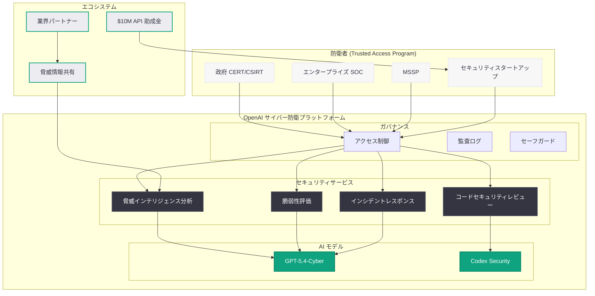
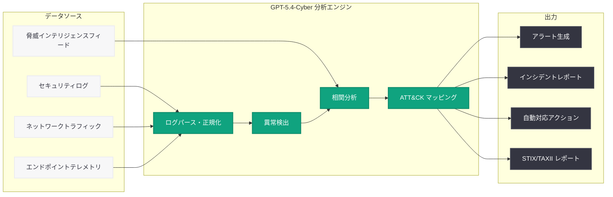
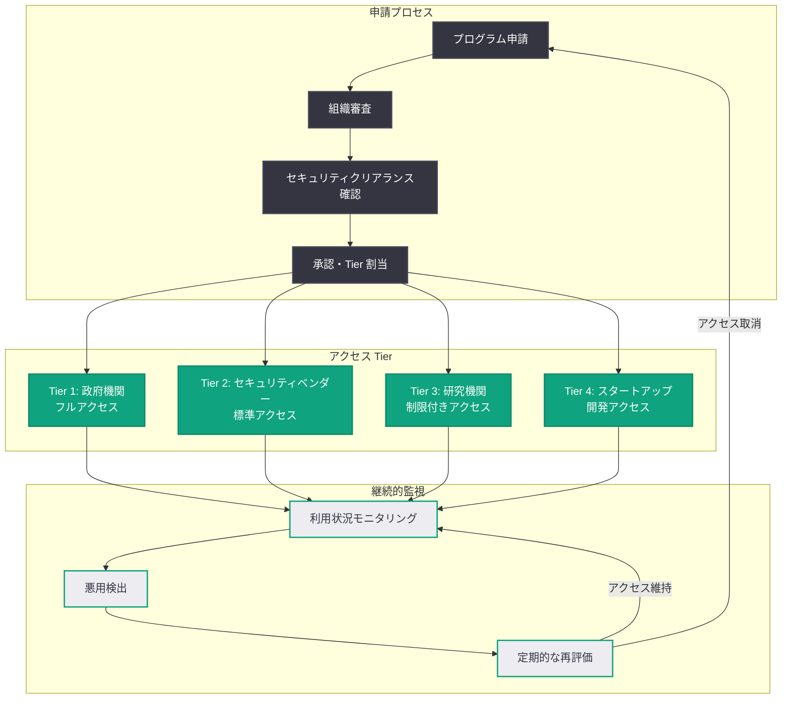

# インテリジェンス時代のサイバーセキュリティ: OpenAI が提唱する 5 つのアクションプラン

## メタデータ

| 項目 | 内容 |
|------|------|
| 発表日 | 2026-04-29 |
| ソース | OpenAI News |
| カテゴリ | セキュリティ / グローバルポリシー |
| 公式リンク | [Cybersecurity in the Intelligence Age](https://openai.com/index/cybersecurity-in-the-intelligence-age) |

> **注記:** 本レポートは、OpenAI 公式ブログの RSS フィード情報および関連する公開情報に基づいて作成されている。元記事の全文はアクセス制限により取得できなかったため、公開されている情報に基づく内容となっている。正確な詳細については公式ページを参照されたい。

## 概要

OpenAI は 2026 年 4 月 29 日、「インテリジェンス時代のサイバーセキュリティ」と題した包括的な政策文書を公開し、AI を活用したサイバー防衛を民主化し重要システムを保護するための 5 つのアクションプランを提唱した。本文書は、AI の急速な進化がサイバーセキュリティの攻守両面に根本的な変化をもたらす中で、防衛側が技術的優位性を確保・維持するための戦略的フレームワークを提示するものである。

この発表は、2026 年 4 月に OpenAI が推進してきた一連のサイバーセキュリティ施策の集大成として位置付けられる。4 月 14 日の Trusted Access for Cyber プログラム拡大、4 月 16 日のサイバー防衛エコシステム加速 (1,000 万ドル助成金)、4 月 24 日の GPT-5.4-Cyber 限定リリースという一連の取り組みを統合し、AI 時代のサイバーセキュリティにおける OpenAI のビジョンと具体的な行動計画を体系的に示している。AI を活用したサイバー防衛の「民主化」、すなわち高度なセキュリティ能力を限られた大企業だけでなく、中小組織や重要インフラ運用者にも広く提供するという理念が、本アクションプランの核心である。

## 主な内容

### 5 つのアクションプランの概要

OpenAI が提唱する 5 つのアクションプランは、AI 時代のサイバーセキュリティにおける防衛優位を確立するための包括的な戦略フレームワークである。各プランは相互に連携し、技術開発からエコシステム構築、政策提言まで幅広い領域をカバーしている。

1. **AI を活用したサイバー防衛の民主化:** 高度な AI セキュリティツールを幅広い防衛者に提供し、防衛能力の格差を解消する
2. **重要インフラの保護強化:** エネルギー、金融、通信、医療などの重要インフラに対する AI 駆動の防衛システムを構築する
3. **AI セキュリティモデルの責任あるデプロイ:** GPT-5.4-Cyber に代表される高度なセキュリティ特化モデルを、厳格なセーフガードの下で段階的に展開する
4. **グローバルなセキュリティエコシステムの構築:** 業界パートナーシップ、助成金プログラム、オープンな脅威インテリジェンス共有を通じて、防衛者コミュニティを強化する
5. **サイバーセキュリティ AI のガバナンスと政策フレームワーク:** AI サイバーセキュリティツールの開発・展開に関する責任ある規範の策定を推進する

### AI を活用したサイバー防衛の民主化

サイバーセキュリティにおける最大の課題の 1 つは、防衛能力の非対称性である。攻撃者は少数の脆弱性を突くだけで成功するが、防衛者はあらゆる攻撃ベクトルに対応しなければならない。さらに、高度なセキュリティ人材の不足により、多くの組織が十分な防衛体制を構築できていない現状がある。

OpenAI の民主化アプローチは、この構造的課題に AI の力で対処しようとするものである。

- **スキルギャップの解消:** GPT-5.4-Cyber を活用することで、セキュリティ専門家でなくても高度な脅威分析やインシデントレスポンスが可能になる。中小企業のIT管理者が、大企業の SOC (Security Operations Center) に匹敵する分析能力を手に入れることを目指す
- **自動化による防衛能力の底上げ:** 脆弱性スキャン、ログ分析、脅威ハンティングといった定型的だが専門知識を要するタスクを AI が自動化し、人的リソースをより戦略的な活動に集中させる
- **コストの削減:** 従来は高額なセキュリティコンサルタントや専用ツールに依存していた分析が、API 経由で手頃なコストで利用可能になる
- **リアルタイム対応の実現:** AI による常時監視と自動分析により、攻撃の検出から対応までの時間 (Mean Time to Respond: MTTR) を劇的に短縮する

### 重要インフラの保護

インテリジェンス時代において、重要インフラへのサイバー攻撃は国家安全保障上の最重大リスクの 1 つとなっている。電力グリッド、水道システム、交通インフラ、医療システムなどは、デジタル化が進む一方で、レガシーシステムの存在やセキュリティ投資の不足により脆弱性を抱えている。

OpenAI の重要インフラ保護戦略は、以下の要素で構成されると考えられる。

- **OT (Operational Technology) セキュリティへの AI 適用:** 産業制御システム (ICS)、SCADA システムのプロトコル分析にAIを活用し、異常な通信パターンや不正なコマンドをリアルタイムで検出する
- **レガシーシステムの防衛:** 更新が困難な古いシステムに対して、AI による外部からの監視と防衛レイヤーを提供し、既存環境を変更せずにセキュリティを強化する
- **サプライチェーンリスクの可視化:** ソフトウェアサプライチェーン全体を AI で分析し、依存関係の脆弱性や改ざんのリスクを早期に特定する。2026 年 4 月 10 日の Axios 開発者ツール侵害事案のようなサプライチェーン攻撃に対する防衛能力を強化する
- **セクター間の脅威インテリジェンス共有:** AI を活用して異なるセクター間の攻撃パターンを相関分析し、1 つのセクターで検出された脅威を他のセクターの防衛に活用する

### GPT-5.4-Cyber と Trusted Access プログラム

本アクションプランにおいて、GPT-5.4-Cyber と Trusted Access for Cyber プログラムは中核的な技術基盤として位置付けられている。4 月中の一連の発表を通じて構築されたプログラムの全体像が、本文書で統合的に説明されている。

#### GPT-5.4-Cyber の戦略的位置付け

GPT-5.4-Cyber は単なる AI モデルではなく、サイバー防衛の民主化を実現するための技術的プラットフォームである。

- **防衛特化の設計思想:** 攻撃目的ではなく防衛目的に最適化された出力制御が実装されている
- **段階的アクセスモデル:** Trusted Access プログラムの審査を経た組織から段階的に利用を拡大し、悪用リスクを最小化しながら防衛能力を広げる
- **エコシステム連携:** 1,000 万ドルの API 助成金を通じて、スタートアップや研究機関が GPT-5.4-Cyber を活用したソリューションを開発できる環境を整備する

#### Trusted Access for Cyber のフレームワーク

| 審査段階 | 対象組織 | アクセスレベル |
|----------|----------|--------------|
| Tier 1 | 政府 CERT/CSIRT、国家サイバーセキュリティ機関 | フルアクセス (高度な分析機能を含む) |
| Tier 2 | 大手セキュリティベンダー、金融機関セキュリティチーム | 標準アクセス (脅威分析・脆弱性評価) |
| Tier 3 | 認定 MSSP、学術研究機関 | 制限付きアクセス (研究・教育目的) |
| Tier 4 | 助成金受給スタートアップ、防衛者コミュニティ | 開発アクセス (プロダクト構築用) |

### セキュリティエコシステムの拡大

OpenAI は、単独でサイバーセキュリティの課題を解決することはできないという認識のもと、広範なエコシステムの構築を推進している。

- **業界パートナーシップ:** BNY、Zscaler をはじめとする主要企業との協業を通じて、AI サイバーセキュリティの実用化を加速する
- **1,000 万ドル API 助成金:** セキュリティスタートアップ、学術研究機関、非営利セキュリティ組織に対して GPT-5.4-Cyber の API クレジットを提供し、エコシステムの裾野を広げる
- **オープンな脅威インテリジェンス:** AI が検出した脅威パターンを匿名化した形でコミュニティと共有し、集合知による防衛を実現する
- **Codex Security の統合:** 3 月 6 日に発表された Codex Security Research Preview の成果を本プログラムに統合し、コードセキュリティの自動化を推進する
- **インシデントレスポンスの標準化:** AI を活用したインシデントレスポンスのベストプラクティスを策定し、コミュニティ全体で共有する

### ガバナンスと政策フレームワーク

AI サイバーセキュリティツールのデュアルユースリスクを管理するため、OpenAI は技術面だけでなくガバナンス面でも積極的な取り組みを行っている。

- **責任あるデプロイの原則:** セキュリティ特化モデルのリリースにおいて、段階的なアクセス拡大と継続的なリスク評価を義務付ける
- **国際的な規範の策定:** AI サイバーセキュリティツールの開発・展開に関する国際的なガイドラインの策定を関係各国と協議する
- **透明性レポート:** Trusted Access プログラムの運用状況、悪用試行の検出・対応実績を定期的に公開する
- **マルチステークホルダーガバナンス:** 政府、産業界、学術界、市民社会の代表者で構成されるアドバイザリーボードを設置し、プログラムの方向性を監督する

## 技術的な詳細

### GPT-5.4-Cyber の主要機能

GPT-5.4-Cyber は GPT-5.4 をベースに、サイバーセキュリティ防衛に特化した以下の技術的強化が施されている。

- **1M トークンコンテキストウィンドウ:** 大規模なログファイル、ソースコード、ネットワークキャプチャの一括分析が可能
- **MITRE ATT&CK フレームワークとの深い統合:** 検出された脅威を自動的に ATT&CK テクニックにマッピング
- **CVE データベースのリアルタイム参照:** 既知の脆弱性情報と照合し、影響評価を自動生成
- **構造化された脅威レポート生成:** STIX/TAXII 形式での脅威インテリジェンスレポートの自動生成
- **多言語マルウェア解析:** 難読化されたコード、パックされたバイナリの解析支援

### セキュリティ API の統合パターン

GPT-5.4-Cyber は OpenAI API 経由で利用され、既存のセキュリティインフラストラクチャとシームレスに統合できる設計となっている。

### コードサンプル

#### 脅威インテリジェンスの自動分析

```python
from openai import OpenAI

client = OpenAI()

def analyze_threat_indicators(indicators: list[str]) -> dict:
    """脅威インジケータを分析し、MITRE ATT&CK マッピングを生成する"""
    response = client.chat.completions.create(
        model="gpt-5.4-cyber",
        messages=[
            {
                "role": "system",
                "content": (
                    "You are a cybersecurity threat intelligence analyst. "
                    "Analyze the provided indicators of compromise (IoCs) and:\n"
                    "1. Classify each indicator by type (IP, domain, hash, URL, etc.)\n"
                    "2. Map observed behaviors to MITRE ATT&CK techniques\n"
                    "3. Assess the threat level (Critical/High/Medium/Low)\n"
                    "4. Provide recommended defensive actions\n"
                    "Output in structured JSON format."
                )
            },
            {
                "role": "user",
                "content": f"Analyze the following indicators:\n{chr(10).join(indicators)}"
            }
        ],
        response_format={"type": "json_object"},
        temperature=0.1
    )
    return response.choices[0].message.content


# 使用例
indicators = [
    "Outbound C2 beacon to 198.51.100.23:443 every 30 minutes",
    "DNS queries to randomly generated subdomains of malware-c2.example.net",
    "PowerShell execution with Base64-encoded payload: -enc UwB0AGEAcgB0AC...",
    "Registry persistence at HKLM\\SOFTWARE\\Microsoft\\Windows\\CurrentVersion\\Run",
    "Lateral movement via SMB to internal hosts on port 445"
]

result = analyze_threat_indicators(indicators)
print(result)
```

#### リアルタイムログ監視とアラート生成

```python
from openai import OpenAI
import json

client = OpenAI()

def monitor_security_logs(log_batch: str, context: str = "") -> dict:
    """セキュリティログをリアルタイムで監視し、異常を検出する"""
    response = client.chat.completions.create(
        model="gpt-5.4-cyber",
        messages=[
            {
                "role": "system",
                "content": (
                    "You are a SOC (Security Operations Center) analyst AI. "
                    "Analyze the provided security logs and identify:\n"
                    "1. Anomalous patterns indicating potential threats\n"
                    "2. Known attack signatures (CVE matches, malware patterns)\n"
                    "3. Lateral movement indicators\n"
                    "4. Data exfiltration attempts\n"
                    "5. Privilege escalation activities\n\n"
                    "For each finding, provide:\n"
                    "- Severity (P1-P4)\n"
                    "- MITRE ATT&CK technique ID\n"
                    "- Recommended immediate action\n"
                    "- Confidence score (0.0-1.0)"
                )
            },
            {
                "role": "user",
                "content": f"Security logs:\n{log_batch}\n\nContext: {context}"
            }
        ],
        response_format={"type": "json_object"},
        temperature=0.0
    )
    return json.loads(response.choices[0].message.content)


def generate_incident_report(findings: dict) -> str:
    """検出結果からインシデントレポートを生成する"""
    response = client.chat.completions.create(
        model="gpt-5.4-cyber",
        messages=[
            {
                "role": "system",
                "content": (
                    "Generate a structured incident report in STIX 2.1 format "
                    "based on the security findings. Include: threat actor profile, "
                    "attack pattern, indicators, and recommended mitigations."
                )
            },
            {
                "role": "user",
                "content": json.dumps(findings)
            }
        ],
        temperature=0.1
    )
    return response.choices[0].message.content
```

#### 脆弱性スキャンとコードレビューの自動化

```python
from openai import OpenAI
from pathlib import Path

client = OpenAI()

def security_code_review(source_code: str, language: str = "python") -> dict:
    """ソースコードのセキュリティレビューを実行する"""
    response = client.chat.completions.create(
        model="gpt-5.4-cyber",
        messages=[
            {
                "role": "system",
                "content": (
                    "You are a security code reviewer specializing in "
                    f"{language} applications. Perform a comprehensive "
                    "security audit covering:\n"
                    "- OWASP Top 10 vulnerabilities\n"
                    "- CWE (Common Weakness Enumeration) mapping\n"
                    "- Input validation issues\n"
                    "- Authentication/authorization flaws\n"
                    "- Cryptographic weaknesses\n"
                    "- Injection vulnerabilities (SQL, XSS, Command)\n"
                    "- Sensitive data exposure\n"
                    "- Dependency vulnerabilities\n\n"
                    "For each finding, provide:\n"
                    "- CWE ID and description\n"
                    "- Severity (Critical/High/Medium/Low)\n"
                    "- Line number(s) affected\n"
                    "- Remediation recommendation with code fix"
                )
            },
            {
                "role": "user",
                "content": f"Review the following {language} code:\n\n```{language}\n{source_code}\n```"
            }
        ],
        response_format={"type": "json_object"},
        temperature=0.1
    )
    return response.choices[0].message.content


def scan_supply_chain(requirements_file: str) -> dict:
    """依存関係のサプライチェーンリスクを評価する"""
    response = client.chat.completions.create(
        model="gpt-5.4-cyber",
        messages=[
            {
                "role": "system",
                "content": (
                    "Analyze the dependency list for supply chain risks. "
                    "Check for:\n"
                    "- Known vulnerable versions (CVE matches)\n"
                    "- Typosquatting package names\n"
                    "- Packages with known maintainer compromises\n"
                    "- Unusual dependency chains\n"
                    "- Packages flagged in recent supply chain attacks\n"
                    "Reference: Axios developer tool compromise (April 2026)"
                )
            },
            {
                "role": "user",
                "content": f"Dependencies:\n{requirements_file}"
            }
        ],
        response_format={"type": "json_object"},
        temperature=0.0
    )
    return response.choices[0].message.content
```

## アーキテクチャ

### サイバー防衛プラットフォーム全体像



### 脅威検出フロー



### Trusted Access プログラム構造



## 開発者への影響

### セキュリティチームへの影響

本アクションプランは、セキュリティチームの業務を根本的に変革する可能性を持つ。

- **SOC アナリストの生産性向上:** GPT-5.4-Cyber の導入により、Tier 1 アナリストのアラートトリアージが自動化され、Tier 2/3 アナリストがより高度な脅威ハンティングに集中できる環境が整う
- **インシデントレスポンス時間の短縮:** AI による自動分析と対応手順の生成により、MTTR (Mean Time to Respond) の大幅な短縮が期待される
- **脅威インテリジェンスの効率化:** 大量の脅威情報を AI が自動的に分析・優先度付けすることで、アナリストの情報過多を軽減する
- **セキュリティ人材不足の緩和:** AI がジュニアアナリストの能力を補完し、限られた人員でより広範な防衛が可能になる

### API ユーザーへの影響

- **新モデルへのアクセス:** Trusted Access プログラムの審査を通過した組織は、`gpt-5.4-cyber` モデルを API 経由で利用可能。一般のAPI ユーザーは引き続きアクセス制限の対象となる
- **セキュリティ API の拡充:** 脅威分析、脆弱性評価、コードレビューに特化した API エンドポイントやプロンプトテンプレートの提供が期待される
- **JSON モード対応:** セキュリティ分析結果を構造化された JSON 形式で出力でき、SIEM やSOAR プラットフォームとの統合が容易になる
- **助成金によるコスト軽減:** セキュリティスタートアップや研究機関は、1,000 万ドル助成金プログラムを通じて API クレジットを取得できる

### エンタープライズ顧客への影響

- **統合セキュリティソリューション:** BNY や Zscaler との協業により、エンタープライズ向けの統合セキュリティソリューションが充実する
- **コンプライアンス対応:** AI を活用したセキュリティ監視・レポーティングにより、規制対応の負荷を軽減できる
- **マルチベンダー戦略の選択肢:** OpenAI と Anthropic の双方がサイバーセキュリティ特化モデルを提供することで、ベンダーロックインを回避した柔軟な選択が可能になる
- **重要インフラ事業者:** エネルギー、金融、医療セクターの組織は、特に優先的なアクセスと支援を受けられる見込み

## 関連リンク

### OpenAI サイバーセキュリティ関連発表

- [Cybersecurity in the Intelligence Age](https://openai.com/index/cybersecurity-in-the-intelligence-age) - 本記事 (2026-04-29)
- [GPT-5.4-Cyber Limited Release](https://openai.com/index/gpt-5-4-cyber) - GPT-5.4-Cyber 限定リリース (2026-04-24)
- [Accelerating the cyber defense ecosystem](https://openai.com/index/accelerating-cyber-defense-ecosystem) - エコシステム加速・$10M 助成金 (2026-04-16)
- [Trusted access for the next era of cyber defense](https://openai.com/index/scaling-trusted-access-for-cyber-defense) - Trusted Access プログラム拡大 (2026-04-14)
- [Axios developer tool compromise response](https://openai.com/index/axios-developer-tool-compromise) - サプライチェーン攻撃対応 (2026-04-10)

### Codex Security 関連

- [Codex Security Research Preview](https://openai.com/index/codex-security-research-preview) - Codex Security 研究プレビュー (2026-03-06)
- [Codex Security Reports](https://openai.com/index/codex-security-reports) - Codex セキュリティレポート (2026-03-16)

### 関連レポート (本リポジトリ)

- [GPT-5.4-Cyber の限定リリース](./2026-04-24-gpt-5-4-cyber-limited-release.md)
- [サイバー防衛エコシステムの加速](./2026-04-16-accelerating-cyber-defense-ecosystem.md)
- [Trusted Access プログラムの拡大](./2026-04-14-scaling-trusted-access-cyber-defense.md)

## まとめ

OpenAI の「インテリジェンス時代のサイバーセキュリティ」は、2026 年 4 月に展開された一連のサイバーセキュリティ施策を統合する包括的な政策文書であり、AI 時代におけるサイバー防衛の方向性を明確に示している。5 つのアクションプランは、技術開発 (GPT-5.4-Cyber)、アクセスの民主化 (Trusted Access プログラム)、エコシステム構築 (助成金・パートナーシップ)、重要インフラ保護、ガバナンスという多層的なアプローチで構成されている。

特に注目すべきは、「防衛の民主化」という理念である。AI サイバーセキュリティの能力を一部の大企業に限定せず、中小組織や重要インフラ運用者にも広く提供するという方針は、サイバーセキュリティの構造的課題に対する意欲的な解決策と言える。同時に、デュアルユースリスクを管理するための段階的アクセスモデルとセーフガードの設計は、責任ある AI 展開のモデルケースとなりうる。

Anthropic との競争的文脈の中で、OpenAI がエコシステム全体の支援 (助成金、パートナーシップ、脅威情報共有) という差別化戦略を取っている点も重要である。AI プロバイダー間の競争が防衛者の選択肢を広げ、結果的にサイバーセキュリティエコシステム全体の強化につながることが期待される。

> **免責事項:** 本レポートは公開情報に基づいて作成されており、OpenAI の公式見解を代表するものではない。GPT-5.4-Cyber の具体的な機能やアクセス条件は、公式ドキュメントおよび Trusted Access for Cyber プログラムの案内を参照されたい。技術的な詳細やコードサンプルは想定される利用パターンを示したものであり、実際の API 仕様は変更される可能性がある。
