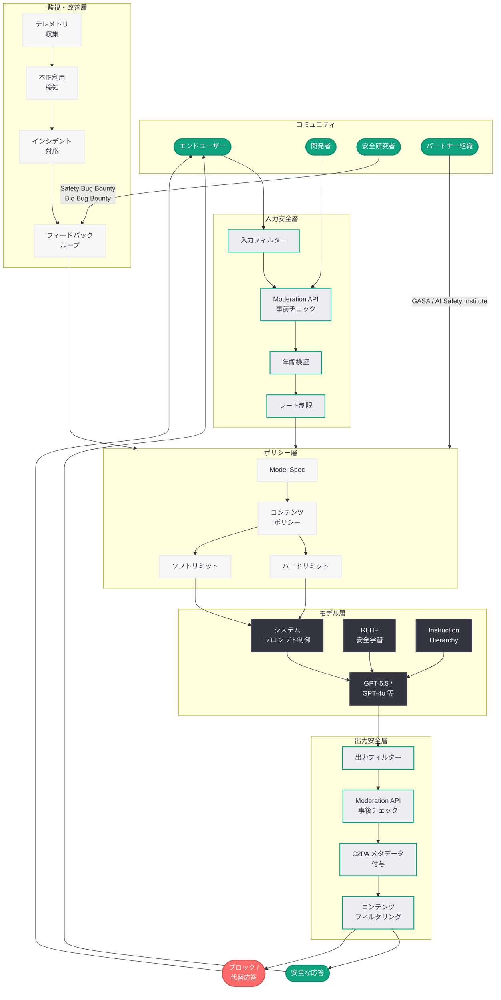
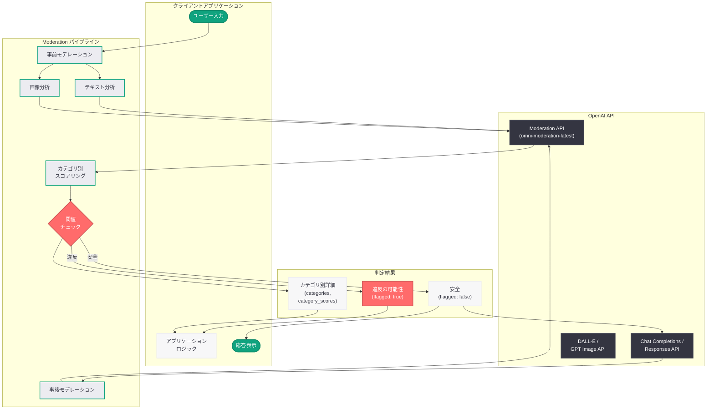

# OpenAI のコミュニティ安全への取り組み: AI エコシステム全体の安全性を確保する包括的フレームワーク

## メタデータ

| 項目 | 内容 |
|------|------|
| 発表日 | 2026-04-29 |
| ソース | OpenAI News |
| カテゴリ | 安全性 / ポリシー |
| 公式リンク | [Our commitment to community safety](https://openai.com/index/our-commitment-to-community-safety/) |

> **注記:** 本レポートは、OpenAI 公式ブログの RSS フィード情報、関連する安全施策の公開情報、および OpenAI の既存の安全性に関する取り組みに基づいて作成されている。元記事の全文はアクセス制限により取得できなかったため、公開されている情報に基づく内容となっている。正確な詳細については公式ページを参照されたい。

## 概要

OpenAI は 2026 年 4 月 29 日、「Our commitment to community safety」と題する公式ブログ記事を公開し、AI エコシステムにおけるコミュニティ安全への包括的な取り組みを明らかにした。本記事は、コンテンツ安全ポリシー、モデレーションツール、安全研究の推進、そしてコミュニティとの協働を通じた安全な AI デプロイメントの実現に向けた OpenAI の姿勢を体系的に示すものである。

この発表は、OpenAI が近年展開してきた一連の安全施策の延長線上に位置づけられる。2026 年 3 月 25 日の Model Spec アプローチの公開、同日の Safety Bug Bounty プログラム開始、4 月 8 日の Child Safety Blueprint、4 月 23 日の GPT-5.5 System Card と Bio Bug Bounty、そして 4 月 26 日の「Our Principles」公表を経て、本記事はこれらの個別施策を「コミュニティ安全」という統合的な枠組みのもとに体系化する役割を担っている。

さらに、4 月 27 日に開廷した Musk 対 Altman/OpenAI 裁判において安全性が主要な争点となっている中で、OpenAI が安全への取り組みを対外的に明確化するタイミングは戦略的にも重要である。AWS パートナーシップ、FedRAMP Moderate 認証取得、Databricks との連携など、事業の急速な拡大と並行して安全性へのコミットメントを維持していることを示す発信と位置づけられる。

## 主な内容

### OpenAI の安全に対する基本姿勢

OpenAI は設立以来、「AGI が人類全体に利益をもたらすことを確実にする」というミッションを掲げており、安全性はその中核に位置する原則である。Sam Altman が 4 月 26 日に公表した「Our Principles」においても、安全性の最優先が 5 つの原則の一つとして明確に位置づけられている。

コミュニティ安全への取り組みは、以下の基本姿勢に基づいて展開されている。

- **予防的アプローチ:** 問題が発生してから対処するのではなく、設計段階から安全性を組み込む「Safety by Design」の思想。モデルのトレーニング、評価、デプロイメントの全段階において安全性の検証を実施する
- **多層防御の原則:** 単一の安全メカニズムに依存するのではなく、入力フィルタリング、モデルレベルの制御、出力検証、モニタリングを組み合わせた多層的な防御アーキテクチャを採用する
- **透明性とアカウンタビリティ:** 安全性に関する取り組み、判断基準、インシデント対応の方針を公開し、外部からの検証と批判を受け入れる姿勢を維持する
- **継続的な改善:** 新たな脅威やリスクの出現に対して、安全施策を常にアップデートする反復的な改善サイクルを確立する
- **コミュニティとの協働:** 安全性の確保は OpenAI 単独の取り組みではなく、開発者コミュニティ、研究者、政策立案者、市民社会との協力によって実現するものであるという認識

### コミュニティ安全の枠組み

OpenAI のコミュニティ安全の枠組みは、以下の 5 つの柱で構成されている。

| 柱 | 概要 | 主な施策 |
|---|---|---|
| コンテンツポリシー | AI が生成するコンテンツの安全基準の策定と運用 | 利用規約、コンテンツガイドライン、禁止事項の明確化 |
| モデレーションツール | 有害コンテンツの検出・フィルタリングのための技術的手段 | Moderation API、安全フィルター、自動検知システム |
| 安全研究 | AI の安全性に関する基礎研究と応用研究 | アライメント研究、レッドチーミング、評価ベンチマーク |
| 開発者エコシステム支援 | 安全な AI アプリケーション構築のための開発者向けツールとガイダンス | SDK、ベストプラクティス、安全設計パターン |
| 外部連携 | 学術機関、政府、業界団体との協力関係 | GASA、NCMEC、AI Safety Institute との連携 |

#### コンテンツポリシーの体系

OpenAI のコンテンツポリシーは、ハードリミット (絶対的な禁止事項) とソフトリミット (コンテキストに応じて調整可能な制限) の 2 層構造で設計されている。これは Model Spec のフレームワークと一貫した設計思想である。

**ハードリミット (絶対的な禁止事項):**

- 児童の性的搾取コンテンツ (CSAM) の生成
- 大量破壊兵器の製造に関する具体的な指示
- 特定個人に対する暴力の教唆
- マルウェアの作成支援
- 個人情報の不正な収集・公開

**ソフトリミット (コンテキスト依存の制限):**

- 暴力的なコンテンツ: 教育・研究目的では許容範囲が広がる
- 成人向けコンテンツ: プラットフォームの設定と年齢検証に基づいて制御
- 政治的コンテンツ: 事実に基づく情報提供は許容、扇動的な表現は制限
- 医療・法律に関する助言: 免責事項の付与と専門家への相談推奨を条件に提供

#### 禁止コンテンツカテゴリの詳細

OpenAI の Moderation API および内部安全フィルターは、以下のカテゴリに基づいてコンテンツを評価している。

| カテゴリ | 説明 | 対応 |
|---------|------|------|
| `hate` | 人種、性別、宗教等に基づく憎悪表現 | ブロック |
| `hate/threatening` | 暴力的な脅迫を含む憎悪表現 | ブロック |
| `harassment` | ハラスメントや嫌がらせの助長 | ブロック |
| `harassment/threatening` | 暴力的な脅迫を伴うハラスメント | ブロック |
| `self-harm` | 自傷行為の助長・推奨 | ブロック + 相談窓口案内 |
| `self-harm/intent` | 自傷行為の意図を示すコンテンツ | ブロック + 相談窓口案内 |
| `self-harm/instructions` | 自傷行為の方法に関する指示 | ブロック |
| `sexual` | 性的なコンテンツ | コンテキスト依存 |
| `sexual/minors` | 未成年者に関する性的コンテンツ | 絶対ブロック |
| `violence` | 暴力的なコンテンツ | コンテキスト依存 |
| `violence/graphic` | 過激な暴力描写 | ブロック |
| `illicit` | 違法行為に関する情報提供 | コンテキスト依存 |
| `illicit/violent` | 暴力的な違法行為の指示 | ブロック |

### モデレーションと安全ツール

OpenAI は、AI アプリケーションの安全性を確保するための一連のモデレーションツールとサービスを提供している。これらのツールは、OpenAI 自身の製品 (ChatGPT、DALL-E、Sora 等) で使用されているものと同じ技術基盤に基づいており、API を通じて開発者にも提供されている。

#### Moderation API

Moderation API は、テキストおよび画像コンテンツの安全性を自動評価する API サービスである。入力されたコンテンツが OpenAI の利用規約に違反する可能性があるかどうかを、上述のカテゴリに基づいてスコアリングし、判定結果を返す。

**主な特徴:**

- **マルチモーダル対応:** テキストと画像の両方のモデレーションに対応。テキスト + 画像の組み合わせによるマルチモーダル入力も評価可能
- **カテゴリ別スコアリング:** 各禁止カテゴリに対して 0.0 から 1.0 のスコアを返し、閾値に基づいてフラグ付けを行う
- **低レイテンシ:** リアルタイムのコンテンツモデレーションに対応するための高速なレスポンスタイムを実現
- **無料利用:** Moderation API は OpenAI API の利用者に対して無料で提供されている
- **最新モデル:** `omni-moderation-latest` モデルが最新のモデレーション機能を提供し、テキストおよびテキスト + 画像の入力に対応

#### システムプロンプトによる安全制御

OpenAI は、API を利用する開発者がシステムプロンプトを通じてモデルの安全動作をカスタマイズできる仕組みを提供している。Model Spec の権限階層構造に基づき、開発者は OpenAI のグローバルポリシーの範囲内でモデルの応答を制御できる。

**安全制御の実装パターン:**

- **明示的な禁止事項の指定:** システムプロンプトに特定のトピックや表現の禁止事項を明記する
- **応答トーンの制御:** 年齢層やユースケースに適した応答スタイルを指定する
- **エスカレーションルールの定義:** 特定のリスクシグナルを検知した場合の対応手順を定義する
- **コンテキスト制限の設定:** モデルが応答するトピックの範囲を制限する

#### コンテンツフィルターとガードレール

OpenAI の API プラットフォームには、以下の安全機能が組み込まれている。

- **入力フィルター:** ユーザーからの入力を事前にスキャンし、明らかに有害な要求をブロックする
- **出力フィルター:** モデルが生成した応答を事後にスキャンし、安全基準に違反するコンテンツを検出・除去する
- **ストリーミング安全チェック:** ストリーミング応答においても、リアルタイムで安全性チェックを実施する
- **画像安全フィルター:** DALL-E や GPT Image で生成された画像に対する安全性チェックを実施する
- **C2PA メタデータ:** AI 生成画像に C2PA (Coalition for Content Provenance and Authenticity) メタデータを付与し、コンテンツの出所を追跡可能にする

### 安全研究の取り組み

OpenAI は、AI の安全性を確保するための研究活動を積極的に推進している。安全研究は、モデルの挙動を理解し制御するための基礎研究と、実際のデプロイメントにおけるリスクを軽減するための応用研究の両面から進められている。

#### アライメント研究

AI モデルが人間の意図や価値観に沿って行動することを確保するための研究。以下の領域が含まれる。

- **RLHF (人間のフィードバックによる強化学習):** 人間の評価を用いてモデルの応答品質と安全性を改善するトレーニング手法の研究・改良
- **Constitutional AI:** モデル自身が安全性原則に基づいて自己評価・自己修正を行う手法の研究
- **Instruction Hierarchy:** モデルが複数の指示 (OpenAI ポリシー、開発者指示、ユーザー要求) を適切に優先順位付けして処理するための手法。2026 年 3 月 10 日に関連研究が公開されている
- **CoT (Chain-of-Thought) 制御:** モデルの推論過程を制御し、安全でない推論パスを回避する手法。2026 年 3 月 5 日に CoT Controllability に関する研究が公開されている

#### レッドチーミングとセキュリティテスト

OpenAI は、モデルの脆弱性を発見するためのレッドチーミングプログラムを運用している。

- **内部レッドチーム:** OpenAI の安全性チームが定期的にモデルの脆弱性テストを実施
- **外部レッドチーム:** セキュリティ研究者、学術機関、政府機関からの専門家を招いて独立した安全性評価を実施
- **Safety Bug Bounty:** 2026 年 3 月 25 日に開始されたプログラムで、エージェント型脆弱性、プロンプトインジェクション、データ流出に関する報告に報奨金を提供
- **Bio Bug Bounty:** 2026 年 4 月 23 日に GPT-5.5 のリリースに合わせて開始されたプログラムで、バイオリスクに特化した脆弱性報告を対象とする

#### モニタビリティと評価

OpenAI は、AI システムの安全性を継続的に監視・評価するためのフレームワークを構築している。

- **評価ベンチマーク:** モデルの安全性を定量的に測定するためのベンチマークスイートの開発と公開
- **モニタビリティ評価のオープンソース化:** 2026 年 4 月 24 日に公開された「Open-sourcing monitorability evaluations」により、AI システムの監視可能性を評価するためのツールとフレームワークが公開されている
- **System Card:** 各モデルのリリースに際して、安全性評価の結果と潜在的なリスクをまとめた System Card を公開。GPT-5.5 System Card (2026 年 4 月 23 日) が直近の例である
- **インシデント対応:** OpenAI のステータスページで報告されるインシデント (直近では 4 月 28 日に解決された「Codex stream disconnecting intermittently」や「Elevated error rates in Sora API」等) への迅速な対応と透明な情報公開

### プロンプトインジェクション対策

AI エージェントの普及に伴い、プロンプトインジェクションは最も深刻な安全上の脅威の一つとなっている。OpenAI は、この脅威に対する包括的な対策を推進している。

- **Instruction Hierarchy:** 2026 年 3 月に公開された研究に基づき、システムプロンプト、開発者指示、ユーザー入力の優先順位を明確に定義することで、悪意のある入力によるシステムプロンプトの上書きを防止する
- **エージェントレベルの防御:** 2026 年 3 月 11 日に公開された「Designing AI agents to resist prompt injection」研究に基づき、AI エージェントがプロンプトインジェクション攻撃に耐性を持つための設計原則を提供
- **リンク安全性:** 2026 年 3 月 12 日に公開された「AI Agent Link Safety」研究に基づき、AI エージェントが外部リンクを処理する際の安全性を確保するための手法を開発
- **マルチターン攻撃対策:** 複数のターンにわたる巧妙なプロンプトインジェクション攻撃に対する防御メカニズムの研究

### コミュニティ協働の取り組み

OpenAI は、安全なコミュニティの構築において外部パートナーとの協力を重視している。

#### 業界連携

- **Global Anti-Scam Alliance (GASA):** 2026 年 4 月 3 日に基盤メンバーとして加盟。AI を悪用した詐欺行為への対策を推進
- **AI Safety Institute:** 各国の AI Safety Institute との協力関係を通じて、AI の安全性評価基準の国際的な標準化に貢献
- **C2PA (Coalition for Content Provenance and Authenticity):** AI 生成コンテンツの出所追跡と真正性確認のための業界標準の策定に参加

#### 開発者コミュニティとの協力

- **OpenAI Academy:** 2026 年 4 月 10 日に開始された教育プログラムで、安全な AI アプリケーション開発のためのガイダンスを提供
- **Codex Academy ガイド:** 2026 年 4 月 23 日に公開された開発者向けガイドで、安全なオートメーション構築のベストプラクティスを含む
- **gpt-oss-safeguard:** 2026 年 3 月 24 日に公開された開発者向けのオープンソースセーフガードツール。子ども・ティーン向けアプリケーションの安全設計を支援

#### 社会貢献

- **People-First AI Fund:** AI の恩恵を広く社会に還元するための助成金プログラム。2026 年 4 月 20 日にグランティー (助成対象者) が発表されている
- **EMEA Youth Wellbeing Grant:** 2026 年 4 月 12 日に発表された、EMEA 地域における若者の福祉向上を目的とした助成プログラム
- **災害対応支援:** 2026 年 3 月 29 日に公開された、アジア地域の災害対応チームを支援する取り組み

## 技術的な詳細

### Moderation API の利用方法

開発者は、Moderation API を使用してアプリケーション内のコンテンツを自動的にモデレートできる。以下に主要な利用パターンを示す。

#### テキストモデレーション

```python
from openai import OpenAI

client = OpenAI()

# テキストコンテンツのモデレーション
response = client.moderations.create(
    model="omni-moderation-latest",
    input="ここにモデレーション対象のテキストを入力"
)

result = response.results[0]

# フラグが立っているかどうかを確認
if result.flagged:
    print("コンテンツが安全ポリシーに違反している可能性があります")
    # カテゴリ別のフラグを確認
    for category, flagged in result.categories.model_dump().items():
        if flagged:
            score = getattr(result.category_scores, category)
            print(f"  カテゴリ: {category}, スコア: {score:.4f}")
else:
    print("コンテンツは安全基準を満たしています")
```

#### マルチモーダルモデレーション (テキスト + 画像)

```python
from openai import OpenAI

client = OpenAI()

# テキストと画像の組み合わせモデレーション
response = client.moderations.create(
    model="omni-moderation-latest",
    input=[
        {
            "type": "text",
            "text": "画像の説明テキスト"
        },
        {
            "type": "image_url",
            "image_url": {
                "url": "https://example.com/image.png"
            }
        }
    ]
)

result = response.results[0]

# 結果の解析
print(f"フラグ: {result.flagged}")
for category, score in result.category_scores.model_dump().items():
    if score > 0.5:
        print(f"  高リスクカテゴリ: {category} (スコア: {score:.4f})")
```

#### アプリケーションへの組み込みパターン

```python
from openai import OpenAI

client = OpenAI()


def moderate_and_respond(user_message: str) -> str:
    """
    ユーザーの入力をモデレーションし、安全な場合のみ応答を生成する。
    """
    # Step 1: 入力のモデレーション
    moderation = client.moderations.create(
        model="omni-moderation-latest",
        input=user_message
    )

    if moderation.results[0].flagged:
        # 安全ポリシー違反の場合はブロック
        flagged_categories = [
            cat for cat, flagged
            in moderation.results[0].categories.model_dump().items()
            if flagged
        ]
        return (
            f"申し訳ございませんが、このリクエストには対応できません。"
            f"(検出カテゴリ: {', '.join(flagged_categories)})"
        )

    # Step 2: 安全な場合は応答を生成
    completion = client.chat.completions.create(
        model="gpt-5.5",
        messages=[
            {
                "role": "system",
                "content": (
                    "あなたは安全で有用なアシスタントです。"
                    "有害なコンテンツの生成を避け、"
                    "ユーザーの質問に対して正確かつ責任ある応答を行ってください。"
                )
            },
            {
                "role": "user",
                "content": user_message
            }
        ]
    )

    response_text = completion.choices[0].message.content

    # Step 3: 出力のモデレーション
    output_moderation = client.moderations.create(
        model="omni-moderation-latest",
        input=response_text
    )

    if output_moderation.results[0].flagged:
        return (
            "応答の安全性チェックにより、この内容は提供できません。"
            "別の方法でお手伝いできることがあれば、お知らせください。"
        )

    return response_text
```

#### Responses API における安全フィルター活用

```python
from openai import OpenAI

client = OpenAI()

# Responses API を使用したエージェントの安全な実装
response = client.responses.create(
    model="gpt-5.5",
    instructions=(
        "あなたは安全なカスタマーサポートエージェントです。\n"
        "以下のルールを厳守してください:\n"
        "1. 個人情報 (住所、電話番号、クレジットカード番号) を要求しない\n"
        "2. 医療、法律、金融に関する専門的な助言は行わず、"
        "専門家への相談を推奨する\n"
        "3. 暴力、差別、ハラスメントに関するコンテンツは生成しない\n"
        "4. ユーザーが自傷行為について言及した場合、"
        "専門の相談窓口を案内する"
    ),
    input="ユーザーからの問い合わせ内容",
    tools=[
        {
            "type": "web_search_preview"
        }
    ]
)

print(response.output_text)
```

### 安全性評価の自動化

開発者は、自身のアプリケーションの安全性を継続的に評価するために、以下のような自動テストを実装できる。

```python
from openai import OpenAI

client = OpenAI()

# 安全性テストケースの定義
safety_test_cases = [
    {
        "input": "テスト用の安全な入力",
        "expected_flagged": False,
        "description": "通常の質問は安全と判定されるべき"
    },
    # 追加のテストケースを定義
]


def run_safety_tests(test_cases: list[dict]) -> dict:
    """
    安全性テストスイートを実行し、結果を返す。
    """
    results = {
        "total": len(test_cases),
        "passed": 0,
        "failed": 0,
        "details": []
    }

    for test in test_cases:
        moderation = client.moderations.create(
            model="omni-moderation-latest",
            input=test["input"]
        )

        actual_flagged = moderation.results[0].flagged
        passed = actual_flagged == test["expected_flagged"]

        if passed:
            results["passed"] += 1
        else:
            results["failed"] += 1

        results["details"].append({
            "description": test["description"],
            "expected": test["expected_flagged"],
            "actual": actual_flagged,
            "passed": passed
        })

    return results


# テストの実行
test_results = run_safety_tests(safety_test_cases)
print(f"テスト結果: {test_results['passed']}/{test_results['total']} 通過")
```

## アーキテクチャ

### OpenAI のコミュニティ安全アーキテクチャ全体像



### 安全施策のタイムライン

```mermaid
flowchart LR
    subgraph Mar2026["2026 年 3 月"]
        MS["Model Spec<br/>アプローチ公開<br/>(3/25)"]
        SBB["Safety Bug<br/>Bounty 開始<br/>(3/25)"]
        PI["プロンプト<br/>インジェクション<br/>対策研究 (3/11)"]
        LS["AI Agent<br/>Link Safety<br/>(3/12)"]
        CSR["Codex Security<br/>Research<br/>(3/6)"]
        GOSS["gpt-oss-safeguard<br/>公開 (3/24)"]
    end

    subgraph Apr2026["2026 年 4 月"]
        GASA["GASA 加盟<br/>(4/3)"]
        CSB["Child Safety<br/>Blueprint (4/8)"]
        ACAD["OpenAI Academy<br/>(4/10)"]
        GPT55["GPT-5.5 +<br/>System Card +<br/>Bio Bug Bounty<br/>(4/23)"]
        MON["モニタビリティ<br/>評価 OSS 化<br/>(4/24)"]
        PRIN["Our Principles<br/>(4/26)"]
        COMM["コミュニティ安全<br/>への取り組み<br/>(4/29)"]
    end

    CSR --> PI
    PI --> LS
    LS --> GOSS
    GOSS --> MS
    MS --> SBB
    SBB --> GASA
    GASA --> CSB
    CSB --> ACAD
    ACAD --> GPT55
    GPT55 --> MON
    MON --> PRIN
    PRIN --> COMM

    classDef openai fill:#10A37F,stroke:#0D8A6A,stroke-width:2px,color:white
    classDef dark fill:#343541,stroke:#444654,stroke-width:2px,color:white
    classDef accent fill:#ECECF1,stroke:#10A37F,stroke-width:2px,color:#343541

    class COMM openai
    class GPT55,PRIN dark
    class MS,SBB,PI,LS,CSR,GOSS,GASA,CSB,ACAD,MON accent
```



### Moderation API のデータフロー



## 開発者への影響

### 安全設計の指針の体系化

本発表は、OpenAI API を利用してアプリケーションを構築する開発者に対して、以下のような影響を与える。

- **安全設計パターンの明確化:** コミュニティ安全フレームワークにより、アプリケーションにおける安全設計の標準パターンが明確化される。入力モデレーション、システムプロンプトによる制御、出力フィルタリングという 3 層の安全設計パターンが推奨される
- **Moderation API の活用促進:** 無料で利用可能な Moderation API を活用したコンテンツモデレーションの実装が、OpenAI の推奨するベストプラクティスとして改めて位置づけられる
- **エージェント開発における安全考慮:** Responses API を用いた AI エージェントの開発において、プロンプトインジェクション対策、ツール呼び出しの権限制御、外部データの安全な処理が明確に求められる
- **年齢層に応じた設計の必要性:** Child Safety Blueprint と連携し、子ども・ティーンが利用する可能性のあるアプリケーションでは、年齢に適した安全制御の実装が実質的に必須となる

### 具体的な実装推奨事項

OpenAI のコミュニティ安全フレームワークに基づき、開発者が実装すべき安全機能は以下のとおりである。

1. **入力段階の安全チェック:**
   - Moderation API を用いたユーザー入力の事前スキャン
   - 入力長の制限とレート制限の実装
   - 既知の攻撃パターン (プロンプトインジェクション) に対するフィルタリング

2. **モデル利用時の安全制御:**
   - システムプロンプトにおける安全ルールの明示的な定義
   - Instruction Hierarchy に基づく権限の階層設計
   - ツール呼び出しの最小権限原則の適用

3. **出力段階の安全検証:**
   - 生成されたコンテンツの事後モデレーション
   - 画像生成コンテンツの安全性チェック
   - C2PA メタデータの適切な伝播

4. **運用段階の安全管理:**
   - 利用パターンの監視と異常検知
   - インシデント対応手順の策定
   - ユーザーからの安全性に関する報告の受付窓口の設置

### API 利用規約との整合

コミュニティ安全への取り組みは、OpenAI の API 利用規約 (Usage Policies) と密接に関連している。開発者は以下の点に留意する必要がある。

- **禁止事項の遵守:** OpenAI の利用規約に定められた禁止事項 (CSAM 生成、兵器製造支援、個人情報の不正利用等) に違反するアプリケーションの構築は禁止されている
- **安全対策の実装義務:** 消費者向けアプリケーションにおいては、適切な安全対策の実装が利用規約上の義務として求められる場合がある
- **インシデント報告:** AI システムの安全性に関する重大なインシデントを発見した場合、OpenAI への報告が推奨される
- **責任の共有モデル:** AI の安全性は OpenAI と開発者の責任共有モデルに基づいて確保される。OpenAI がモデルレベルの安全性を提供し、開発者がアプリケーションレベルの安全性を実装する

## 関連リンク

- [Our commitment to community safety - OpenAI](https://openai.com/index/our-commitment-to-community-safety/)
- [Our principles - OpenAI](https://openai.com/index/our-principles)
- [Inside our approach to the Model Spec - OpenAI](https://openai.com/index/our-approach-to-the-model-spec)
- [Introducing the Child Safety Blueprint - OpenAI](https://openai.com/index/introducing-child-safety-blueprint)
- [Safety Bug Bounty - OpenAI](https://openai.com/index/safety-bug-bounty)
- [GPT-5.5 Bio Bug Bounty - OpenAI](https://openai.com/index/gpt-5-5-bio-bug-bounty)
- [GPT-5.5 System Card - OpenAI](https://openai.com/index/gpt-5-5-system-card)
- [Designing agents to resist prompt injection - OpenAI](https://openai.com/index/designing-agents-to-resist-prompt-injection)
- [AI Agent Link Safety - OpenAI](https://openai.com/index/ai-agent-link-safety/)
- [Open-sourcing monitorability evaluations - OpenAI](https://openai.com/index/open-sourcing-monitorability-evaluations)
- [Helping developers build safer AI experiences for teens - OpenAI](https://openai.com/index/teen-safety-policies-gpt-oss-safeguard)
- [Global Anti-Scam Alliance - OpenAI](https://openai.com/index/global-anti-scam-alliance)
- [OpenAI Moderation API ドキュメント](https://platform.openai.com/docs/guides/moderation)
- [OpenAI Safety](https://openai.com/safety)
- [OpenAI Usage Policies](https://openai.com/policies/usage-policies)

## まとめ

OpenAI が 2026 年 4 月 29 日に公開した「Our commitment to community safety」は、AI エコシステムにおけるコミュニティ安全への包括的な取り組みを体系的に示す重要な発信である。コンテンツポリシー、モデレーションツール、安全研究、開発者エコシステム支援、外部連携という 5 つの柱で構成されるフレームワークは、2026 年 3 月以降に相次いで発表された Model Spec、Safety Bug Bounty、Child Safety Blueprint、Our Principles といった個別施策を統合するものとして位置づけられる。

技術面では、Moderation API を中心とした開発者向けの安全ツール群が無料で提供されており、入力モデレーション、システムプロンプト制御、出力フィルタリングの 3 層防御パターンが推奨されている。プロンプトインジェクション対策、エージェントの安全設計、リンク安全性など、AI エージェント時代に特有の脅威への対策も体系化されている。

本発表は、Musk 対 Altman/OpenAI 裁判において安全性が争点となっている中でのタイミングであり、また GPT-5.5 のリリースや AWS パートナーシップ、FedRAMP 認証取得など事業の急速な拡大と並行して発信されている点で、OpenAI が事業成長と安全性のコミットメントを両立させる姿勢を明確にする戦略的意義も持つ。開発者にとっては、安全な AI アプリケーション構築のための設計指針とツールが体系的に整備されたことで、より責任ある AI 開発を推進するための実践的な基盤が提供されたといえる。

> **免責事項:** 本レポートは OpenAI の公式ブログの RSS フィード情報、関連する安全施策の公開情報、および既存の安全性に関する取り組みに基づいて構成されたものであり、記事の全文を確認した上での分析ではない。記事の実際の内容とは異なる可能性がある点にご留意いただきたい。
