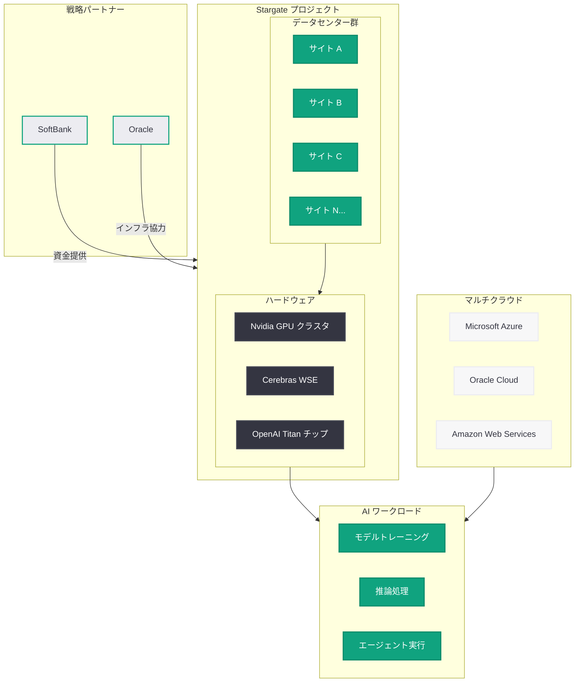
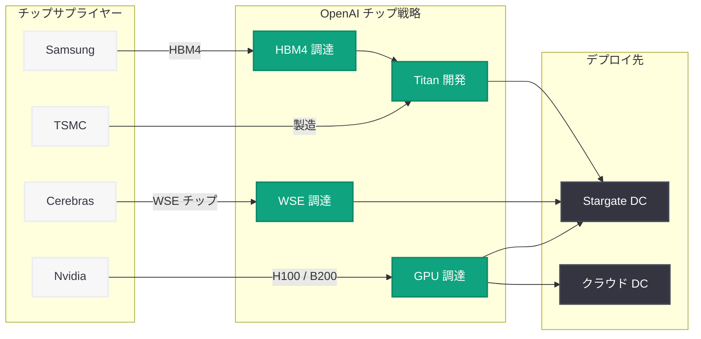
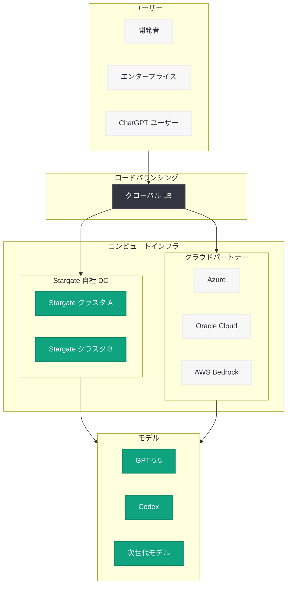

# OpenAI、Stargate プロジェクトを拡大し「知性の時代」を支えるコンピュートインフラを構築

## メタデータ

| 項目 | 内容 |
|------|------|
| 発表日 | 2026-04-29 |
| ソース | OpenAI News |
| カテゴリ | インフラストラクチャ / 企業戦略 |
| 公式リンク | [Building the compute infrastructure for the Intelligence Age](https://openai.com/index/building-the-compute-infrastructure-for-the-intelligence-age) |

> **注記:** 本レポートは、OpenAI 公式ブログの RSS フィード情報および関連する公開情報に基づいて作成されている。元記事の全文はアクセス制限により取得できなかったため、公開されている情報に基づく内容となっている。正確な詳細については公式ページを参照されたい。

## 概要

OpenAI は 2026 年 4 月 29 日、「Building the compute infrastructure for the Intelligence Age (知性の時代のためのコンピュートインフラ構築)」と題したブログ記事を公開し、Stargate プロジェクトのスケールアップによる大規模データセンター容量の新規追加を発表した。同社は AGI (汎用人工知能) の実現に向けて増大する AI 需要に対応するため、米国内で複数のデータセンターを新設・拡張する計画を推進している。

本発表は、OpenAI がここ数か月にわたって展開してきたインフラ戦略の転換点に位置するものである。2026 年 3 月 22 日に報じられたデータセンター投資の縮小方針からの再拡大、4 月 5 日に CFO が認めたコンピュート不足の解消に向けた具体的な施策、そして 4 月 10 日に報じられた Stargate チームの主要幹部 3 名の Meta への流出後における組織再建の成果を示すものと位置付けられる。SoftBank、Oracle をはじめとするパートナーとの協業を通じ、OpenAI は「知性の時代 (Intelligence Age)」の基盤となるコンピュートインフラの確立を目指す。

## 主な内容

### Stargate プロジェクトの拡大

Stargate は、OpenAI と SoftBank が中心となって推進する米国内の大規模 AI データセンター構想である。本プロジェクトは、AGI の開発と運用に必要な膨大な計算資源を確保するために設計されており、総投資額は数千億ドル規模に達するとされている。

今回の発表では、Stargate プロジェクトのスケールアップが明確に打ち出された。主な進展は以下の通りである。

- **データセンター容量の新規追加:** 増大する AI 需要に対応するため、新たなデータセンター容量が追加される
- **米国内での展開加速:** 米国各地に複数のデータセンター拠点を展開し、地理的な分散と冗長性を確保
- **AGI 開発の計算基盤:** フロンティアモデルのトレーニングおよび大規模推論処理に必要なコンピュートリソースを確保
- **「知性の時代」のインフラ:** OpenAI が提唱する Intelligence Age (知性の時代) を実現するための物理的基盤として位置付け

### データセンターの新規展開

OpenAI の Stargate プロジェクトは、米国内における複数のデータセンターサイトの開発を含む。これは単なるサーバーラックの追加ではなく、AI ワークロードに特化した次世代のデータセンター設計を採用した大規模施設群の新設である。

#### 立地戦略

Stargate のデータセンターは、以下の要素を考慮した立地選定がなされている。

| 要素 | 詳細 |
|------|------|
| 電力供給 | 安定的かつ大容量の電力供給が可能な地域を優先 |
| 冷却効率 | 気候条件を活用した冷却コスト最適化 |
| 通信インフラ | 低レイテンシの光ファイバーネットワークへのアクセス |
| 人材確保 | データセンター運用人材の確保が容易な地域 |
| 規制環境 | データセンター建設に対する規制が整備された州 |

#### 電力と持続可能性

AI データセンターの消費電力は急速に増加しており、Stargate プロジェクトにおける電力確保は最重要課題の一つである。大規模言語モデルのトレーニングには数十 MW から数百 MW 規模の電力が必要とされ、複数のデータセンターを同時運用する場合、GW 級の電力インフラが求められる。

### パートナーシップとサプライチェーン

Stargate プロジェクトは OpenAI 単独の取り組みではなく、複数の戦略的パートナーとの協業により推進されている。

#### 主要パートナー

| パートナー | 役割 | 関与形態 |
|-----------|------|----------|
| SoftBank | 資金提供、共同推進 | 合弁パートナー |
| Oracle | クラウドインフラ、データセンター | インフラパートナー |
| Microsoft | Azure 統合、既存インフラ | 戦略的パートナー |
| Cerebras | AI 推論チップ供給 | チップサプライヤー |
| Samsung | HBM4 メモリ供給 | メモリサプライヤー |

#### SoftBank との連携

SoftBank は Stargate プロジェクトの最も重要な共同推進者であり、数千億ドル規模の資金提供を通じてプロジェクトのスケールアップを支えている。SoftBank の孫正義氏は AI インフラへの大規模投資を戦略の中核に据えており、Stargate は SoftBank Vision Fund の代表的な投資先の一つとなっている。

#### Oracle の役割

Oracle Cloud Infrastructure (OCI) は、OpenAI のクラウドインフラパートナーとして Stargate プロジェクトに深く関与している。2026 年 4 月 27 日に発表された Microsoft-OpenAI パートナーシップ契約改定により、OpenAI は Azure 以外のクラウドプロバイダーへのモデル提供が可能となった。Oracle は OpenAI のマルチクラウド戦略における重要な柱の一つである。

### AGI 開発に向けた計算リソース戦略

OpenAI は AGI の実現に向けて、計算資源の確保を最優先課題として位置付けている。2026 年 4 月 5 日に同社の CFO が「コンピュート不足により事業機会を見送っている」と発言したことは、需要と供給のギャップの深刻さを物語っている。

#### コンピュート需要の増大要因

OpenAI におけるコンピュート需要の急増は、複数の要因によるものである。

1. **フロンティアモデルのトレーニング:** GPT-5.5 に続く次世代モデルの開発には、前世代を大幅に上回る計算資源が必要
2. **推論需要の爆発的増加:** ChatGPT のユーザー数拡大、Codex のエンタープライズ展開、API 利用の増加により、推論ワークロードが急増
3. **マルチモーダル処理:** 画像生成、音声処理、動画理解など、テキスト以外のモダリティ処理には追加の計算資源が必要
4. **エージェント型 AI:** Codex や Managed Agents など、自律的に長時間動作するエージェント型 AI は、従来の API 呼び出しと比較して桁違いの計算資源を消費

#### 計算資源確保の多角化

OpenAI は Nvidia GPU への一極集中依存から脱却するため、計算資源の調達先を多角化する戦略を推進している。

- **Nvidia GPU:** H100、B200 などの高性能 GPU を引き続き大量調達
- **Cerebras WSE:** 200 億ドル超の契約に基づき、AI 推論特化型の Wafer-Scale Engine チップを調達
- **自社チップ Titan:** Samsung の HBM4 を搭載した自社設計カスタムチップの開発を推進
- **クラウドパートナー:** Microsoft Azure、Oracle Cloud、AWS から計算資源をオンデマンドで確保

## 技術的な詳細

### チップ戦略とハードウェアアーキテクチャ

OpenAI の Stargate データセンターは、複数の AI アクセラレータを組み合わせたヘテロジニアスなコンピュートアーキテクチャを採用している。

#### Nvidia GPU クラスタ

Stargate の基幹計算資源として、Nvidia の最新世代 GPU が大量に導入されている。

| GPU | 用途 | 特徴 |
|-----|------|------|
| H100 | モデルトレーニング、推論 | 80 GB HBM3、3.35 TB/s メモリ帯域 |
| B200 | 次世代トレーニング | Blackwell アーキテクチャ、HBM3E 搭載 |
| GB200 NVL72 | 超大規模クラスタ | 72 GPU を NVLink で接続 |

#### Cerebras Wafer-Scale Engine

2026 年 4 月 17 日に締結された 200 億ドル超の契約に基づき、Cerebras の WSE チップが Stargate データセンターの AI 推論処理に導入される。

- **ウェーハスケール設計:** シリコンウェーハ全体を 1 枚のチップとして使用
- **オンチップ SRAM:** 大容量の SRAM により外部メモリアクセスのボトルネックを解消
- **低レイテンシ推論:** LLM の推論処理において従来の GPU 比で大幅な低レイテンシを実現
- **エネルギー効率:** 推論ワークロードにおいて高い電力効率を達成

#### OpenAI カスタムチップ「Titan」

OpenAI 初のカスタム AI チップ「Titan」は、Samsung の HBM4 メモリを搭載し、OpenAI のワークロードに完全最適化された設計を採用している。

| 仕様 | 詳細 |
|------|------|
| メモリ | Samsung HBM4 (帯域幅 1.5 TB/s 以上) |
| 設計思想 | OpenAI のモデルアーキテクチャに特化 |
| 主な用途 | トレーニングおよび推論の両方 |
| 量産時期 | 2026 年後半から段階的に投入予定 |

### データセンターネットワーキング

Stargate データセンター間の接続には、高帯域幅・低レイテンシのネットワークインフラが構築されている。

- **データセンター間接続:** 400 Gbps 以上の光ファイバーリンクによるデータセンター間通信
- **GPU クラスタ内接続:** NVLink および InfiniBand による超高速ノード間通信
- **ユーザーアクセス:** 各データセンターからのマルチリージョン配信による低レイテンシ API 提供
- **冗長性:** 複数のネットワークパスによる可用性の確保

### マルチクラウド統合アーキテクチャ

2026 年 4 月 28 日に発表された AWS とのパートナーシップ拡大に象徴されるように、OpenAI はマルチクラウド戦略を本格的に展開している。Stargate の自社データセンターと各クラウドプロバイダーのインフラを組み合わせたハイブリッドアーキテクチャにより、柔軟なリソース配分と可用性の最大化を実現する。

## アーキテクチャ

### Stargate インフラストラクチャ全体像

### チップ供給エコシステム

### マルチクラウド配信アーキテクチャ

## 開発者への影響

Stargate プロジェクトの拡大は、OpenAI API を利用する開発者に以下の直接的な恩恵をもたらすと考えられる。

- **API 応答速度の向上:** データセンター容量の増加により、推論処理のキューイング時間が短縮され、API のレイテンシが改善される見込み
- **レート制限の緩和:** コンピュートリソースの拡充に伴い、API のレート制限 (RPM / TPM) が段階的に引き上げられる可能性がある
- **可用性の向上:** 複数データセンターへの地理的分散により、障害時のフェイルオーバーが強化され、サービスの可用性が向上する
- **新モデルへのアクセス:** 十分なコンピュートリソースの確保により、次世代モデルのリリース頻度や同時利用可能なモデル数が増加する可能性がある
- **マルチクラウド対応:** AWS、Azure、Oracle Cloud のいずれからでも OpenAI モデルにアクセスでき、既存のクラウドインフラとの統合が容易になる
- **エンタープライズ対応の強化:** データレジデンシー要件への対応、専用インスタンスの提供など、エンタープライズ向けオプションの拡充が期待される
- **Codex エージェントのスケーラビリティ:** コンピュートリソースの増加により、Codex エージェントの同時実行数やタスク処理能力が向上する
- **コスト最適化の可能性:** インフラの効率化とスケールメリットにより、長期的には API 利用料金の引き下げにつながる可能性がある

### 短期的な影響 (2026 年下半期)

- データセンターの新規稼働に伴う段階的なキャパシティ増加
- 一部リージョンでの API レイテンシ改善
- AWS Bedrock 経由での OpenAI モデル利用開始 (4 月 28 日発表済み)

### 中長期的な影響 (2027 年以降)

- Titan チップの本格稼働による推論コストの大幅削減
- Cerebras WSE によるリアルタイム推論能力の飛躍的向上
- マルチクラウド環境での統一的なモデルアクセス基盤の確立
- AGI 級モデルの開発・提供を可能にするコンピュート基盤の完成

## 時系列: OpenAI インフラ戦略の変遷

OpenAI のインフラ戦略は 2026 年に入り急速に変化している。本発表の文脈を理解するため、関連する出来事を時系列で整理する。

| 日付 | 出来事 | 意味合い |
|------|--------|----------|
| 2026-03-21 | Samsung HBM4 の OpenAI Titan チップ向け供給が判明 | 自社チップ開発の本格化 |
| 2026-03-22 | データセンター投資縮小、Nvidia 契約見直しが報道 | IPO に向けた財務規律重視への転換 |
| 2026-03-31 | 1,220 億ドルの資金調達完了 | 史上最大規模の AI 投資資金確保 |
| 2026-04-05 | CFO がコンピュート不足を認める | 需要と供給のギャップの深刻さが顕在化 |
| 2026-04-10 | Stargate 主要幹部 3 名が Meta へ移籍 | インフラチームの再編が必要に |
| 2026-04-17 | Cerebras と 200 億ドル超のチップ契約締結 | Nvidia 依存脱却、推論チップの多角化 |
| 2026-04-27 | Microsoft パートナーシップ契約改定 | マルチクラウド戦略の法的基盤確立 |
| 2026-04-28 | OpenAI モデルが AWS に展開 | マルチクラウド戦略の実行開始 |
| 2026-04-29 | Stargate スケールアップ発表 (本記事) | コンピュートインフラの本格拡充 |

この時系列から読み取れるのは、OpenAI が 3 月下旬のデータセンター投資縮小報道から約 1 か月で方針を再調整し、Stargate プロジェクトの再加速に踏み切ったという戦略的な転換である。CFO によるコンピュート不足の公表 (4 月 5 日) が示したように、財務規律と計算資源確保のバランスを再検討した結果、やはり大規模インフラ投資が不可避であるとの結論に至ったものと考えられる。

## 業界への影響

### AI インフラ投資競争の激化

OpenAI の Stargate 拡大は、AI インフラ投資競争の新たなフェーズの幕開けを告げるものである。

- **Google:** TPU v6 (Trillium) の大規模展開と自社データセンターの拡張を継続
- **Meta:** OpenAI の Stargate 幹部 3 名を引き抜き、自社 AI インフラを積極強化
- **Microsoft:** OpenAI の独占契約解消後も Azure インフラの拡充を継続し、自社モデル開発にも投資
- **Amazon:** AWS Bedrock への OpenAI モデル統合により、AI クラウド市場での存在感を強化

### 半導体サプライチェーンへの影響

OpenAI の大規模なチップ需要は、半導体サプライチェーン全体に波及効果をもたらす。

- **Nvidia:** OpenAI からの大口需要は継続するものの、Cerebras や Titan チップへの分散により独占的な地位は徐々に希薄化
- **Cerebras:** 200 億ドル契約に基づく量産体制の確立が課題。IPO に向けた追い風
- **Samsung:** HBM4 の量産能力が OpenAI の Titan チップ展開スケジュールを左右
- **TSMC:** OpenAI Titan チップの製造パートナーとして、先端プロセスの生産枠確保が重要

## 関連リンク

- [Building the compute infrastructure for the Intelligence Age](https://openai.com/index/building-the-compute-infrastructure-for-the-intelligence-age) - 本記事の公式ページ
- [OpenAI モデル、Codex、Managed Agents が AWS に到来](2026-04-28-openai-models-codex-managed-agents-aws.md) - マルチクラウド戦略の実行
- [Microsoft-OpenAI パートナーシップ契約改定](2026-04-27-microsoft-openai-partnership-amendment.md) - マルチクラウド化の法的基盤
- [OpenAI が Cerebras と 200 億ドル超のチップ供給契約を締結](2026-04-17-openai-cerebras-20b-chip-deal.md) - チップ供給の多角化
- [OpenAI Stargate 主要リーダー 3 名が Meta へ移籍](2026-04-10-stargate-leaders-depart-for-meta.md) - Stargate チームの変動
- [OpenAI CFO、コンピュート不足により事業機会を見送り](2026-04-05-openai-cfo-compute-constraints.md) - コンピュート需給ギャップの顕在化
- [OpenAI、データセンター投資を縮小し Nvidia 契約を見直し](2026-03-22-openai-datacenter-pivot-nvidia-ipo.md) - IPO 前の戦略転換
- [Samsung、OpenAI Titan チップ向け HBM4 供給](2026-03-21-samsung-hbm4-openai-titan-chip.md) - 自社チップの進展

## まとめ

OpenAI が発表した「知性の時代のためのコンピュートインフラ構築」は、同社のインフラ戦略における重要なマイルストーンである。Stargate プロジェクトのスケールアップにより、AGI 開発に必要な膨大なコンピュートリソースの確保を目指す OpenAI の姿勢が明確に示された。

本発表の重要なポイントは以下の 3 点に集約される。

1. **Stargate の再加速:** 3 月のデータセンター投資縮小報道から約 1 か月で方針を再調整し、大規模インフラ投資を再び前面に打ち出した。CFO が認めたコンピュート不足を解消するための具体的な行動である
2. **ヘテロジニアスなチップ戦略:** Nvidia GPU、Cerebras WSE、自社 Titan チップを組み合わせた多角的なハードウェアアーキテクチャにより、特定サプライヤーへの依存リスクを低減しつつ性能を最大化する
3. **マルチクラウドとの両立:** 自社データセンター (Stargate) と複数のクラウドパートナー (Azure、Oracle Cloud、AWS) を組み合わせたハイブリッドインフラにより、柔軟性と可用性を両立する戦略を確立

AI 開発者にとっては、コンピュートリソースの拡充に伴う API パフォーマンスの向上、マルチクラウド環境での利便性向上、そして長期的なコスト最適化が期待される。OpenAI の「知性の時代」構想が現実のインフラとして形を成しつつある本発表は、AGI に向けた同社のコミットメントの強さを改めて示すものである。

> **免責事項:** 本レポートは OpenAI 公式ブログの RSS フィード情報、関連する報道および過去のレポートに基づいて作成されている。元記事の全文はアクセス制限により取得できなかったため、一部推測を含む可能性がある。投資判断や事業判断には、必ず公式ソースおよび最新情報を参照されたい。
