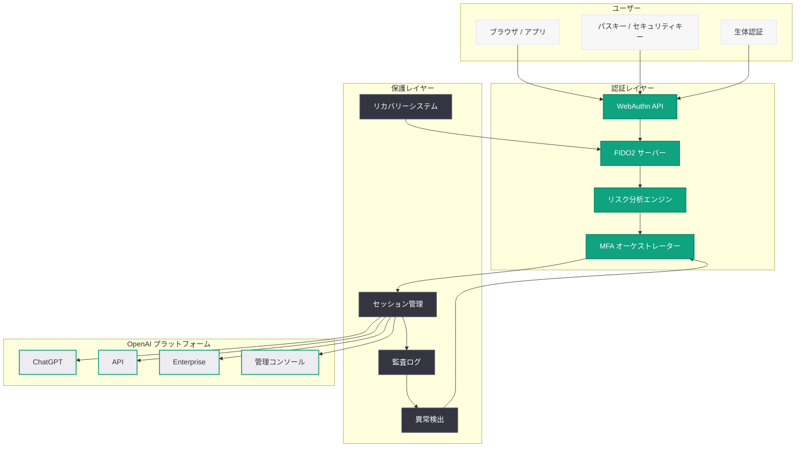
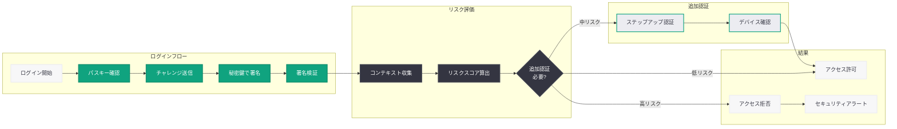

# OpenAI Advanced Account Security の導入: フィッシング耐性認証とアカウント保護の強化

## メタデータ

| 項目 | 内容 |
|------|------|
| 発表日 | 2026-04-30 |
| ソース | OpenAI News (Product) |
| カテゴリ | セキュリティ / アカウント保護 |
| 公式リンク | [Introducing Advanced Account Security](https://openai.com/index/advanced-account-security) |

> **注記:** 本レポートは、OpenAI 公式ブログの RSS フィード情報および関連する公開情報に基づいて作成されている。元記事の全文はアクセス制限により取得できなかったため、公開されている情報に基づく内容となっている。正確な詳細については公式ページを参照されたい。

## 概要

OpenAI は 2026 年 4 月 30 日、「Advanced Account Security」を発表した。これは、フィッシング耐性ログイン、より強力なリカバリー、および拡張保護を含む包括的なアカウントセキュリティ機能群であり、機密データの保護とアカウント乗っ取りの防止を目的としている。

この発表は、2026 年 4 月を通じて OpenAI が展開してきた一連のセキュリティ強化施策の一環として位置付けられる。Enterprise や API の利用者が急速に拡大する中、個々のアカウントレベルでのセキュリティ強化は、プラットフォーム全体の信頼性を支える基盤として不可欠なものである。従来のパスワードや SMS OTP に依存した認証から、パスキーや FIDO2 ベースのフィッシング耐性認証への移行は、現代のサイバー脅威環境において極めて重要なステップといえる。

## 主な内容

### フィッシング耐性認証 (Phishing-Resistant Login)

フィッシング攻撃は、アカウント乗っ取りの最も一般的な手法の 1 つである。従来のパスワードベースの認証は、巧妙なフィッシングサイトやソーシャルエンジニアリングにより容易に突破される。SMS OTP も SIM スワップ攻撃やリアルタイムフィッシングプロキシにより安全とは言えなくなっている。

Advanced Account Security で導入されるフィッシング耐性認証は、以下の特徴を持つと考えられる。

- **パスキー (Passkeys) のサポート:** FIDO2/WebAuthn 標準に準拠したパスキーによる認証。デバイスに保存された秘密鍵を使用し、フィッシングサイトでは認証が成立しない仕組み
- **ハードウェアセキュリティキー対応:** YubiKey 等の FIDO2 対応ハードウェアキーによる物理的な認証手段のサポート
- **オリジン検証:** WebAuthn プロトコルによるオリジン (ドメイン) の自動検証により、正規サイト以外での認証試行を技術的に不可能にする
- **パスワードレス認証への移行パス:** 従来のパスワード + MFA から、パスキーのみでの完全なパスワードレス認証への段階的な移行を支援

### リカバリー強化 (Stronger Recovery)

アカウントリカバリーは、セキュリティにおいて最も脆弱なポイントの 1 つである。攻撃者がリカバリーフローを悪用し、正当なユーザーのアカウントを奪取するケースが後を絶たない。

強化されたリカバリーメカニズムには、以下の要素が含まれると推測される。

- **ソーシャルエンジニアリング耐性:** カスタマーサポートを介したリカバリーにおいて、なりすましを防止するための追加検証ステップの導入
- **複数のリカバリーパスの設定:** 単一のリカバリー手段に依存せず、複数の検証手段を組み合わせた階層的なリカバリーフローの実装
- **リカバリーコードの強化:** バックアップコードの生成・管理方法の改善。暗号学的に安全な方法でのコード生成と保管ガイダンスの提供
- **冷却期間 (Cooling-off Period) の導入:** リカバリーリクエスト後に一定の待機期間を設け、正当なアカウント所有者が不正なリカバリーに気づく機会を確保
- **信頼できるデバイスの活用:** 過去に認証済みのデバイスからのリカバリー確認により、未知のデバイスからの不正なリカバリーを防止

### 拡張保護 (Enhanced Protections)

機密データの保護とアカウント乗っ取り防止のための追加セキュリティ層として、以下の機能が導入されると考えられる。

- **セッション管理の強化:** アクティブなセッションの可視化、不審なセッションの自動検出と強制終了、地理的に異常なログインの検知
- **API キーのセキュリティ強化:** API キーの権限スコープの細分化、有効期限の設定、使用状況の監視とアラート機能
- **アカウントアクティビティの監査ログ:** セキュリティに関連する全てのイベント (ログイン、設定変更、API キー生成等) の詳細な監査ログとリアルタイム通知
- **高度な異常検出:** 機械学習ベースの行動分析により、通常のユーザーパターンから逸脱するアクティビティを検出し、自動的に追加認証を要求
- **IP アドレスのホワイトリスト:** Enterprise ユーザー向けに、許可された IP アドレスからのみアクセスを許可する機能

### Enterprise および API ユーザーへの影響

Enterprise と API の利用拡大に伴い、アカウントセキュリティの重要性は飛躍的に高まっている。1 つのアカウントの侵害が、組織全体のデータ漏洩や大規模なAPI クレジットの不正利用につながるリスクがある。

- **Enterprise アカウント管理:** 組織管理者によるセキュリティポリシーの一括設定。パスキーの強制適用、最小権限の原則に基づくアクセス制御
- **API キーのローテーション:** 定期的なキーローテーションの自動化と通知。旧キーの段階的な無効化によるダウンタイムの防止
- **組織レベルの監査:** 組織内全メンバーのセキュリティ状態の可視化ダッシュボードと、コンプライアンス要件に基づくレポート生成
- **SSO/SAML 連携の強化:** 既存の ID プロバイダー (Okta、Azure AD、Google Workspace 等) との連携においても、フィッシング耐性認証の恩恵を受けられる構成

## 技術的な詳細

### パスキーと FIDO2/WebAuthn

パスキー (Passkeys) は、FIDO Alliance と W3C が策定した WebAuthn (Web Authentication) 標準に基づく認証技術である。

| 技術要素 | 説明 |
|----------|------|
| WebAuthn | W3C 標準の Web 認証 API。ブラウザとサーバー間の認証プロトコル |
| FIDO2 | FIDO Alliance が策定した認証フレームワーク。WebAuthn + CTAP2 で構成 |
| CTAP2 | Client to Authenticator Protocol。外部認証器との通信プロトコル |
| パスキー | FIDO2 ベースのクレデンシャル。デバイス間同期が可能 |

#### 認証フローの概要

1. **登録 (Registration):** ユーザーがパスキーを登録する際、デバイスは公開鍵ペアを生成し、公開鍵をサーバーに送信。秘密鍵はデバイスのセキュアエレメントに保存される
2. **認証 (Authentication):** サーバーがチャレンジを送信し、デバイスが秘密鍵で署名。サーバーは公開鍵で署名を検証する
3. **オリジン検証:** WebAuthn プロトコルにより、認証リクエストのオリジン (ドメイン) が自動的に検証される。フィッシングサイトのドメインでは認証が技術的に不可能

### MFA (多要素認証) の階層

Advanced Account Security では、複数の認証要素を組み合わせた多層的な認証が実装されると考えられる。

| 認証要素 | 具体例 | セキュリティレベル |
|----------|--------|-------------------|
| 所持要素 (Something you have) | パスキー、ハードウェアキー、認証アプリ | 高 |
| 知識要素 (Something you know) | パスワード、PIN、リカバリーコード | 中 |
| 生体要素 (Something you are) | 指紋、顔認証 (デバイス側) | 高 |

### セッションセキュリティ

- **トークンバインディング:** セッショントークンをデバイスの暗号鍵にバインドし、トークンの盗用によるセッションハイジャックを防止
- **短命トークン:** アクセストークンの有効期限を短縮し、リフレッシュトークンによる定期的な再認証を強制
- **リスクベース認証:** ログインコンテキスト (デバイス、ネットワーク、地理情報、行動パターン) に基づいてリスクスコアを算出し、必要に応じて追加認証を要求

## アーキテクチャ

### Advanced Account Security 全体像

### 認証フロー

## 開発者への影響

### API 開発者への影響

- **API キー管理の変更:** API キーの生成・管理フローにパスキー認証が必須化される可能性がある。セキュリティが強化される一方、自動化スクリプトからのキー管理にはサービスアカウントやトークンベースの認証が必要になる場合がある
- **セッション管理の厳格化:** ダッシュボードや Playground へのアクセスにおいて、セッションの有効期限短縮や追加認証要求が増加する可能性がある
- **Webhook 通知:** セキュリティイベント (不審なアクセス試行、キーの使用異常等) に対するリアルタイム通知のための Webhook エンドポイントの設定が可能になると考えられる

### Enterprise 管理者への影響

- **セキュリティポリシーの強制適用:** 組織内の全メンバーに対して、パスキーの登録や MFA の有効化を必須とするポリシー設定が可能になる
- **コンプライアンスレポート:** SOC 2、ISO 27001 等のコンプライアンス要件に対応した監査ログとレポートの自動生成
- **インシデント対応:** アカウント侵害の疑いがある場合の即座のアクセス停止、セッション無効化、リカバリーフローの管理者による制御

### ChatGPT ユーザーへの影響

- **認証体験の向上:** パスキーによるワンタップ認証で、パスワード入力なしの迅速なログインが可能になる
- **セキュリティ通知:** 新しいデバイスからのログイン、設定変更等のセキュリティイベントに対する即時通知
- **データ保護の強化:** 会話履歴やカスタム指示等の機密データが、より強固な認証によって保護される

## 関連リンク

### OpenAI セキュリティ関連発表 (2026 年 4 月)

- [Advanced Account Security](https://openai.com/index/advanced-account-security) - 本記事 (2026-04-30)
- [Cybersecurity in the Intelligence Age](https://openai.com/index/cybersecurity-in-the-intelligence-age) - インテリジェンス時代のサイバーセキュリティ (2026-04-29)
- [GPT-5.4-Cyber Limited Release](https://openai.com/index/gpt-5-4-cyber) - GPT-5.4-Cyber 限定リリース (2026-04-24)
- [Accelerating the cyber defense ecosystem](https://openai.com/index/accelerating-cyber-defense-ecosystem) - サイバー防衛エコシステム加速 (2026-04-16)
- [Trusted access for the next era of cyber defense](https://openai.com/index/scaling-trusted-access-for-cyber-defense) - Trusted Access プログラム拡大 (2026-04-14)

### プラットフォームセキュリティ関連

- [ChatGPT Pro / Codex Plan](https://openai.com/index/chatgpt-pro-codex-plan) - $100/月プラン・Mac セキュリティ必須アップデート (2026-04-11)
- [OpenAI セキュリティポータル](https://trust.openai.com/) - OpenAI Trust Center

### 関連レポート (本リポジトリ)

- [インテリジェンス時代のサイバーセキュリティ](./2026-04-29-cybersecurity-intelligence-age.md)
- [GPT-5.4-Cyber の限定リリース](./2026-04-24-gpt-5-4-cyber-limited-release.md)
- [サイバー防衛エコシステムの加速](./2026-04-16-accelerating-cyber-defense-ecosystem.md)
- [Trusted Access プログラムの拡大](./2026-04-14-scaling-trusted-access-cyber-defense.md)

## よくある質問 (FAQ)

### Q1: パスキーを設定しない場合、既存のパスワード認証は引き続き利用できるか?

現時点では、パスキーへの即座の完全移行が強制されるとは考えにくい。多くのサービスと同様に、段階的な移行アプローチが取られると推測される。ただし、Enterprise プランでは組織管理者がパスキー必須のポリシーを設定できるようになる可能性がある。一般ユーザーについても、将来的にはパスキーが推奨認証方式として位置付けられることが予想される。

### Q2: API の自動化ワークフローに影響はあるか?

API キー自体の利用方法 (Bearer トークンとしてのリクエストヘッダーへの付加) は変更されないと考えられる。影響があるのは、API キーの生成・管理・ローテーションといったダッシュボード操作である。これらの操作にパスキー認証が要求される場合、自動化されたキー管理フローにはサービスアカウントや管理用 API トークンの利用が必要になる可能性がある。

### Q3: リカバリー手段をすべて失った場合のアカウント復旧は可能か?

詳細は公式ドキュメントを確認する必要があるが、一般的にフィッシング耐性認証を提供するサービスでは、複数のリカバリー手段 (バックアップパスキー、リカバリーコード、信頼できるデバイス) の事前登録を強く推奨している。すべてのリカバリー手段を失った場合の復旧プロセスは、本人確認に追加の時間と手順が必要になると考えられる。

### Q4: この機能は ChatGPT 無料ユーザーにも提供されるか?

RSS の説明文には対象ユーザーの限定に関する言及がないため、基本的なフィッシング耐性認証 (パスキーサポート) は全ユーザーに提供される可能性が高い。ただし、高度な監査ログ、IP ホワイトリスト、組織レベルのポリシー管理等の Enterprise 向け機能は、有料プランに限定される可能性がある。

## まとめ

OpenAI の Advanced Account Security は、フィッシング耐性ログイン、強化されたリカバリー、拡張保護という 3 つの柱で構成される包括的なアカウントセキュリティ強化施策である。パスキー/FIDO2 ベースの認証、ソーシャルエンジニアリング耐性のあるリカバリーフロー、機械学習による異常検出を組み合わせることで、現代のサイバー脅威に対する多層的な防衛を実現する。

2026 年 4 月に OpenAI が展開してきた一連のサイバーセキュリティ施策 (Trusted Access プログラム、エコシステム加速、GPT-5.4-Cyber、インテリジェンス時代のサイバーセキュリティ) の文脈において、本発表はプラットフォームの「基盤」となるユーザーアカウントのセキュリティを強化するものとして位置付けられる。AI が企業の業務プロセスに深く組み込まれる時代において、AI プラットフォームのアカウントセキュリティは、従来の Web サービスのそれ以上に重要な意味を持つ。

Enterprise や API の利用拡大に伴い、OpenAI のアカウントに紐づく機密データ (会話履歴、カスタム設定、API キー、課金情報) の保護は事業継続性に直結する。Advanced Account Security の導入は、OpenAI がプラットフォームの信頼性と安全性を最優先事項として位置付けていることを明確に示している。

> **免責事項:** 本レポートは RSS フィードの説明文および関連する公開情報に基づいて作成されている。具体的な機能の詳細、提供時期、対象プランについては、OpenAI 公式ページを参照されたい。
