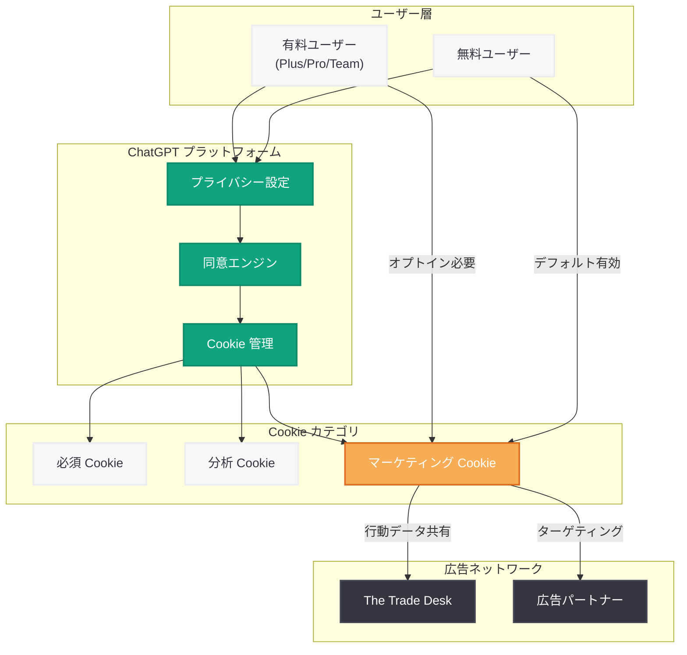

# OpenAI が無料版 ChatGPT ユーザーに対しマーケティング Cookie をデフォルトで有効化

## メタデータ

| 項目 | 内容 |
|------|------|
| 発表日 | 2026-05-01 |
| ソース | OpenAI News (Third-party coverage: WIRED) |
| カテゴリ | プライバシー / 製品アップデート |
| 公式リンク | [WIRED 記事](https://www.wired.com/story/openai-enables-marketing-cookies-by-default-for-free-chatgpt-users/) |

## 概要

OpenAI は 2026 年 5 月 1 日、無料版 ChatGPT ユーザーに対するマーケティング Cookie の設定をデフォルトで有効 (オプトイン済み) に変更した。従来、マーケティングおよび広告目的の Cookie は明示的なユーザーの同意 (オプトイン) を必要としていたが、今回の変更により無料ティアのユーザーには自動的に有効化される。ユーザーは設定画面から手動でオプトアウトすることは引き続き可能である。

この変更は、OpenAI が 2026 年初頭から本格化している広告収益モデルの拡大戦略と密接に関連している。無料ユーザーの行動データを広告パートナーと共有することで、無料サービスの持続可能性を高める狙いがあるとみられる。一方で、プライバシー擁護団体や一部ユーザーからは、デフォルト設定の変更がユーザーの自律的な選択を損なうとの批判が出ている。

## 主な内容

### Cookie 設定の変更点

今回の変更における主要なポイントは以下の通りである。

| 項目 | 変更前 | 変更後 |
|------|--------|--------|
| マーケティング Cookie | オプトイン (デフォルト無効) | オプトアウト (デフォルト有効) |
| 対象ユーザー | - | 無料版 ChatGPT ユーザー |
| 有料ユーザー (Plus/Pro/Team) | オプトイン | 変更なし (オプトインのまま) |
| オプトアウト手段 | - | 設定画面から手動で無効化可能 |

### 影響を受けるデータの種類

マーケティング Cookie がデフォルトで有効化されることにより、以下のデータが広告目的で利用される可能性がある。

- **閲覧行動データ:** ChatGPT 上でのセッション情報、利用パターン
- **興味関心プロファイル:** ユーザーの入力傾向から推定されるインタレストカテゴリ
- **デバイス情報:** ブラウザ、OS、画面解像度などの技術的識別子
- **サードパーティ連携:** 広告ネットワークとのデータ共有

### OpenAI の広告戦略との関連

本変更は、OpenAI が 2026 年に入ってから段階的に進めている広告事業の一環として位置付けられる。

- **2026 年 3 月:** ChatGPT への広告表示を米国市場で本格展開 (参照: 2026-03-21-chatgpt-ads-expansion-us.md)
- **2026 年 3 月:** The Trade Desk との広告パートナーシップ締結 (参照: 2026-03-22-openai-trade-desk-ad-partnership.md)
- **2026 年 3 月:** Meta 広告部門幹部の採用 (参照: 2026-03-23-openai-hires-meta-ad-exec.md)
- **2026 年 5 月:** 無料ユーザー向けマーケティング Cookie のデフォルト有効化 (本件)

## 技術的な詳細

### Cookie の分類と動作

ChatGPT における Cookie は以下のカテゴリに分類されている。

| カテゴリ | 目的 | デフォルト状態 |
|---------|------|---------------|
| 必須 Cookie | サービスの基本動作に必要 | 常に有効 (無効化不可) |
| 分析 Cookie | サービス改善のための利用統計 | 有効 |
| マーケティング Cookie | 広告配信・効果測定 | **無料ユーザー: 有効** / 有料ユーザー: 無効 |

### オプトアウト手順

ユーザーは以下の手順でマーケティング Cookie を無効化できる。

1. ChatGPT にログイン
2. 設定 (Settings) を開く
3. プライバシー (Privacy) セクションに移動
4. 「マーケティング Cookie」のトグルを無効にする

### プライバシーポリシーとの関係

OpenAI のプライバシーポリシーでは、Cookie の使用目的とユーザーの選択権について記載されている。今回の変更はプライバシーポリシー自体の改定を伴うものではないが、デフォルト設定の変更により実質的なデータ収集範囲が拡大する。GDPR や CCPA などの規制との適合性については、ユーザーがオプトアウト可能である点を根拠として合法性を主張しているとみられる。

## アーキテクチャ

## 開発者への影響

- **API ユーザーへの直接的影響はなし:** 本変更は ChatGPT の Web/アプリインターフェースにおける Cookie 設定に限定されており、API 経由でのアクセスには影響しない
- **OAuth 連携アプリの考慮:** ChatGPT プラグインや GPTs と連携するアプリケーションを開発している場合、ユーザーのプライバシー設定との整合性を確認する必要がある
- **プライバシーコンプライアンス:** EU 向けサービスを提供する開発者は、GDPR の同意要件 (オプトインが原則) との関係に注意が必要。OpenAI プラットフォーム上で動作するサービスにおけるデータ処理の責任範囲を確認すべきである
- **広告 SDK との統合:** OpenAI の広告エコシステムに参加する開発者にとっては、マーケティング Cookie のデフォルト有効化によりリーチが拡大する可能性がある
- **ユーザー信頼への配慮:** ChatGPT を業務で利用している企業の開発者は、社内ユーザーに対してプライバシー設定の確認を推奨する必要がある

## 関連リンク

- [WIRED: OpenAI Enables Marketing Cookies by Default for Free ChatGPT Users](https://www.wired.com/story/openai-enables-marketing-cookies-by-default-for-free-chatgpt-users/)
- [OpenAI プライバシーポリシー](https://openai.com/policies/privacy-policy)
- [ChatGPT 広告展開 (米国)](./2026-03-21-chatgpt-ads-expansion-us.md)
- [OpenAI - The Trade Desk パートナーシップ](./2026-03-22-openai-trade-desk-ad-partnership.md)
- [OpenAI Meta 広告幹部採用](./2026-03-23-openai-hires-meta-ad-exec.md)
- [OpenAI Platform ドキュメント](https://platform.openai.com/docs)

## まとめ

OpenAI は無料版 ChatGPT ユーザーに対してマーケティング Cookie をデフォルトで有効化するという、プライバシー設定の重要な変更を実施した。これは同社の広告収益モデル拡大の一環であり、The Trade Desk とのパートナーシップや広告表示の本格展開と軌を一にする動きである。

ユーザーはオプトアウト可能であるものの、デフォルト設定の変更は「選択しない限り追跡される」状態を生み出すため、プライバシーの観点からは後退と評価される。特に GDPR が適用される地域では、オプトアウト方式の適法性について今後議論が生じる可能性がある。

API 開発者への直接的な影響は限定的だが、ChatGPT エコシステム上でサービスを構築する開発者は、ユーザーのプライバシー期待値の変化に注意を払い、自社サービスにおけるデータ処理の透明性を確保することが重要である。
