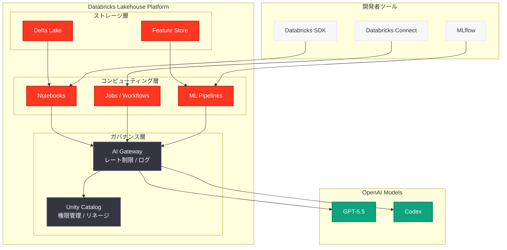

# OpenAI GPT-5.5 と Codex が Databricks 上で完全ガバナンス統合として利用可能に

## メタデータ

| 項目 | 内容 |
|------|------|
| 発表日 | 2026-05-01 |
| ソース | OpenAI News (Third-party announcement: Databricks) |
| カテゴリ | パートナーシップ / 製品 |
| 公式リンク | [databricks.com/blog/openai-gpt-55-codex](https://www.databricks.com/blog/openai-gpt-55-codex) |

## 概要

2026 年 5 月 1 日、Databricks は OpenAI の最新フラッグシップモデル GPT-5.5 およびクラウドベースコーディングエージェント Codex が Databricks プラットフォーム上で完全ガバナンス統合 (fully-governed) として利用可能になったことを公式ブログで発表した。

本発表は、2026 年 4 月 28 日に発表された [OpenAI モデルの AWS 展開](2026-04-28-openai-models-codex-managed-agents-aws.md) に続くものであり、OpenAI のマルチプラットフォーム戦略がクラウドプロバイダーの枠を超え、データ分析プラットフォームにまで拡大していることを明確に示している。Databricks の Unity Catalog や AI Gateway との統合により、エンタープライズ企業はデータガバナンスを維持しながら OpenAI の最先端 AI モデルを活用できるようになった。

## 主な内容

### Databricks プラットフォームでの OpenAI モデル提供

Databricks 上で利用可能になった OpenAI モデルは以下の通りである。

| モデル | 特徴 | Databricks での主な用途 |
|--------|------|------------------------|
| GPT-5.5 | OpenAI 最新フラッグシップモデル、マルチツール統合推論 | データ分析、リサーチ、コード生成 |
| Codex | クラウドベースコーディングエージェント | ノートブック自動生成、ETL コード作成、データパイプライン構築 |

### 完全ガバナンス統合の意義

「完全ガバナンス統合」(fully-governed) とは、OpenAI モデルの利用が Databricks の既存ガバナンスフレームワークの中で完全に管理されることを意味する。具体的には以下の要素が含まれる。

- **Unity Catalog 統合:** データアクセス権限、リネージ追跡、監査ログが Unity Catalog を通じて一元管理される
- **AI Gateway によるモデルアクセス制御:** OpenAI モデルへのリクエストが AI Gateway を経由し、レート制限、コスト管理、利用状況の可視化が実現される
- **データレジデンシーの確保:** Databricks ワークスペース内でのモデル呼び出しにより、データが管理された環境内に留まる
- **監査とコンプライアンス:** すべての API 呼び出しが記録され、企業のコンプライアンス要件に対応可能

### Unity Catalog との統合

Unity Catalog は Databricks のデータガバナンスソリューションであり、OpenAI モデルとの統合により以下が実現される。

- **モデルアクセスの権限管理:** テーブルやビューと同様に、OpenAI モデルへのアクセス権限をユーザー/グループ単位で制御
- **データリネージの追跡:** OpenAI モデルがどのデータを入力として使用し、どのような出力を生成したかを追跡可能
- **コスト配分:** 部門やプロジェクトごとの OpenAI モデル利用コストを追跡・配分

### AI Gateway を通じたモデル管理

Databricks の AI Gateway は OpenAI モデルへのアクセスを仲介するプロキシレイヤーとして機能する。

- **レート制限:** ユーザーやアプリケーションごとに API コールのレート制限を設定
- **フォールバック設定:** OpenAI モデルが応答できない場合の代替モデル (Databricks 上の OSS モデル等) への自動切り替え
- **コスト制御:** 月次予算上限の設定とアラート通知
- **リクエスト/レスポンスのログ記録:** すべての通信を記録し、監査やデバッグに活用

## 技術的な詳細

### アーキテクチャ



### コードサンプル: Databricks 上での GPT-5.5 利用

Databricks ノートブックから AI Gateway を経由して GPT-5.5 を呼び出す基本的なパターンを示す。

```python
import mlflow.deployments

# Databricks AI Gateway クライアントの作成
client = mlflow.deployments.get_deploy_client("databricks")

# GPT-5.5 を利用したチャット補完
response = client.predict(
    endpoint="openai-gpt-5-5",
    inputs={
        "messages": [
            {
                "role": "system",
                "content": "You are a data analyst. Analyze the provided data and generate insights."
            },
            {
                "role": "user",
                "content": "Summarize the key trends in our Q1 2026 sales data."
            }
        ],
        "max_tokens": 2048,
        "temperature": 0.3
    }
)

print(response["choices"][0]["message"]["content"])
```

### コードサンプル: Delta Lake データと GPT-5.5 の連携

```python
import mlflow.deployments
from pyspark.sql import SparkSession

spark = SparkSession.builder.getOrCreate()

# Delta Lake からデータを取得
sales_df = spark.read.table("catalog.schema.sales_2026_q1")
summary = sales_df.describe().toPandas().to_string()

# GPT-5.5 でデータ分析
client = mlflow.deployments.get_deploy_client("databricks")

response = client.predict(
    endpoint="openai-gpt-5-5",
    inputs={
        "messages": [
            {
                "role": "system",
                "content": (
                    "You are a senior data analyst. Analyze the statistical summary "
                    "and provide actionable business insights in Japanese."
                )
            },
            {
                "role": "user",
                "content": f"以下のデータサマリーを分析してください:\n\n{summary}"
            }
        ],
        "max_tokens": 4096,
        "temperature": 0.5
    }
)

# 分析結果を Delta Lake に保存
import pandas as pd
from datetime import datetime

result_df = spark.createDataFrame([{
    "analysis_date": datetime.now().isoformat(),
    "model": "openai-gpt-5-5",
    "insight": response["choices"][0]["message"]["content"]
}])

result_df.write.mode("append").saveAsTable("catalog.schema.ai_insights")
```

### コードサンプル: MLflow によるモデル実験追跡

```python
import mlflow
import mlflow.deployments

client = mlflow.deployments.get_deploy_client("databricks")

# MLflow 実験の開始
mlflow.set_experiment("/Users/analyst/openai-gpt-5-5-evaluation")

with mlflow.start_run(run_name="gpt-5-5-data-analysis"):
    # パラメータの記録
    mlflow.log_param("model", "openai-gpt-5-5")
    mlflow.log_param("temperature", 0.3)
    mlflow.log_param("max_tokens", 2048)

    # モデル呼び出し
    response = client.predict(
        endpoint="openai-gpt-5-5",
        inputs={
            "messages": [
                {"role": "user", "content": "Analyze customer churn patterns."}
            ],
            "max_tokens": 2048,
            "temperature": 0.3
        }
    )

    # メトリクスの記録
    mlflow.log_metric("response_tokens", response.get("usage", {}).get("total_tokens", 0))
    mlflow.log_text(
        response["choices"][0]["message"]["content"],
        "output/analysis_result.txt"
    )
```

### AI Gateway エンドポイントの設定例

Databricks AI Gateway で OpenAI GPT-5.5 エンドポイントを構成する設定例を示す。

```json
{
  "name": "openai-gpt-5-5",
  "endpoint_type": "llm/v1/chat",
  "model": {
    "name": "gpt-5.5",
    "provider": "openai"
  },
  "rate_limits": [
    {
      "calls": 1000,
      "key": "user",
      "renewal_period": "minute"
    }
  ],
  "ai_gateway": {
    "usage_tracking_config": {
      "enabled": true
    },
    "guardrails": {
      "input": {
        "pii": {"behavior": "block"},
        "safety": {"behavior": "block"}
      },
      "output": {
        "pii": {"behavior": "block"}
      }
    }
  }
}
```

## 開発者への影響

### データエンジニア・データサイエンティストへの恩恵

今回の統合により、Databricks を日常的に利用するデータ専門家には以下のメリットがもたらされる。

- **既存ワークフローへのシームレスな統合:** ノートブック、ジョブ、ML パイプラインから直接 GPT-5.5 を呼び出せるため、新たなツールチェーンの導入が不要
- **データガバナンスの維持:** Unity Catalog の権限管理が適用されるため、セキュリティチームの追加承認プロセスを最小化
- **コスト可視化:** AI Gateway を通じたコスト追跡により、チームやプロジェクトごとの利用状況を正確に把握可能

### マルチクラウド環境での活用

Databricks 自体が AWS、Azure、Google Cloud 上で動作するマルチクラウドプラットフォームであるため、OpenAI モデルの利用環境がさらに拡大する。

- **クラウド非依存:** Databricks 上の同一コードが、基盤となるクラウドプロバイダーに関係なく OpenAI モデルを利用可能
- **AWS Bedrock との補完関係:** AWS 上で Databricks を利用する場合、Bedrock 経由と Databricks AI Gateway 経由の 2 つの選択肢が存在し、ユースケースに応じた使い分けが可能
- **統一的なガバナンス:** マルチクラウド環境でも Unity Catalog による一元的なガバナンスが適用される

### 従来の Azure OpenAI Service 利用からの移行

これまで Databricks ユーザーが OpenAI モデルを利用するには Azure OpenAI Service への外部接続が必要であった。今回の統合により以下が改善される。

| 観点 | 従来 (Azure OpenAI 外部接続) | 新方式 (Databricks 統合) |
|------|---------------------------|------------------------|
| ガバナンス | 別途設定が必要 | Unity Catalog で一元管理 |
| アクセス制御 | Azure AD + Databricks 双方の設定 | Databricks 権限のみ |
| コスト管理 | Azure 請求書を別途確認 | AI Gateway で統合管理 |
| 監査ログ | 分散した監査ログ | 統合的なログ管理 |
| レイテンシ | 外部 API 呼び出しのオーバーヘッド | プラットフォーム内で最適化 |

## 関連リンク

- [Databricks 公式ブログ: OpenAI GPT-5.5 + Codex](https://www.databricks.com/blog/openai-gpt-55-codex)
- [Databricks Unity Catalog ドキュメント](https://docs.databricks.com/en/data-governance/unity-catalog/index.html)
- [Databricks AI Gateway](https://docs.databricks.com/en/machine-learning/model-serving/ai-gateway.html)
- [MLflow 公式サイト](https://mlflow.org/)
- [OpenAI API リファレンス](https://platform.openai.com/docs/api-reference)

### 関連レポート

- [OpenAI モデル、Codex、Managed Agents が AWS に到来](2026-04-28-openai-models-codex-managed-agents-aws.md) -- AWS Bedrock での OpenAI モデル提供 (同時期の発表)
- [Microsoft-OpenAI パートナーシップ契約改定](2026-04-27-microsoft-openai-partnership-amendment.md) -- マルチクラウド展開を可能にした契約改定
- [GPT-5.5 の発表](2026-04-23-introducing-gpt-5-5.md) -- Databricks で提供される最新フラッグシップモデル
- [Codex Orchestration Symphony](2026-04-27-codex-orchestration-symphony.md) -- Codex の最新オーケストレーション機能
- [エンタープライズ AI の次なるフェーズ](2026-04-08-next-phase-of-enterprise-ai.md) -- OpenAI のエンタープライズ戦略

## まとめ

Databricks 上での OpenAI GPT-5.5 と Codex の完全ガバナンス統合は、OpenAI のマルチプラットフォーム戦略における重要なマイルストーンである。AWS Bedrock での提供がクラウドインフラとしての統合であるのに対し、Databricks との統合はデータプラットフォームとしての統合であり、データガバナンス、実験管理、マルチクラウド対応という独自の価値を提供する。

特に Unity Catalog と AI Gateway を通じた完全ガバナンス統合は、エンタープライズ企業がセキュリティとコンプライアンスの要件を満たしながら最先端の AI モデルを活用するための重要な基盤となる。Databricks を既に利用しているデータエンジニアやデータサイエンティストにとって、既存のワークフローを大きく変更することなく GPT-5.5 の高度な推論能力を活用できるようになった点は、実務上の大きな進展である。

2026 年 4 月 27 日の Microsoft 契約改定から始まった OpenAI のマルチクラウド展開は、AWS (4 月 28 日)、Databricks (5 月 1 日) と矢継ぎ早に実体化しており、AI モデルの提供先多角化が急速に進行していることを示している。
