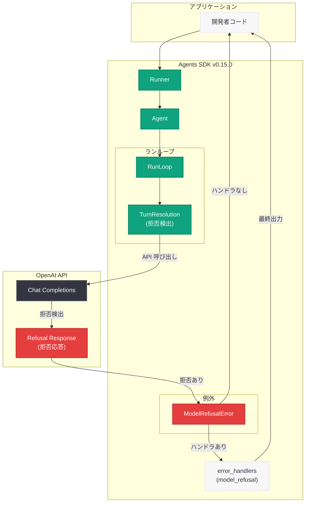

# Agents SDK v0.15.0: ModelRefusalError によるモデル応答拒否の明示的ハンドリング

## メタデータ

| 項目 | 内容 |
|------|------|
| 発表日 | 2026-05-01 |
| ソース | OpenAI API Changelog (GitHub Release) |
| カテゴリ | API 更新 |
| 公式リンク | [openai-agents-python v0.15.0](https://github.com/openai/openai-agents-python/releases/tag/v0.15.0) |

## 概要

OpenAI は 2026 年 5 月 1 日、Agents SDK v0.15.0 をリリースした。本リリースの主要な変更は、モデルの応答拒否 (refusal) を明示的にサーフェスする `ModelRefusalError` の導入である。従来、モデルが応答を拒否した場合、空のテキスト出力や構造化出力のパース失敗として暗黙的に処理されていたが、本バージョンからは専用の例外クラスとエラーハンドラにより、拒否を明確にキャッチし適切に対応できるようになった。

この改善は、特に構造化出力 (structured outputs) を使用するエージェントにおいて重要である。従来は拒否がパース失敗として扱われ、`MaxTurnsExceeded` に達するまでランループがリトライし続けるという非効率な動作が発生していた。v0.15.0 では、拒否を即座に検出して開発者に制御を委ねることで、リソースの無駄遣いを防ぎ、ユーザー体験を向上させている。

## 主な内容

### ModelRefusalError: 応答拒否の明示的なサーフェシング

v0.15.0 で新たに導入された `ModelRefusalError` は、モデルが応答を拒否した際に発生する専用の例外クラスである。この例外は `src/agents/exceptions.py` に定義されており、拒否理由 (refusal メッセージ) を保持する。

**変更前の問題点:**

- テキスト出力エージェント: 拒否が空文字列 (`final_output == ""`) として扱われ、開発者が拒否と正常な空応答を区別できなかった
- 構造化出力エージェント: 拒否レスポンスが JSON パースに失敗し、SDK がリトライを繰り返した結果 `MaxTurnsExceeded` エラーが発生していた
- いずれの場合も、拒否が発生したこと自体が開発者に通知されないという問題があった

**変更後の動作:**

- モデルが拒否した場合、即座に `ModelRefusalError` が発生する
- 拒否理由がエラーオブジェクトの `refusal` プロパティとして取得可能
- `error_handlers` に `model_refusal` ハンドラを指定することで、拒否時のカスタム処理が可能

### error_handlers による拒否時のカスタム処理

`Runner.run` および `Runner.run_sync` に渡す `error_handlers` 辞書に `model_refusal` キーを追加することで、拒否時の振る舞いをカスタマイズできる。ハンドラは拒否データを受け取り、エージェントの最終出力として使用する値を返すことができる。

構造化出力エージェントの場合、ハンドラが返す値はエージェントの出力スキーマに一致する必要があり、SDK がバリデーションを実施する。これにより、拒否時のフォールバック値を安全に提供できる。

### ランループにおける拒否検出ロジック

`src/agents/run_internal/turn_resolution.py` に 48 行のロジックが追加され、各ターンの応答で拒否が発生したかを検出する。拒否が検出された場合、ランループは即座に中断され、`ModelRefusalError` が発生するか、または `error_handlers` に登録されたハンドラに制御が移る。

### その他の変更

本リリースには以下の付随的な変更も含まれている。

- **ドキュメント修正:** MCPServerStdio のドキュメントスタイルにおけるスペースの修正
- **依存関係の更新:**
  - actions/github-script 9.0.0
  - peter-evans/create-pull-request 8.1.1
  - pypa/gh-action-pypi-publish 1.14.0
  - openai/codex-action 1.8
- **バグ修正:** PR #3057 by @seratch (Issue #3055 の修正)

## 技術的な詳細

### コードサンプル

#### 基本的な拒否ハンドリング (テキスト出力エージェント)

```python
from agents import Agent, Runner

agent = Agent(
    name="assistant",
    instructions="ユーザーの質問に回答してください。",
)

# error_handlers で拒否をカスタム処理
result = Runner.run_sync(
    agent,
    "不適切なコンテンツのリクエスト",
    error_handlers={"model_refusal": lambda data: data.error.refusal},
)

# result.final_output にはモデルの拒否メッセージが格納される
print(result.final_output)
# 例: "申し訳ございませんが、そのリクエストにはお応えできません。"
```

#### 構造化出力エージェントでの拒否ハンドリング

```python
from pydantic import BaseModel
from agents import Agent, Runner


class AnalysisResult(BaseModel):
    summary: str
    confidence: float
    categories: list[str]


agent = Agent(
    name="analyzer",
    instructions="入力テキストを分析してください。",
    output_type=AnalysisResult,
)


# 構造化出力のフォールバック値を返すハンドラ
def handle_refusal(data):
    return AnalysisResult(
        summary=f"分析不可: {data.error.refusal}",
        confidence=0.0,
        categories=["refused"],
    )


result = Runner.run_sync(
    agent,
    "不適切なコンテンツ",
    error_handlers={"model_refusal": handle_refusal},
)

# result.final_output は AnalysisResult 型として検証済み
print(result.final_output.summary)
```

#### 拒否をキャッチして例外として処理

```python
from agents import Agent, Runner
from agents.exceptions import ModelRefusalError

agent = Agent(
    name="assistant",
    instructions="ユーザーの質問に回答してください。",
)

try:
    result = Runner.run_sync(agent, "不適切なリクエスト")
except ModelRefusalError as e:
    print(f"モデルが応答を拒否しました: {e.refusal}")
    # フォールバック処理を実行
```

### 変更されたファイル (主要)

| ファイル | 変更内容 | 追加行数 |
|---------|---------|---------|
| `src/agents/exceptions.py` | `ModelRefusalError` 例外クラスの追加 | +11 |
| `src/agents/items.py` | 拒否関連のアイテム追加 | +13 |
| `src/agents/run_internal/turn_resolution.py` | 拒否検出ロジックの追加 | +48 |
| `src/agents/run_error_handlers.py` | `model_refusal` エラーハンドラのサポート | - |
| `src/agents/run_internal/run_loop.py` | ランループでの拒否処理 | - |
| `docs/running_agents.md` | ドキュメント更新 | +33 |
| `tests/test_max_turns.py` | テストケースの追加 | +87 |

リリース全体では 8 コミット、20 ファイルが変更されている。

## アーキテクチャ



### 拒否処理フロー (シーケンス図)

```mermaid
sequenceDiagram
    participant Dev as 開発者コード
    participant Runner as Runner
    participant Loop as RunLoop
    participant TR as TurnResolution
    participant API as OpenAI API

    Dev->>Runner: run_sync(agent, input, error_handlers)
    Runner->>Loop: ランループ開始
    Loop->>TR: ターン解決
    TR->>API: Chat Completions リクエスト
    API-->>TR: 拒否レスポンス (refusal)
    TR->>TR: 拒否検出

    alt error_handlers に model_refusal あり
        TR->>Runner: ModelRefusalError
        Runner->>Dev: ハンドラの戻り値を final_output として返却
    else error_handlers なし
        TR->>Runner: ModelRefusalError
        Runner->>Dev: ModelRefusalError 例外を送出
    end
```

## 開発者への影響

- **構造化出力エージェントの安定性向上:** 従来、拒否がパース失敗として無限リトライを引き起こしていた問題が解消される。`MaxTurnsExceeded` エラーの削減により、API コストの無駄遣いが防止される
- **拒否理由の可視化:** モデルがなぜ応答を拒否したかを `refusal` プロパティで直接確認できるようになり、デバッグとモニタリングが容易になる
- **グレースフルデグラデーション:** `error_handlers` を活用することで、拒否時にフォールバック値を返すグレースフルデグラデーションパターンを実装できる。本番環境でのユーザー体験の向上に寄与する
- **破壊的変更の可能性:** 従来 `final_output == ""` で拒否を判定していたコードは、`ModelRefusalError` が発生するよう動作が変わるため、アップグレード時にエラーハンドリングの見直しが必要となる
- **テストの更新:** 拒否シナリオのテストコードは、空文字列チェックから `ModelRefusalError` のキャッチへと更新する必要がある
- **コンテンツモデレーションワークフローの改善:** 拒否を明示的にキャッチできるようになったことで、コンテンツモデレーションやセーフティフィルタリングのワークフローがより堅牢に構築できる

## 関連リンク

- [Agents SDK v0.15.0 リリースノート](https://github.com/openai/openai-agents-python/releases/tag/v0.15.0)
- [openai/openai-agents-python (GitHub)](https://github.com/openai/openai-agents-python)
- [PR #3057 by @seratch](https://github.com/openai/openai-agents-python/pull/3057)
- [Issue #3055](https://github.com/openai/openai-agents-python/issues/3055)
- [OpenAI Agents SDK ドキュメント](https://openai.github.io/openai-agents-python/)
- [OpenAI Platform ドキュメント](https://platform.openai.com/docs)

## まとめ

Agents SDK v0.15.0 は、モデルの応答拒否ハンドリングにおける長年の課題を解決するリリースである。新たに導入された `ModelRefusalError` と `error_handlers` の `model_refusal` ハンドラにより、開発者は拒否を明示的に検出し、適切なフォールバック処理を実装できるようになった。

特に構造化出力エージェントにおいては、拒否がパース失敗として処理され `MaxTurnsExceeded` まで無駄にリトライし続けるという重大な問題が解消された。これにより API コストの削減とユーザー体験の向上が同時に達成される。

8 コミット、20 ファイルの変更という比較的コンパクトなリリースながら、エージェントの堅牢性と開発者体験に大きなインパクトを与える改善であり、本番環境で Agents SDK を活用するすべての開発者にアップグレードを推奨する。
