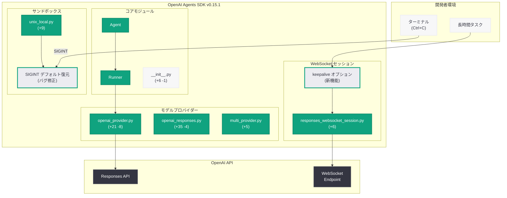
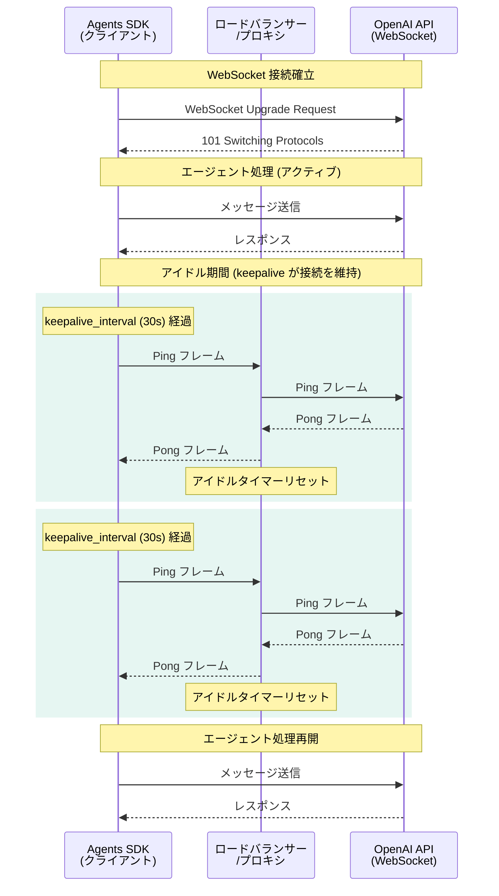
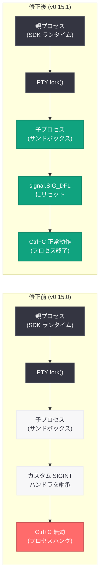

# OpenAI Agents SDK v0.15.1 リリース: WebSocket keepalive オプション公開と PTY シグナル修正

## メタデータ

| 項目 | 内容 |
|------|------|
| 発表日 | 2026-05-02 |
| ソース | OpenAI API Changelog (GitHub Release) |
| カテゴリ | API 更新 |
| 公式リンク | [Agents SDK v0.15.1](https://github.com/openai/openai-agents-python/releases/tag/v0.15.1) |

## 概要

OpenAI は 2026 年 5 月 2 日、Agents SDK v0.15.1 をリリースした。今回のリリースでは、WebSocket 接続のキープアライブオプションを開発者に公開する新機能と、UnixLocal サンドボックスにおける PTY (疑似端末) の SIGINT シグナルデフォルト復元に関するバグ修正が含まれている。

このリリースは全体で 10 コミット、25 ファイルの変更を含む。新機能とバグ修正に加え、Windows OS ユーザー向けのクイックスタートドキュメント改善、日本語・韓国語・中国語の翻訳ドキュメント更新、テストの追加、CI フィクスチャの堅牢化など、SDK の品質と多言語サポートを向上させる包括的な保守リリースとなっている。前バージョン v0.15.0 で導入された Responses WebSocket セッション機能の安定性向上が主要なテーマである。

## 主な内容

### 新機能: Responses WebSocket keepalive オプションの公開

PR [#3080](https://github.com/openai/openai-agents-python/pull/3080) (by @seratch) により、`responses_websocket_session.py` に WebSocket 接続のキープアライブオプションが公開された (+6 行)。

#### 背景と動機

Agents SDK の Responses WebSocket セッションは、エージェントとサーバー間のリアルタイム通信を実現する機能である。長時間実行されるエージェントセッション (例: 複雑なタスクの段階的実行、ユーザーとの長い対話セッション) では、WebSocket 接続がサーバー側やネットワーク機器 (ロードバランサー、プロキシ) によってアイドルタイムアウトで切断される問題が発生し得る。

従来、keepalive 設定は SDK 内部で管理されており、開発者が接続のタイムアウト閾値やキープアライブ間隔をカスタマイズすることはできなかった。今回の変更により、これらのパラメータが開発者に公開され、ユースケースに応じた接続管理が可能になった。

#### 技術的詳細

WebSocket のキープアライブメカニズムは、接続がアイドル状態にあるときに定期的に Ping フレームを送信し、サーバーから Pong フレームの応答を受け取ることで接続の活性を維持する。これにより以下の問題を防止できる。

1. **サーバー側タイムアウト:** サーバーがアイドル接続を切断するまでの時間を超えないよう、定期的な通信を維持する
2. **中間プロキシのタイムアウト:** ロードバランサーやリバースプロキシが設定するアイドルタイムアウト (一般的に 60-300 秒) に対応する
3. **NAT テーブルのタイムアウト:** ネットワーク機器の NAT テーブルエントリが期限切れになることを防止する

### バグ修正: UnixLocal PTY ターミナルシグナルのデフォルト復元

PR [#3082](https://github.com/openai/openai-agents-python/pull/3082) (by @seratch) および PR [#3075](https://github.com/openai/openai-agents-python/pull/3075) (by @Aphroq、Issue [#3074](https://github.com/openai/openai-agents-python/issues/3074)) により、UnixLocal サンドボックスクライアントの PTY 子プロセスにおける SIGINT シグナルのデフォルト設定が修正された。

#### 問題の詳細

Unix システムにおいて、PTY (疑似端末) を使用して子プロセスを生成する場合、子プロセスは親プロセスのシグナルハンドラを継承する。Python の `subprocess` や `pty.fork()` で子プロセスを作成する際、親プロセスで SIGINT ハンドラがカスタマイズされていると、子プロセスもそのカスタムハンドラを継承してしまう。

Agents SDK の UnixLocal サンドボックスでは、エージェントのコード実行環境として PTY ベースの子プロセスを使用している。SDK のランタイムが SIGINT ハンドラをカスタマイズしていたため、サンドボックス内の子プロセスでも SIGINT のデフォルト動作 (プロセス終了) が無効化されていた。その結果、ユーザーが Ctrl+C を入力しても子プロセスが正常に中断されず、プロセスがハングする問題が報告された (Issue #3074)。

#### 修正内容

`src/agents/sandbox/sandboxes/unix_local.py` に 9 行が追加され、PTY 子プロセスの生成時に SIGINT シグナルハンドラをデフォルト (`signal.SIG_DFL`) にリセットする処理が実装された。これにより、サンドボックス内のプロセスは標準的なシグナル処理動作を取り戻し、Ctrl+C による正常な中断が期待通りに動作するようになった。

加えて、`tests/sandbox/test_unix_local.py` に 41 行のテストが追加され、SIGINT シグナルによるプロセス中断が正しく機能することが検証されている。

### ドキュメントとテストの改善

今回のリリースには、コード変更以外にも多数の品質改善が含まれている。

- **v0.15 チェンジログの追加:** 前バージョンの変更点を正式にドキュメント化
- **Windows OS ユーザー向けクイックスタート改善:** +24 行の追加により、Windows 環境でのセットアップ手順をより明確に説明
- **多言語翻訳の更新:** 日本語、韓国語、中国語のドキュメントを最新の内容に同期
- **ガードレール名テストの追加:** `__name__` フォールバックの動作を検証するテストを追加
- **Dapr Redis インテグレーションフィクスチャの堅牢化:** CI 環境での Redis 接続テストの信頼性を向上

## 技術的な詳細

### コードサンプル

#### SDK のアップグレード

```bash
# pip を使用したアップグレード
pip install --upgrade openai-agents

# バージョン指定でのインストール
pip install openai-agents==0.15.1

# Poetry を使用している場合
poetry update openai-agents

# uv を使用している場合
uv pip install --upgrade openai-agents
```

#### WebSocket keepalive オプションの使用

```python
from agents import Agent, Runner
from agents.responses_websocket_session import ResponsesWebSocketSession

# エージェントの定義
agent = Agent(
    name="long_running_agent",
    instructions="You are a helpful assistant for complex tasks.",
    model="gpt-4o",
)

# WebSocket セッションの作成 (keepalive オプションを指定)
session = ResponsesWebSocketSession(
    agent=agent,
    # keepalive 間隔を秒単位で指定
    # デフォルトのタイムアウトよりも短い間隔で Ping を送信
    keepalive_interval=30,  # 30 秒ごとに Ping フレームを送信
    keepalive_timeout=10,   # Pong レスポンスのタイムアウト (秒)
)

# セッションの開始
async with session:
    response = await session.send("Analyze this complex dataset...")
    print(response)
```

#### WebSocket keepalive の動作概念

```python
import asyncio
from agents import Agent, Runner
from agents.responses_websocket_session import ResponsesWebSocketSession

async def long_running_session():
    """長時間実行されるエージェントセッションの例"""

    agent = Agent(
        name="research_agent",
        instructions=(
            "You are a research assistant. "
            "Take your time to provide thorough analysis."
        ),
        model="gpt-4o",
    )

    # keepalive を有効化した WebSocket セッション
    # ネットワーク環境に応じて間隔を調整
    session = ResponsesWebSocketSession(
        agent=agent,
        keepalive_interval=20,  # プロキシのタイムアウトが 60 秒の場合
        keepalive_timeout=5,
    )

    async with session:
        # 長時間の処理でも接続が維持される
        tasks = [
            "Step 1: Gather information about quantum computing.",
            "Step 2: Analyze current trends in the field.",
            "Step 3: Synthesize findings into a report.",
        ]

        for task in tasks:
            response = await session.send(task)
            print(f"Completed: {task}")
            print(f"Response: {response[:100]}...")
            # 処理間のアイドル時間があっても接続は維持される
            await asyncio.sleep(45)

asyncio.run(long_running_session())
```

#### PTY シグナル修正の確認

```python
import signal
import subprocess
from agents.sandbox.sandboxes.unix_local import UnixLocalSandbox

# UnixLocal サンドボックスでのコード実行
sandbox = UnixLocalSandbox()

# v0.15.1 以降: Ctrl+C (SIGINT) で正常に中断可能
result = sandbox.execute("""
import time
import signal

# 子プロセス内でシグナルハンドラがデフォルトであることを確認
handler = signal.getsignal(signal.SIGINT)
assert handler == signal.SIG_DFL, f"Expected SIG_DFL, got {handler}"

print("SIGINT handler is correctly set to default")
print("Process can be interrupted with Ctrl+C")
""")

print(result.output)
```

#### PTY シグナル修正の内部実装概念

```python
import os
import pty
import signal

def spawn_sandbox_process(command: str):
    """
    v0.15.1 で修正された PTY 子プロセスの生成ロジック (概念)

    修正前: 子プロセスが親の SIGINT ハンドラを継承し、
            Ctrl+C で中断不可能になっていた
    修正後: preexec_fn で SIGINT をデフォルトにリセット
    """

    def preexec_fn():
        """子プロセス生成直後に実行される関数"""
        # SIGINT のデフォルト動作を復元
        # これにより Ctrl+C でプロセスが正常終了する
        signal.signal(signal.SIGINT, signal.SIG_DFL)

    # PTY を使用した子プロセスの生成
    pid, fd = pty.fork()

    if pid == 0:
        # 子プロセス側
        preexec_fn()
        os.execvp("/bin/sh", ["/bin/sh", "-c", command])
    else:
        # 親プロセス側
        return pid, fd
```

### 変更一覧

| 種別 | 変更内容 | PR |
|------|---------|-----|
| 新機能 | Responses WebSocket keepalive オプションの公開 | #3080 |
| バグ修正 | UnixLocal PTY ターミナルシグナルのデフォルト復元 | #3082, #3075 |
| ドキュメント | v0.15 チェンジログの追加 | - |
| ドキュメント | Windows OS クイックスタートの改善 | - |
| ドキュメント | 日本語・韓国語・中国語翻訳の更新 | - |
| テスト | ガードレール名 `__name__` フォールバックテスト追加 | - |
| CI | Dapr Redis インテグレーションフィクスチャの堅牢化 | - |

### ファイル変更の詳細

| ファイルパス | 変更行数 | 概要 |
|-------------|---------|------|
| `src/agents/models/openai_provider.py` | +21 -8 | OpenAI プロバイダーの更新 |
| `src/agents/models/openai_responses.py` | +35 -4 | Responses モデルの拡張 |
| `src/agents/responses_websocket_session.py` | +6 | WebSocket keepalive オプション公開 |
| `src/agents/sandbox/sandboxes/unix_local.py` | +9 | PTY SIGINT デフォルト復元 |
| `src/agents/__init__.py` | +6 -1 | パッケージエクスポートの更新 |
| `src/agents/models/multi_provider.py` | +5 | マルチプロバイダー対応 |
| `tests/sandbox/test_unix_local.py` | +41 | SIGINT 動作のテスト追加 |
| テストファイル (複数) | +100 以上 | 各種テストの追加 |

## アーキテクチャ

以下の図は、v0.15.1 で変更された Agents SDK の主要コンポーネントと、WebSocket keepalive および PTY シグナル修正の位置づけを示している。



以下の図は、WebSocket keepalive のメカニズムを詳細に示している。



以下の図は、PTY シグナル処理の修正前後の動作を比較している。



## 開発者への影響

### WebSocket keepalive を活用すべきユースケース

- **長時間実行エージェント:** 複雑なリサーチタスクや多段階のワークフロー実行など、数分以上にわたるエージェントセッションを運用する場合、keepalive の設定により接続安定性が向上する
- **企業ネットワーク環境:** ファイアウォールやプロキシが厳しいアイドルタイムアウトを設定している環境では、keepalive_interval をプロキシのタイムアウトよりも短く設定することが重要
- **不安定なネットワーク環境:** モバイル環境や不安定な Wi-Fi 接続では、keepalive により接続の死活監視を行い、早期の切断検知と再接続が可能になる

### PTY シグナル修正の影響を受ける開発者

- **UnixLocal サンドボックスを使用している開発者:** ローカル開発環境で Agents SDK のサンドボックス機能を使用している場合、v0.15.1 へのアップグレードにより Ctrl+C での正常な中断動作が回復する
- **CI/CD パイプラインでの利用:** 自動テストやバッチ処理でサンドボックスを使用している場合、タイムアウトによるプロセス強制終了 (SIGKILL) ではなく、正常なシグナル処理による中断が可能になる
- **macOS / Linux ユーザー:** この修正は Unix 系 OS に固有の問題であり、Windows ユーザーには影響しない

### アップグレード推奨事項

1. **即座のアップグレードを推奨:** WebSocket セッションの安定性向上と PTY シグナル修正は、開発体験に直接影響する修正であるため、早期のアップグレードを推奨する
2. **破壊的変更なし:** v0.15.1 は v0.15.0 に対する純粋なパッチリリースであり、破壊的変更は含まれない。既存のコードは変更なしで動作する
3. **新機能の段階的導入:** keepalive オプションはデフォルトで従来と同じ動作を維持するため、必要に応じてオプションを追加設定すればよい

### Windows ユーザーへの影響

- クイックスタートドキュメントが改善され、Windows 環境でのセットアップ手順がより明確になった
- PTY シグナル修正は Unix 固有の問題であるため、Windows ユーザーには直接的な影響はない

## 関連リンク

- [Agents SDK v0.15.1 リリースノート](https://github.com/openai/openai-agents-python/releases/tag/v0.15.1)
- [PR #3080: Responses WebSocket keepalive オプション公開](https://github.com/openai/openai-agents-python/pull/3080)
- [PR #3082: UnixLocal PTY シグナル修正](https://github.com/openai/openai-agents-python/pull/3082)
- [PR #3075: SIGINT デフォルト復元](https://github.com/openai/openai-agents-python/pull/3075)
- [Issue #3074: PTY 子プロセスの SIGINT 問題報告](https://github.com/openai/openai-agents-python/issues/3074)
- [OpenAI Agents SDK ドキュメント](https://openai.github.io/openai-agents-python/)
- [openai-agents-python GitHub リポジトリ](https://github.com/openai/openai-agents-python)
- [OpenAI API Changelog](https://platform.openai.com/docs/changelog)

## まとめ

Agents SDK v0.15.1 は、v0.15.0 で導入された Responses WebSocket セッション機能の安定性を向上させる重要なパッチリリースである。主な変更点は 2 つある。

第一に、WebSocket keepalive オプションの公開により、長時間実行されるエージェントセッションにおける接続タイムアウトの問題を開発者自身が制御できるようになった。これは、プロキシやロードバランサーが存在する企業ネットワーク環境や、不安定なネットワーク環境でのエージェント運用を大幅に改善する。

第二に、UnixLocal サンドボックスの PTY 子プロセスにおける SIGINT シグナルハンドラのデフォルト復元により、Ctrl+C による正常なプロセス中断が回復した。これは Unix 系 OS でローカルサンドボックスを使用する全ての開発者に影響する基本的な操作性の修正であり、開発体験の向上に直結する。

v0.15.1 は破壊的変更を含まないパッチリリースであるため、v0.15.0 を使用している開発者は安全にアップグレードできる。WebSocket セッションの長時間利用やローカルサンドボックスでの開発を行っている場合は、早期のアップグレードを推奨する。
