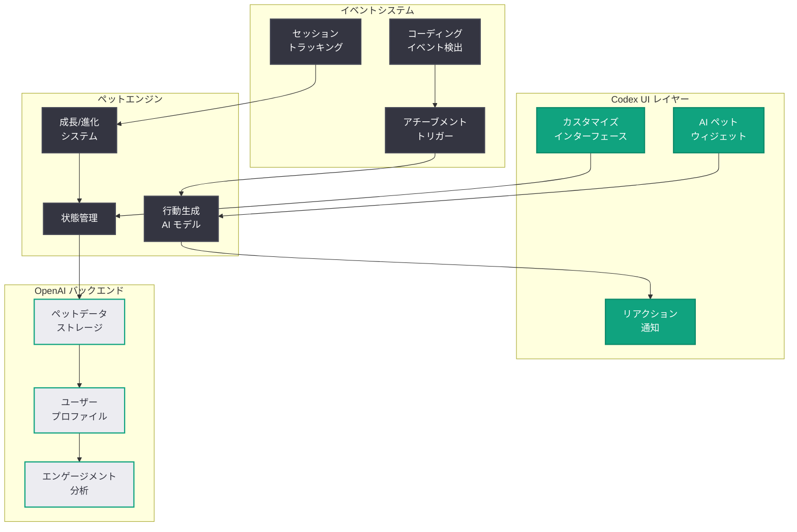

# Codex に AI ペット/コンパニオン機能が追加: 開発者のコーディング体験をパーソナライズ

## メタデータ

| 項目 | 内容 |
|------|------|
| 発表日 | 2026-05-03 |
| ソース | OpenAI News (Third-party coverage: Mashable) |
| カテゴリ | 製品アップデート |
| 公式リンク | [Mashable 報道](https://mashable.com/article/openai-codex-ai-pets) |

> **注記:** 本レポートは Mashable による外部報道 (2026 年 5 月 3 日付) に基づいて作成している。元記事ページへの直接アクセスが制限されていたため、Google News RSS フィードで確認されたタイトルと概要情報を基に構成している。正確な詳細については Mashable の原文記事および OpenAI の公式発表を参照されたい。

## 概要

OpenAI は Codex コーディングツールに「AI ペット」(AI コンパニオン) 機能を追加したことが Mashable の報道により明らかになった。この機能は、開発者が Codex を使用する際にバーチャルなペットやマスコットキャラクターがコーディング作業を伴走する仕組みであり、長時間にわたるコーディングセッションにおける開発者のエンゲージメントとモチベーション維持を目的としていると考えられる。

Codex は 2026 年 4 月のスーパーアプリ化以降、コーディング以外の機能拡張を急速に進めてきたが、AI ペット機能の追加は「開発者体験のパーソナライゼーション」という新たな方向性を示すものである。ゲーミフィケーション要素やエモーショナルデザインを取り入れた本機能は、AI コーディングツールの差別化戦略としても注目される。

## 主な内容

### AI ペット/コンパニオンの概要

Codex に追加された AI ペット機能は、開発環境内でバーチャルなコンパニオンとして開発者をサポートするキャラクターシステムと推定される。

- **バーチャルコーディングバディ:** 開発者が Codex でコードを書いている間、AI ペットが画面上に表示され、作業を「見守る」コンパニオンとして機能する
- **インタラクティブな反応:** コードのコンパイル成功、テストパス、バグ修正などのイベントに対してペットがリアクションを示し、ポジティブフィードバックを提供する
- **パーソナライゼーション:** 開発者が自身のペットをカスタマイズし、外見やキャラクター特性を選択できる可能性がある
- **成長システム:** 開発者のコーディング活動に応じてペットが成長・進化するゲーミフィケーション要素

### 開発者体験への貢献

AI ペット機能が開発者体験にもたらす価値は以下のように整理できる。

- **モチベーション維持:** 長時間のコーディングセッションにおいて、ペットの存在が精神的なサポートを提供し、作業の継続を促進する
- **達成感の可視化:** コーディングの成果がペットの成長やリアクションとして可視化されることで、日常的な開発タスクに達成感を付与する
- **孤独な作業の緩和:** リモートワーク環境で一人でコーディングする開発者にとって、AI ペットが疑似的なソーシャルプレゼンスを提供する
- **ブランドアイデンティティの強化:** OpenAI/Codex ブランドに親しみやすさと遊び心を加える要素として機能する

### ゲーミフィケーション戦略

本機能は、開発ツールにゲーミフィケーション要素を取り入れるトレンドの一環として位置づけられる。

- **GitHub Achievements と同系統:** GitHub のプロフィールバッジや Achievements に見られるような、開発活動に対する報酬システムの延長線上にある
- **Duolingo モデルの応用:** 言語学習アプリ Duolingo が採用するマスコットキャラクター (Duo) によるエンゲージメント向上戦略を、コーディングツールに適用したものと考えられる
- **リテンション施策:** 日常的に Codex を使い続けるインセンティブとして、ペットの世話や成長が動機づけになる設計

## 技術的な詳細

### 想定されるアーキテクチャ

AI ペット機能の技術的な実装は、以下の要素で構成されると推定される。

### イベント駆動型リアクションシステム

AI ペットの反応は、Codex 内のコーディングイベントにトリガーされる仕組みであると考えられる。

| イベント | ペットの反応 (想定) |
|---------|-------------------|
| コードコンパイル成功 | 喜びのアニメーション |
| テスト全パス | 祝福のリアクション |
| バグ修正完了 | 感謝の表現 |
| 長時間コーディング | 休憩の提案 |
| 新しい言語を使用 | 好奇心を示す反応 |
| エラー連続 | 励ましのメッセージ |

### Codex エコシステムとの統合

AI ペット機能は、Codex の既存機能と以下のように統合される可能性がある。

- **永続メモリとの連携:** Codex のメモリ機能を活用し、ペットが開発者の習慣やプロジェクト履歴を「記憶」する
- **Automations との連携:** 特定のマイルストーン達成時にペットが自動的に祝福する Automation トリガーの設定
- **プラグインとしての拡張:** サードパーティがカスタムペットスキンやテーマを提供するプラグインエコシステム

## 開発者への影響

- **コーディング体験のエモーショナルデザイン:** 機能面だけでなく感情面からも開発者体験を設計するアプローチが AI コーディングツールに導入されることで、ツール選択においてエモーショナルな要素が新たな差別化ポイントとなる可能性がある

- **プラットフォームへのエンゲージメント向上:** ペットの成長や日常的なインタラクションが動機づけとなり、開発者が Codex を継続的に使用するインセンティブが強化される。これは OpenAI のリテンション戦略として機能する

- **開発者の健康への配慮:** 長時間コーディング時の休憩提案など、ペットを通じたウェルビーイング機能が実装されている場合、開発者の健康管理に対する間接的なサポートとなる

- **チーム開発での活用:** チームメンバーのペットが互いに交流する機能が実装されれば、リモートチームにおけるソーシャルコネクションの強化に寄与する可能性がある

- **オプション機能としての設計:** 集中を妨げる可能性がある機能であるため、有効/無効の切り替えや表示レベルのカスタマイズが提供されると想定される。開発者は自身のワークスタイルに合わせて利用を選択できる

## 関連リンク

- [Mashable: OpenAI adds AI pets to its Codex coding tool](https://mashable.com/article/openai-codex-ai-pets)
- [関連レポート: Codex が「ほぼ万能」のスーパーアプリに進化](2026-04-16-codex-for-almost-everything.md)
- [関連レポート: Codex Labs 発表](2026-04-21-codex-labs.md)
- [関連レポート: Codex Chronicle によるスクリーンメモリ機能](2026-04-20-codex-chronicle-screen-memory.md)
- [関連レポート: Codex Orchestration Symphony](2026-04-27-codex-orchestration-symphony.md)
- [OpenAI News](https://openai.com/news)

## まとめ

OpenAI は Codex コーディングツールに AI ペット/コンパニオン機能を追加した。本機能は、バーチャルなペットキャラクターが開発者のコーディングセッションを伴走し、コーディングイベントに対するインタラクティブな反応やゲーミフィケーション要素を通じて、開発者のエンゲージメントとモチベーションを向上させることを目的としている。Codex が 2026 年 4 月のスーパーアプリ化以降、機能面の拡張を急速に進めてきた中で、本機能は「感情面からの開発者体験の向上」という新しいアプローチを示すものである。Duolingo のマスコット戦略や GitHub Achievements に類するゲーミフィケーション手法を AI コーディングツールに適用した本施策は、競合製品との差別化要素としても注目される。なお、本レポートは Mashable の報道タイトルに基づいた分析であり、機能の具体的な仕様については OpenAI の公式発表を参照されたい。
